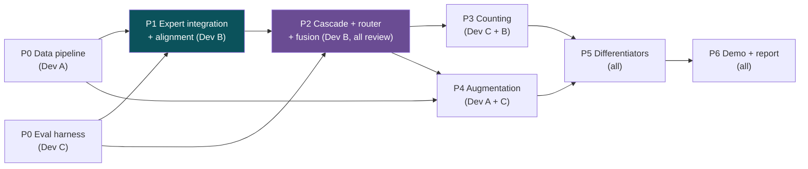

# Development Plan: CA-MoSE Multi-Speaker Speech Separation
## Team of 3, Parallel Workstreams, Balanced Workload and Learning

> **Companion to:** MASTER_PROJECT.md (version 1.2, approved).
> **Team size:** 3 developers, referred to here as Dev A, Dev B, and Dev C.
> **Duration:** 10 to 12 weeks, mapped to the six project phases already defined.
> **Guiding principle:** Every developer touches data, model, and evaluation work at least once. No single person owns all the hard or all the visible parts.

---

## 1. Roles and Ownership Philosophy

The plan avoids the common failure where one strong developer builds the core model and the other two do glue code. Instead, each developer owns one vertical slice of the system end to end, and the three slices are of comparable difficulty and comparable visibility. Ownership means being the person responsible for that area's design, tests, and documentation, not the only person allowed to touch it.

| Developer | Primary vertical (owns) | Secondary area (contributes) | Learning focus |
|---|---|---|---|
| Dev A | Data pipeline, augmentation, dynamic mixer | Evaluation harness | Data engineering, audio signal processing, reproducibility |
| Dev B | Expert integration, cascade gate, fusion head | Speaker counting | Model inference, routing logic, PyTorch training |
| Dev C | Evaluation harness, metrics, counting, demo | Augmentation robustness | Metrics, calibration, scientific reporting, user interface |

Ownership rotates once. In Phase 4 and 5, each developer takes a task outside their primary vertical (detailed in Section 4) so that everyone trains a model, everyone writes an evaluation, and everyone touches the data pipeline. This is a deliberate cost to raw speed, paid to guarantee equal learning.

---

## 2. Phase and Milestone Overview

The six phases from the master document become the milestone backbone. Each milestone has a single integration checkpoint where the three slices must connect and pass a shared test.

| Phase | Weeks | Milestone (definition of done) | Integration checkpoint |
|---|---|---|---|
| P0 Foundation | 1 to 2 | Data pipeline produces mixtures with ground truth; evaluation harness computes SI-SDRi on a known model | M0: baseline number on Libri3Mix reproduced by all three |
| P1 Expert integration | 3 to 4 | Both experts run and produce aligned streams on test input | M1: two experts aligned end to end |
| P2 Cascade core | 5 to 6 | Scene analyzer, router, cascade gate, fusion head train and beat best single expert | M2: full CA-MoSE forward pass with measured escalation rate |
| P3 Counting | 7 | Learned stop-classifier produces confusion matrix and calibration curve | M3: unknown-N system reports count accuracy |
| P4 Robustness | 8 | Reverb, noise, codec augmentation integrated; clean performance preserved | M4: robustness table across conditions |
| P5 Differentiators | 9 to 10 | Sparse-overlap curve, real-room eval, break-point curve produced | M5: three flagship results locked |
| P6 Demo and report | 11 to 12 | Gradio demo, ablation table, written report complete | M6: submission package |

---

## 3. Dependency Map and Critical Path

Understanding what blocks what prevents idle time. The critical path (the longest chain of dependent tasks) runs through the model integration slice, so that slice is protected from extra scope.



**Critical path:** Data pipeline and eval harness (P0) must both finish before expert integration (P1) can be meaningfully tested, which blocks the cascade core (P2), which blocks both counting (P3) and robustness (P4), which both block the differentiating results (P5), which block the demo and report (P6).

**Parallelism rule:** During P0, all three work simultaneously with no blocking. During P1, while Dev B integrates experts, Dev A and Dev C build ahead on augmentation and metrics that do not depend on the experts being ready. Idle time is avoided by front-loading independent work.

---

## 4. Detailed Task Distribution by Phase

### Phase 0: Foundation (weeks 1 to 2)

All three work in parallel with zero cross-dependencies. This is the warm-up where everyone sets up the shared environment.

| Task | Owner | Depends on | Deliverable |
|---|---|---|---|
| Repository skeleton, environment, dependency lockfile, pre-commit hooks | Dev B (leads), all agree | none | Working repo everyone can clone and run |
| Dynamic mixer: sample N speakers, set levels, produce mixture plus ground-truth stems | Dev A | none | `data/mixer.py` with unit tests |
| LibriMix and Libri3Mix download and preparation scripts | Dev A | none | Reproducible data-prep script |
| Evaluation harness: SI-SDRi, permutation-invariant matching, per-tier reporting | Dev C | none | `eval/metrics.py` with unit tests |
| Baseline runner: load pretrained SepFormer and SR-CorrNet, run on Libri3Mix | Dev B | mixer stub | Baseline number table |
| Shared config system (YAML-based) and logging | Dev C | repo skeleton | Config loader used by all modules |

**Collaboration point:** All three sit together on day 1 to agree the repository structure, the config schema, and the interface contracts (what shape a "separation result" object has). This one-hour decision prevents integration pain later.

**M0 gate:** All three independently reproduce the same SI-SDRi baseline number on Libri3Mix. If the numbers differ, the harness or data has a bug that must be fixed before anyone builds on top.

### Phase 1: Expert integration and alignment (weeks 3 to 4)

Dev B owns the critical-path model work. Dev A and Dev C build independent components that will be needed soon, so no one waits.

| Task | Owner | Depends on | Deliverable |
|---|---|---|---|
| MossFormer2 inference wrapper (cheap expert) | Dev B | P0 | Wrapper returning standard result object |
| SR-CorrNet inference wrapper (expensive expert) plus attractor output | Dev B | P0 | Wrapper with count and confidence outputs |
| REAL-M blind quality estimator integration | Dev B | none | Quality scoring function |
| Hungarian stream alignment via ECAPA-TDNN embeddings | Dev C | ECAPA wrapper | `align/hungarian.py` with tests |
| Cross-chunk identity lock for long audio | Dev C | alignment | Chunk-stitching module |
| Augmentation pipeline stage 1 and 2: RIR reverb, WHAM noise | Dev A | P0 mixer | Augmentation module (reverb, noise) |
| Codec augmentation (Opus, AAC) research and prototype | Dev A | none | Codec augmentation prototype |

**Collaboration point:** Dev B and Dev C pair on the alignment interface, because alignment consumes expert outputs. This pairing spreads knowledge of the model output format to Dev C.

**M1 gate:** Given one 3-speaker test clip, both experts run and their outputs are correctly aligned to the same speaker order. Verified by a shared integration test.

### Phase 2: Cascade core (weeks 5 to 6)

This is the highest-value, highest-difficulty phase. To keep it from becoming a solo effort, the design is decided by all three, Dev B implements the training loop, and Dev A and Dev C each own a trainable sub-component.

| Task | Owner | Depends on | Deliverable |
|---|---|---|---|
| Scene analyzer (feature extraction plus coarse count) | Dev A | P1 | `models/scene_analyzer.py` |
| Two-level adaptive router (sigmoid gates, load-balance loss) | Dev C | scene analyzer | `models/router.py` |
| Cascade gate logic and threshold tuning | Dev B | quality estimator | Cascade controller |
| Fusion head (Confidence-Routed Residual Refinement) | Dev B | alignment | `models/fusion.py` |
| Composite loss assembly and training loop | Dev B (leads), all review | all above | `train/trainer.py` |
| Escalation-rate instrumentation and logging | Dev C | cascade gate | Escalation metrics dashboard |

**Collaboration point:** The full team reviews the cascade design together before implementation begins, and the whole team reviews the training loop pull request, because it is the integration seam of the entire system. This is the one place where a shared mental model matters most.

**M2 gate:** The full CA-MoSE forward pass runs end to end, trains for a few epochs, beats the best single expert on a mixed-condition validation set, and reports a measured escalation rate. Everyone can explain how a single input flows through the system.

### Phase 3: Speaker counting (week 7)

Ownership rotation begins here. Dev C leads the counting work with Dev B supporting, so Dev C gets deep model-training experience rather than only metrics.

| Task | Owner | Depends on | Deliverable |
|---|---|---|---|
| Learned stop-classifier (four-feature MLP) | Dev C | P2 | `models/stop_classifier.py` |
| Feature extractors: residual energy, VAD prob, embedding distance, mixture-consistency | Dev B | P2 | Feature module |
| Count confusion matrix and calibration curve reporting | Dev C | eval harness | Counting report generator |
| Stop-classifier training on Libri2-5Mix | Dev C | mixer at N=2..5 (Dev A support) | Trained classifier |

**Collaboration point:** Dev A provides the 2-to-5-speaker mixtures needed to train the classifier, keeping the data owner involved in a model phase.

**M3 gate:** The system estimates speaker count on unknown-N inputs and produces a confusion matrix and calibration curve.

### Phase 4: Robustness (week 8)

Ownership rotation continues. Dev A, the data owner, now also runs a training and evaluation cycle on augmented data, gaining model-side experience.

| Task | Owner | Depends on | Deliverable |
|---|---|---|---|
| Integrate full three-stage augmentation into training | Dev A | P2 trainer | Augmented training runs |
| Re-tune heads on augmented data | Dev A (leads), Dev B support | trainer | Retrained checkpoint |
| Clean-versus-augmented ablation | Dev C | eval harness | Ablation table |
| Codec degradation evaluation | Dev A | codec augmentation | Degradation table |

**M4 gate:** Robustness table shows the system holds up under reverb, noise, and codec conditions, and a clean-versus-augmented ablation confirms clean performance is not lost.

### Phase 5: Differentiating results (weeks 9 to 10)

All three collaborate, each owning one flagship result so all three appear in the report with a named author.

| Task | Owner | Depends on | Deliverable |
|---|---|---|---|
| Sparse-overlap curve on SparseLibriMix (six ratios) | Dev C | eval harness | Overlap curve figure |
| Real-room recording session and Whisper Word Error Rate evaluation | Dev A | recorded set | Real-room WER table |
| Break-point curve to 6 and 7 speakers | Dev B | mixer at high N | Break-point figure |
| Full ablation table (all nine conditions) | All, split | all prior phases | Ablation table |

**Collaboration point:** The real-room recording session involves all three as speakers, since it needs multiple simultaneous voices. This is a shared, low-stress team activity.

**M5 gate:** All three flagship results are produced and locked.

### Phase 6: Demo and report (weeks 11 to 12)

| Task | Owner | Depends on | Deliverable |
|---|---|---|---|
| Gradio demo interface | Dev C | full system | Working demo |
| Routing-weight interpretability panel and self-grade display | Dev B | demo | Demo panels |
| Demo audio processing backend | Dev A | full system | Demo backend |
| Technical report writing | All, one section each | all results | Final report |
| Reproducibility package (configs, checkpoints, instructions) | Dev A | all | Reproducibility bundle |

**M6 gate:** Submission package complete: demo runs, report is written, results reproduce from the bundle.

---

## 5. Workload and Learning Balance Check

The table confirms no developer is boxed into one skill area, and each experiences data, model, evaluation, and presentation work.

| Skill area | Dev A | Dev B | Dev C |
|---|---|---|---|
| Data engineering | Primary | Contributes (P0 baseline) | Contributes (mixer for counting) |
| Model training | Contributes (P4) | Primary | Primary in P3 |
| Routing and cascade logic | Contributes (scene analyzer) | Primary | Primary (router) |
| Evaluation and metrics | Contributes (codec eval) | Contributes (break-point) | Primary |
| Scientific reporting | One report section | One report section | Primary (calibration, curves) |
| User interface and demo | Backend | Interpretability panels | Primary (Gradio) |

Every developer trains at least one model, writes at least one evaluation, touches the data pipeline, and authors at least one flagship result and one report section. The primary-count is balanced: two primaries each for the harder model and evaluation areas.

---

## 6. Git Workflow

A lightweight trunk-based-with-branches flow suits a team of three. It avoids long-lived divergent branches while keeping `main` always working.

**Branch model:**
- `main` is always runnable and always passing tests. Nobody commits to `main` directly.
- Feature branches are named `type/owner/short-description`, for example `feat/devb/fusion-head` or `fix/deva/mixer-clipping`.
- One branch per task from the tables above. Branches are short-lived, ideally merged within 2 to 4 days.

**Pull request rules:**
- Every change reaches `main` through a pull request. No exceptions, including for the tech lead.
- Each pull request needs one approving review from a developer who does not own that branch. This spreads knowledge and catches issues.
- The training-loop pull request in Phase 2 and any change to shared interface contracts need review from all three, because they affect everyone.
- A pull request must pass the continuous-integration checks (tests, linting, formatting) before it can be merged.

**Merge strategy:**
- Squash-merge feature branches into `main` to keep history readable.
- Rebase feature branches on `main` before merging to avoid merge commits and keep a linear history.
- Delete branches after merge.

**Integration cadence:**
- Merge to `main` frequently, at least at each milestone gate, ideally more often.
- At each milestone (M0 through M6), the whole team does a joint integration session: everyone rebases, the full pipeline is run end to end, and the milestone gate test must pass before moving on.

**Protecting the critical path:**
- The model integration branch (Phase 1 and 2) is reviewed fastest, within a day, so the critical path never waits on review latency.

---

## 7. Codebase Consistency

**Folder ownership.** Each top-level directory has one owner responsible for its coherence, though anyone may contribute via pull request.

```
repo/
  data/          -> Dev A     (mixer, augmentation, dataset prep)
  models/        -> Dev B     (experts, router, fusion, cascade)
  eval/          -> Dev C     (metrics, harness, reporting)
  train/         -> Dev B     (training loops, loss assembly)
  align/         -> Dev C     (stream alignment, chunking)
  demo/          -> Dev C     (Gradio interface)
  configs/       -> shared    (all edit, changes reviewed by all)
  tests/         -> shared    (each owner writes tests for their area)
  docs/          -> shared    (each owner documents their area)
```

**Coding standards.**
- One formatter and one linter agreed on day 1 (for example, Black and Ruff for Python), enforced by pre-commit hooks and continuous integration. No style debates in review.
- Type hints on all public function signatures.
- Every module exposes a small, documented public interface. Internal helpers stay private.
- The shared "separation result" object (streams, count, confidence, per-stream metadata) is defined once, in a shared schema file, and never redefined ad hoc.

**Documentation.**
- Every module has a short header explaining its purpose, inputs, and outputs.
- Each owner maintains a one-page design note in `docs/` for their area, updated when the design changes.
- A running decision log in `docs/decisions.md` records every architecture choice with a date and a one-line reason, so nobody re-litigates settled questions.

**Testing.**
- Unit tests for every data and metric function, since silent bugs there corrupt everything downstream.
- One shared end-to-end integration test that runs a tiny input through the full pipeline. It must pass before any milestone gate.
- The person who owns a module writes its tests. Reviewers check that tests exist and are meaningful.

---

## 8. Whole-Team Collaboration Points

Some work should never be done alone. These are the mandatory shared sessions.

| Activity | When | Why it is shared |
|---|---|---|
| Repository and interface design | Day 1 | Bad contracts cause weeks of integration pain |
| Cascade architecture review | Start of Phase 2 | It is the integration seam of the whole system |
| Training-loop code review | Phase 2 | Everyone must understand how training works |
| Milestone integration sessions | M0 through M6 | Catch integration drift early, run the full pipeline together |
| Real-room recording session | Phase 5 | Physically needs multiple simultaneous speakers |
| Report writing | Phase 6 | Each owner writes the section they know best |
| Weekly sync | Every week | Surface blockers, rebalance if someone is stuck |

**Code review culture.** Reviews are for knowledge transfer as much as bug catching. A reviewer who does not understand a change asks until they do. This is slower but it is how all three stay able to work on any part of the system if someone is unavailable.

---

## 9. Risk Notes for the Plan Itself

| Planning risk | Mitigation |
|---|---|
| The model integration slice (Dev B) becomes a bottleneck for everyone | Front-load independent work for Dev A and Dev C in P1; review Dev B's branches fastest |
| One developer falls behind and the milestone slips | Weekly sync surfaces this early; the milestone gate is a hard checkpoint where the team rebalances |
| Knowledge concentrates in whoever built the cascade | Mandatory whole-team review of the training loop; ownership rotation in P3 and P4 |
| Integration drift between the three slices | Frequent merges to main and the shared end-to-end integration test at every gate |
| Scope creep from optional novelties | The master document already tiers novelties; Tier 3 items are touched only after M5 |

---

## 10. Summary

The plan splits the system into three comparable vertical slices (data, model, evaluation), one per developer, then rotates ownership once in the middle so everyone trains a model and everyone writes an evaluation. The critical path runs through model integration, so that slice is kept lean and its reviews are prioritized, while the other two developers front-load independent work to avoid idle time. Milestones M0 through M6 map directly to the six approved project phases, each with a hard integration gate. A trunk-based Git workflow with mandatory single-reviewer pull requests, whole-team review of the integration seam, and a shared end-to-end test keeps the codebase coherent. The result is a plan that finishes the project on time and leaves all three developers able to work on any part of it.
