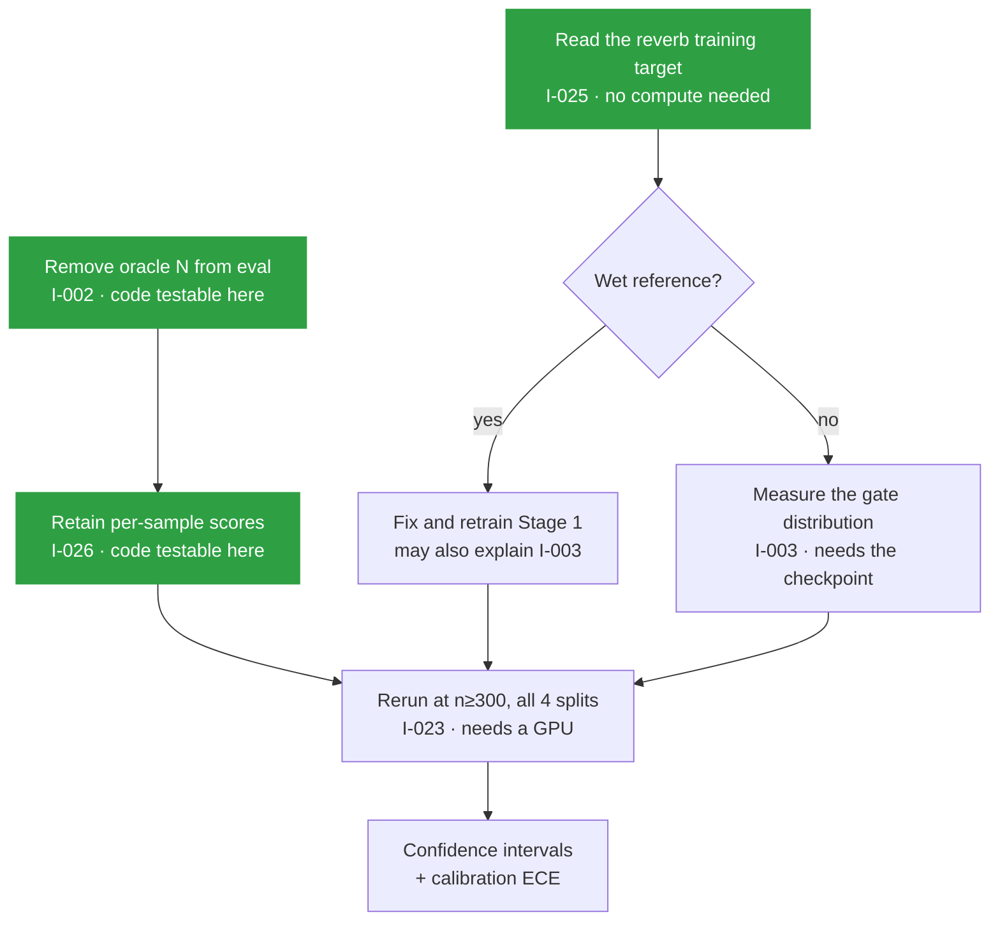

# What is wrong, and what it would take to fix it

**39 issues found · 27 closed · 12 open**

---

This is the plain-language companion to [`docs/restoration/ISSUE_LEDGER.md`](docs/restoration/ISSUE_LEDGER.md), which holds the formal tickets, and to the [GitHub issue tracker](https://github.com/TECHSCHOLAR777/SINGLE-CHANNEL-SPEECH-SEPARATION-PROJECT/issues), where each one is filed with labels.

The ledger tells you *what* each ticket says. This file tells you *why the remaining ones matter* and *what it would actually take* to close them, so you can decide what to do next without reading forty tickets.

---

## The short version

The code is in better shape than its own documentation suggested. Of the 39 problems found, 27 are already fixed, and most of those were connective tissue rather than design faults: symbols renamed in one place and not updated in another, all of which survived because the CI workflow was watching a branch that does not exist.

What remains is **mostly not fixable by writing code**. Nine of the twelve open issues need either a GPU, access to the Kaggle account holding the checkpoints, or a decision from the project owner. Three can be done on a laptop this afternoon.

---

## 🔴 Two issues that matter more than everything else

### The primary result has never been measured

**[I-002](https://github.com/TECHSCHOLAR777/SINGLE-CHANNEL-SPEECH-SEPARATION-PROJECT/issues/40) · `EXP` · P0**

The project is graded first on whether it returns the correct number of speakers, and second on whether each voice sounds clean. Every evaluation run so far handed the true speaker count to both the baseline and the full system, reading it off the LibriMix directory name. So the primary axis has no number at all, and the secondary one was measured under an assumption that will not hold in deployment.

This is not a small gap. It means the headline claim of the project is unevidenced.

**What it takes.** The mechanism already exists and is tested: `models/counting.py::count_from_attractors` reads the count off the backbone's attractor probabilities, and `eval/metrics.py` has `count_accuracy` and `count_confusion_matrix` waiting. The work is to add a flag to the evaluation harness that defaults to *not* supplying the count, thread `N_hat` into the result payload, and keep the oracle path available behind the flag so the existing numbers stay reproducible for comparison.

Perhaps a day of code, then a full evaluation run. The code half can be done and unit-tested here with a stub backbone. The run half needs compute.

### Five live credentials are sitting in a file

**[I-001](https://github.com/TECHSCHOLAR777/SINGLE-CHANNEL-SPEECH-SEPARATION-PROJECT/issues/39) · `SEC` · P0 · blocked on the owner**

The supplied project archive contains a Hugging Face read token, a Hugging Face write token, a Kaggle API token, and a Modal token-id and secret, all in plaintext in a file written for redistribution.

None of them is in this repository, and none ever was. The archive lives in a gitignored directory, a pre-commit hook now rejects those patterns, and CI scans every tracked file on every push.

**What it takes.** Rotate all five. That is the owner's action and nothing in this repository can do it. Treat them as exposed regardless of where the file has been, because a file written for handoff has usually been handed off.

---

## 🟠 Three findings that undercut the architecture

These are the ones that would come up in review, so it is better to know them now.

### The router does not route

**[I-003](https://github.com/TECHSCHOLAR777/SINGLE-CHANNEL-SPEECH-SEPARATION-PROJECT/issues/41) · `MODEL` · P1 · blocked on the checkpoint**

Stage 4c fitted the gate temperature to **T = 4.9872** by golden-section search. At that temperature `sigmoid(logit / T)` is nearly flat across the operating range, so all three adapter gates sit near 0.5 no matter what the input sounds like. The system is currently a fixed uniform blend of three adapters. The condition-aware routing that gives the project its name is, in the trained artifact, absent.

**What it takes.** Diagnose before touching anything. Load the Stage 4 checkpoint, push a set of mixtures with known conditions through it, and record the actual distribution of gate values. That single measurement distinguishes three hypotheses that currently look alike: the L1 sparsity penalty at 1e-3 pushing the gate to its uninformative mid-point, Stage 3 having too few epochs to separate the conditions, or the calibration objective having nothing to reward because one of the three adapters is harmful (see below). Needs the checkpoint from Kaggle. The measurement itself runs on CPU.

### One of the three adapters makes things worse

**[I-025](https://github.com/TECHSCHOLAR777/SINGLE-CHANNEL-SPEECH-SEPARATION-PROJECT/issues/62) · `MODEL` · P1**

| Condition | Base | With reverb adapter | Change |
|---|---:|---:|---:|
| Clean, anechoic | 18.61 dB | 18.17 dB | 🔴 -0.44 dB |
| Reverb, mild | -30.89 dB | -30.96 dB | -0.07 dB |
| Reverb, strong | -32.83 dB | -35.64 dB | 🔴 -2.81 dB |

The reverb adapter degrades quality in every tested condition, including the clean one it should leave alone.

The measurement is trustworthy because the same diagnostic ran two controls and both passed. With the gate at zero the adapted model reproduced the base model to a maximum difference of `0.000000`, so the injection mechanism is correct. The LoRA A matrices had a mean norm of 1.5813 and the B matrices were non-zero, so weights were genuinely learned. The adapter learned something, and what it learned is harmful.

**What it takes.** The most likely cause is that Stage 1 reverb training used the *wet* reverberant signal as its reference target rather than the anechoic one, which would teach the adapter to reproduce reverberation instead of removing it. That hypothesis ranks above the alternatives because it explains the *sign* of the result and not merely its size.

Confirming it needs no compute at all: read the reference signal through `train/stage1_single.py` and `data/degradations.py`. If the target is wrong, fix it and retrain, which does need a GPU. **Start here.** It is the cheapest of the three findings to diagnose and it may explain I-003 as well.

### The three-adapter design has no evidence behind it

**[I-024](https://github.com/TECHSCHOLAR777/SINGLE-CHANNEL-SPEECH-SEPARATION-PROJECT/issues/61) · `EXP` · P1 · blocked on compute**

Why three condition-specific adapters rather than one universal one? The intended answer is the Stage 2 ablation. Stage 2 was never trained.

The interesting detail is that it was clearly *prepared for*: the evaluation harness recovered from the archive contains `_load_universal_ckpt`, a loader that reads a Stage 2 checkpoint from either a file or a PyTorch zip directory. Somebody wrote the loader and never got to the run.

**What it takes.** Train Stage 2 and run the ablation. Roughly two weeks of GPU time by the original estimate. Until then the central design choice of the system is a preference, not a finding.

---

## 🟡 Evidence gaps worth closing before publishing anything

### Thirty samples, no error bars

**[I-023](https://github.com/TECHSCHOLAR777/SINGLE-CHANNEL-SPEECH-SEPARATION-PROJECT/issues/60) · `EXP` · P1** and **[I-026](https://github.com/TECHSCHOLAR777/SINGLE-CHANNEL-SPEECH-SEPARATION-PROJECT/issues/63) · `TEST` · P2**

Every reported number comes from 30 clips out of roughly 3,000 available, and none carries a confidence interval. The Libri5Mix improvement of +0.62 dB could plausibly be noise, and there is currently no way to say whether it is. Libri4Mix was never evaluated at all, so there is a hole in the middle of the speaker-count sweep.

The tooling is already written and has simply never been pointed at a result: `eval/stats.py` implements bootstrap BCa confidence intervals and a Wilcoxon signed-rank test.

**What it takes.** Two pieces. The evaluation harness currently keeps only aggregates, so per-sample scores have to be retained first, which is a small change and testable here. Then a rerun at n ≥ 300 across all four splits, which is three to five days of compute. The recovered harness can already enumerate all four splits; the committed one could not, which is part of why Libri4Mix was skipped.

### Confidence scores of unknown reliability

**[I-034](https://github.com/TECHSCHOLAR777/SINGLE-CHANNEL-SPEECH-SEPARATION-PROJECT/issues/71) · `EXP` · P2 · blocked on compute**

Four calibration components are implemented, unit-tested, and one is fitted. None has a measured calibration error. The system emits per-stream confidence and a completeness probability, and nobody knows whether either is trustworthy. Producing a confidence number whose calibration is unknown is arguably worse than producing none, because a reader will believe it.

**What it takes.** Compute ECE and a reliability diagram over a held-out set. About a day, once the checkpoint and evaluation data are in hand. `train/calibrate.py` already computes and records ECE for the confidence calibrator, so the plumbing exists.

### No result can be tied to the weights that produced it

**[I-022](https://github.com/TECHSCHOLAR777/SINGLE-CHANNEL-SPEECH-SEPARATION-PROJECT/issues/59) · `DATA` · P2 · blocked on Kaggle access**

No checkpoint in this project has a recorded hash. The result files identify their checkpoint as `"checkpoint_dir": "checkpoints"`, which identifies nothing. There is no way to prove that the weights on Kaggle today are the weights behind the published numbers.

A related open question: `MEASUREMENTS.md` records the Stage 1 noise adapter at roughly 40 epochs, while a project note from 2026-07-18 records the then-current `best_noise.pt` as an epoch-2 artifact needing retraining. Both can be true if retraining happened between those dates, but no log confirms it, and the Stage 4 result was built on top of whichever one it was.

**What it takes.** Read the epoch field out of each Stage 1 checkpoint. Minutes of work, gated entirely on Kaggle credentials. Going forward the fix is cheap and already half-built: `utils/hashing.py` exists and is tested, and `train/calibrate.py` now demonstrates the pattern by writing a hashed artifact manifest. Wiring the same thing into checkpoint writing closes this permanently for future runs. It cannot be closed retroactively for past ones.

---

## ⚪ Three you can finish on a laptop today

| Issue | What | Effort |
|---|---|---|
| [I-039](https://github.com/TECHSCHOLAR777/SINGLE-CHANNEL-SPEECH-SEPARATION-PROJECT/issues/77) `DOC` | The decision log says 17 LoRA attachment points. The measured count is 37. Work out from the July history whether 17 was a deliberate narrower choice that was later widened, then append a dated correction rather than editing the original entry. | An hour |
| [I-038](https://github.com/TECHSCHOLAR777/SINGLE-CHANNEL-SPEECH-SEPARATION-PROJECT/issues/75) `ARCH` | Four calibrators, three serialisation formats, two of them pickling scikit-learn estimators. Unpickling executes arbitrary code, and a pickled estimator stops loading after a routine dependency bump. One of them also silently rewrites the path you give it. Move all four to JSON. | Half a day |
| [I-032](https://github.com/TECHSCHOLAR777/SINGLE-CHANNEL-SPEECH-SEPARATION-PROJECT/issues/69) `PERF` | Inference runs 12 to 20 times slower than real time on CPU, which is the direct reason n = 30 rather than 300. Profile before proposing anything; the frozen backbone dominates and cannot be changed, so batching across the evaluation loop is the only plausible lever. | Unscoped |

---

## Where to start

🟩 needs nothing but a laptop.

The two green paths are independent and can run in parallel. Both should finish before any GPU time is spent, because a rerun that still supplies the oracle count would produce another set of numbers that answer the wrong question.

---

## What was already fixed

Twenty-seven issues, all closed with validation evidence rather than on the code change alone. Each closure comment on GitHub names its commit.

| Group | What was wrong | Now |
|---|---|---|
| **Rename drift** (I-004 to I-008) | Symbols renamed in the module that defines them, consumers never updated. `CALMSEP_SR`, `si_snr`, `CalmSepEngine`, plus two whole modules dropped in a branch merge. | 🟢 All import |
| **v1 residue** (I-009, I-033, I-035) | Four files serving the abandoned cascade, one script calling deleted classes, another hard-coding paths on a banned platform. | 🟢 Classified, removed or repaired |
| **Silent bugs** (I-010, I-036, I-037) | A script that copied files on import. Inference randomising every adapter gate while reporting the correct one. A speaker-count readout that crashed on its own documented type and counted two slots that are not speakers. | 🟢 Fixed with regression tests |
| **Reproducibility** (I-019, I-020, I-021) | The frozen backbone loader was unobtainable, five runtime imports were undeclared, and three documents gave three different parameter counts. | 🟢 Backbone pinned by commit, dependencies enforced by a test, parameters measured |
| **Recovery** (I-012 to I-015) | Six weeks of work existed only inside an archive: three source files and one raw result that appear in no commit. | 🟢 Recovered verbatim |
| **The reason none of it was caught** (I-011) | CI watched `main` while the default branch was `master`. It had never run once in 158 commits. | 🟢 Runs on `master`, three jobs, import sweep, credential scan |
| **Documentation** (I-016 to I-018, I-029) | A results table of empty cells while measured results sat in tracked JSON. A structure section describing files that do not exist. Package metadata naming a project abandoned in July. | 🟢 Rewritten against the artifacts |
| **Structure** (I-028, I-031) | Eleven packages at the repository root, `demo.py` and `demo/` both resolving to `import demo`, two dead project names. | 🟢 `src/coralsep/`, renamed to CoRAL-Sep |

The single most useful thing that came out of the whole pass was the CI finding. A quality gate pointed at a branch that does not exist is worse than no gate, because the badge implies a protection that was never there, and every one of the import failures above would have been caught by its first run.

---

## Conventions

**Priority.** 🔴 `P0` blocks operation or invalidates results · 🟠 `P1` blocks a workflow · 🟡 `P2` degrades quality or reproducibility · ⚪ `P3` improvement.

**Blocked** means blocked on compute, on credentials, or on a decision from the owner. It never means blocked on knowing what to do; where that is unresolved the ticket says `INVESTIGATING` and names what evidence would settle it.

**Closing.** A ticket closes on validation evidence, never on a code change alone. Every closure names its commit, and the command that proved it is in [`docs/restoration/VALIDATION_MATRIX.md`](docs/restoration/VALIDATION_MATRIX.md).
