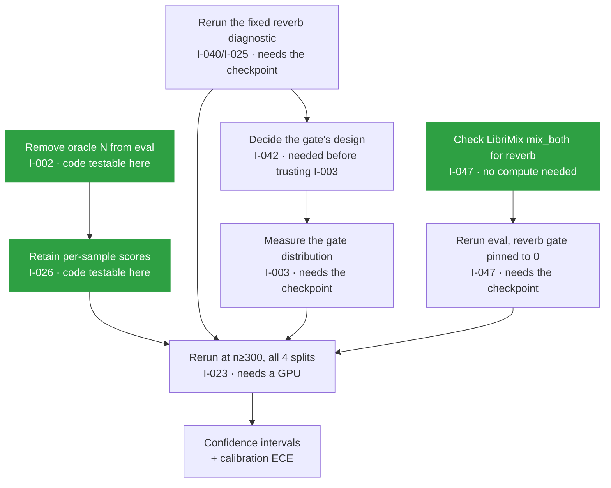

# What is wrong, and what it would take to fix it

**47 issues found · 29 closed · 18 open**

---

This is the plain-language companion to [`docs/restoration/ISSUE_LEDGER.md`](docs/restoration/ISSUE_LEDGER.md), which holds the formal tickets, and to the [GitHub issue tracker](https://github.com/TECHSCHOLAR777/SINGLE-CHANNEL-SPEECH-SEPARATION-PROJECT/issues), where each one is filed with labels.

The ledger tells you *what* each ticket says. This file tells you *why the remaining ones matter* and *what it would actually take* to close them, so you can decide what to do next without reading forty tickets.

---

## The short version

The code is in better shape than its own documentation suggested. Of the 47 problems found, 29 are already fixed. The first restoration pass found mostly connective tissue: symbols renamed in one place and not updated in another, all of which survived because the CI workflow was watching a branch that does not exist. A second, deeper pass attacking the research approach itself, not just the code, found two severe bugs in the load-bearing paths (below) and six open questions about whether the architecture's central design choices are supported by evidence at all.

What remains is **mostly not fixable by writing code**. Most of the open issues need either a GPU, access to the Kaggle account holding the checkpoints, or a decision from the project owner. A handful can be done on a laptop.

---

## 🟢 Two severe bugs found and fixed this session, before touching anything else

The instruction going into this pass was to attack the approach and the codebase hard before doing anything else. These two were the payoff.

### The condition-routed gate could not run

**[I-041](https://github.com/TECHSCHOLAR777/SINGLE-CHANNEL-SPEECH-SEPARATION-PROJECT/issues/79) · `BUG` · P0 · fixed**

`GateNetwork` is built to take a 10-number input, four DSP features plus six learned condition features. The actual inference pipeline built only the four DSP numbers and handed that straight to the gate. That is the deployed, condition-routed inference path the whole project is named for, and it would crash the instant a real trained gate was attached to it. Every result in the repository that involves the gate came from separate scripts that build their own input tensor correctly; the pipeline class itself had, as far as anyone can tell, never been run end to end with a real gate.

Fixed by padding the missing six numbers with zero, which matches a convention the architecture doc already describes for the first chunk of audio. A test now builds a real pipeline with a real gate and proves it runs.

### The reverb adapter's "harmful" verdict was measured wrong

**[I-040](https://github.com/TECHSCHOLAR777/SINGLE-CHANNEL-SPEECH-SEPARATION-PROJECT/issues/78) · `BUG` · P1 · fixed**

The diagnostic script behind the table in the next section scores the model's output against the wrong reference signal for two of its three conditions. See below, this rewrites what I-025 currently means.

---

## 🔴 Two issues that matter more than everything else

### The primary result has never been measured

**[I-002](https://github.com/TECHSCHOLAR777/SINGLE-CHANNEL-SPEECH-SEPARATION-PROJECT/issues/40) · `EXP` · P0**

The project is graded first on whether it returns the correct number of speakers, and second on whether each voice sounds clean. Every evaluation run so far handed the true speaker count to both the baseline and the full system, reading it off the LibriMix directory name. So the primary axis has no number at all, and the secondary one was measured under an assumption that will not hold in deployment.

This is not a small gap. It means the headline claim of the project is unevidenced.

**What it takes.** The mechanism already exists and is tested: `models/counting.py::count_from_attractors` reads the count off the backbone's attractor probabilities, and `eval/metrics.py` has `count_accuracy` and `count_confusion_matrix` waiting. The work is to add a flag to the evaluation harness that defaults to *not* supplying the count, thread `N_hat` into the result payload, and keep the oracle path available behind the flag so the existing numbers stay reproducible for comparison.

Perhaps a day of code, then a full evaluation run. The code half can be done and unit-tested here with a stub backbone. The run half needs compute.

### Five live credentials are sitting in a file

**[I-001](https://github.com/TECHSCHOLAR777/SINGLE-CHANNEL-SPEECH-SEPARATION-PROJECT/issues/39) · `SEC` · P0 · blocked on the owner**

The supplied project archive contains a Hugging Face read token, a Hugging Face write token, a Kaggle API token, and a Modal token-id and secret, all in plaintext in a file written for redistribution.

None of them is in this repository, and none ever was. The archive lives in a gitignored directory, a pre-commit hook now rejects those patterns, and CI scans every tracked file on every push.

**What it takes.** Rotate all five. That is the owner's action and nothing in this repository can do it. Treat them as exposed regardless of where the file has been, because a file written for handoff has usually been handed off.

---

## 🟠 Three findings that undercut the architecture

These are the ones that would come up in review, so it is better to know them now.

### The router does not route

**[I-003](https://github.com/TECHSCHOLAR777/SINGLE-CHANNEL-SPEECH-SEPARATION-PROJECT/issues/41) · `MODEL` · P1 · blocked on the checkpoint**

Stage 4c fitted the gate temperature to **T = 4.9872** by golden-section search. At that temperature `sigmoid(logit / T)` is nearly flat across the operating range, so all three adapter gates sit near 0.5 no matter what the input sounds like. The system is currently a fixed uniform blend of three adapters. The condition-aware routing that gives the project its name is, in the trained artifact, absent.

**What it takes.** Diagnose before touching anything. Load the Stage 4 checkpoint, push a set of mixtures with known conditions through it, and record the actual distribution of gate values. That single measurement distinguishes three hypotheses that currently look alike: the L1 sparsity penalty at 1e-3 pushing the gate to its uninformative mid-point, Stage 3 having too few epochs to separate the conditions, or the calibration objective having nothing to reward because one of the three adapters is harmful (see below). Needs the checkpoint from Kaggle. The measurement itself runs on CPU.

### Whether the reverb adapter makes things worse is now an open question again, for a better reason than before

**[I-025](https://github.com/TECHSCHOLAR777/SINGLE-CHANNEL-SPEECH-SEPARATION-PROJECT/issues/62) · `MODEL` · P1 · investigating**

The original table here read:

| Condition | Base | With reverb adapter | Change |
|---|---:|---:|---:|
| Clean, anechoic | 18.61 dB | 18.17 dB | 🔴 -0.44 dB |
| Reverb, mild | -30.89 dB | -30.96 dB | -0.07 dB |
| Reverb, strong | -32.83 dB | -35.64 dB | 🔴 -2.81 dB |

and this file's previous edition said the likely cause was that Stage 1 training used the wet reverberant reference instead of the dry one. That hypothesis is now refuted, by reading the code it named. `data/degradations.py` shows the wet reference is a deliberate, carefully justified design choice: the system is meant to separate speakers without also dereverberating them, so scoring it against the dry source would grade it on a task it was never asked to do. That part of the design is sound.

What was actually wrong is the diagnostic script that produced the table above ([I-040](https://github.com/TECHSCHOLAR777/SINGLE-CHANNEL-SPEECH-SEPARATION-PROJECT/issues/78), now fixed). It scored the reverb conditions against the dry reference anyway, the exact mistake the design docs warn against. Its own second pass proves this on its own numbers: scored against the correct wet target, the same audio measures near 0 dB; scored against the dry one, it measures -32 to -35 dB. That is a 31.65 dB gap on identical audio, and the script's own sanity check missed it because of a sign error.

**What this means.** The -2.81 dB "harm" figure cannot be trusted; it may still be true, or the adapter may be fine, or actively good, once measured correctly. The one number from that table that is *not* affected by this bug is the clean-audio delta (-0.44 dB), since there is no wet/dry distinction without reverb, and it stands as a small real regression from switching the adapter on when it has nothing to do.

A separate, independent finding from this pass gives a second reason the adapter could be struggling even once scored correctly: it was trained with the other two adapters barely switched on (0 to 20 percent), but the deployed gate runs all three near 50 percent (see the gate finding just below). It has never been tested under the load it actually runs in.

**What it takes.** The diagnostic script is fixed and ready to rerun. Rerunning it needs the Stage 1 checkpoint, which is on Kaggle. **Start here once compute is available**, since it is the single measurement that would tell us the most, and everything else about the reverb adapter is downstream of it.

### The three-adapter design has no evidence behind it

**[I-024](https://github.com/TECHSCHOLAR777/SINGLE-CHANNEL-SPEECH-SEPARATION-PROJECT/issues/61) · `EXP` · P1 · blocked on compute**

Why three condition-specific adapters rather than one universal one? The intended answer is the Stage 2 ablation. Stage 2 was never trained.

The interesting detail is that it was clearly *prepared for*: the evaluation harness recovered from the archive contains `_load_universal_ckpt`, a loader that reads a Stage 2 checkpoint from either a file or a PyTorch zip directory. Somebody wrote the loader and never got to the run.

**What it takes.** Train Stage 2 and run the ablation. Roughly two weeks of GPU time by the original estimate. Until then the central design choice of the system is a preference, not a finding.

### The gate never actually receives the features it was trained to route on

**[I-042](https://github.com/TECHSCHOLAR777/SINGLE-CHANNEL-SPEECH-SEPARATION-PROJECT/issues/80) · `ARCH` · P1**

Half the gate's input is supposed to come from the audio itself: pooled encoder output from the previous chunk, six numbers describing reverb severity, count evidence and the like. The architecture docs describe this as a deliberate one-chunk lag, zero on the first chunk of audio, real after that. The actual inference code computes the gate exactly once for an entire utterance, before any audio has been processed at all, so those six numbers are always zero, not just on the first chunk. The fix for the crash above (I-041) papers over this correctly for now by zero-padding, but the deeper question, should the gate run per chunk with real features, is still open.

**What it takes.** A decision: either restructure the pipeline to run the gate per chunk the way the docs describe, or correct the docs to say the gate is once-per-utterance and always blind to reverb and count evidence. This is a real design change either way, not a quick patch. It may also be a second explanation for why the gate output is flat (I-003): a gate that is structurally blind to half its intended input cannot route on that half.

### The three adapters were trained for a blend they never actually run in

**[I-043](https://github.com/TECHSCHOLAR777/SINGLE-CHANNEL-SPEECH-SEPARATION-PROJECT/issues/81) · `MODEL` · P2**

Stage 1 trains one adapter at a time with the other two barely switched on, 0 to 20 percent. The gate that actually runs at inference blends all three near 50 percent. No adapter has ever seen, in training, anything close to the composition regime it is deployed under.

**What it takes.** A diagnostic that runs each trained adapter under a fixed 50/50/50 blend and compares it against its own trained regime. Needs the Stage 1 checkpoints from Kaggle; the diagnostic script itself is a laptop task.

### The noise adapter's training data was never checked against the test set it is graded on

**[I-044](https://github.com/TECHSCHOLAR777/SINGLE-CHANNEL-SPEECH-SEPARATION-PROJECT/issues/82) · `DATA` · P2**

The official test mixtures include WHAM background noise. The code that stages noise for training is aware that WHAM has separate train and test splits, but nothing downstream of it actually enforces which split gets used, unlike speaker isolation, which is checked explicitly for LibriSpeech. If whoever ran noise staging pointed it at the wrong folder, the noise adapter could have trained on noise related to the exact clips it is later scored against.

**What it takes.** A guard that records and checks the split at load time, so a future run cannot make this mistake silently, which is a laptop task. Confirming whether past runs actually did this needs the staged data on Kaggle.

### Reconstructing the missing high frequencies leans on information the deployed system will never have

**[I-045](https://github.com/TECHSCHOLAR777/SINGLE-CHANNEL-SPEECH-SEPARATION-PROJECT/issues/83) · `MODEL` · P2**

The step that reconstructs 4 to 8 kHz content works by masking the shared, unseparated mixture, because separation itself only happens up to 4 kHz. In practice this means every speaker's reconstructed high band is a mask over the same signal, distinguished only by how each mask is shaped, so true separation above 4 kHz cannot happen by construction, only attenuation can. Separately, the code that decides whether to trust the reconstruction can consult the answer key during evaluation, an option a deployed system never has.

**What it takes.** Report any future band-recovery number honestly labelled by which guard produced it, the oracle one or the deployable one, and be plain in the docs that this step extends bandwidth rather than separates it.

### The decision to never touch the frozen backbone was never itself tested

**[I-046](https://github.com/TECHSCHOLAR777/SINGLE-CHANNEL-SPEECH-SEPARATION-PROJECT/issues/84) · `RESEARCH` · P3**

The rule against ever fine-tuning the backbone comes from an earlier experiment that stacked new layers on *top of* its output and made things worse. That is real evidence against one specific approach. It was generalised into a much broader rule, never touch the backbone at all, only ever intervene through LoRA, without a direct test of the more moderate middle ground, such as lightly fine-tuning the last layer or two. Given that one of the three adapters needs to be re-verified (I-025) and the universal-adapter ablation was never run (I-024), the project currently has no direct evidence that its central bet beats that untested alternative.

**What it takes.** Nothing urgent. Just say plainly in the docs that this is an extrapolation, not a measurement, until compute allows testing it directly.

### The headline results may include a known-harmful adapter that was never supposed to be graded there

**[I-047](https://github.com/TECHSCHOLAR777/SINGLE-CHANNEL-SPEECH-SEPARATION-PROJECT/issues/85) · `EXP` · P1 · blocked**

The standard LibriMix test mixtures used to produce the headline improvement numbers do not include reverberation at all, only noise. If that is also true of the actual data copy used here, every one of those headline numbers was produced with the gate still blending in the reverb adapter at roughly 50 percent (I-003), on audio that adapter is separately measured to hurt even when perfectly clean. The reported improvement would then understate what the noise and codec adapters contribute on their own, and the true story may be that two adapters help while the third quietly drags the total down.

**What it takes.** First, a five-minute check of which LibriMix generation path was actually used, doable without a GPU. Second, if confirmed, a cheap rerun with the reverb adapter's gate pinned to zero, compared side by side with the current numbers.

---

## 🟡 Evidence gaps worth closing before publishing anything

### Thirty samples, no error bars

**[I-023](https://github.com/TECHSCHOLAR777/SINGLE-CHANNEL-SPEECH-SEPARATION-PROJECT/issues/60) · `EXP` · P1** and **[I-026](https://github.com/TECHSCHOLAR777/SINGLE-CHANNEL-SPEECH-SEPARATION-PROJECT/issues/63) · `TEST` · P2**

Every reported number comes from 30 clips out of roughly 3,000 available, and none carries a confidence interval. The Libri5Mix improvement of +0.62 dB could plausibly be noise, and there is currently no way to say whether it is. Libri4Mix was never evaluated at all, so there is a hole in the middle of the speaker-count sweep.

The tooling is already written and has simply never been pointed at a result: `eval/stats.py` implements bootstrap BCa confidence intervals and a Wilcoxon signed-rank test.

**What it takes.** Two pieces. The evaluation harness currently keeps only aggregates, so per-sample scores have to be retained first, which is a small change and testable here. Then a rerun at n ≥ 300 across all four splits, which is three to five days of compute. The recovered harness can already enumerate all four splits; the committed one could not, which is part of why Libri4Mix was skipped.

### Confidence scores of unknown reliability

**[I-034](https://github.com/TECHSCHOLAR777/SINGLE-CHANNEL-SPEECH-SEPARATION-PROJECT/issues/71) · `EXP` · P2 · blocked on compute**

Four calibration components are implemented, unit-tested, and one is fitted. None has a measured calibration error. The system emits per-stream confidence and a completeness probability, and nobody knows whether either is trustworthy. Producing a confidence number whose calibration is unknown is arguably worse than producing none, because a reader will believe it.

**What it takes.** Compute ECE and a reliability diagram over a held-out set. About a day, once the checkpoint and evaluation data are in hand. `train/calibrate.py` already computes and records ECE for the confidence calibrator, so the plumbing exists.

### No result can be tied to the weights that produced it

**[I-022](https://github.com/TECHSCHOLAR777/SINGLE-CHANNEL-SPEECH-SEPARATION-PROJECT/issues/59) · `DATA` · P2 · blocked on Kaggle access**

No checkpoint in this project has a recorded hash. The result files identify their checkpoint as `"checkpoint_dir": "checkpoints"`, which identifies nothing. There is no way to prove that the weights on Kaggle today are the weights behind the published numbers.

A related open question: `MEASUREMENTS.md` records the Stage 1 noise adapter at roughly 40 epochs, while a project note from 2026-07-18 records the then-current `best_noise.pt` as an epoch-2 artifact needing retraining. Both can be true if retraining happened between those dates, but no log confirms it, and the Stage 4 result was built on top of whichever one it was.

**What it takes.** Read the epoch field out of each Stage 1 checkpoint. Minutes of work, gated entirely on Kaggle credentials. Going forward the fix is cheap and already half-built: `utils/hashing.py` exists and is tested, and `train/calibrate.py` now demonstrates the pattern by writing a hashed artifact manifest. Wiring the same thing into checkpoint writing closes this permanently for future runs. It cannot be closed retroactively for past ones.

---

## ⚪ Three you can finish on a laptop today

| Issue | What | Effort |
|---|---|---|
| [I-039](https://github.com/TECHSCHOLAR777/SINGLE-CHANNEL-SPEECH-SEPARATION-PROJECT/issues/77) `DOC` | The decision log says 17 LoRA attachment points. The measured count is 37. Work out from the July history whether 17 was a deliberate narrower choice that was later widened, then append a dated correction rather than editing the original entry. | An hour |
| [I-038](https://github.com/TECHSCHOLAR777/SINGLE-CHANNEL-SPEECH-SEPARATION-PROJECT/issues/75) `ARCH` | Four calibrators, three serialisation formats, two of them pickling scikit-learn estimators. Unpickling executes arbitrary code, and a pickled estimator stops loading after a routine dependency bump. One of them also silently rewrites the path you give it. Move all four to JSON. | Half a day |
| [I-032](https://github.com/TECHSCHOLAR777/SINGLE-CHANNEL-SPEECH-SEPARATION-PROJECT/issues/69) `PERF` | Inference runs 12 to 20 times slower than real time on CPU, which is the direct reason n = 30 rather than 300. Profile before proposing anything; the frozen backbone dominates and cannot be changed, so batching across the evaluation loop is the only plausible lever. | Unscoped |

---

## Where to start

🟩 needs nothing but a laptop.

The green paths are independent and can run in parallel, and should finish before spending GPU time on anything else. I-042 is new: it is a design decision, not a measurement, and I-003's diagnosis depends on which way it is decided, since a gate that structurally never sees half its intended input cannot be diagnosed the same way as one that sees real features and ignores them.

---

## What was already fixed

Twenty-nine issues, all closed with validation evidence rather than on the code change alone. Each closure comment on GitHub names its commit.

| Group | What was wrong | Now |
|---|---|---|
| **Rename drift** (I-004 to I-008) | Symbols renamed in the module that defines them, consumers never updated. `CALMSEP_SR`, `si_snr`, `CalmSepEngine`, plus two whole modules dropped in a branch merge. | 🟢 All import |
| **v1 residue** (I-009, I-033, I-035) | Four files serving the abandoned cascade, one script calling deleted classes, another hard-coding paths on a banned platform. | 🟢 Classified, removed or repaired |
| **Silent bugs** (I-010, I-036, I-037) | A script that copied files on import. Inference randomising every adapter gate while reporting the correct one. A speaker-count readout that crashed on its own documented type and counted two slots that are not speakers. | 🟢 Fixed with regression tests |
| **Load-bearing bugs found on the second, harder pass** (I-040, I-041) | A diagnostic script scoring reverberant audio against the wrong reference, and the production gate crashing whenever a real gate network was attached to it. | 🟢 Fixed with regression tests, see above |
| **Reproducibility** (I-019, I-020, I-021) | The frozen backbone loader was unobtainable, five runtime imports were undeclared, and three documents gave three different parameter counts. | 🟢 Backbone pinned by commit, dependencies enforced by a test, parameters measured |
| **Recovery** (I-012 to I-015) | Six weeks of work existed only inside an archive: three source files and one raw result that appear in no commit. | 🟢 Recovered verbatim |
| **The reason none of it was caught** (I-011) | CI watched `main` while the default branch was `master`. It had never run once in 158 commits. | 🟢 Runs on `master`, three jobs, import sweep, credential scan |
| **Documentation** (I-016 to I-018, I-029) | A results table of empty cells while measured results sat in tracked JSON. A structure section describing files that do not exist. Package metadata naming a project abandoned in July. | 🟢 Rewritten against the artifacts |
| **Structure** (I-028, I-031) | Eleven packages at the repository root, `demo.py` and `demo/` both resolving to `import demo`, two dead project names. | 🟢 `src/coralsep/`, renamed to CoRAL-Sep |

The single most useful thing that came out of the whole pass was the CI finding. A quality gate pointed at a branch that does not exist is worse than no gate, because the badge implies a protection that was never there, and every one of the import failures above would have been caught by its first run.

---

## Conventions

**Priority.** 🔴 `P0` blocks operation or invalidates results · 🟠 `P1` blocks a workflow · 🟡 `P2` degrades quality or reproducibility · ⚪ `P3` improvement.

**Blocked** means blocked on compute, on credentials, or on a decision from the owner. It never means blocked on knowing what to do; where that is unresolved the ticket says `INVESTIGATING` and names what evidence would settle it.

**Closing.** A ticket closes on validation evidence, never on a code change alone. Every closure names its commit, and the command that proved it is in [`docs/restoration/VALIDATION_MATRIX.md`](docs/restoration/VALIDATION_MATRIX.md).
