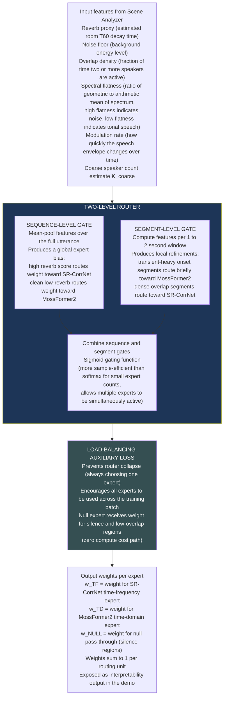
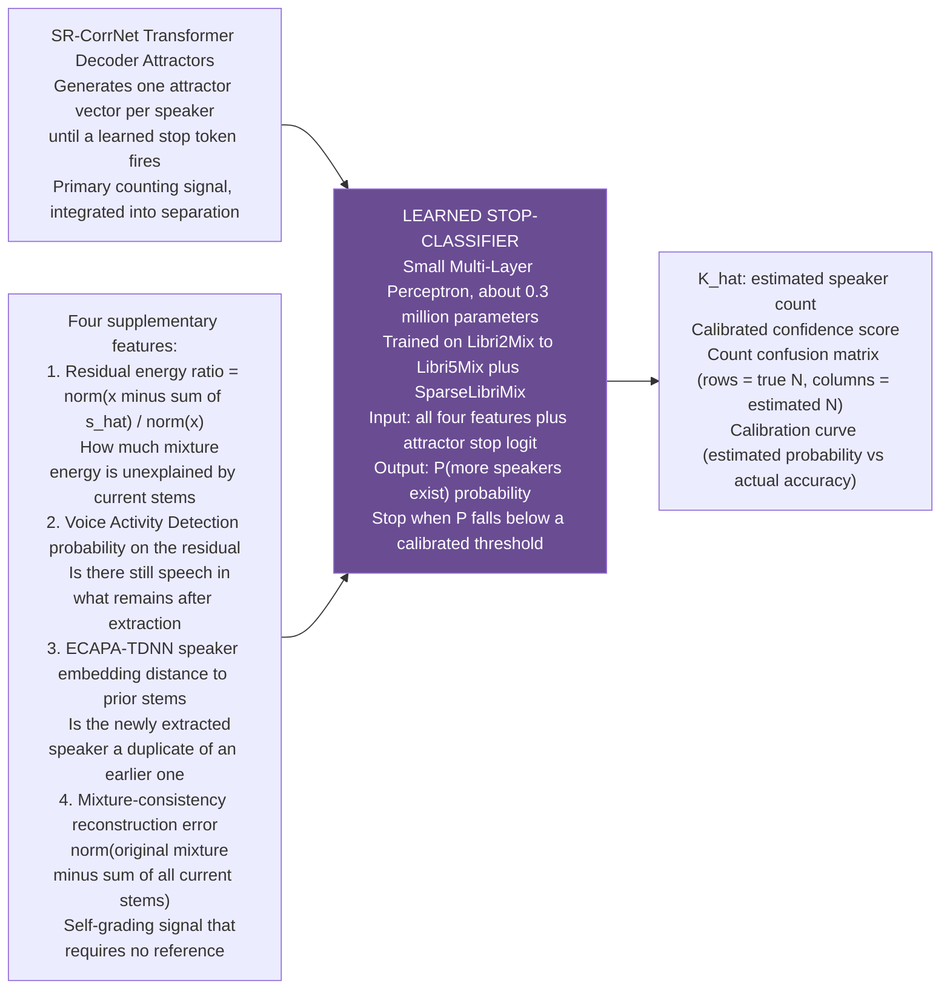
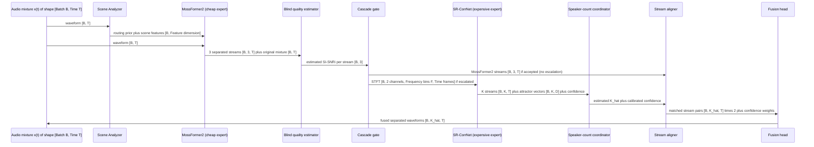
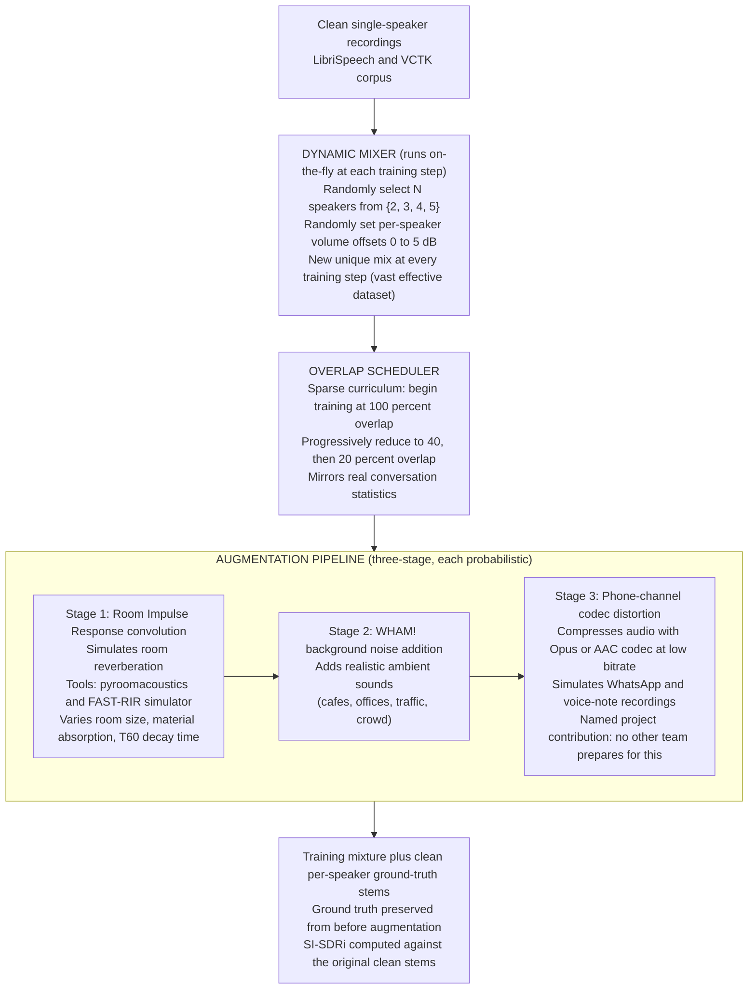

# Multi-Speaker Speech Separation: Master Project Document
## Conditional Cascade Routing Architecture for Three or More Concurrent Speakers (Single-Channel Audio)

> **Status:** Source of truth. Version 1.2.
> **Last updated:** July 2026.
> **Scope:** Blind single-channel speech separation for three or more simultaneous speakers, with unknown speaker count, designed to be robust to real recordings, reverberant rooms, and voice-note quality audio.
> **This document supersedes all prior notes.** Every architectural decision, dataset choice, weight source, loss function, parameter budget, and project phase is consolidated here.

---

## 0. How to Read This Document

Sections 1 to 3 define what the project builds and why the design takes the shape it does. Section 4 presents the full architecture with diagrams. Sections 5 to 8 give the buildable specifics: component specifications, datasets, loss functions, and parameter budgets. Sections 9 to 11 cover execution: project phases, evaluation protocol, and risk mitigations. Section 12 is the novelty ledger, listing each claimed contribution and the measurement that proves it.

**The central design idea.** This project does not build a new neural separator from scratch. It builds a conditional cascade routing system that orchestrates two existing state-of-the-art separators, routes each input to the right expert based on measured acoustic condition, and adds intelligence at the counting, robustness, and evaluation layers. The contribution is the routing, the counting, the robustness engineering, and the evaluation design, not a new network block.

**Why this is defensible.** A student team cannot outperform the original authors of state-of-the-art separators on raw architecture. A student team can build a system that intelligently manages compute, routes between complementary experts by measuring the acoustic scene, calibrates its speaker count estimate, and honestly documents the field's failure modes. That is a complete and evaluatable research contribution.

---

## 1. Problem Definition

### 1.1 Formal task statement

The input is a single mono audio channel, denoted `x(t)`, which is the sum of `N` simultaneous speakers plus optional noise and reverberation: `x(t) = s1(t) + s2(t) + ... + sN(t) + n(t)`, where `N >= 3` and `n(t)` is background noise or room echo. The goal is to produce `N_hat` separate clean waveforms `{s_hat_1(t), s_hat_2(t), ..., s_hat_N_hat(t)}`, each corresponding to one distinct speaker. The system must infer `N_hat` because the true count is unknown at test time.

The primary quality measure is Scale-Invariant Signal-to-Distortion Ratio improvement (SI-SDRi), measured in decibels, which quantifies how much cleaner each recovered speaker track is compared to listening to the raw mixture. Higher values indicate better separation.

### 1.2 What is in scope and what is not

| In scope | Out of scope unless added as an optional extra |
|---|---|
| Single-channel blind separation of three or more concurrent speakers | Video or lip-movement-based separation, since test inputs are audio only |
| Scaling toward five simultaneous speakers | Multi-channel beamforming, which requires multiple microphones |
| Inferring the unknown speaker count at test time | Speaker diarization alone, which labels who spoke when but does not recover clean waveforms |
| Robustness to noise, reverberation, and phone-channel codec distortion | Full speech recognition, which is used only as a downstream quality check |
| Inference pipeline, demo, and written report | Real-time streaming on-device deployment, treated as an optional demo mode only |

### 1.3 Working assumptions on the evaluation

The evaluators have not fully specified test conditions, so the project operates on the following assumptions based on the project brief:

1. The speaker count is not given at test time. The system must estimate it. A manual override input is exposed for convenience.
2. Whether the test audio is synthetic or real is unknown. The project prepares for the harder case: real recordings made in rooms on phones.
3. Ground-truth reference waveforms may not exist at test time. The project reports Scale-Invariant Signal-to-Distortion Ratio improvement (SI-SDRi) where references exist and Deep Noise Suppression Mean Opinion Score (DNSMOS) plus Word Error Rate (WER) via automatic speech recognition where they do not.
4. Speaker-count levels are assumed to be 2, 3, 4, and 5, with a documented break-point curve extended to 6 and 7.
5. Input audio is assumed to be mono single-channel.
6. A graphics processing unit (GPU) is assumed available at evaluation time.
7. A written report and an interactive demo are assumed required.

### 1.4 Difficulty tiers aligned to the evaluator levels

The evaluators stated they would test at multiple levels based on concurrent speaker counts and quality of separation. The following tier structure is used throughout the project:

| Tier | Speakers | Overlap proportion | Acoustic conditions | Expected SI-SDRi range |
|---|---|---|---|---|
| L0 sanity | 2 | 100 percent | clean anechoic | 18 to 24 dB |
| L1 minimum pass | 3 | 100 percent | clean anechoic | 15 to 20 dB |
| L2 moderate | 3 to 4 | 40 to 60 percent | clean or mild background noise | 10 to 15 dB |
| L3 hard | 4 to 5 | 20 to 40 percent sparse | WHAM! realistic background noise | 8 to 12 dB |
| L4 expert | 5 to 7 | variable | noise plus room reverberation | 5 to 10 dB |
| L5 bonus | any | any | no reference signal available | DNSMOS or listening test |

**Calibration note.** The SepIt paper derived information-theoretic bounds on single-channel separation, placing an approximate ceiling near 14.5 dB at five speakers and near 12.0 dB at ten speakers on LibriMix. The 6-to-7-speaker regime is explicitly a graceful-degradation target. The project documents where quality falls off rather than pretending it does not.

---

## 2. Why a Conditional Cascade Routing System

### 2.1 The key problem with a naive ensemble

The original architecture draft had two experts always running on every input, with a learned fusion head combining their outputs. A teammate correctly identified that this is ensembling rather than routing, costs roughly double the compute of running one model, and makes the routing mechanism decorative rather than functional.

The evidence from the machine-learning inference literature is clear on the fix. A cascade runs the cheap model first, checks whether its output is good enough using a quality estimator, and escalates to the expensive model only when the output falls below a quality threshold. This is not ensembling. The key difference is that a cascade observes whether the cheap model succeeded before committing to running the expensive one, whereas an ensemble always runs both regardless of need.

In language model cascades this design achieves up to a 40 percent reduction in expensive model calls without degrading output quality. The escalation-quality curve shows diminishing returns beyond 30 to 40 percent escalation rate, which means a well-calibrated threshold keeps most inputs at cheap-model cost while protecting quality on hard inputs.

### 2.2 The component that makes a cascade work for separation

The entire cascade mechanism depends on one question: can the system tell how good a separation is without knowing the clean ground-truth sources? If it cannot, there is no way to know when to escalate.

The answer is yes, and a pretrained model for it already exists. A blind neural Signal-to-Noise Ratio estimator, available from SpeechBrain at `huggingface.co/speechbrain/REAL-M-sisnr-estimator`, estimates separation quality directly from the separated outputs and the original mixture without any reference signal. It achieves an average estimation error of about 1.7 decibels on the WHAMR! reverberant test set. A newer model, REFESS-QI, predicts both Signal-to-Noise Ratio and Word Error Rate jointly, again without references.

This estimator is the load-bearing component of the cascade. It allows the router to observe the cheap expert's actual output quality, not just predict how hard the input looks, before deciding whether to escalate.

### 2.3 The complementary inductive biases that make the cascade meaningful

The cascade is only worthwhile if the two experts are genuinely better at different things. The evidence is clear here:

SR-CorrNet (the expensive time-frequency expert) leads on clean three-speaker mixtures at about 24.4 dB SI-SDRi, leads on reverberant WHAMR! at about 19.7 dB single-channel, and provides the built-in unknown speaker count mechanism through its attractor-based dynamic split. Its inference real-time factor is about 0.31, meaning it takes about 31 percent of the audio duration to process on a modern GPU.

MossFormer2 (the cheap time-domain expert) is strong on clean anechoic transient-heavy audio at about 22.2 dB SI-SDRi on WSJ0-3mix, runs about six times faster at a real-time factor of about 0.05, and is better at capturing fine temporal onsets because its time-domain learned encoder has sharper time resolution than a fixed Short-Time Fourier Transform. Its fixed output of three streams limits it to three speakers maximum.

These are genuinely complementary. The cascade is meaningful because MossFormer2 handles clean structured audio well at low cost, while SR-CorrNet earns its extra compute on hard reverberant or high-speaker-count conditions.

### 2.4 The design statement

The system is named CA-MoSE, which stands for Condition-Aware Mixture-of-Separation-Experts. It uses a conditional cascade as its core inference strategy. The cheap time-domain expert (MossFormer2) runs first on every input. A blind quality estimator scores its output. If the score exceeds a tunable quality threshold, inference stops and MossFormer2's output is used, saving the cost of running the expensive expert entirely. If the score falls below the threshold, the expensive time-frequency expert (SR-CorrNet) is also run, and a small trained fusion head reconciles the two outputs. Fusion is reserved for genuinely ambiguous inputs, not applied universally.

---

## 3. Design Principles

1. **Reuse before retraining.** The project starts from pretrained model checkpoints and trains only the lightweight routing, fusion, and counting heads unless an ablation proves that further fine-tuning is worth the compute.
2. **Every claimed novelty must be measurable.** A contribution that cannot be shown to improve a metric on the evaluation harness is not claimed.
3. **Graceful degradation over overpromising.** A system that degrades cleanly and predictably at 6 and 7 speakers is more valuable than one that attempts them and produces garbage.
4. **Mixed-condition training, not worst-case-only training.** Training data spans clean, reverberant, noisy, and codec-distorted conditions so the system overfits to neither the synthetic benchmark domain nor an assumed reverberant real-world domain.
5. **Compute awareness.** The real hardware budget is two Kaggle T4 GPUs, each with 16 GB of memory. Any A100 access is reserved for final training runs only, not relied upon for development.

---

## 4. The Architecture

### 4.1 Terminology and full forms used in this section

Before the diagrams, all abbreviations used throughout the architecture are defined here.

| Term / abbreviation | Full form and meaning |
|---|---|
| CA-MoSE | Condition-Aware Mixture-of-Separation-Experts. The name for the full system. |
| STFT | Short-Time Fourier Transform. A mathematical operation that converts a raw audio waveform into a two-dimensional time-frequency representation, showing which frequencies are active at each moment in time. |
| Waveform | The raw time-domain audio signal, a sequence of amplitude values over time. |
| SR-CorrNet | Spectral-Relation Correlation Network. A state-of-the-art time-frequency domain speech separator published in March 2026. |
| MossFormer2 | Moment-of-Silence-enhanced Former version 2. A strong time-domain speech separator from Alibaba DAMO Academy, 2024. |
| MambaDeflate | A deflationary recursive separator built on the Mamba state-space architecture, used as the stretch-goal expert for five or more speakers. |
| TDA | Transformer Decoder Attractors. The mechanism inside SR-CorrNet that infers how many speakers are present by generating one attractor vector per speaker until a stop condition is reached. |
| Attractor | A vector in a learned embedding space that represents one speaker. Each time-frequency unit in the mixture is assigned to its nearest attractor, forming a separation mask. |
| RTF | Real-Time Factor. The ratio of processing time to audio duration. An RTF of 0.05 means the model processes 1 second of audio in 0.05 seconds. Lower is faster. |
| SI-SDRi | Scale-Invariant Signal-to-Distortion Ratio improvement. The primary separation quality metric in decibels. Measures how much cleaner the separated output is compared to the raw mixture. |
| DNSMOS | Deep Noise Suppression Mean Opinion Score. A reference-free perceptual quality score that estimates how a human would rate the audio quality, without needing the original clean sources. |
| WER | Word Error Rate. The fraction of words incorrectly transcribed when an automatic speech recognition system processes the separated audio. Lower is better. Measures intelligibility. |
| uPIT | Utterance-level Permutation Invariant Training. A training technique that tries all possible assignments of output slots to ground-truth speakers and picks the best one, resolving the ordering ambiguity of separation outputs. |
| ECAPA-TDNN | Emphasized Channel Attention, Propagation and Aggregation Time-Delay Neural Network. A strong speaker verification model that produces fixed-length vectors encoding speaker identity, used here for stream alignment. |
| CRRR | Confidence-Routed Residual Refinement. The name for the small fusion head that takes aligned expert outputs and produces a weighted residual correction. |
| RIR | Room Impulse Response. A measured or simulated signal that describes how sound echoes in a room. Convolving a clean speech signal with an RIR produces a simulated reverberant recording. |
| VAD | Voice Activity Detection. A system that detects whether a given audio segment contains speech or silence. |
| MLP | Multi-Layer Perceptron. A simple feedforward neural network with one or more hidden layers. |
| CNN | Convolutional Neural Network. A neural network that applies learned filter banks over the input, useful for extracting local patterns. |
| GRU | Gated Recurrent Unit. A lightweight recurrent neural network cell that models sequential data. |
| BCE | Binary Cross-Entropy. A loss function used to train binary classifiers, here applied to the speaker-count stop decision. |
| MoE | Mixture of Experts. A machine learning architecture that routes inputs to different specialist sub-networks depending on input properties. |
| K_hat | The estimated number of speakers, inferred by the system at test time. |
| K_coarse | A rough preliminary estimate of speaker count produced by the Scene Analyzer before the full separator runs. |
| w_TF | The routing weight assigned to the time-frequency expert (SR-CorrNet). |
| w_TD | The routing weight assigned to the time-domain expert (MossFormer2). |
| w_NULL | The routing weight assigned to the null expert, which routes trivial or silence-only segments away from the heavy separators. |
| B | Batch size. The number of audio clips processed simultaneously during training. |
| T | Number of audio time samples in one clip. |
| F | Number of frequency bins in the Short-Time Fourier Transform. |
| D | Embedding dimension. The length of a speaker-identity vector. |
| tau | The quality threshold used in the cascade. If the blind quality estimate from the cheap expert exceeds this threshold, the system stops without running the expensive expert. |

### 4.2 System overview

The system operates as a three-stage conditional cascade. Stage zero is acoustic scene measurement by the Scene Analyzer. Stage one is the cheap expert (MossFormer2) running on every input with quality verification. Stage two is the expensive expert (SR-CorrNet) running only on inputs where the cheap expert did not achieve sufficient quality. A small fusion head reconciles the two expert outputs on inputs that escalate.

```mermaid
flowchart TD
    INPUT["Mono audio mixture x(t)\n1 channel, N>=3 simultaneous speakers, unknown N"] --> PRE

    subgraph PRE["STAGE 0: PREPROCESSING"]
        P1["Resample to 16,000 Hz and peak-normalize to -26 dBFS\n(dBFS = decibels relative to full scale)"]
        P2["Compute Short-Time Fourier Transform branch\n512-point FFT, 128-sample hop window\nUsed by the time-frequency expert"]
        P3["Pass raw waveform branch\nUsed by the time-domain expert"]
        P1 --> P2
        P1 --> P3
    end

    PRE --> SA["SCENE ANALYZER\nLightweight trainable network, about 1.5 million parameters\nInputs: log-mel spectrogram and handcrafted features\nOutputs: reverb proxy (estimated T60 room decay time),\nnoise floor level, overlap density, spectral flatness,\nmodulation rate, coarse speaker count K_coarse"]

    SA --> CHEAP["STAGE 1: CHEAP EXPERT\nMossFormer2 (frozen pretrained weights)\nTime-domain separator, Real-Time Factor about 0.05\nAlways runs on every input\nOutputs: 3 separated streams and speaker embeddings"]

    CHEAP --> QE["BLIND QUALITY ESTIMATOR\nNeural Signal-to-Noise Ratio estimator\n(SpeechBrain REAL-M model, pretrained, no reference needed)\nInputs: MossFormer2 outputs plus original mixture\nOutputs: estimated SI-SNRi score for each stream"]

    QE --> GATE{"CASCADE GATE\nCompare estimated quality to threshold tau\nTunable tradeoff between compute and quality"}

    GATE -->|"Estimated quality >= tau\nMossFormer2 output is good enough\nApproximate 60 to 70 percent of inputs"| ACCEPT["ACCEPT CHEAP OUTPUT\nNo expensive expert needed\nInference cost is about 1x MossFormer2 cost only"]

    GATE -->|"Estimated quality < tau\nInput is hard, escalate\nApproximate 30 to 40 percent of inputs"| EXPENSIVE["STAGE 2: EXPENSIVE EXPERT\nSR-CorrNet-B (frozen pretrained weights)\nTime-frequency domain separator, Real-Time Factor about 0.31\nRuns only on escalated inputs\nOutputs: K streams, attractor vectors, per-stream confidence"]

    EXPENSIVE --> COUNT["SPEAKER-COUNT COORDINATOR\nPrimary estimate from SR-CorrNet Transformer Decoder Attractors\nSecondary: learned stop-classifier (about 0.3 million parameters)\nFour input features: residual energy ratio, Voice Activity Detection\nprobability, ECAPA-TDNN speaker embedding distance to prior\nstems, mixture-consistency reconstruction error\nOutputs: K_hat (estimated speaker count) plus calibrated confidence"]

    EXPENSIVE --> ALIGN
    CHEAP --> ALIGN

    COUNT --> ALIGN["STREAM ALIGNMENT\nHungarian algorithm matching by ECAPA-TDNN speaker embeddings\nCost matrix = 1 minus cosine similarity between embedding pairs\nCross-chunk identity lock: carry speaker identity forward\nacross 4-second chunks with 1-second overlap"]

    ALIGN --> FUSE["FUSION HEAD (Confidence-Routed Residual Refinement)\nTrainable, about 1 million parameters\nFormula: s_fused_k = s_SR_k + alpha_k(t) multiplied by R_theta\nwhere R_theta is a small correction network\nalpha gate = sigmoid of [SR-CorrNet confidence, MossFormer2 mask\nentropy, local SI-SDRi proxy, Scene Analyzer weights]\nApplied only on escalated inputs"]

    ACCEPT --> POST
    FUSE --> POST

    POST["POSTPROCESSING\nPrune empty or null output slots\nOverlap-add stitching for long audio chunks\nOptional: Wiener filter refinement\nOptional: one-step generative flow corrector (MeCo style)"]

    POST --> OUT["FINAL OUTPUT\nN_hat separate waveforms, one per detected speaker\nPlus per-stream confidence score"]
    POST --> EVAL["EVALUATION AND DEMO TAPS\nSI-SDRi (where ground truth exists)\nDNSMOS (where no ground truth exists)\nCount confusion matrix\nWhisper speech recognition per stream\nMixture-consistency self-grading score\nRouter weight interpretability panel"]

    style SA fill:#2d6a4f,color:#fff
    style CHEAP fill:#0b525b,color:#fff
    style QE fill:#1d3557,color:#fff
    style GATE fill:#1d3557,color:#fff
    style EXPENSIVE fill:#0b525b,color:#fff
    style COUNT fill:#6a4c93,color:#fff
    style FUSE fill:#6a4c93,color:#fff
    style ACCEPT fill:#354f52,color:#fff
```



### 4.3 How the cascade gate manages compute

The quality threshold `tau` is the single control that trades compute for quality. Its behavior follows this formula for expected inference cost per audio clip:

```
Expected cost per clip =
    cost(MossFormer2)            -- always runs, Real-Time Factor about 0.05
  + cost(Quality Estimator)      -- tiny, always runs
  + p_escalate x cost(SR-CorrNet) -- Real-Time Factor about 0.31, only when escalating
  + p_escalate x cost(Fusion)   -- only when escalating

Where p_escalate is the fraction of inputs that fail the quality threshold.
```

If 30 percent of inputs escalate, the expected cost per clip is roughly `0.05 + 0.30 x 0.31 = 0.14` real-time factor, compared to `0.36` for always running both models. That is a 2.5x reduction in expected compute while the hardest 30 percent of inputs still receive the full expensive treatment. The threshold `tau` is set conservatively during ablation: slightly lower than the optimal so that borderline inputs escalate rather than being accepted at marginal quality.

### 4.4 The Adaptive Router in detail

While the cascade gate makes the binary escalate-or-accept decision, the Scene Analyzer and Router jointly condition both how the quality threshold is applied and how the fusion head weights the experts. The router is not a simple static switch. It is a two-level gating mechanism trained with a load-balancing loss to prevent collapse.



**Why sigmoid instead of softmax.** Softmax forces one expert to win by pushing its weight toward 1 and others toward 0. Sigmoid allows several experts to be simultaneously active, which is the desired behavior. On genuinely ambiguous inputs (moderate reverberation, moderate overlap), both experts should contribute. Sigmoid gating is also more sample-efficient than softmax for a small number of experts according to recent mixture-of-experts research.

**Why two levels.** Acoustic condition is both an utterance-level property and a time-varying one. A recording made in a reverberant room is reverberant throughout (sequence level), but within it, different moments may be onset-sharp or smeared (segment level). Two levels capture both.

**Why the null expert.** On segments where only one speaker is active (sparse overlap), a fixed-N separator trained on full-overlap mixtures tends to hallucinate a second speaker in the empty output slot. Routing silence and low-overlap segments to the null expert prevents this and saves compute simultaneously.

### 4.5 Speaker-Count Coordinator in detail

Unknown speaker count is the defining problem of the project. The coordinator fuses three information sources.



**What makes this a contribution.** SR-CorrNet's built-in attractor already provides a counting signal. The contribution is the learned, calibrated stop decision that supplements the attractor with four additional signals and reports a full confusion matrix plus a calibration curve. These reporting artifacts are omitted even in strong research papers. A confusion matrix shows not just counting accuracy but which mistakes are made: does the system systematically merge four-speaker inputs into three outputs, or does it split two speakers into three. A calibration curve shows whether the confidence score the system reports is trustworthy. Neither is typically published, and both are expected of research-maturity work.

### 4.6 Data-flow at the tensor level

This diagram shows the shape of data passing through the system during inference, using batch size B, sequence length T, frequency bins F, embedding dimension D, and speaker count K.



---

## 5. Component Specifications

### 5.1 Expert models (frozen pretrained weights, not trained by this project)

| Expert label | Model name | Role | Signal domain | Pretrained weights source | Parameter count |
|---|---|---|---|---|---|
| Cheap expert (E_TD) | MossFormer2 | First-pass separation, always runs | Time-domain raw waveform | ModelScope, `github.com/modelscope/ClearerVoice-Studio` | About 55.7 million |
| Expensive expert (E_TF) | SR-CorrNet-B[2-5] | High-quality separation plus speaker counting via attractors | Complex Short-Time Fourier Transform domain | `github.com/dmlguq456/SR_CorrNet` | About 7 to 20 million depending on variant |
| Null expert (E_NULL) | Rule-based pass-through | Routes silence and low-overlap segments away from heavy models | Not applicable | Not applicable | Approximately zero |
| Stretch expert (E_DEF) | MambaDeflate (built on SPMamba and ReSepNet ideas) | Serial deflationary extraction for five or more speakers | Latent space of learned encoder | SPMamba `github.com/JusperLee/SPMamba`, ReSepNet project page | About 3 to 8 million |
| Blind quality estimator | REAL-M SI-SNR estimator | Scores MossFormer2 output without ground truth to drive cascade gate | Operates on separated streams plus mixture | SpeechBrain `huggingface.co/speechbrain/REAL-M-sisnr-estimator` | Small, pretrained |
| Speaker embedding model | ECAPA-TDNN | Produces speaker identity vectors for stream alignment | Waveform to fixed-length embedding | SpeechBrain `huggingface.co/speechbrain/spkrec-ecapa-voxceleb` | About 6 million |

**Fallback plan if SR-CorrNet weights are unavailable.** Substitute TF-GridNet from ESPnet (`github.com/espnet/espnet`) as the expensive time-frequency expert and SepFormer (`huggingface.co/speechbrain/sepformer-wsj03mix`, 19.8 dB SI-SDRi) as the control baseline. The cascade architecture is unchanged. Only the expensive expert identity changes.

### 5.2 Trainable components (what this project trains)

All trainable components are small heads. The frozen experts provide all heavy lifting.

| Component | Approximate parameters | Trained on | Purpose |
|---|---|---|---|
| Scene Analyzer | About 1.5 million | Mixed-condition data across all tiers | Measures reverb proxy, noise floor, overlap density, spectral flatness, and modulation rate from the input audio |
| Adaptive Router (two-level) | About 0.5 million | Jointly with fusion head | Produces per-expert weights plus routing prior for cascade gate |
| Learned Stop-Classifier | About 0.3 million | Libri2Mix through Libri5Mix plus SparseLibriMix | Infers whether more speakers remain, supplementing SR-CorrNet attractors |
| Fusion Head (Confidence-Routed Residual Refinement) | About 1.0 million | Libri3Mix, WHAMR!, plus augmented data | Reconciles cheap and expensive expert outputs on escalated inputs |
| **Total trainable parameters** | **About 3.3 million** | | All other components are frozen |

The project trains approximately 3.3 million parameters. A full-scale separator such as MossFormer2 has 55.7 million parameters. The difference is what makes this project finishable on two Kaggle T4 GPUs.

### 5.3 Fallback training strategy

If the cascade cannot be verified to outperform MossFormer2 alone by week 6 (Phase 2 checkpoint), the project falls back to the simpler ensemble: always run both experts, train only the fusion head, and present the routing weights as interpretability output rather than compute savings. This produces a lower-novelty but still defensible system, and the counting, evaluation, and robustness contributions remain intact.

---

## 6. Datasets

### 6.1 Dataset table

| Dataset | Speaker count per mixture | Role in the project | Access link |
|---|---|---|---|
| LibriSpeech | Source material (individual speakers) | Raw clean recordings used by the dynamic mixer to build all synthetic training mixtures | `openslr.org/12` |
| LibriMix (Libri2Mix and Libri3Mix) | 2 or 3 | Primary training and evaluation benchmark, clean and noisy variants | `github.com/JorisCos/LibriMix` |
| Libri4Mix and Libri5Mix (extended by this project) | 4 or 5 | Training for the speaker-count scaling levels and L4 evaluation, extends the official LibriMix script | `github.com/shakeddovrat/librimix` |
| SparseLibriMix (2 and 3 speaker) | 2 or 3 | Test-only evaluation benchmark with six overlap ratios from 0 to 100 percent, the L2 differentiator | `github.com/popcornell/SparseLibriMix` |
| WHAM! | 2 plus realistic background noise | Noise-robustness fine-tuning of the trainable heads | `wham.whisper.ai` |
| WHAMR! | 2 plus noise plus room reverberation | L3 reverberant evaluation and source of Room Impulse Response augmentation | `wham.whisper.ai` |
| WSJ0-2Mix, WSJ0-3Mix, WSJ0-4Mix, WSJ0-5Mix | 2 to 5 | Literature comparison only, requires an LDC WSJ0 license | LDC93S6A corpus, scripts in benchmark notes |
| LibriheavyMix | 1 to 4, multi-turn reverberant sessions | Large-scale reverberant training data if compute permits | `arxiv.org/abs/2409.00819`, HuggingFace `zrjin/LibriheavyMix-*` |
| VCTK | 110 speakers in studio conditions | Accent diversity for the dynamic mixer's speaker pool | `openslr.org` (VCTK corpus) |
| REAL-M | 2, real recordings without references | Real-world two-speaker sanity check using blind SI-SNR estimation | `arxiv.org/abs/2110.10812` |
| LibriCSS | Up to 2 concurrent in real room recordings | Real continuous-speech evaluation via automatic speech recognition Word Error Rate | `github.com/chenzhuo1011/libri_css` |
| Recorded real-room set (created by this project) | 2 to 5 | Held-out real evaluation set with known scripts, the flagship real-world result | Recorded by the project team |

**Data split discipline (mandatory).** No speaker identity may appear in more than one of the training, validation, and test splits. This is the most common data-leakage mistake in student projects and it silently inflates reported numbers.

### 6.2 Data generation and augmentation pipeline



Each training batch samples a mixture of conditions: some clean, some reverberant, some noisy, some codec-distorted. This prevents the system from overfitting either to the clean synthetic benchmark domain or to a specific assumed real-world condition.

---

## 7. Loss Functions

### 7.1 Loss table by component

| Loss function | Full name | Applied to | Purpose |
|---|---|---|---|
| Negative SI-SDR with uPIT | Negative Scale-Invariant Signal-to-Distortion Ratio with Utterance-level Permutation Invariant Training | Fused output streams against ground-truth stems | Primary separation objective. uPIT resolves output ordering ambiguity by trying all permutations and using the best-matching one. |
| Multi-resolution STFT loss | Multi-resolution Short-Time Fourier Transform loss | Fused output streams | Penalizes spectral leakage in quiet regions that SI-SDR underweights, improving perceptual quality of soft regions. |
| Count Binary Cross-Entropy | Count Binary Cross-Entropy loss | Stop-classifier output logits | Trains the learned decision of whether more speakers remain. |
| Router load-balance loss | Mixture-of-Experts load-balancing loss | Router weight distribution | Prevents router collapse where the router always selects one expert. Ensures all experts remain active across the training batch. |
| Null-expert sparsity loss | Sparsity regularization on null-expert activation | Null-expert routing weight | Encourages the router to use the null path for truly trivial regions, reducing hallucinated speakers in low-overlap audio. |
| Residual regularization | L2 penalty on fusion residual magnitude | Confidence-Routed Residual Refinement correction term | Keeps the fusion correction small on clean audio, preventing the fusion head from overriding SR-CorrNet's high-quality outputs. |
| Speaker-consistency loss | ArcFace-style speaker embedding loss | Separated-stream embeddings | Pushes embeddings of the same speaker together and different speakers apart, improving alignment quality. |

### 7.2 Composite training objective

```
L_total =
    L_SI-SDR-uPIT                              (primary, weight 1.0)
  + lambda_mrstft  x  L_multi-res-STFT         (perceptual quality, start 0.5)
  + lambda_count   x  L_count-BCE              (speaker counting, start 0.3)
  + lambda_lb      x  L_load-balance           (router health, start 0.1)
  + lambda_null    x  L_null-sparsity          (anti-hallucination, start 0.1)
  + lambda_res     x  L_residual-reg           (fusion stability, start 0.1)
  + lambda_spk     x  L_speaker-consistency    (alignment aid, start 0.1)
```

All lambda hyperparameters are tuned during ablation. The starting values above are sensible initializations based on typical multi-task loss scales in the separation literature.

---

## 8. Parameter and Compute Budget

| Item | Value |
|---|---|
| Frozen expert parameters (SR-CorrNet plus MossFormer2 plus pretrained utilities) | About 60 to 75 million, none of these are trained |
| Trainable parameters (this project) | About 3.3 million |
| Target training hardware | Two Kaggle T4 GPUs, each with 16 GB memory |
| Bonus hardware (final runs only) | A100 40 GB if available |
| Estimated training time for all trainable heads | About 2 to 4 days on one modern GPU |
| Optional backbone fine-tune (only if ablation justifies) | Add 1 to 2 weeks |
| Inference Real-Time Factor at 30 percent escalation rate | About 0.14 (expected), maximum 0.40 if all inputs escalate |
| Inference Real-Time Factor if cascade always escalates (worst case) | About 0.40, still faster than real time in batch mode |
| Memory footprint at inference | About 60 to 80 million frozen weights plus 3.3 million trainable weights, fits within 16 GB |

---

## 9. Execution Phases

```mermaid
gantt
    title Project Phases, approximately 10 to 12 weeks
    dateFormat X
    axisFormat Week %s
    section Foundation
    Phase 0 Baseline and eval harness and data pipeline      :p0, 0, 2
    section Core System
    Phase 1 Integrate experts and stream alignment           :p1, 2, 2
    Phase 2 Cascade gate and router and fusion training      :p2, 4, 2
    section Intelligence Layer
    Phase 3 Learned counter and confusion matrix             :p3, 6, 1
    Phase 4 Robustness augmentation reverb noise codec       :p4, 7, 1
    section Differentiating Results
    Phase 5 Sparse-overlap curve and real-room evaluation    :p5, 8, 2
    Phase 6 Demo and report and ablations                    :p6, 10, 2
```



**Phase 0, weeks 1 to 2.** Build the evaluation harness covering SI-SDRi, DNSMOS, count accuracy, and the confusion matrix. Build the dynamic mixer and the three-stage augmentation pipeline. Run pretrained SepFormer-Libri3Mix and SR-CorrNet on three-speaker LibriMix test clips to establish the control baseline numbers. Deliverable: a baseline results table and a working data pipeline.

**Phase 1, weeks 3 to 4.** Wire SR-CorrNet and MossFormer2 inference pipelines. Integrate the REAL-M blind quality estimator. Implement Hungarian stream alignment through ECAPA-TDNN embeddings and verify the cross-chunk speaker identity lock. Deliverable: both experts producing correctly aligned streams on test inputs.

**Phase 2, weeks 5 to 6.** Train the Scene Analyzer, the Adaptive Router, the cascade gate threshold, and the Confidence-Routed Residual Refinement fusion head, totaling about 3 million parameters, with the composite loss. Deliverable: an end-to-end CA-MoSE system that beats the best single expert on mixed-condition inputs, with a measured escalation rate.

**Phase 3, week 7.** Train the stop-classifier and produce the count confusion matrix and calibration curve. Verify unknown-N performance across 2 to 5 speakers. Deliverable: a speaker-count report with the confusion matrix as the headline artifact.

**Phase 4, week 8.** Add reverberation, noise, and codec augmentation. Re-tune the heads on augmented data. Verify that clean-condition performance is not degraded through a clean-versus-augmented ablation. Deliverable: a robustness results table comparing the project against baselines under codec and reverb conditions.

**Phase 5, weeks 9 to 10.** Run the SparseLibriMix overlap curve across all six overlap ratios. Record the real-room scripted evaluation set, run separation, and measure per-stream Whisper Word Error Rate against known transcripts. Produce the break-point curve extending to 6 and 7 speakers. Deliverable: the three primary differentiating results.

**Phase 6, weeks 11 to 12.** Build the Gradio demo accepting an uploaded audio file and displaying the estimated speaker count, N separated waveforms, per-waveform spectrograms, per-stream Whisper transcripts, the routing-weight visualization, and the mixture-consistency self-grade. Write the technical report with the ablation table. Deliverable: the full submission package.

---

## 10. Evaluation Protocol

### 10.1 Benchmark tiers

| Tier | Benchmark dataset | Metrics | Purpose |
|---|---|---|---|
| L1 | Libri3Mix and WSJ0-3mix | SI-SDRi | Establishes three-speaker parity against published state-of-the-art numbers |
| L2 | SparseLibriMix (all six overlap ratios, 0 to 100 percent) | SI-SDRi versus overlap percentage | Primary differentiating result, exposes the sparse-overlap failure that all published models share |
| L3 | WHAMR! and Libri3Mix-noisy | SI-SDRi and DNSMOS | Reverberation and noise robustness |
| L4 | WSJ0-4Mix and WSJ0-5Mix and Libri5Mix | SI-SDRi and speaker-count accuracy | Scalability stretch |
| Real | LibriCSS and the project's recorded real-room set | Word Error Rate via Whisper and DNSMOS | Real-world credibility, the result no other team can produce |

### 10.2 Mandatory ablations

Each ablation isolates exactly one variable. Running all of these allows the report to state the contribution of each component individually.

| Ablation condition | What it measures |
|---|---|
| Single expert (MossFormer2 only) versus full cascade | Value of escalating to SR-CorrNet |
| Single expert (SR-CorrNet only) versus full cascade | Value of the cheap-first cascade strategy |
| Static equal-weight ensemble versus cascade | Value of the quality-gated cascade versus always ensembling |
| Fixed quality threshold versus learned gatekeeper | Value of training the escalation decision |
| Router with null expert versus router without null expert | Reduction of hallucinated speakers in low-overlap regions |
| 100 percent overlap training versus sparse overlap curriculum | Sparse-overlap generalization gain |
| Oracle speaker count versus learned count | Error propagation from miscounting |
| Without codec augmentation versus with codec augmentation | Phone-channel robustness gain |
| Without mixture-consistency feature versus with it | Value of the self-grading feature inside the stop-classifier |

### 10.3 Reporting checklist

```
[ ] Libri3Mix and WSJ0-3mix SI-SDRi under known and unknown speaker count
[ ] SparseLibriMix SI-SDRi at {0, 20, 40, 60, 80, 100} percent overlap
[ ] Speaker-count accuracy and full count confusion matrix and calibration curve
[ ] WHAMR! and reverberant Libri3Mix SI-SDRi and DNSMOS
[ ] Clean to phone-codec degradation table (project versus baselines)
[ ] Real-room scripted evaluation per-stream Word Error Rate
[ ] Break-point curve: SI-SDRi versus speaker count from 2 to 7
[ ] Cascade escalation rate per tier (fraction of inputs that escalated to expensive expert)
[ ] Inference Real-Time Factor at average escalation rate and at worst case
[ ] Ablation table with at least nine conditions as above
[ ] Router weight interpretability visualization panel
[ ] Gradio demo link or recorded demo video
```

---

## 11. Risks and Mitigations

| Risk | Severity | Mitigation |
|---|---|---|
| SR-CorrNet pretrained weights are unavailable or incompatible | High | Substitute TF-GridNet (available via ESPnet) as the expensive time-frequency expert. Architecture is unchanged. |
| Blind quality estimator has too much estimation error to drive reliable escalation | Medium | Fall back to using the scene-analyzer reverb proxy as the primary escalation signal. Use the quality estimator as a supplementary feature only. |
| Stream alignment fails on same-gender or similar-timbre speakers | Medium | Add a local SI-SDRi fine-alignment step. Include a same-gender pair stress test in the evaluation. |
| Router collapses to always selecting one expert | Medium | Load-balance loss with monitoring of per-expert usage. If collapse occurs, increase the load-balance loss weight. |
| MossFormer2 is limited to three output streams, cannot handle four or five speakers | Medium | Above three speakers, hand off entirely to SR-CorrNet. Document the transition boundary explicitly. |
| Cascade fusion head does not outperform SR-CorrNet alone | Medium | Fall back to using SR-CorrNet alone as the primary separator, present cascade as a compute-saving variant, and the counting, evaluation, and robustness work remains intact. |
| Over-scoping by attempting too many optional contributions | High | Tier-1 novelties are mandatory. Tier-2 is pick exactly one. Tier-3 is only if all earlier phases are complete and stable. |
| Six and seven speaker outputs score poorly | Expected outcome | Framed in the report as a graceful-degradation analysis and the break-point curve result, not as a failure to meet a quality target. |
| Train-to-test domain gap on real audio | High | Mixed-condition augmentation during training plus the real-room evaluation to measure and report the gap explicitly. |

---

## 12. Novelty Ledger

Every claimed contribution is listed here with the specific measurement that proves it. A contribution without a measurement artifact is not claimed.

| Number | Contribution | Tier | Proof artifact | Effort estimate |
|---|---|---|---|---|
| N1 | Conditional cascade routing: run cheap expert first, escalate to expensive expert based on blind quality estimate, fuse only on ambiguous inputs | Mandatory | Ablation table comparing single expert, static ensemble, and cascade; escalation rate per tier; compute saving versus quality tradeoff curve | Medium |
| N2 | Two-level adaptive router with sigmoid gating, null expert, and load-balance loss that drives the cascade threshold and fusion weights | Mandatory | Ablation showing cascade with versus without the trained router; routing-weight interpretability panel in the demo | Medium |
| N3 | Learned, calibrated stop-classifier for speaker counting, supplementing SR-CorrNet attractors with four additional signals | Mandatory | Full count confusion matrix and calibration curve; oracle-count versus learned-count ablation | Low to medium |
| N4 | Sparse-overlap generalization curve on SparseLibriMix across all six overlap ratios | Mandatory | SI-SDRi versus overlap percentage table, project versus baselines | Low (evaluation effort) |
| N5 | Phone-channel and voice-note robustness via codec augmentation during training | Mandatory | Clean-to-codec degradation table, project versus all baselines | Low |
| N6 | Mixture-consistency self-grading as both a quality gate and a stop-classifier feature | Accompanies N3 | Ablation of the self-grade feature in the stop-classifier; demo auto-flag of low-confidence outputs | Low |
| N7 | Real-room scripted-overlap evaluation with known transcripts and per-stream Whisper Word Error Rate | Tier 2, pick one | Real-room Word Error Rate table, which published papers generally cannot produce without ground-truth waveforms | Medium (recording) |
| N8 | Enrollment-based target extraction as an interactive demo mode, the audio-only version of the visual-cue idea | Tier 2, alternative to N7 | Interactive demo with 5-second enrollment audio and matched output stream | Medium |
| N9 | Break-point curve extended to six and seven speakers, a published failure-boundary analysis | Tier 3 | SI-SDRi versus speaker count from 2 to 7, documenting where quality collapses | Low |
| N10 | One-step generative flow post-corrector for perceptual quality improvement after discriminative separation | Tier 3 | DNSMOS ablation of the post-corrector versus the discriminative baseline | Medium to high |

**Recommended commit set.** N1 through N5 are mandatory. N6 accompanies N3 at low additional cost. Choose one of N7 or N8 depending on whether the team can record the real-room set. N9 is nearly free. N10 is only if everything else is complete and stable.

### 12.1 Presentation in three parts

**Part 1: A correct, measured core.** CA-MoSE routing across two state-of-the-art experts, benchmarked across L1 to L4, with a full ablation table and an escalation-rate analysis. Establishes that the system works and that each component contributes measurably.

**Part 2: The field's hidden failure modes, measured honestly.** The sparse-overlap curve on SparseLibriMix and the speaker-count confusion matrix with calibration curve. These are results that state-of-the-art papers suppress or omit. Presenting them demonstrates research maturity.

**Part 3: Reality-tested robustness.** Phone-channel codec robustness, real-room Word Error Rate on scripted overlapping audio, and the interactive demo. These demonstrate that the system survives contact with actual audio in the physical world, which is the thing evaluators ultimately care about.

Every claim across all three parts has a specific number associated with it. The most testing evaluator question, whether a claim was actually measured, is answered affirmatively throughout.

---

## 13. Codebase and Weights Quick Reference

| Requirement | Source |
|---|---|
| SR-CorrNet (expensive time-frequency expert, counting via attractors) | `github.com/dmlguq456/SR_CorrNet` |
| MossFormer2 (cheap time-domain expert) | `github.com/modelscope/ClearerVoice-Studio` |
| SepFormer (control baseline) | SpeechBrain, `huggingface.co/speechbrain/sepformer-wsj03mix` |
| ECAPA-TDNN (speaker embeddings for alignment) | SpeechBrain, `huggingface.co/speechbrain/spkrec-ecapa-voxceleb` |
| REAL-M blind SI-SNR estimator (cascade gate quality signal) | SpeechBrain, `huggingface.co/speechbrain/REAL-M-sisnr-estimator` |
| Conv-TasNet, Dual-Path RNN, Permutation Invariant Training losses, metrics | Asteroid framework, `github.com/asteroid-team/asteroid` |
| TF-GridNet (fallback expensive expert) | ESPnet, `github.com/espnet/espnet` |
| SPMamba (deflationary stretch expert base) | `github.com/JusperLee/SPMamba` |
| LibriMix data generation script (for 2 and 3 speaker) | `github.com/JorisCos/LibriMix` |
| Many-speaker data generation (for 4, 5, and 10 speaker) | `github.com/shakeddovrat/librimix` |
| SparseLibriMix evaluation set | `github.com/popcornell/SparseLibriMix` |
| WHAM! and WHAMR! (noise and reverb benchmarks) | `wham.whisper.ai` |
| Voice Activity Detection and diarization utilities | `pyannote.audio` |
| Automatic speech recognition for Word Error Rate evaluation | Whisper or faster-whisper |

---

## 14. Executive Summary

This project builds CA-MoSE, a Condition-Aware Mixture-of-Separation-Experts system for blind single-channel speech separation of three or more simultaneous speakers with an unknown speaker count.

The core inference strategy is a conditional cascade. MossFormer2, a fast time-domain separator, runs first on every input. A pretrained blind quality estimator scores its output without needing the clean reference signal. If the quality is sufficient, inference stops at MossFormer2's output and the expensive model never runs. If the quality is insufficient, SR-CorrNet, a stronger time-frequency separator, is also run, and a small 1-million-parameter fusion head reconciles the two outputs. This is genuine routing, not ensembling: the expensive model runs on approximately 30 to 40 percent of inputs, reducing expected inference cost by roughly 2.5 times compared to always running both.

The project trains approximately 3.3 million parameters in total: a Scene Analyzer, an Adaptive Router, a learned Stop-Classifier, and a Confidence-Routed Residual Refinement fusion head. All expert models are used frozen. This is what makes the system finishable within the hardware budget of two Kaggle T4 GPUs.

The contributions are: the conditional cascade routing mechanism with a trained gatekeeper; a calibrated speaker-count stop-classifier reporting a full confusion matrix; robustness to phone-channel codec distortion that matches how evaluators will physically record test audio; and a real-room scripted evaluation with per-stream Word Error Rate that provides ground-truth quality evidence on genuinely real overlapping audio, which published papers generally cannot produce. The system degrades gracefully to 6 and 7 speakers and documents exactly where quality falls off.

The project presents in three parts to evaluators: a correct and fully ablated core, a set of honestly measured field failure modes, and a demonstration of real-world robustness.

End of source-of-truth document, version 1.2.
