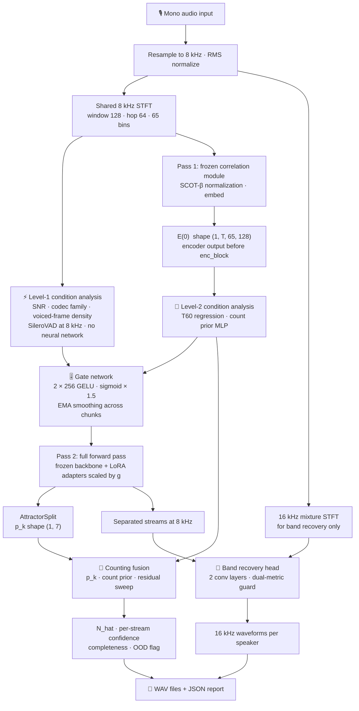
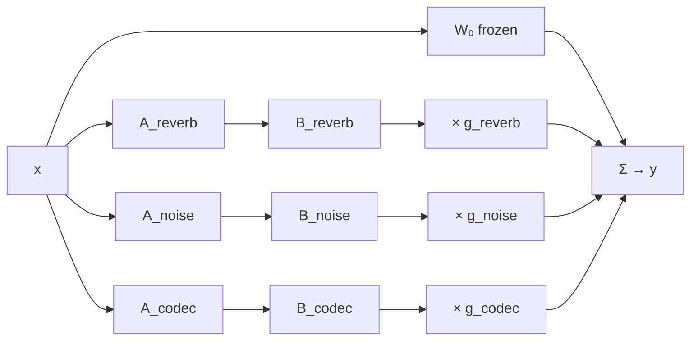
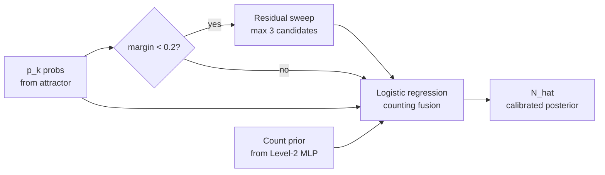
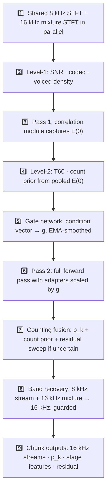
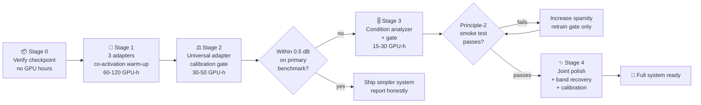

# CALM-Sep

**Condition-Aware LoRA Mixture for Multi-Speaker Speech Separation**

CALM-Sep separates the voices of two to five simultaneous speakers from a single mono audio recording. The number of speakers is not provided to the system. The recording may be reverberant, noisy, or degraded by audio codec compression, in any combination. The system returns one clean waveform per estimated speaker, a calibrated speaker count, a per-stream confidence score, and a completeness probability that expresses how likely it is that no speaker was missed.

The system is graded on two axes: first, whether it returns the correct number of speakers; second, whether each returned voice sounds clean and isolated. Everything else follows from those two requirements.

---

## 📋 Table of Contents

- [Overview](#-overview)
- [Approach](#-approach)
- [Architecture](#-architecture)
  - [The backbone: SR-CorrNet](#the-backbone-sr-corrnet)
  - [LoRA adapter library](#lora-adapter-library)
  - [Condition analyzer](#condition-analyzer)
  - [Gate network](#gate-network)
  - [Speaker counting](#speaker-counting)
  - [Band recovery](#band-recovery)
- [Inference pipeline](#-inference-pipeline)
- [Training](#-training)
- [Evaluation](#-evaluation)
- [Data](#-data)
- [Results](#-results)
- [Repository structure](#-repository-structure)
- [Setup](#-setup)
- [Design principles](#-design-principles)

---

## 🎯 Overview

Real recordings rarely contain just one type of difficulty. A conference call in a reverberant room may also carry background noise. A voice memo recorded over a poor codec connection may arrive with both bandwidth loss and quantization artifacts. Systems that specialize in one condition at a time struggle when multiple conditions appear together.

CALM-Sep addresses this by taking one strong pretrained speech separation network, freezing it completely, and teaching it to handle adverse conditions through a library of three small trainable plug-in modules called LoRA adapters. Each adapter specializes in one degradation: reverberation, background noise, or codec artifacts. A lightweight condition analyzer inspects each audio chunk using raw signal statistics and neural features, estimates how much of each condition is present, and a gate network blends the adapters into the frozen network in proportion to those measured strengths. Blending happens inside the weight matrices before any audio is produced, so the system always runs one forward pass and always emits one coherent set of output voices.

The speaker count is read directly from the backbone's own attractor probabilities. A small band recovery head extends the 8 kHz output to 16 kHz for perceptual quality. A bounded residual-energy sweep guards against missed speakers.

The total number of new trainable parameters is approximately 3 to 4 million, set against a 13.6 million parameter frozen base. The full training pipeline runs in under 150 GPU-hours on free-tier hardware.

---

## 💡 Approach

The design space for this task has two natural failure modes.

A bank of separate specialist models with a hard switch between them cannot represent conditions that co-occur. It also produces outputs from different forward passes that cannot be merged without a stream-alignment problem. A single model fine-tuned on all conditions at once tends to average its behavior, handling no condition particularly well.

The adapter-mixture design takes the useful part of each: specialist capacity per condition through separate LoRA modules, and a shared frozen backbone that eliminates the alignment problem entirely. All routing decisions produce streams from the same split, with the same speaker identities, because the backbone never changes. The gate operates continuously rather than as a discrete switch, because acoustic conditions are quantities and not categories. A room has a specific reverberation time; noise sits at a specific SNR; a codec compresses at a specific bitrate.

Three structural properties of LoRA composition hold by construction. First, when all gate values are exactly zero, the network is mathematically identical to the frozen base. Second, blending happens in weight space before any forward pass, so there is never an output-level merging problem. Third, the total parameter cost for all three adapters stays under 2 million parameters.

What composition does not guarantee is that adapters trained independently on separate conditions will compose cleanly when co-activated at inference time. This is the expected case on real recordings. The project addresses it directly: each adapter trains with the other two randomly active at low strength, and Stage 4 requires a mandatory joint fine-tune on compound-condition data before the system is considered complete.

---

## 🏗️ Architecture

### System overview



### The backbone: SR-CorrNet

The frozen backbone is SR-CorrNet var-2-5, downloaded once from HuggingFace Hub at `shinuh/sr-corrnet-ss-1ch-wsj-var-2-5spk` and never modified in any way.

SR-CorrNet structures its computation around signal physics. For each time-frequency point in the short-time Fourier transform, the model computes the correlation between that point and its neighboring frames and frequency bins. These spatio-spectro-temporal correlations give the network a structured view of reverberation and spatial coherence. A small convolutional module embeds them into a latent map called E(0), with shape (1, T, 65, 128). This is the output of the correlation module, and it is the feature the condition analyzer taps at Level 2.

The architecture then processes E(0) through two encoder blocks, passes it to an attractor-based split module that determines the speaker count, and decodes through four decoder blocks. The decoder blocks operate on per-speaker streams in parallel, with cross-speaker interaction modules between stages. The output is a per-speaker complex-valued filter applied to the input neighborhood to produce each separated signal.

The split module holds five plus two learnable query vectors. These cross-attend to the encoder output and produce seven attractor vectors. Each attractor yields an existence probability `p_k` through a linear layer and sigmoid. Slots one through five correspond to active speakers. The probability threshold of 0.5 is configurable. This mechanism is what allows the network to infer speaker count without being told it.

**Published performance on clean WSJ0-mix:**

| N speakers | Count accuracy | SI-SDRi |
|:---:|:---:|:---:|
| 2 | 100.0% | 24.8 dB |
| 3 | 99.7% | 24.4 dB |
| 4 | 97.7% | 21.9 dB |
| 5 | 96.9% | 19.9 dB |

The checkpoint operates at 8 kHz natively. The STFT window is 128 samples, the hop is 64 samples, giving 65 frequency bins. These values are baked into the checkpoint weights and are never changed.

### LoRA adapter library

Three adapters are trained, one per degradation condition. Each attaches to the same set of target layers: the attention projections in all encoder and decoder blocks and the filter estimation head. This gives 17 target Linear layers per adapter, with total parameter counts of approximately 0.4 to 0.6 million per adapter.

The composition formula at each target layer is:

```
y = W₀ x  +  g_reverb · B_reverb(A_reverb x)
           +  g_noise  · B_noise (A_noise  x)
           +  g_codec  · B_codec (A_codec  x)
```

`W₀` is the frozen weight. `g_i` is the gate scalar for adapter `i` at that layer. `B_i` and `A_i` are the low-rank matrices. The corrections add linearly in weight space. There is no output-level merging and no permutation problem.



| Adapter | Trains on | Rank |
|---|---|:---:|
| `adapter_reverb` | LibriMix at 8 kHz plus simulated RIRs, T60 0.2 to 1.0 s, wet references | 8 (attention), 4 (filter head) |
| `adapter_noise` | LibriMix plus WHAM and DNS-4, SNR -6 to +10 dB | 8 / 4 |
| `adapter_codec` | LibriMix plus ffmpeg: Opus 6-24 kbps, AAC 16-48 kbps, AMR-NB/WB | 8 / 4 |

Each adapter trains with the other two randomly active at gate strengths drawn from Uniform(0.0, 0.2). This co-activation warm-up prevents the composition failure that would otherwise appear when all three adapters run together at inference time.

### Condition analyzer

The condition analyzer operates at two levels, resolved in sequence during each chunk's processing.

**Level 1** runs before any neural pass. It computes three features directly from the shared 8 kHz STFT, using SileroVAD for voiced-frame detection:

| Feature | Computation | Target |
|---|---|---|
| SNR estimate | Voiced-frame mean energy over noise-floor mean energy | SNR in dB |
| Codec estimate | Spectral bandwidth at which energy drops below a rolling percentile | Codec family and bitrate |
| Voiced-frame density | Fraction of frames flagged active by SileroVAD | Overlap proxy and count prior cross-check |

These three features drive the gate values for the reverb, noise, and codec adapters. They are computed without E(0), which resolves the circularity: the adapters attach to the correlation module, but Level-1 features never touch E(0) and so are not affected by what the adapters do in Pass 2.

**Level 2** runs after Pass 1, using pooled E(0):

| Head | Architecture | Target |
|---|---|---|
| Reverberation strength | Attention-pooled 1D CNN over time-averaged E(0) | T60 in seconds |
| Count prior | Two-layer MLP over pooled E(0) plus Level-1 SNR and voiced density | Soft distribution over 2 to 5 |

Both supervision targets come free from the synthesis recipe. No additional annotation is needed.

### Gate network

The gate network takes the full condition vector from Level 1 and Level 2 and produces one gate scalar per adapter per layer. Its output is bounded to [0, 1.5], where the upper bound above 1.0 permits mild amplification for extreme conditions without causing instability.

**Architecture:** Two hidden layers of 256 units, GELU activations, sigmoid output scaled by 1.5.

**Sparsity:** L1 penalty on all gate values, weight 1e-3. This regularization pushes gates toward zero on clean audio, which is what makes the Principle-2 guarantee empirically true rather than just structurally true.

**Temporal smoothing:** EMA coefficient 0.7 across consecutive chunks. Without this, gate values that flip between chunks produce audible texture changes at stitch boundaries.

The gate is trained with per-dimension supervision on each condition head, not end-to-end only. End-to-end training of a routing network without supervision produces degenerate solutions, most commonly activating every adapter at medium strength for every input. Supervised dimensions are individually inspectable: a routing failure can be traced to a wrong T60 estimate or a wrong SNR estimate.

### Speaker counting

Speaker count estimation uses three sources of evidence, fused by logistic regression.

**Vote 1: attractor probabilities.** `pres["probs"]` from the AttractorSplit module, shape (1, 7). Slots 1 through 5 are the active speaker existence slots. The count is the number of slots whose probability exceeds the configurable threshold (default 0.5).

**Vote 2: condition analyzer count prior.** The Level-2 MLP produces a soft distribution over speaker counts 2 to 5. This vote runs before Pass 2 and does not depend on the separation output.

**Vote 3: bounded residual sweep.** When the top-two posterior margin is below 0.2, the system sweeps at most three count candidates: mode-1, mode, and mode+1, clipped to the range [2, 5]. The sweep runs decoder-only, with the encoder output cached. The worst-case cost is approximately 0.9 extra equivalent forward passes per uncertain chunk.



Count targets: accuracy above 95% at N equals 2 and 3, above 85% at N equals 4 and 5, on degraded validation mixtures. Count ECE below 0.05 after calibration.

### Band recovery

The frozen checkpoint operates at 8 kHz, limiting the audio band to 0 to 4 kHz. DNSMOS expects 16 kHz input, and fricative consonants and speaker-discriminating formants lie above 4 kHz. A small band recovery head extends each separated stream to 16 kHz.

The head takes the separated stream's 8 kHz complex STFT and the mixture's 16 kHz high-band STFT, and predicts the per-speaker high-band mask. Two convolutional layers, approximately 0.1 million parameters.

A dual-metric guard controls whether the head is applied per chunk. Band recovery activates only when both SI-SDRi and DNSMOS improve relative to 8 kHz pass-through. If either metric decreases, the chunk is output as zero-padded 8 kHz. The worst case is always pass-through: no regression can occur.

---

## 🔄 Inference pipeline

Long recordings are cut into 2.4-second chunks stepped by 0.8 seconds. Each chunk follows a fixed processing order:



**Stitching:** Adjacent chunks overlap by 1.6 seconds. Stream continuity is determined by maximum cross-correlation of the overlapping waveforms, with ECAPA-TDNN speaker-embedding similarity as a tie-breaker. A linear crossfade runs over the overlap region. A stream that appears in one chunk and disappears in the next is faded out rather than cut abruptly.

**Global count for long recordings:** ECAPA-TDNN embeddings are extracted per stream per chunk and clustered across the full recording using agglomerative clustering. The global speaker count equals the number of clusters whose total speech duration exceeds one second. Per-cluster confidence aggregates member stream confidences weighted by duration.

**Output:** One WAV file per estimated speaker at 16 kHz. A JSON report containing the global count, the count posterior distribution, per-stream confidences, the completeness probability, per-chunk condition estimates and gate values, and OOD flags where the input falls outside the training distribution.

---

## 🏋️ Training

The frozen base checkpoint is never modified. Approximately 3 to 4 million new parameters are trained across four stages.



### Stage 0: Verify checkpoint

Download the checkpoint. Apply three non-destructive patches to expose the model's internal signals:

- **Patch A:** Expose `pres["probs"]` (shape 1, 7) through the inference API. The original `_single_pass_session` silently drops this dictionary.
- **Patch B:** Register a forward hook on `model.encoder` to capture E(0) with shape (1, T, 65, 128) after every forward pass.
- **Patch C:** Register hooks on each of the four decoder blocks to capture per-stage features for the inter-stage consistency signal.

Run `attractor_test.py`. The test verifies that `p_k` varies with true speaker count at N equals 2, 3, 4, and 5. Nothing else begins until this test passes.

No GPU hours are spent in Stage 0.

### Stage 1: Adapters individually

Each adapter trains with all base parameters frozen. The LoRA branches register on the 17 target Linear layers, and only adapter parameters appear in the optimizer. The existing `PIT_SISNR_time` and `PIT_SISNR_mag` losses from the SR-CorrNet engine are reused directly, combined with a BCE loss on the attractor existence logits.

Training order: `adapter_noise` first (widest data variety, best for debugging LoRA plumbing), then `adapter_reverb`, then `adapter_codec`.

Each adapter trains with the other two active at gate strengths drawn from Uniform(0.0, 0.2). This co-activation warm-up is required, not optional.

After all three adapters are trained, the cross-interference matrix is measured: each adapter alone on every condition. Off-diagonal harm above 0.3 dB triggers an orthogonality penalty in Stage 4.

### Stage 2: Universal-adapter calibration gate

Before the gate network is built, a single universal adapter is trained on the union of all condition data. Its size matches the full adapter library budget. It is then evaluated on the primary benchmark and at least two multi-condition cells.

If the universal adapter matches learned gating within 0.5 dB on the primary benchmark and within confidence intervals on the degraded cells, the project adopts the simpler system. This decision is irreversible and is logged before the gate network is built.

### Stage 3: Condition analyzer and gate

With adapters frozen, the condition analyzer heads and gate MLP train on co-occurring degradation data, excluding the held-out combination cells. The loss combines separation loss (gradients through gates only), supervised condition-head losses, and L1 sparsity on gate values.

At the end of Stage 3, the Principle-2 smoke test runs: full system with all adapters active versus the frozen base alone on clean LibriMix. If the full system is worse, the sparsity weight is doubled and the gate MLP retrains alone. This repeats until the test passes.

### Stage 4: Joint polish, band recovery, and calibration

**Joint polish** is mandatory. All three adapters plus the gate unlock simultaneously. The system trains for 15 to 20 epochs at one-tenth the Stage-1 learning rate on compound-condition data. The base stays frozen. If cross-interference harm remains above 0.3 dB after joint polish, an orthogonality penalty is added.

**Band recovery** trains after joint polish. Input: per-speaker 8 kHz STFT plus mixture 16 kHz high-band STFT. Target: per-speaker high-band mask. The dual-metric guard thresholds are validated on held-out data.

**Calibration** fits everything to held-out validation data: temperature scaling for the count posterior, logistic models for per-stream confidence and completeness, counting fusion regression, and band-recovery guard thresholds. All calibration artifacts are hashed.

### Training defaults

| Setting | Value |
|---|---|
| LoRA rank (attention) | 8 |
| LoRA rank (filter head) | 4 |
| Co-activation gate range | Uniform [0.0, 0.2] |
| Optimizer | AdamW, lr 3e-4, weight decay 0.01, cosine decay |
| Batch size | 1 |
| Segment length | 4 seconds (32,000 samples at 8 kHz) |
| Gradient clip norm | 5 |
| Gate sparsity weight | 1e-3 |
| Gate EMA coefficient | 0.7 |
| Residual sweep candidates | Max 3, clipped to [2, 5] |
| Uncertainty trigger | Top-2 posterior margin below 0.2 |

---

## 📊 Evaluation

### Metrics

**SI-SDRi** (scale-invariant signal-to-distortion ratio, improvement over the mixture) is the primary separation quality metric, computed at 8 kHz.

**DNSMOS** evaluates perceptual quality on the 16 kHz band-recovered output without requiring a clean reference.

**PESQ** provides reference-based perceptual quality where clean references are available.

**Cardinality-aware scoring:** When the estimated and true speaker counts differ, Hungarian assignment is used to match outputs to references. Each unmatched reference (missed speaker) contributes 0 dB. Each hallucinated stream applies a 1 dB penalty to the mean SI-SDRi.

### Evaluation matrix

Conditions are crossed with speaker counts N in {2, 3, 4, 5}. All separation is scored at 8 kHz; DNSMOS runs on the 16 kHz band-recovered output.

| Tier | Source | What it measures | N |
|---|---|---|:---:|
| Clean 2-3 speakers | Libri2Mix and Libri3Mix test sets | Literature-comparable baseline | 2, 3 |
| Sparse overlap | SparseLibriMix test set | Quality versus overlap ratio 0 to 100% | 2 |
| **Primary benchmark** | Custom reverb-noisy LibriMix (WHAMR-style) | **Headline SI-SDRi and DNSMOS** | **2** |
| Reverb-noisy, high count | Same pipeline | Degraded count accuracy and quality | 3, 4, 5 |
| Reverb only | Clean-reverb LibriMix | Isolates adapter_reverb | 2, 3 |
| Real-RIR reverb (mandatory) | BUT ReverbDB (OpenSLR SLR17) | Sim-to-real gap | 2 |
| Codec only | LibriMix plus ffmpeg | Isolates adapter_codec | 2 |
| Reverb plus codec (held out) | LibriMix plus codec plus RIR | Compositional generalization | 2, 4 |
| Noise plus codec (held out) | LibriMix plus noise plus codec | Compositional generalization | 2, 4 |
| High count, clean | Libri4Mix and Libri5Mix test sets | Count break-point at N = 4, 5 | 4, 5 |
| High count, degraded | Plus reverb-noisy | Count under degradation | 4, 5 |
| Real recordings | LibriCSS 1-channel downmix | DNSMOS and Whisper WER | 2+ |
| Band recovery gain | Matched 8 kHz vs. 16 kHz pairs | Isolates band recovery contribution | 2 |

The held-out combination cells (reverb plus codec, noise plus codec) never appear in gate or joint-training data. They exist to test compositional generalization.

Real-RIR evaluation on BUT ReverbDB is mandatory, not optional. Simulated rooms produce cleaner impulse responses than real measured rooms. The sim-to-real gap must be diagnosed and reported.

> **Note on datasets:** BUT ReverbDB is OpenSLR SLR17. OpenSLR SLR28 is the AISHELL-2 Mandarin ASR corpus and is not a room impulse response dataset.

### Mandatory baselines

| Baseline | What it tests |
|---|---|
| Frozen base alone (8 kHz, zero-padded to 16 kHz for DNSMOS) | Quality floor; the never-worse guarantee is measured against this |
| Universal adapter (Stage 2) | Whether routing earns its complexity |
| Uniform blend, no gate | Whether the gate earns its complexity |
| Oracle gating (gates from true synthesis recipe) | Upper bound on routing quality |
| Frozen base plus band recovery, no adapters | Isolates band recovery from adapter contribution |

### Statistical rules

Evaluation sets are fixed, seeded, and generated once before any model training begins. All reported numbers carry 95% bootstrap confidence intervals (10,000 resamples at the utterance level). Differences are claimed only when Wilcoxon signed-rank p is below 0.05 and the interval excludes zero.

---

## 💾 Data

All training data is synthesized from public corpora. All supervision labels come free from the synthesis recipe. No annotation is needed beyond what is recorded in the mixer log.

### Source speech

**LibriSpeech** at 8 kHz is the source for all separation training. `train-clean-100` (100 hours, 251 speakers) covers all adapter and condition-analyzer training. `dev-clean` and `test-clean` speakers are held out strictly and never appear in training.

16 kHz copies are kept alongside the 8 kHz versions for band recovery training and DNSMOS evaluation.

### Acoustic conditions

**Reverberation** is simulated using 10,000 room impulse responses generated by `pyroomacoustics`, organized into 1,000-RIR bins at each 0.1-second T60 step from 0.2 to 1.0 seconds. Training targets for reverberant mixtures are wet sources truncated at `n_peak + 512` samples. The system separates speakers; it does not dereverberate them.

**Noise** comes from WHAM (approximately 17 GB of urban ambient recordings) and a stratified 20 GB subset of the DNS-4 noise corpus. SNR range for training: -6 to +10 dB.

**Codec degradation** is applied using ffmpeg transforms: Opus at 6 to 24 kbps, AAC at 16 to 48 kbps, and AMR-NB/WB. Codec is a deterministic transform applied to existing mixtures, so no additional data storage is needed.

### Three-way holdout discipline

Three boundaries are enforced to protect the evaluation matrix from contamination:

1. **Speaker holdout:** `dev-clean` and `test-clean` speakers never appear in training.
2. **Condition-combination holdout:** Reverb-plus-codec and noise-plus-codec combinations are held out of all gate and joint-training data.
3. **Severity holdout:** T60 above 0.9 s and SNR below -4 dB are underrepresented in training (10% of reverb and noise samples), and are probed explicitly in evaluation.

### Approximate storage

| Dataset | Role | Size |
|---|---|---|
| LibriSpeech train-clean-100 at 8 kHz | Source speech | ~3 GB |
| WHAM noise | adapter_noise | ~17 GB |
| DNS-4 stratified subset | adapter_noise variety | ~20 GB |
| Cached RIR bank | adapter_reverb and evaluation | ~1 GB |
| **Total** | | **~41 GB** |

Dynamic mixing is used throughout training. No pre-rendered mixture files are stored.

---

## 📈 Results

Results will be populated as training stages complete. The primary benchmark is noisy-reverberant LibriMix, N = 2, SI-SDRi over the unprocessed mixture.

| System | Primary SI-SDRi | Count acc. N=2 | Count acc. N=5 | DNSMOS |
|---|:---:|:---:|:---:|:---:|
| Frozen base (8 kHz, no adapters) | — | — | — | — |
| Universal adapter | — | — | — | — |
| Uniform blend, no gate | — | — | — | — |
| CALM-Sep full system | — | — | — | — |
| Oracle gating | — | — | — | — |

---

## 📁 Repository structure

```
calm-sep/
├── configs/
│   ├── base_checkpoint.yaml        # Locked checkpoint path and SHA-256
│   ├── adapters/
│   │   ├── reverb.yaml
│   │   ├── noise.yaml
│   │   └── codec.yaml
│   ├── gate.yaml
│   ├── band_recovery.yaml
│   └── eval.yaml
│
├── data/
│   ├── mixer.py                    # Dynamic 8 kHz mixer
│   ├── calmsep_mixer.py            # CALM-Sep dynamic mixing dataset
│   ├── augmentation.py             # Reverb, noise, and codec transforms
│   ├── codec_augmentation.py       # ffmpeg-based codec degradation
│   ├── degradations.py             # Degradation pipeline utilities
│   ├── rir_bank.py                 # RIR generation and caching
│   ├── vad_features.py             # SileroVAD voiced-frame density
│   ├── synthesis/                  # Mixture generation and recipe logging
│   ├── fixed_eval/                 # Seeded evaluation sets and SHA manifests
│   └── rirs/                       # Cached RIR bank (pyroomacoustics output)
│
├── models/
│   ├── srcorrnet/                  # Frozen backbone wrapper (Patches A, B, C)
│   ├── lora.py                     # Parallel-branch LoRA and co-activation sampler
│   ├── condition.py                # Two-level condition analyzer
│   ├── gate.py                     # Gate MLP, EMA smoothing, sparsity
│   ├── counting.py                 # Attractor readout, residual sweep, fusion
│   ├── confidence.py               # Per-stream confidence, completeness, OOD
│   └── band_recovery.py            # High-band head and dual-metric guard
│
├── train/
│   ├── stage1_single.py            # Single-adapter training with co-activation warm-up
│   ├── stage2_universal.py         # Universal adapter training
│   ├── stage3_gate.py              # Condition analyzer and gate training
│   ├── stage4_joint.py             # Joint polish, band recovery, calibration
│   ├── calibrate.py                # Calibration fitting
│   └── losses.py                   # PIT SI-SNR and attractor BCE losses
│
├── pipeline/
│   ├── chunker.py                  # 2.4 s chunks at 8 kHz
│   ├── stitcher.py                 # ECAPA-TDNN stitching and crossfade
│   └── infer.py                    # Full per-chunk processing order
│
├── eval/
│   ├── metrics.py                  # Cardinality-aware SI-SDRi and DNSMOS
│   ├── matrix.py                   # Full evaluation matrix
│   ├── stats.py                    # Bootstrap CIs and Wilcoxon tests
│   ├── baselines.py                # Mandatory baseline runs
│   ├── ablation_gate.py            # Per-layer vs per-adapter gate ablation
│   ├── interference.py             # Cross-interference matrix
│   └── curves.py                   # Break-point, risk-coverage, band recovery curves
│
├── calibration/
│   ├── temperature.py              # Count posterior temperature scaling
│   ├── confidence.py               # Per-stream confidence logistic model
│   ├── completeness.py             # Completeness logistic model
│   └── ood.py                      # Mahalanobis OOD discount
│
├── notebooks/
│   ├── stage1_train_adapter.ipynb  # Kaggle/Colab: Stage 1 single adapter
│   ├── stage2_universal.ipynb      # Stage 2 universal adapter
│   ├── stage3_gate.ipynb           # Stage 3 condition analyzer and gate
│   ├── stage4_joint.ipynb          # Stage 4 joint polish and calibration
│   └── eval_matrix.ipynb           # Full evaluation matrix
│
├── align/                          # Stream alignment and embedding utilities
├── demo/                           # CLI entry point and Gradio web demo
├── schemas/
│   └── separation_result.py        # SeparationResult contract
│
├── tests/
│   ├── attractor_test.py           # BLOCKING: p_k varies with true N at N=2,3,4,5
│   ├── e0_hook_test.py             # Patch B: E(0) shape verification
│   ├── principle2_test.py          # Smoke test: system not worse than base on clean
│   └── smoke_test.py               # End-to-end: 60 s fixture, output format and schema
│
├── scripts/
│   ├── download_checkpoint.py      # Download, verify SHA, update base_checkpoint.yaml
│   └── preflight_data.py           # Verify data directories before training
│
└── docs/
    └── decisions.md                # Architecture decisions and their rationale
```

---

## ⚙️ Setup

### Prerequisites

- Python 3.10 or later
- PyTorch 2.1 or later
- ffmpeg (for codec augmentation)

### Install dependencies

```bash
git clone https://github.com/TECHSCHOLAR777/SP2.git
cd SP2
pip install -e ".[dev]"
```

### Install SR-CorrNet

```bash
git clone https://github.com/dmlguq456/SR_CorrNet_SS.git
cd SR_CorrNet_SS && pip install -e ".[hub]"
cd ..
```

### Download and verify the frozen checkpoint

```bash
python scripts/download_checkpoint.py
```

This downloads `shinuh/sr-corrnet-ss-1ch-wsj-var-2-5spk`, computes its SHA-256, and writes the hash to `configs/base_checkpoint.yaml`. The checkpoint is approximately 55 MB and downloads once. It is never modified.

### Verify the baseline

```bash
pytest tests/attractor_test.py -v
```

The `TestPkCountAccuracy` class confirms that `p_k` is exposed and varies with true speaker count. This test is the gate for Phase 0: nothing else proceeds until it passes.

### Run on an audio file

```bash
python -m demo.app --input recording.wav --output ./output/
```

---

## 📌 Design principles

Five principles govern every decision in this project.

**1. One backbone, adapted, never arbitrated.** All specialization lives in adapters on a single frozen network. A shared backbone makes stream alignment a non-problem.

**2. Never worse than the base, verified by measurement.** When all gate values are exactly zero the network equals the frozen base by construction. That adapters behave well near zero on clean audio is an empirical outcome, not a structural guarantee. The Principle-2 smoke test measures it.

**3. Conditions are quantities, not categories.** All routing is continuous gating scaled by measured condition strength. A hard switch between experts cannot represent conditions that co-occur.

**4. Every emitted probability is calibrated, and every internal signal is inspectable.** Count estimate, per-stream confidence, and completeness probability all pass through temperature scaling fitted on held-out data. The condition representation is supervised dimension by dimension so that failures can be traced to a named misestimate.

**5. No claim without a measured number.** The universal adapter is trained before the gate network and evaluated first. If it matches learned gating within confidence intervals on the primary benchmark, the project reports that honestly and ships the simpler system.

---

## 🔒 Fixed constraints

These values are locked by the frozen checkpoint. Changing any of them would corrupt inference without a diagnostic error.

| Property | Value |
|---|---|
| Checkpoint | `shinuh/sr-corrnet-ss-1ch-wsj-var-2-5spk` |
| Sample rate | 8000 Hz |
| STFT window / hop / bins | 128 / 64 / 65 |
| Attractor slot count K0 | 5 |
| `spk_query` shape | (1, 7, 128) |
| Speaker count range | N in {2, 3, 4, 5} |
| Quality extension | Band recovery (Option B) only |

---

*Source of truth: `BLUEPRINT` at the repository root. When this document and `BLUEPRINT` disagree, `BLUEPRINT` is correct.*
