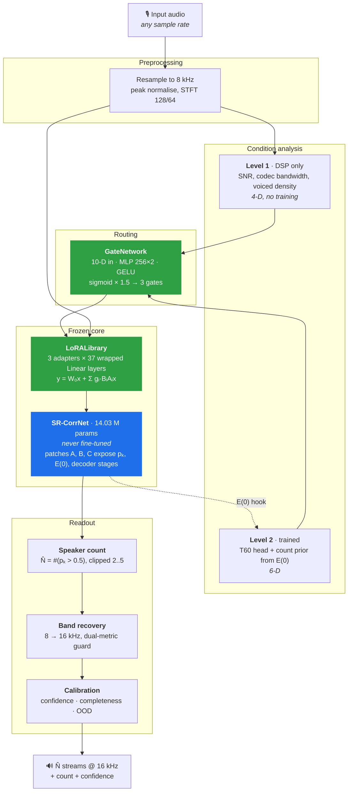
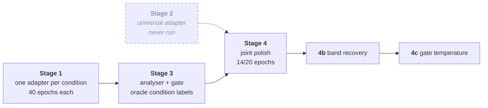

<div align="center">

# CoRAL-Sep

### Condition-Routed Adapter Library for Speech Separation

**Separating two to five simultaneous voices from a single mono recording, without being told how many there are.**

[](https://github.com/TECHSCHOLAR777/SINGLE-CHANNEL-SPEECH-SEPARATION-PROJECT/actions)
[](tests/)
[](pyproject.toml)
[](#license)

[-1f6feb?style=flat-square)](https://github.com/dmlguq456/SR_CorrNet_SS)
[-1f6feb?style=flat-square)](#parameter-budget)
[](docs/restoration/PROJECT_STATUS.md)

</div>

---

<div align="center">

**[Overview](#overview)** · **[Architecture](#architecture)** · **[Results](#results)** · **[Setup](#setup)** · **[Training](#training)** · **[Repository](#repository-layout)** · **[Project state](#project-state)**

</div>

---

## Overview

Real recordings rarely carry one kind of difficulty at a time. A conference call in a hard-walled room is reverberant *and* noisy. A voice memo over a bad connection loses bandwidth *and* gains quantisation artifacts. A system that specialises in one condition tends to fall over when two arrive together.

CoRAL-Sep takes one strong pretrained separation network, **freezes it completely**, and teaches it to survive adverse conditions through three small plug-in LoRA adapters, one each for reverberation, noise and codec damage. A condition analyser measures how much of each is present, and a gate blends the adapters into the frozen weight matrices in proportion, **before** any audio is produced. One forward pass, one coherent set of output voices.

The design rule behind it came from a measured failure, not a preference. In the previous architecture, every attempt to put trainable layers on top of this backbone's output made it **worse by 0.4 to 3.7 dB** at every operating point tested. The bet here is that the right place to help a strong frozen model is *inside* its weights, gently, and only under conditions it was never trained for.

The system is graded on two axes, in order:

| | Axis | Measured? |
|:--:|---|---|
| 🥇 | **Speaker count accuracy.** Did it return the right number of voices? | 🔴 Not yet, see [I-002](docs/restoration/ISSUE_LEDGER.md) |
| 🥈 | **Separation quality.** Does each returned voice sound clean? | 🟡 Measured under oracle count |

That second row is the honest headline of this repository, and the rest of the [Results](#results) section explains it rather than hiding it.

---

## Architecture



🟦 frozen · 🟩 trained

### Why this shape

Two failure modes bound the design space. A bank of separate specialist models with a hard switch cannot represent conditions that co-occur, and it produces streams from different forward passes that then need aligning. A single model fine-tuned on everything averages its behaviour and handles nothing well.

The adapter mixture takes the useful half of each: specialist capacity per condition, and one shared frozen backbone that removes the alignment problem entirely. Every routing decision yields streams from the same split with the same speaker identities, because the backbone never changes. The gate is continuous rather than discrete, because acoustic conditions are quantities: a room has a specific T60, noise sits at a specific SNR, a codec compresses at a specific bitrate.

Three properties hold **by construction**:

1. With all gates at zero the network is mathematically identical to the frozen base. Verified: output matches to a maximum difference of `0.000000`.
2. Blending happens in weight space before the forward pass, so there is never an output-merging problem.
3. All three adapters together cost 304,212 parameters, 2.17 percent of the backbone.

What composition does **not** guarantee is that independently trained adapters compose cleanly when co-activated, which is the normal case on real audio. Two mitigations are built in: each adapter trains with the other two randomly active at low strength, and Stage 4 requires a joint fine-tune on compound-condition data.

### Components

| Component | Module | Params | Trained | Status |
|---|---|---:|:--:|:--:|
| Backbone | `models/srcorrnet/` | 14,031,768 | ❄️ frozen | 🟢 |
| LoRA adapters ×3 | `models/lora.py` | 304,212 | ✅ | 🟢 |
| Gate network | `models/gate.py` | 69,379 | ✅ | 🟠 [flat, see I-003](#known-limitations) |
| Level-2 analyser | `models/condition.py` | 20,997 | ✅ | 🟢 |
| Band recovery | `models/band_recovery.py` | 45,697 | ✅ | 🟢 |
| Speaker counting | `models/counting.py` | 0 | readout | 🟠 never evaluated |
| Calibration | `calibration/` | 4 scalars + covariance | fitted | 🟠 unmeasured |

<a id="parameter-budget"></a>

**Parameter budget**, measured on 2026-09-04 by loading the real checkpoint, not quoted from documentation:

```
frozen backbone       14,031,768
trainable total          440,285   ( 3.138 % of backbone )
  ├─ LoRA ×3             304,212   ( 2.168 % )
  ├─ gate MLP             69,379
  ├─ level-2 analyser     20,997
  └─ band recovery        45,697
```

### The three backbone patches

`SRCorrNetWrapper` never subclasses or edits the pretrained network. It applies hooks at load time that expose internal tensors the public API drops:

| Patch | Exposes | Consumed by |
|:--:|---|---|
| **A** | per-slot attractor probabilities `pₖ` | speaker counting, attractor confidence |
| **B** | encoder output `E(0)` | Level-2 analyser, T60 head, count prior |
| **C** | per-decoder-stage outputs | inter-stage consistency in the confidence head |

This is the load-bearing choice of the whole system. The backbone stays byte-identical and everything the architecture needs is read out through hooks.

---

## Results

> ### ⚠️ Read this before the numbers
>
> **Every evaluation below supplied the true speaker count to both systems.** Speaker count accuracy is the *primary* graded axis of this project and it has never been measured. These numbers answer a narrower question than the project intends to ask: given a correct count, does the adapter stack improve separation quality? Tracked as [I-002](docs/restoration/ISSUE_LEDGER.md).
>
> Second caveat: **n = 30** per split, out of roughly 3,000 available test clips, with no confidence intervals.

### LibriMix, `wav8k/min/test`, `mix_both`

| Split | N | n | Baseline SI-SDRi | CoRAL-Sep SI-SDRi | Δ | Evidence |
|---|:--:|:--:|---:|---:|---:|:--:|
| Libri2Mix | 2 | 30 | 7.095 dB | **8.858 dB** | 🟢 **+1.764** | [json](results/eval_outputs/calmsep_eval.json) |
| Libri3Mix | 3 | 30 | 10.071 dB | **11.803 dB** | 🟢 **+1.732** | [json](results/eval_outputs/calmsep_eval.json) |
| Libri4Mix | 4 | 0 | n/a | n/a | ⚪ not run | n/a |
| Libri5Mix | 5 | 30 | 9.428 dB | **10.050 dB** | 🟡 **+0.623** | [json](results/eval_outputs/calmsep_eval_5.json) |

Backbone `shinuh/sr-corrnet-ss-1ch-wsj-var-2-5spk`. CPU inference, Apple M5 Pro, single threaded.

**What this supports.** The adapter stack improves SI-SDRi over the same frozen backbone on the same clips, by 0.62 to 1.76 dB, when the speaker count is known.

**What it does not support.** Anything about speaker counting, statistical significance, Libri4Mix, or which of the three adapters contributed the gain.

**On the absolute level.** These baseline numbers sit far below published LibriMix results such as SepFormer at 22.3 dB. That is expected: the backbone was trained on WSJ0-mix and transfers poorly to LibriMix. The delta is the contribution; the absolute level is a property of the backbone choice.

### Stage 4 joint training 🟢 verified

Confirmed epoch by epoch against the [raw Kaggle log](results/training_logs/stage4_joint_kaggle.log).

| Epoch | 6 | 7 | 8 | 9 | 10 | 11 | 12 | 13 | **14** |
|---|--:|--:|--:|--:|--:|--:|--:|--:|--:|
| Loss | 9.59 | 9.486 | 9.431 | 10.935 | 8.891 | 10.313 | 8.720 | 8.937 | **8.681** |
| Saved | ✅ | ✅ | ✅ | | ✅ | | ✅ | | ✅ |

Tesla T4, BF16, roughly 2,930 s per epoch. **14 of 20 configured epochs completed, with loss still falling.** The joint stage is unfinished, not converged.

<a id="known-limitations"></a>

### Known limitations, stated plainly

| | Finding | Evidence |
|:--:|---|---|
| 🔴 | **Speaker count accuracy has never been measured.** Every run passed the oracle count. | [I-002](docs/restoration/ISSUE_LEDGER.md) |
| 🔴 | **The gate does not route.** Stage 4c fitted temperature T = 4.9872, which flattens the sigmoid so all three gates sit near 0.5. The system is currently a fixed uniform blend, not a condition-aware router. | [I-003](docs/restoration/ISSUE_LEDGER.md) |
| 🔴 | **The reverb adapter makes things worse**, by 0.44 dB on clean audio and 2.81 dB on strong reverberation. Both controls pass, so the fault is in the training objective, most likely a wet reference target. | [eval.log](results/eval_outputs/eval.log), [I-025](docs/restoration/ISSUE_LEDGER.md) |
| 🟠 | **The Stage 2 universal adapter was never trained**, so the ablation justifying three adapters over one does not exist. | [I-024](docs/restoration/ISSUE_LEDGER.md) |
| 🟠 | **No confidence intervals on any result.** `eval/stats.py` implements bootstrap BCa and Wilcoxon and has never been run on a result. | [I-026](docs/restoration/ISSUE_LEDGER.md) |
| 🟠 | **Calibration error was never measured**, so the confidence values the system emits have unknown reliability. | [I-034](docs/restoration/ISSUE_LEDGER.md) |
| ⚪ | **No checkpoint has a recorded hash**, so no result can be tied to the weights that produced it. | [DATA_AND_MODEL_INVENTORY](docs/restoration/DATA_AND_MODEL_INVENTORY.md) |

Full evidence and provenance: **[docs/restoration/RESULTS.md](docs/restoration/RESULTS.md)**.

---

## Setup

### Prerequisites

- Python 3.10, 3.11 or 3.12
- `ffmpeg` and `libsndfile` on the system path
- A GPU for training. Inference runs on CPU at roughly 12 to 20 times slower than real time.

### Install

```bash
git clone https://github.com/TECHSCHOLAR777/SINGLE-CHANNEL-SPEECH-SEPARATION-PROJECT.git
cd SINGLE-CHANNEL-SPEECH-SEPARATION-PROJECT

python -m venv .venv && source .venv/bin/activate    # Windows: .venv\Scripts\activate
pip install -e ".[dev]"
```

That pulls the frozen backbone loader straight from its MIT-licensed source, pinned to a commit:

```
sr-corrnet-ss[hub] @ git+https://github.com/dmlguq456/SR_CorrNet_SS@7340365b
```

It is pinned rather than tracked, because `models/srcorrnet/` patches internal attribute paths of that package, and a later revision could move them without warning.

To reproduce the environment behind the recorded results:

```bash
pip install -r requirements.txt -c constraints/reproduce-2026-07.txt
```

### Verify the install

```bash
pytest tests/ -q                # expect: 563 passed, 11 skipped
python -c "from coralsep.models.srcorrnet import SRCorrNetWrapper; \
           w = SRCorrNetWrapper(device='cpu'); w.load(); print('backbone loaded')"
```

The backbone weights download from Hugging Face on first use, roughly 50 MB.

### Run it

```bash
coralsep-infer --input mixture.wav --checkpoints checkpoints/
coralsep-demo                     # CLI
python -m coralsep.demo.gradio_app  # Gradio UI with Whisper transcripts
coralsep-baseline --data-root <librimix>/Libri2Mix --max-samples 30
```

---

## Training

Four stages, each producing a checkpoint the next one consumes.



| Stage | Command | Ran | Artifact |
|---|---|:--:|---|
| 1 | `python -m coralsep.train.stage1_single --adapter reverb` | ✅ | `best_reverb.pt` 424 KB |
| 1 | `... --adapter noise` / `--adapter codec` | ✅ | `best_noise.pt`, `best_codec.pt` |
| 2 | `python -m coralsep.train.stage2_universal` | ⚪ never | none |
| 3 | `python -m coralsep.train.stage3_gate` | ✅ | `best_gate.pt` 368 KB |
| 4 | `python -m coralsep.train.stage4_joint` | 🟡 14/20 | `best_joint.pt` 1.6 MB, 222 tensors |
| 4b | `python -m coralsep.train.stage4b_band` | ✅ | `best_band.pt` 184 KB |
| 4c | `python -m coralsep.train.stage4c_calib` | ✅ | `calibration.pt`, T = 4.9872 |

**No checkpoint is in this repository.** All of them live in Kaggle datasets under the account `rishig777`. Full details in [DATA_AND_MODEL_INVENTORY](docs/restoration/DATA_AND_MODEL_INVENTORY.md).

Detailed recipes, hyperparameters and the hard-won Apple Silicon MPS lessons are in **[docs/TRAINING_GUIDE.md](docs/TRAINING_GUIDE.md)**.

---

## Data

| Dataset | Role | Size | Present here |
|---|---|---|:--:|
| LibriSpeech 8 kHz | training speech | 137,876 utterances | ❌ external |
| WHAM! noise | noise augmentation | 28,000 clips | ❌ external |
| RIR bank | reverberation | 10,001 responses | ❌ external |
| LibriMix `wav8k/min/test` | evaluation | 30 clips per split used | ❌ external |
| **Fixed eval manifests** | **seeded, hash-pinned evaluation tiers** | **25 tiers + SHA-256 sidecars** | ✅ [`datasets/fixed_eval/`](datasets/fixed_eval/) |

The fixed evaluation manifests are the strongest reproducibility asset in the project, and no recorded experiment has used them yet.

Training uses **on-the-fly dynamic mixing**, drawn fresh each epoch from 2-second clips at 8 kHz. There is no fixed training split, which is a deliberate design choice with a reproducibility cost that has not been paid down: no run recorded its mixer seed.

---

## Repository layout

```
.
├── src/coralsep/               # the package, one importable top-level name
│   ├── models/                 # backbone wrapper, LoRA, condition, gate, counting, band recovery
│   │   └── srcorrnet/          # frozen backbone + patches A, B, C
│   ├── data/                   # mixing, degradations, RIR bank, VAD, dataset preparation
│   ├── train/                  # stages 1, 2, 3, 4, 4b, 4c, losses, calibration
│   ├── eval/                   # metrics, matrix, baselines, statistics, DNSMOS, PESQ
│   ├── pipeline/               # chunker, stitcher, inference orchestration
│   ├── calibration/            # temperature, confidence, completeness, OOD
│   ├── align/                  # embeddings, Hungarian assignment, chunk alignment
│   ├── demo/                   # CLI and Gradio UI
│   ├── schemas/                # SeparationResult, the shared output contract
│   └── utils/                  # config loading, hashing, structured logging
│
├── tests/                      # 563 tests, 57 modules
├── configs/                    # stage and adapter YAML
├── datasets/fixed_eval/        # seeded eval manifests + SHA-256 sidecars
├── results/                    # raw evaluation outputs and training logs
├── notebooks/                  # Kaggle training and evaluation notebooks
├── scripts/                    # data preparation, checkpoint download, preflight
├── deploy/                     # Modal serverless application
├── constraints/                # pinned environment for reproducing recorded results
└── docs/
    ├── BLUEPRINT.md            # the full design specification
    ├── TRAINING_GUIDE.md
    └── restoration/            # the project knowledge base, start here
```

---

## Project state

This repository is under **active restoration**. Its full, evidence-backed state lives in [`docs/restoration/`](docs/restoration/), which is worth reading before changing anything.

| Document | Answers |
|---|---|
| [PROJECT_STATUS](docs/restoration/PROJECT_STATUS.md) | What shape is this in, dimension by dimension? |
| [RESULTS](docs/restoration/RESULTS.md) | What has been measured, and what does it actually support? |
| [ARCHITECTURE](docs/restoration/ARCHITECTURE.md) | What is built, and where does it disagree with the design intent? |
| [APPROACH_EVOLUTION](docs/restoration/APPROACH_EVOLUTION.md) | Why does it look like this? |
| [ISSUE_LEDGER](docs/restoration/ISSUE_LEDGER.md) | Every open problem, scoped and prioritised |
| [EXPERIMENT_REGISTRY](docs/restoration/EXPERIMENT_REGISTRY.md) | Which runs actually happened |
| [REPRODUCTION](docs/restoration/REPRODUCTION.md) | Can someone else rebuild this, and where does it stop? |
| [DECISIONS](docs/restoration/DECISIONS.md) | What was decided, and at what cost |
| [LEARNINGS](docs/restoration/LEARNINGS.md) | What this project learned the expensive way |

### Naming history

This project was **CA-MoSE** (a compute-adaptive cascade, abandoned 2026-07-16 after the fusion head measured worse than the frozen expert), then **CALM-Sep**, and is now **CoRAL-Sep**. External artifacts keep their original names on purpose: Kaggle dataset slugs, the local `calmsep-8k` directory, checkpoint filenames and the existing `calmsep_eval*.json` results all still say `calmsep`, because renaming the references would break loaders pointing at data outside this repository. The mapping is recorded in [DECISIONS DEC-006](docs/restoration/DECISIONS.md).

---

## Design principles

1. **The frozen expert is not the enemy.** Twice this project put trainable layers on the backbone's output and twice it made things worse. Help it from inside its weights instead.
2. **A criterion written before the first measurement is a wish, not a gate.** Equality with a component is a failure if improvement was the point.
3. **Name the exact thing that failed.** Summarising a failed boolean flag as "the model failed" cost this project days aimed at the wrong problem.
4. **A known hack in a comment is still a known hack in the results table.** Disclosure belongs next to the number.
5. **Run it end to end at toy scale before renting a GPU.** Nine of ten bugs from one expensive session would have surfaced in a local dry run with one batch.
6. **Verify that CI has actually run.** A pipeline pointed at the wrong branch is worse than no pipeline, because the badge implies protection that is not there.

---

## License

MIT. The frozen backbone, [SR-CorrNet-SS](https://github.com/dmlguq456/SR_CorrNet_SS) by Ui-Hyeop Shin and Hyung-Min Park, is separately MIT licensed and is pulled in as a pinned dependency rather than vendored.
