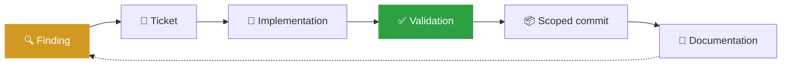

# CoRAL-Sep Documentation

**Everything written down about this project, and how much of it you can trust.**

---

## Start here

If you have five minutes, read [restoration/PROJECT_STATUS.md](restoration/PROJECT_STATUS.md). It says what shape the project is in, dimension by dimension, with the evidence for each claim.

If you are about to change code, read [restoration/ISSUE_LEDGER.md](restoration/ISSUE_LEDGER.md) first. There is probably already a ticket for what you found.

---

## The documents

### 🎯 Current state

| Document | Answers | Trust |
|---|---|:--:|
| [restoration/PROJECT_STATUS](restoration/PROJECT_STATUS.md) | What shape is this in right now? | 🟢 measured |
| [restoration/RESTORATION_STATE](restoration/RESTORATION_STATE.md) | What is the factual state, and how was it established? | 🟢 measured |
| [restoration/ARCHITECTURE](restoration/ARCHITECTURE.md) | What is actually built, and where does it disagree with the design? | 🟢 read from source |
| [restoration/PROJECT_INVENTORY](restoration/PROJECT_INVENTORY.md) | What exists, where did it come from? | 🟢 measured |
| [restoration/VALIDATION_MATRIX](restoration/VALIDATION_MATRIX.md) | What has been validated, by which exact command? | 🟢 executed |

### 📊 Results and experiments

| Document | Answers | Trust |
|---|---|:--:|
| [restoration/RESULTS](restoration/RESULTS.md) | What has been measured, and what does it support? | 🟡 partially verified |
| [restoration/EXPERIMENT_REGISTRY](restoration/EXPERIMENT_REGISTRY.md) | Which runs happened, on what hardware, with what provenance? | 🟡 partially verified |
| [restoration/DATA_AND_MODEL_INVENTORY](restoration/DATA_AND_MODEL_INVENTORY.md) | Which datasets and checkpoints, and where do they live? | 🟠 all external |
| [MEASUREMENTS](MEASUREMENTS.md) | The author's own reference figures, with three corrections marked | 🟡 corrected |

### 🧭 Why it looks like this

| Document | Answers | Trust |
|---|---|:--:|
| [restoration/APPROACH_EVOLUTION](restoration/APPROACH_EVOLUTION.md) | How the design got here, and what killed the previous one | 🟢 sourced |
| [restoration/DECISIONS](restoration/DECISIONS.md) | Restoration decisions, with reasoning and cost | 🟢 current |
| [restoration/LEARNINGS](restoration/LEARNINGS.md) | What this project learned the expensive way | 🟢 sourced |
| [PROJECT_HISTORY](PROJECT_HISTORY.md) | The v1 to v2 narrative, written 2026-07-18 | 📜 historical |
| [decisions](decisions.md) | The original one-line decision log, July 2026 | 📜 historical |

### 🔧 Doing the work

| Document | Answers |
|---|---|
| [BLUEPRINT](BLUEPRINT.md) | The full design specification, 1,216 lines, including the backbone code audit |
| [TRAINING_GUIDE](TRAINING_GUIDE.md) | Stage-by-stage training recipes and hyperparameters |
| [restoration/REPRODUCTION](restoration/REPRODUCTION.md) | How to rebuild this, and exactly where it stops |
| [restoration/ISSUE_LEDGER](restoration/ISSUE_LEDGER.md) | Every open problem, scoped and prioritised |
| [restoration/CHANGELOG](restoration/CHANGELOG.md) | What changed during restoration |
| [restoration/WORKLOG](restoration/WORKLOG.md) | What happened, in order |
| [restoration/protocols/](restoration/protocols/) | Commit, ticketing, reconciliation and done-criteria rules |
| [vad_validation](vad_validation.md) | Voice-activity proxy validation notes |

---

## How to read the tags

Every document in `restoration/` carries a status line at the top. The tags mean the same thing everywhere:

**Health** 🟢 `GREEN` working and evidenced · 🟠 `AMBER` works with known gaps · 🔴 `RED` broken or blocked · ⚪ `UNKNOWN` not yet established

**Evidence** 🟢 `VERIFIED` raw artifact exists and the protocol is sound · 🟡 `PARTIALLY_VERIFIED` artifact exists but the protocol has a disclosed defect · 🟠 `CLAIMED` stated in prose with no artifact · ⚪ `UNVERIFIED` never measured · 🔴 `FAILED` measured and contradicts the intent · 📜 `SUPERSEDED` belongs to an abandoned design

**Priority** 🔴 `P0` blocks operation or invalidates results · 🟠 `P1` blocks a workflow · 🟡 `P2` degrades quality · ⚪ `P3` improvement

A number appears in these documents only if a file in `results/` or `datasets/` produced it. Where evidence is missing, the document says so rather than leaving a blank.

---

## The traceability chain

A ticket closes on validation evidence, never on a code change alone. Every implementation commit names its ticket.
