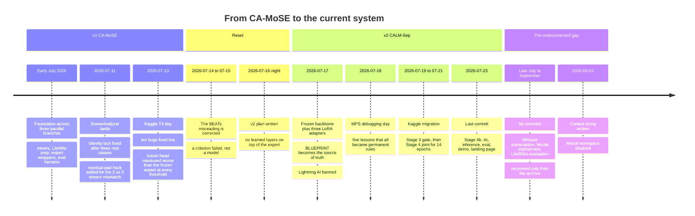

# Approach Evolution

**Purpose:** let a future engineer reconstruct why the architecture looks the way it does, without reading 158 commits.

**Status:** [GREEN] for the July history, which is unusually well documented. [AMBER] for the August gap, which has no record at all.

**Last verified:** 2026-09-02

**Primary sources.** `docs/PROJECT_HISTORY.md`, recovered from the archive and written 2026-07-18 by the original author. `docs/decisions.md`, the running decision log. `NUMBERS.md`, recovered from the archive. Git history. Where this document infers rather than reports, it says so.

---

## Timeline

---

## Phase 1: CA-MoSE, and the measurement that killed it

The first design was a compute-adaptive cascade. Run a cheap separator, judge its output with a blind quality estimator, escalate to an expensive separator only when needed, and merge both with a learned fusion head. Roughly 2.66M trainable parameters across three heads sitting on two frozen experts.

It was measured on 2026-07-13 and the result was unambiguous. The fusion head, the one component that was actually trained, made the strong expert **worse by 0.4 to 3.7 dB at every threshold tested**. At full escalation the cascade exactly equalled SR-CorrNet at 16.22 dB and never exceeded it. The efficiency claim survived: 36 percent less compute at threshold 6, at a cost of 3.55 dB.

The project did the right thing with the negative result. It was written down in full, including the numbers that made the team look bad, and the milestone was reframed around what had actually been measured rather than quietly moved.

Two errors from this phase were recorded honestly and are worth carrying forward:

- **A criterion written before the first measurement is a wish, not a gate.** The flag `cascade_beats_single_expert` was defined before any number existed, and when the cascade merely equalled its own strongest component, that briefly read as success. A cascade that equals its component has added latency and parameters and nothing else.
- **A known hack in a comment is still a known hack in the results table.** The residual-pad workaround for the 2-versus-3 stream mismatch was documented in code from day one, and its effect on the comparison was not disclosed loudly enough next to the numbers it distorted.

---

## Phase 2: the misreading, and why correcting it mattered

For several days the failure was summarised inside the team as "BEATs failed". No BEATs model existed anywhere in the project. What failed was a boolean flag named `cascade_beats_single_expert`, which returned False at every threshold.

The distinction is not pedantic. "BEATs failed" points the next effort at finding a better model. "Our gate criterion was wrong" points it at not putting learned layers on top of a strong frozen expert. The project's own record states that the misreading cost days aimed at the wrong problem, and that the correct sentence was one flag name long.

This correction is the hinge of the whole project. Everything in the current architecture follows from it.

---

## Phase 3: the current architecture, and the rule it obeys

Written on the night of 2026-07-16, with two rules taken directly from the post-mortem.

**Rule one: the frozen pretrained expert is already strong, so ship it and spend the budget on condition breadth and evaluation depth.** Concretely: never fine-tune the backbone, never place a learned layer on its output. Help it from inside its weights instead, with small adapters, and only under conditions it was never trained for.

**Rule two: the negative result is presentation material, not embarrassment.**

The plan salvaged v1's tested plumbing, the data scripts, the metrics and the chunk stitcher that had measured zero identity switches on real speech, and explicitly banned copying any of the failed model code. That ban is visible in the tree today as an absence: there is no fusion head, no cascade gate and no scene analyzer, only three broken imports left pointing at where they used to be (I-009).

---

## Phase 4: five lessons from making a Mac train

2026-07-18 was spent debugging Apple Silicon MPS training. Every one of these became a permanent rule, and every one is a trap for anyone repeating this setup.

| Symptom | Real cause | Rule adopted |
|---|---|---|
| Data preparation roughly 15 times slower than needed | Reverberation, noise and codec degradations were applied to full 15 to 30 second utterances, then 2 seconds were cropped | Clip to 2 seconds first, then degrade |
| Batch times going 1 s, then 11 s, then 86 s, looking exactly like a memory leak | First forward pass per unique speaker count triggers Metal shader compilation, 60 to 90 s each, and mixtures span 2 to 5 speakers | Warm-up loop over all speaker counts before training |
| A five-hour stall | A forgotten benchmark process from an earlier experiment held the MPS device | One owner per device; check before launching |
| A training run crashing during cleanup | The kill command hit a DataLoader worker of the live run | `num_workers=0`; data load is 8 ms against 1 to 4 s of compute, so workers buy nothing here |
| Out of memory minutes into a run that had passed its smoke test | Four simultaneous activation graphs exceed the roughly 30 GiB unified-memory ceiling on a 24 GB machine | Per-sample backward; the batched path stays in the code, disabled, with the reason written next to it |

One incident was never root-caused: a launch that completed warm-up and then produced no batch output before dying. The strongest suspect is the same blocked-device condition. It is recorded as unknown rather than as solved, which is the correct way to leave it.

Note also the BF16 detail, since it will bite anyone porting this: `torch.complex` has no half-precision support on MPS, so the STFT and iSTFT run in explicit float32 islands while the transformer body runs in BF16.

---

## Phase 5: the platform migration nobody planned

The compute story moved three times in eight weeks, and each move left a trace in the code.

| Period | Platform | Why it ended | Residue in the tree |
|---|---|---|---|
| Early July | Lightning AI | Account deleted 2026-07-18 after a credit risk; banned permanently by project rule | `/teamspace/studios/this_studio/` paths in `eval/eval_reverb_adapter.py` (I-033) |
| Mid July | Local Apple M5 Pro, MPS | Too slow for the joint stage | MPS-specific warm-up and float32 islands in `train/stage1_single.py` |
| Late July | Kaggle T4 and P100 | Still the checkpoint and dataset home | 18 notebooks with `/kaggle/...` paths, BF16 to FP16 fallback for P100, base64 dependency stubs for offline runs |
| August | Modal | Workspace disabled 2026-09-01, free credit exhausted by image rebuilds | `modal_deploy.py`, recoverable only from the archive (I-014) |

The Kaggle notebooks contain something worth noticing: base64-embedded stubs for `loguru` and `rotary-embedding-torch`, built because Kaggle runs offline and `sr_corrnet` imports them. That is a workaround for I-019 that predates anyone naming I-019.

---

## Phase 6: the undocumented gap, late July to September

**Fact.** The last commit is 2026-07-23. The archive is dated 2026-09-01. There are no commits in between.

**Fact.** Work in that window is visible in the archive: Whisper transcription with word-level timestamps in `demo.py`, a Modal deployment file, Libri4Mix and Libri5Mix support plus a Stage 2 checkpoint loader in `run_eval.py`, and the Libri5Mix evaluation result itself.

**Inference.** Roughly six weeks of work happened on a machine that was never pushed from. The archive is the only record.

**What this changes.** The three recovery tickets, I-012 through I-014, are not tidy-up. They are the difference between that work surviving and not. It also means the two-month gap in the decision log is a gap in the record, not a pause in the project, and the reasoning behind those changes exists nowhere.

---

## Decision timeline

| Date | Change | Reason | Evidence | Consequence |
|---|---|---|---|---|
| 2026-07-09 | `SeparationResult` becomes the single shared output type | prevents ad-hoc result objects across experts, evaluation and demo | `docs/decisions.md` | still the contract today, `schemas/separation_result.py` |
| 2026-07-11 | Residual-pad hack for the 2 versus 3 stream mismatch | unblocked integration | `docs/PROJECT_HISTORY.md` | distorted the v1 comparison; disclosed afterwards |
| 2026-07-13 | v1 milestone reframed around efficiency | the quality criterion was measured false | `NUMBERS.md` section 3.2 | negative result preserved rather than deleted |
| 2026-07-16 | Learned layers on the backbone output banned | measured 0.4 to 3.7 dB degradation | `docs/PROJECT_HISTORY.md` | the entire current architecture |
| 2026-07-17 | Backbone accessed through hook patches A, B and C | avoids editing the vendored engine | `docs/decisions.md` | makes the unpinned `sr_corrnet` dependency fatal (I-019) |
| 2026-07-17 | Lightning AI banned permanently | account deleted, credit risk | `docs/PROJECT_HISTORY.md` | stale paths remain in one script (I-033) |
| 2026-07-18 | Per-sample backward instead of batched | OOM on 24 GB unified memory | `docs/PROJECT_HISTORY.md` | slower training, no overnight crashes |
| 2026-07-19 | Compute moves to Kaggle | local training too slow for the joint stage | `origin/integration` commits | 18 Kaggle-shaped notebooks, offline dependency stubs |
| 2026-07-21 | Stage 4 stopped at epoch 14 of 20 | run ended, reason not recorded | Kaggle log | loss still decreasing; the joint stage is unfinished |
| ~August | Whisper transcription, Modal deployment, 5Mix evaluation | not recorded | archive only | six weeks of work with no reasoning preserved |
| 2026-09-01 | Modal workspace disabled | free credit exhausted by image rebuilds | `CONTEXT.md` | no live deployment path |
| 2026-09-02 | Restoration begins | project handed over for reconstruction | this document set | see `DECISIONS.md` |

---

## What a future engineer should take from this

Three things, in order of how much they cost to learn the first time.

1. **The frozen backbone is not the enemy.** Twice the project put trainable layers on SR-CorrNet's output and twice it made things worse. The current design exists because of that measurement, not because adapters were fashionable.
2. **Name the exact thing that failed.** "BEATs failed" cost days. The correct sentence was one flag name long.
3. **Run it end to end at toy scale on a laptop before renting a GPU.** Nine of the ten bugs fixed during the expensive Kaggle day would have surfaced in a single local CPU dry run with one batch.

The current restoration adds a fourth, from the CI finding: a quality gate pointed at the wrong branch is worse than no gate, because it looks like protection while providing none.

---

## Related documents

`ARCHITECTURE.md` · `RESULTS.md` · `LEARNINGS.md` · `DECISIONS.md` · `EXPERIMENT_REGISTRY.md`
