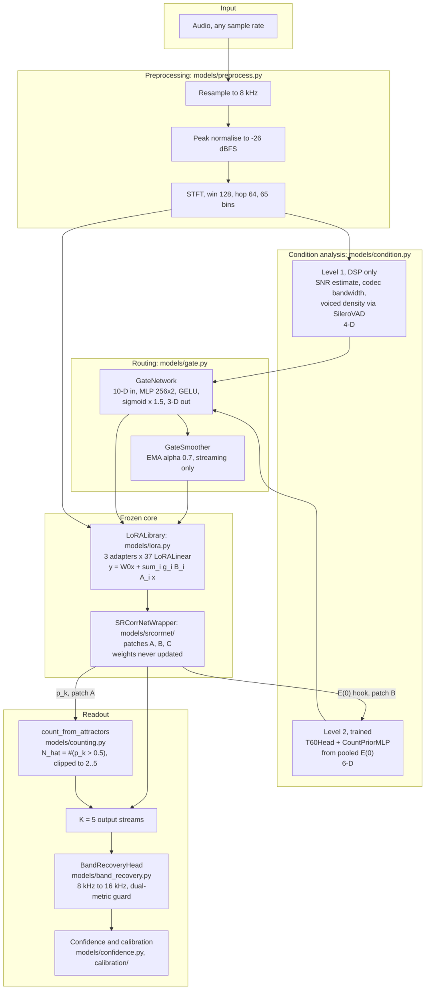
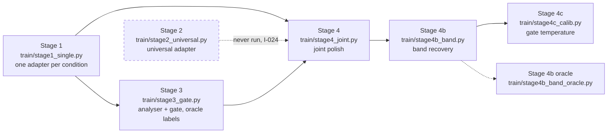

# Architecture

**Purpose:** describe the architecture that actually exists in this tree, verified by reading the modules, not the architecture the README intends.

**Status:** [AMBER] Structure verified by inspection. Runtime behaviour unverified because the backbone dependency is missing (I-019).

**Last verified:** 2026-09-02

**Source of truth:** the module sources listed in each table. Where a number comes from documentation rather than from code, it is marked.

---

## 1. The one-sentence version

A frozen pretrained separation network is left completely untouched, and three small LoRA adapters are injected into 37 of its linear layers, blended by a gate that reads acoustic conditions off the input, so the model can be steered toward reverberant, noisy or codec-damaged audio without ever being fine-tuned.

The design rule behind it, recorded in `docs/PROJECT_HISTORY.md`, came from a measured failure: in the previous architecture, every attempt to put trainable layers on top of this backbone's output made it worse by 0.4 to 3.7 dB. The bet in the current design is that the right place to help a strong frozen model is inside its weights, gently, and only under conditions it was never trained for.

---

## 2. System diagram

---

## 3. Components as they exist

| Component | Module | Key symbols verified present | Trainable | Status |
|---|---|---|---|---|
| Preprocessing | `models/preprocess.py` | `calmsep_preprocess`, `CalmSepPreprocessedAudio`, `CALMSEP_SAMPLE_RATE`, `CALMSEP_STFT_WIN/HOP/BINS` | no | [GREEN] imports, unit-tested |
| Backbone wrapper | `models/srcorrnet/__init__.py` | `SRCorrNetWrapper`, `_patch_a_pres`, `_patch_b_e0`, `_patch_c_dec`, `_patch_prob_thres`, `is_available` | no, frozen | [RED] cannot load, `sr_corrnet` absent (I-019) |
| Adapter library | `models/lora.py` | `LoRALayer`, `LoRALinear`, `LoRALibrary`, `_target_paths`, `inject_gates`, `freeze_base`, `olora_penalty` | yes | [GREEN] imports, unit-tested |
| Level 1 analyser | `models/condition.py` | `level1_features`, `level1_tensor`, `voiced_density_silero`, `voiced_density_energy` | no | [GREEN] imports, has an energy fallback when SileroVAD is unavailable |
| Level 2 analyser | `models/condition.py` | `T60Head`, `CountPriorMLP`, `Level2Analyzer`, `level2_loss` | yes | [GREEN] imports, unit-tested |
| Gate | `models/gate.py` | `GateNetwork`, `gate_dict`, `l1_penalty`, `oracle_gate`, `gate_loss`, `GateSmoother` | yes | [GREEN] imports; the trained artifact does not route (I-003) |
| Speaker counting | `models/counting.py` | `count_from_attractors`, `attractor_confidence`, `residual_sweep_sisdr`, `CountFusion`, `ThreeVoteCounter`, `build_vote_features` | partly | [AMBER] fully implemented, never called from the evaluation path (I-002) |
| Band recovery | `models/band_recovery.py` | `BandRecoveryHead`, `predict_highband_stft`, `apply_band_recovery_guarded`, `stft_to_waveform` | yes | [GREEN] imports, unit-tested |
| Confidence | `models/confidence.py` | `StreamConfidenceHead`, `CompletenessHead` | yes | [GREEN] imports |
| Calibration | `calibration/` | `TemperatureScaler`, `CompletenessCalibrator`, OOD Mahalanobis discount | fitted post hoc | [AMBER] imports and is tested; never measured for calibration error (I-034) |
| Chunking | `pipeline/chunker.py` | `Chunker`, `AudioChunk`, `_compute_stft_16k` | no | [GREEN] |
| Stitching | `pipeline/stitcher.py` | `ChunkStitcher`, `feed_chunk`, `finalize`, `_hungarian_cosine`, `_hungarian_correlation` | no | [GREEN] salvaged from v1, where it measured 0 identity switches on real speech |
| Alignment | `align/` | `run_and_align`, `run_and_align_long`, `ensure_embeddings`, `hungarian` | no | [GREEN] |
| Inference pipeline | `pipeline/infer.py` | `CalmSepPipeline`, `InferenceCfg`, `PipelineResult` | no | [AMBER] imports; three consumers still call it `CalmSepEngine` (I-006) |
| Output contract | `schemas/separation_result.py` | `SeparationResult`, `StreamMetadata` | no | [GREEN] |

Counts of 37 wrapped modules per adapter, 101,404 parameters per adapter and 440,285 total trainable parameters come from `NUMBERS.md`, not from a measurement made here. They cannot be confirmed without loading the backbone, so they are [CLAIMED].

---

## 4. The three backbone patches

`SRCorrNetWrapper` does not subclass or modify the pretrained network. It applies four monkey patches at load time, each exposing an internal tensor the public interface does not return.

| Patch | Method | What it exposes | Consumed by |
|---|---|---|---|
| A | `_patch_a_pres` | per-slot attractor probabilities `p_k` | `count_from_attractors`, `attractor_confidence` |
| B | `_patch_b_e0` | the encoder output `E(0)` | `Level2Analyzer`, the T60 head and the count prior |
| C | `_patch_c_dec` | per-decoder-stage outputs | inter-stage consistency in `models/confidence.py` |
| prob threshold | `_patch_prob_thres` | the slot activation threshold | speaker count readout |

This is the load-bearing design choice of the whole system: the backbone stays byte-identical, and everything the architecture needs is read out through hooks. It is also the reason I-019 is fatal rather than inconvenient, since the patches target internal attribute paths of a specific version of a package that is not pinned anywhere.

---

## 5. Training stages as implemented

| Stage | Script | Ran | Artifact | Evidence |
|---|---|---|---|---|
| 1 reverb | `train/stage1_single.py` | yes, 40 epochs | `best_reverb.pt`, 424 KB | `NUMBERS.md`, Stage 4 log shows it copied at 432.3 KB |
| 1 noise | same | yes, epoch count disputed (I-022) | `best_noise.pt` | Stage 4 log, 433.1 KB |
| 1 codec | same | yes | `best_codec.pt` | Stage 4 log, 433.1 KB |
| 2 universal | `train/stage2_universal.py` | **no** | none | `CONTEXT.md`; the recovered `run_eval.py` contains its loader, so it was prepared for |
| 3 gate | `train/stage3_gate.py` | yes | `best_gate.pt`, `final_gate.pt`, 367.9 KB | Stage 4 log shows both copied |
| 4 joint | `train/stage4_joint.py` | yes, 14 of 20 epochs | `best_joint.pt`, 1.6 MB, 222 adapter tensors | full epoch-by-epoch Kaggle log |
| 4b band | `train/stage4b_band.py` | yes | `best_band.pt`, 184 KB | `NUMBERS.md` |
| 4c calibration | `train/stage4c_calib.py` | yes | `calibration.pt`, T = 4.9872 | `NUMBERS.md`, two sources |

No checkpoint is present in this repository. All of them live in Kaggle datasets under the account `rishig777`, which is why `DATA_AND_MODEL_INVENTORY.md` records them as external.

---

## 6. Inference order

Taken from `pipeline/infer.py` and confirmed against the pipeline description in `NUMBERS.md` section 5.3.

1. Resample the input to 8 kHz and trim or pad it.
2. Compute Level 1 condition features by DSP alone. No model is involved, so this works on the first chunk.
3. Compute Level 2 features from the pooled `E(0)` of the previous chunk. On the first chunk these are zeros, because `E(0)` is only available after a forward pass. This is a real one-chunk lag in the design, not a defect.
4. Concatenate to a 10-D vector, run the gate, obtain three gate values.
5. Inject the gate values into all 37 `LoRALinear` modules.
6. One backbone forward pass, producing five streams and five slot probabilities.
7. `N_hat` is the number of slots above threshold, clipped to the range 2 to 5. Keep the first `N_hat` streams.
8. Band recovery lifts 8 kHz to 16 kHz, applied per chunk only when both SI-SDRi and DNSMOS improve.
9. Confidence and completeness heads score the result; the OOD discount reduces confidence for inputs far from the training distribution.

One forward pass total. The gate adds roughly 100 ms; the backbone dominates at 72 to 116 seconds per 6-second clip on CPU (I-032).

---

## 7. Contract table

| Component | Input | Output | Source of truth | Status |
|---|---|---|---|---|
| Preprocessing | waveform, any sample rate | `CalmSepPreprocessedAudio` at 8 kHz with STFT | `models/preprocess.py` | [VERIFIED] by unit test |
| Level 1 | 8 kHz mixture tensor | 4-D float tensor | `models/condition.py::level1_tensor` | [VERIFIED] by unit test |
| Level 2 | pooled `E(0)`, 128 channels | 6-D float tensor | `models/condition.py::Level2Analyzer.feature_vector` | [VERIFIED] by unit test |
| Gate | 10-D condition tensor | dict of 3 gates in [0, 1.5] | `models/gate.py::GateNetwork.gate_dict` | [VERIFIED] structurally, [FAILED] behaviourally (I-003) |
| LoRA injection | gate dict | modified forward on 37 modules | `models/lora.py::LoRALibrary.inject_gates` | [VERIFIED]: zero-gate output matches base to 0.000000 |
| Backbone | 8 kHz STFT, optional `n_spks` | 5 streams, 5 slot probabilities, `E(0)`, decoder stages | `models/srcorrnet/__init__.py` | [UNVERIFIED], dependency missing |
| Counting | slot probabilities | integer in 2..5 | `models/counting.py::count_from_attractors` | [VERIFIED] by unit test, [UNVERIFIED] end to end (I-002) |
| Band recovery | 8 kHz streams, 16 kHz mixture | 16 kHz streams | `models/band_recovery.py::apply_band_recovery_guarded` | [VERIFIED] by unit test |
| Result | streams and metadata | `SeparationResult` | `schemas/separation_result.py` | [VERIFIED] by unit test |

---

## 8. Where the architecture and the trained artifact disagree

This is the part worth reading twice. The code implements a condition-aware router. The trained artifact does not behave like one.

| Design intent | Trained reality | Ticket |
|---|---|---|
| The gate selects adapters by condition | T = 4.9872 flattens the sigmoid; all gates sit near 0.5, so the system is a fixed uniform blend | I-003 |
| The reverb adapter helps on reverberant audio | It degrades SI-SNR by 2.81 dB on strong reverb and by 0.44 dB on clean audio | I-025 |
| Speaker count is read from attractor probabilities | Evaluation supplies the true count to both systems, so the readout is never exercised | I-002 |
| Three adapters beat one universal adapter | The universal adapter was never trained, so the comparison does not exist | I-024 |

The mechanism is sound and the plumbing is verified. The evidence that the mechanism produces the intended behaviour is missing. Those are different problems and they are ticketed separately.

---

## Related documents

`RESTORATION_STATE.md` · `DATA_AND_MODEL_INVENTORY.md` · `EXPERIMENT_REGISTRY.md` · `RESULTS.md` · `APPROACH_EVOLUTION.md` · `ISSUE_LEDGER.md`
