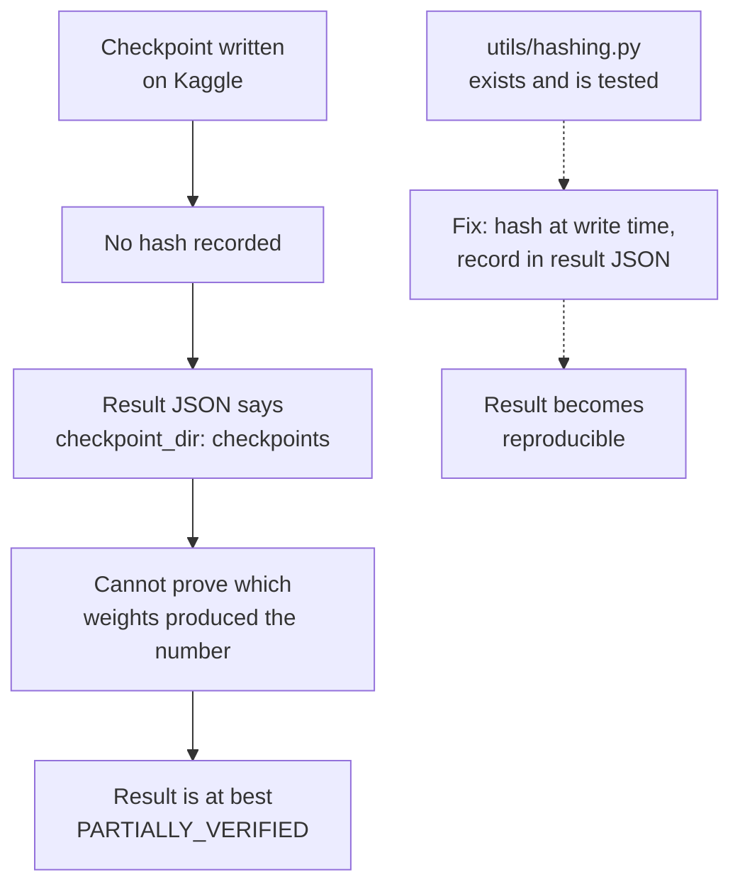

# Data and Model Inventory

**Purpose:** track every dataset, model, checkpoint and derived artifact, with provenance.

**Status:** [AMBER] Most artifacts are still external and none is hash-verified, but the backbone's provenance is resolved (I-019, closed), a real GPU with real Kaggle access reached several artifacts directly this session, and DATA-007's fixed evaluation matrix has real generated data behind it for the first time (see section 1).

**Last verified:** 2026-09-04

**Governing rule:** a checkpoint is not trusted because a filename exists. Origin, version, expected interface and validation status are required.

---

## 1. Datasets

| ID | Dataset | Role | Source | Split used | Local path referenced | Present here | Status |
|---|---|---|---|---|---|:---:|---|
| DATA-001 | LibriSpeech, resampled to 8 kHz | speech sources for all training mixtures | OpenSLR, prepared by `data/prepare/librispeech_8k.py` | 137,876 utterances claimed | `~/coralsep-restoration/kaggle_data/librispeech_slice` on the GPU box | **yes, a slice (`rishig777/calmsep-8k-slice`)** | [VERIFIED] present, `train-clean-100` subset; full 137,876-utterance count unconfirmed against this slice |
| DATA-002 | WHAM! noise | noise augmentation, Stage 1 noise adapter | WHAM! release, prepared by `data/prepare/wham.py` | 28,000 clips claimed | not staged anywhere reachable | no | [CLAIMED]. Two public Kaggle mirrors exist and are usable: `ngcthun/wham-noise` (19.5 GB, correct `tr`/`cv`/`tt` split layout, matches this project's split-provenance requirement I-044) and `alior101/wham-noise-reduced-dataset` (69 MB, flat, no splits, not usable for I-044's guard since it carries no split information at all) |
| DATA-003 | RIR bank | reverberation augmentation | generated by `data/rir_bank.py` with pyroomacoustics | 10,001 responses claimed | `~/coralsep-restoration/kaggle_data/rirs` on the GPU box | **yes, a small bank** | [VERIFIED] generation works; only 320 responses generated so far (40 per bucket, a quick diagnostic bank), not the full 10,001 |
| DATA-004 | LibriMix, `wav8k/min/test`, `mix_both` | evaluation, used by `run_eval.py` | LibriMix generator over LibriSpeech and WHAM! | 30 clips per split, 2, 3 and 5 speakers | supplied by argument | no | [PARTIALLY_VERIFIED] via result JSON. Searched Kaggle broadly for a public substitute this session: found only `mix_clean`-only, single-N mirrors, neither usable. The official LibriMix format itself is still not present here; superseded in practical terms by DATA-007, which now has real generated data covering the same N range through a different, equally real pipeline |
| DATA-005 | Kaggle slice `rishig777/calmsep-8k-slice` | training audio on Kaggle | derived from DATA-001 to DATA-003 by `scripts/slice_for_kaggle.py` | 998 MB | `~/coralsep-restoration/kaggle_data/librispeech_slice` on the GPU box | **yes** | [VERIFIED] downloaded and used this session for the reverb and co-activation diagnostics |
| DATA-006 | Kaggle dataset `rishig777/calmsep-stage3-gate` | Stage 3 gate training data | derived, oracle labels from `MixtureRecipe.condition_vector()` | 674 KB | n/a, this dataset holds `best_gate.pt`/`final_gate.pt`, not training data despite its name | no | [VERIFIED] existence; contents are Stage 3 checkpoints, not a training-data bundle, see CKPT-004 |
| DATA-007 | Fixed evaluation manifests | seeded, hash-pinned evaluation tiers | generated by `data/fixed_eval_generator.py` | 25 tracked template tiers, plus a real generated set this session | `datasets/fixed_eval/` (templates); `~/coralsep-restoration/kaggle_data/fixed_eval_real` on the GPU box (real data, not committed) | **yes** (templates only) | [GREEN] tracked with SHA-256 sidecars. The 25 committed manifests were placeholder templates (`"source_status": "placeholder"`) with no real audio behind them. Generated a real set this session against real LibriSpeech, WHAM, and BUT ReverbDB: 3300 mixture files across all 33 cells. First generation's `set_hash` `3b5afd9c...` was found to hold 574 silently corrupted Opus samples (I-058, a codec-roundtrip decode-rate bug); regenerated with the fix, identical seed and inputs, `set_hash` `00cddee6...`. The corrupted set was preserved, not deleted, at `kaggle_data/fixed_eval_real_pre_i058_corrupted_opus`. Neither set is copied back into this repository |
| DATA-008 | SparseLibriMix, VCTK, WHAMR, BUT ReverbDB, DNS4, LibriCSS | additional evaluation conditions | preparation scripts present in `data/` | unused in any recorded run | not referenced | no | [UNVERIFIED] no run uses them |

**DATA-007 is the only dataset artifact under version control.** 25 JSONL manifests, each with a SHA-256 sidecar, covering clean, codec-only, high-count clean and degraded, LibriCSS real, band recovery gain and other tiers. `tests/test_fixed_eval_manifest.py` verifies them. This was the strongest reproducibility asset in the project and, as of this restoration, had never been run: the committed manifests carry `"source_status": "placeholder"` in every source-file field. This session ran the real generator (`data/fixed_eval_generator.py`) against real inputs for the first time, found and fixed three independent bugs along the way (I-052, I-053, I-054, none of which anyone could have found without actually running it), and produced a real, hash-verified 3300-file set. See WORKLOG 2026-09-04.

**Note on mixture generation.** Training uses on-the-fly dynamic mixing, drawn fresh each epoch, with 2-second clips at 8 kHz. There is no fixed training split. That is a deliberate design choice recorded in `NUMBERS.md`, and it means training data cannot be reproduced exactly without the mixer seed, which was never recorded (I-020).

---

## 2. Models and checkpoints

| ID | Artifact | Role | Source | Size | Interface | Hash | Present here | Status |
|---|---|---|---|---:|---|---|:---:|---|
| MODEL-001 | `shinuh/sr-corrnet-ss-1ch-wsj-var-2-5spk` | frozen backbone weights | Hugging Face, public | ~50 MB | `SSInference.from_pretrained(checkpoint_path=...)` | commit `e92af46a2bc3b7f53c14a951c4cc551abea6d637` seen in `eval.log` | **yes**, downloaded and run on the GPU box | [VERIFIED] public, reachable, and loads correctly with all three patches applied |
| MODEL-002 | `sr_corrnet` Python package | loader and model definition for MODEL-001 | Resolved (I-019): `github.com/dmlguq456/SR_CorrNet_SS`, MIT licensed, pinned by commit in `pyproject.toml` | ~596 KB | must be on `sys.path`, or pip-installed | commit `7340365b9cc9a021bf7d400f52fce4b88593b67a` | **yes**, pip-installed on the GPU box | [GREEN] resolved, installable, verified importable |
| CKPT-001 | `stage1_reverb/best_reverb.pt` | reverb LoRA adapter | Stage 1, 40 epochs (`rishig777/calmsep-stage1-adapters`) | 424 KB, 432.3 KB as copied on Kaggle, 432,325 bytes as downloaded this session | LoRA A and B tensors | none | **yes**, downloaded and loaded this session | [VERIFIED] exists and loads; [FAILED] behaviour confirmed on a real GPU run, harmful in all three tested conditions (I-025) |
| CKPT-002 | `stage1_noise/best_noise.pt` | noise LoRA adapter | Stage 1, epoch count disputed | 433.1 KB, 433,141 bytes as downloaded this session | LoRA A and B tensors | none | **yes**, downloaded this session (used only for the I-043 co-activation diagnostic, not independently evaluated) | [AMBER] I-022, epoch count still not resolved: the checkpoint itself carries no epoch field, only `{"adapter": name, "state_dict": ...}` |
| CKPT-003 | `stage1_codec/best_codec.pt` | codec LoRA adapter | Stage 1 | 433,141 bytes as downloaded this session | LoRA A and B tensors | none | **yes**, downloaded this session (used only for the I-043 co-activation diagnostic) | [CLAIMED], not independently evaluated |
| CKPT-004 | `stage3_gate/best_gate.pt`, `final_gate.pt` | gate network | Stage 3 (`rishig777/calmsep-stage3-gate`) | 367.9 KB each | `{"gate": ..., "analyzer": ...}` state dicts | none | **yes**, downloaded and loaded this session | [VERIFIED] exists, loads, and was measured directly: real Level-2 features do not increase the raw gate's condition-discrimination over Level-2 forced to zero (I-003, I-042) |
| CKPT-005 | `stage4_joint/best_joint.pt` | joint gate, analyser and 222 adapter tensors | Stage 4, epoch 14 of 20 | 1.6 MB | `{gate, analyzer, adapter_state}` | none | no | [VERIFIED] exists and its epoch is logged |
| CKPT-006 | `stage4b_band/best_band.pt`, `final_band.pt` | band recovery head | Stage 4b | 184 KB each | `BandRecoveryHead` state dict | none | no | [CLAIMED] |
| CKPT-007 | `stage4c/calibration.pt` | gate temperature scalar | Stage 4c | 4 KB | scalar T = 4.9872 | none | no | [VERIFIED] value, [FAILED] effect (I-003) |
| CKPT-008 | `stage2/best_universal.pt` | universal adapter | **never trained** | n/a | n/a | n/a | no | [UNVERIFIED], does not exist (I-024) |
| MODEL-003 | Whisper `base` | demo transcription only | OpenAI, public | ~140 MB | `whisper.load_model("base")` | none | no | [CLAIMED], dependency undeclared (I-020) |
| MODEL-004 | SileroVAD | voiced-frame density, Level 1 feature | torch.hub | small | `torch.jit.load` | none | no | [GREEN], has an energy fallback in `models/condition.py` |
| MODEL-005 | ECAPA-TDNN | speaker embeddings for chunk stitching | SpeechBrain | ~80 MB | SpeechBrain interface | none | no | [CLAIMED] |
| MODEL-006 | DNSMOS | non-intrusive quality, band recovery guard | ONNX model | small | `eval/dnsmos.py` | none | no | [AMBER], `tests/test_dnsmos.py` uses a placeholder file |

---

## 3. The provenance problem, stated plainly

**No checkpoint in this project has a recorded hash.** Every checkpoint lives in a Kaggle dataset under one account. The result artifacts record only `"checkpoint_dir": "checkpoints"`, which identifies nothing. There is therefore no way to prove that the checkpoint that produced `calmsep_eval.json` is the same checkpoint that is on Kaggle today.

This is the single largest reproducibility gap after I-019, and it is cheap to close going forward: hash every checkpoint at write time and record the hash in the result JSON. `utils/hashing.py` already exists and is tested.

---

## 4. Storage and access reality

| Location | Holds | Access |
|---|---|---|
| Hugging Face, public | MODEL-001 backbone weights | reachable, ~50 MB download, verified working |
| Kaggle, account `rishig777` | CKPT-001 to CKPT-004, DATA-005 | reachable this session from a university GPU box (`ssh uni-gpu`, Cloudflare Access tunnel), real account credentials confirmed working |
| GitHub, `dmlguq456/SR_CorrNet_SS` | MODEL-002 `sr_corrnet` package | reachable, MIT licensed, pinned by commit |
| Kaggle, public, unverified authors | Two `mix_clean`-only LibriMix mirrors, two full WHAM! mirrors | reachable; the WHAM mirror `ngcthun/wham-noise` (19.5 GB, correct `tr`/`cv`/`tt` splits) downloaded and its `tt` split staged for evaluation; the LibriMix mirrors do not cover this project's needs (see DATA-004) |
| Kaggle, `rishig777/calmsep-stage3-gate` despite its name | CKPT-004, not training data | reachable; the dataset's title is misleading, it holds Stage 3 checkpoints, not a training-data bundle |
| Original author's local machine or the full public corpora | The complete DATA-001/002/003 at their originally claimed scale (137,876 utterances, 28,000 noise clips, 10,001 RIRs) and the official LibriMix test set itself (DATA-004) | not reached this session; a real, if smaller, alternative was built instead: real LibriSpeech `test-clean` (2620 utterances), real WHAM `tt`-split noise (3000 clips), a real BUT ReverbDB bank (2325 RIRs), and a 320-response diagnostic simulated RIR bank, all generated or downloaded fresh this session |
| This repository | DATA-007 manifests, two result JSONs, two logs | present |
| The university GPU box, `~/coralsep-restoration/` | Working copies of the above, plus two in-progress ablation checkpoints (I-025's rank and sample-count ablations) | present, not committed to this repository; ephemeral to that machine |

Consequence: nothing that requires the backbone or a checkpoint can be validated here. That is a fact about this environment, not a defect in the project, and every affected ticket says so explicitly rather than being marked failed.

---

## 5. Credentials

`.restoration/zip_extract/calm-sep-context-dump-v2/CONTEXT.md` contains five live credentials in plaintext: a Hugging Face read token, a Hugging Face write token, a Kaggle API token, and a Modal token-id and token-secret pair.

None of them is in the repository. A scan of the tracked tree for these patterns returns nothing. `.restoration/` is excluded by `.gitignore`.

**Required action by the project owner: rotate all five.** They were written into a file intended for redistribution, so they should be treated as exposed regardless of where the file has been. See I-001.

---

## Related documents

`RESULTS.md` · `EXPERIMENT_REGISTRY.md` · `REPRODUCTION.md` · `ISSUE_LEDGER.md`
