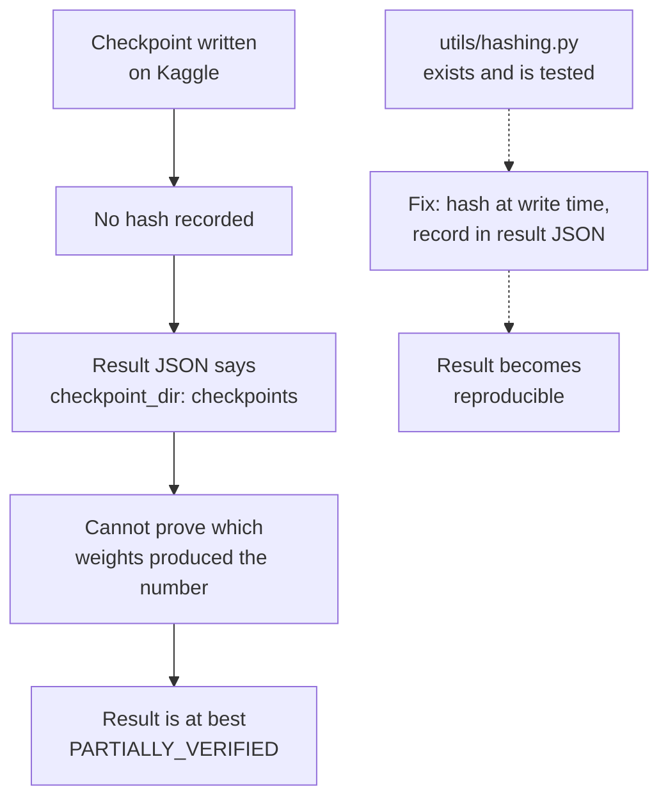

# Data and Model Inventory

**Purpose:** track every dataset, model, checkpoint and derived artifact, with provenance.

**Status:** [AMBER] Every artifact is external. None is hash-verified. One has unknown provenance and blocks reproduction.

**Last verified:** 2026-09-02

**Governing rule:** a checkpoint is not trusted because a filename exists. Origin, version, expected interface and validation status are required.

---

## 1. Datasets

| ID | Dataset | Role | Source | Split used | Local path referenced | Present here | Status |
|---|---|---|---|---|---|:---:|---|
| DATA-001 | LibriSpeech, resampled to 8 kHz | speech sources for all training mixtures | OpenSLR, prepared by `data/prepare_librispeech_8k.py` | 137,876 utterances | `data/calmsep-8k/librispeech-8k/` | no | [CLAIMED] count from `NUMBERS.md` |
| DATA-002 | WHAM! noise | noise augmentation, Stage 1 noise adapter | WHAM! release, prepared by `data/prepare_wham.py` | 28,000 clips | `data/calmsep-8k/wham_noise/` | no | [CLAIMED] |
| DATA-003 | RIR bank | reverberation augmentation | generated by `data/rir_bank.py` with pyroomacoustics | 10,001 responses | `data/calmsep-8k/rirs/` | no | [CLAIMED] |
| DATA-004 | LibriMix, `wav8k/min/test`, `mix_both` | evaluation | LibriMix generator over LibriSpeech and WHAM! | 30 clips per split, 2, 3 and 5 speakers | supplied by argument | no | [PARTIALLY_VERIFIED] via result JSON |
| DATA-005 | Kaggle slice `rishig777/calmsep-8k-slice` | training audio on Kaggle | derived from DATA-001 to DATA-003 by `scripts/slice_for_kaggle.py` | unknown size | `/kaggle/input/...` | no | [VERIFIED] existence, from the Stage 4 log |
| DATA-006 | Kaggle dataset `rishig777/calmsep-stage3-gate` | Stage 3 gate training data | derived, oracle labels from `MixtureRecipe.condition_vector()` | unknown size | `/kaggle/input/...` | no | [VERIFIED] existence, from the Stage 4 log |
| DATA-007 | Fixed evaluation manifests | seeded, hash-pinned evaluation tiers | generated by `data/synthesis/fixed_eval.py` | 25 tiers | `data/fixed_eval/` | **yes** | [GREEN] tracked with SHA-256 sidecars |
| DATA-008 | SparseLibriMix, VCTK, WHAMR, BUT ReverbDB, DNS4, LibriCSS | additional evaluation conditions | preparation scripts present in `data/` | unused in any recorded run | not referenced | no | [UNVERIFIED] no run uses them |

**DATA-007 is the only dataset artifact under version control.** 25 JSONL manifests, each with a SHA-256 sidecar, covering clean, codec-only, high-count clean and degraded, LibriCSS real, band recovery gain and other tiers. `tests/test_fixed_eval_manifest.py` verifies them. This is the strongest reproducibility asset in the project and no recorded experiment used it.

**Note on mixture generation.** Training uses on-the-fly dynamic mixing, drawn fresh each epoch, with 2-second clips at 8 kHz. There is no fixed training split. That is a deliberate design choice recorded in `NUMBERS.md`, and it means training data cannot be reproduced exactly without the mixer seed, which was never recorded (I-020).

---

## 2. Models and checkpoints

| ID | Artifact | Role | Source | Size | Interface | Hash | Present here | Status |
|---|---|---|---|---:|---|---|:---:|---|
| MODEL-001 | `shinuh/sr-corrnet-ss-1ch-wsj-var-2-5spk` | frozen backbone weights | Hugging Face, public | ~50 MB | `SSInference.from_pretrained(checkpoint_path=...)` | commit `e92af46a2bc3b7f53c14a951c4cc551abea6d637` seen in `eval.log` | no | [VERIFIED] public and reachable |
| MODEL-002 | `sr_corrnet` Python package | loader and model definition for MODEL-001 | **unknown**; recorded only as a local directory | ~596 KB | must be on `sys.path` | none | no | **[UNVERIFIED], blocks everything (I-019)** |
| CKPT-001 | `stage1_reverb/best_reverb.pt` | reverb LoRA adapter | Stage 1, 40 epochs | 424 KB, 432.3 KB as copied on Kaggle | LoRA A and B tensors | none | no | [VERIFIED] exists, [FAILED] behaviour (I-025) |
| CKPT-002 | `stage1_noise/best_noise.pt` | noise LoRA adapter | Stage 1, epoch count disputed | 433.1 KB | LoRA A and B tensors | none | no | [AMBER] I-022 |
| CKPT-003 | `stage1_codec/best_codec.pt` | codec LoRA adapter | Stage 1 | 433.1 KB | LoRA A and B tensors | none | no | [CLAIMED] |
| CKPT-004 | `stage3_gate/best_gate.pt`, `final_gate.pt` | gate network | Stage 3 | 367.9 KB each | `GateNetwork` state dict | none | no | [VERIFIED] exists, from the Stage 4 log |
| CKPT-005 | `stage4_joint/best_joint.pt` | joint gate, analyser and 222 adapter tensors | Stage 4, epoch 14 of 20 | 1.6 MB | `{gate, analyzer, adapter_state}` | none | no | [VERIFIED] exists and its epoch is logged |
| CKPT-006 | `stage4b_band/best_band.pt`, `final_band.pt` | band recovery head | Stage 4b | 184 KB each | `BandRecoveryHead` state dict | none | no | [CLAIMED] |
| CKPT-007 | `stage4c/calibration.pt` | gate temperature scalar | Stage 4c | 4 KB | scalar T = 4.9872 | none | no | [VERIFIED] value, [FAILED] effect (I-003) |
| CKPT-008 | `stage2/best_universal.pt` | universal adapter | **never trained** | n/a | n/a | n/a | no | [UNVERIFIED], does not exist (I-024) |
| MODEL-003 | Whisper `base` | demo transcription only | OpenAI, public | ~140 MB | `whisper.load_model("base")` | none | no | [CLAIMED], dependency undeclared (I-020) |
| MODEL-004 | SileroVAD | voiced-frame density, Level 1 feature | torch.hub | small | `torch.jit.load` | none | no | [GREEN], has an energy fallback in `models/condition.py` |
| MODEL-005 | ECAPA-TDNN | speaker embeddings for chunk stitching | SpeechBrain | ~80 MB | SpeechBrain interface | none | no | [CLAIMED] |
| MODEL-006 | DNSMOS | non-intrusive quality, band recovery guard | ONNX model | small | `eval/dnsmos.py` | none | no | [AMBER], `tests/test_dnsmos.py` uses a placeholder file |

---

## 3. The provenance problem, stated plainly

**No checkpoint in this project has a recorded hash.** Every checkpoint lives in a Kaggle dataset under one account. The result artifacts record only `"checkpoint_dir": "checkpoints"`, which identifies nothing. There is therefore no way to prove that the checkpoint that produced `calmsep_eval.json` is the same checkpoint that is on Kaggle today.

This is the single largest reproducibility gap after I-019, and it is cheap to close going forward: hash every checkpoint at write time and record the hash in the result JSON. `utils/hashing.py` already exists and is tested.

---

## 4. Storage and access reality

| Location | Holds | Access from this machine |
|---|---|---|
| Hugging Face, public | MODEL-001 backbone weights | reachable, ~50 MB download |
| Kaggle, account `rishig777` | all checkpoints, training slices, gate dataset | not available here; requires account credentials |
| Unknown | MODEL-002 `sr_corrnet` package | not available; provenance unknown |
| Original author's local machine | DATA-001 to DATA-003, roughly 176,000 audio files | not available |
| This repository | DATA-007 manifests, two result JSONs, two logs | present |

Consequence: nothing that requires the backbone or a checkpoint can be validated here. That is a fact about this environment, not a defect in the project, and every affected ticket says so explicitly rather than being marked failed.

---

## 5. Credentials

`.restoration/zip_extract/calm-sep-context-dump-v2/CONTEXT.md` contains five live credentials in plaintext: a Hugging Face read token, a Hugging Face write token, a Kaggle API token, and a Modal token-id and token-secret pair.

None of them is in the repository. A scan of the tracked tree for these patterns returns nothing. `.restoration/` is excluded by `.gitignore`.

**Required action by the project owner: rotate all five.** They were written into a file intended for redistribution, so they should be treated as exposed regardless of where the file has been. See I-001.

---

## Related documents

`RESULTS.md` · `EXPERIMENT_REGISTRY.md` · `REPRODUCTION.md` · `ISSUE_LEDGER.md`
