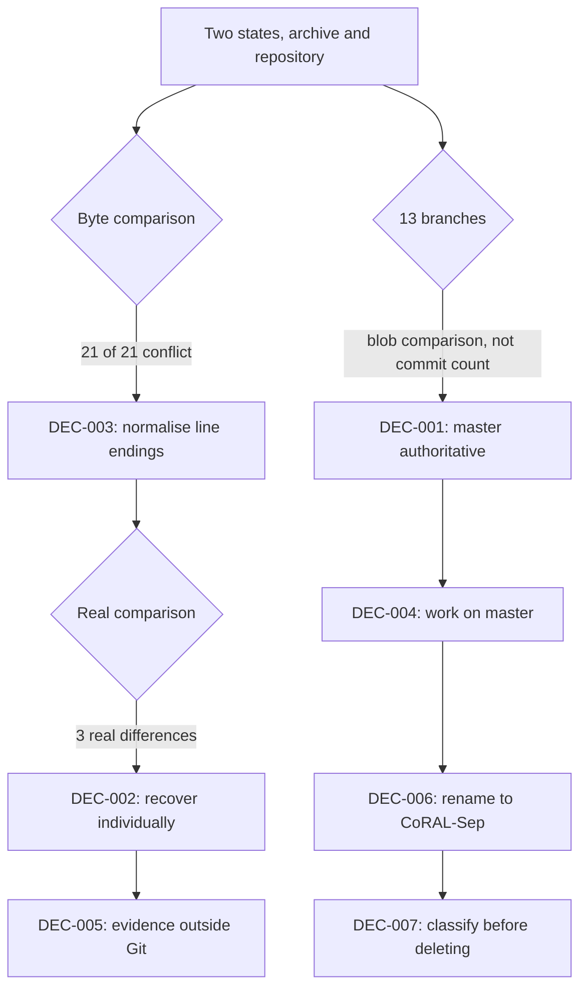

# Decisions

**Purpose:** decisions taken during the restoration, with the reasoning and the cost of each.

**Status:** [GREEN] Seven decisions recorded.

**Last verified:** 2026-09-02

**Relationship to `docs/decisions.md`.** That file is the original project's decision log, one line per decision, running from 2026-07-09 to 2026-07-17. It is historical evidence and is not edited. This file records decisions made from 2026-09-02 onward, with full context, because restoration decisions change what other people are allowed to assume.

---

## DEC-001: `master` is authoritative for all committed source

**Status:** [ACCEPTED] · **Date:** 2026-09-02

**Context.** Thirteen remote branches exist. `origin/integration` is seventeen commits ahead of its merge base with `master` and contains substantial work: Stage 2 evaluation, Stage 3 training, a gradient-flow fix in the PIT loss, LoRA freeze depth ordering, BF16 autocast for L40S, and a rebuilt download script. A reflex reading of "seventeen commits ahead" says merge it.

**Options considered.**

1. Merge `origin/integration` into `master`.
2. Cherry-pick the unique commits.
3. Treat `master` as authoritative and mark the branch superseded.

**Decision.** Option 3.

**Reasoning.** Blob-level comparison, not commit counting, settles this. Of the eighteen files `integration` touches, fifteen are byte-identical to `master` today, because commit `646ab52` on 2026-07-17 explicitly integrated the branches. Of the three that differ, `master` carries the strictly later change in every case. For `models/lora.py`, `master` adds tensor-gate support in `LoRALinear.forward` and fixes the `olora_penalty` accumulator to avoid a device-placement bug, both on top of the `integration` version. Merging would regress those fixes.

Independent confirmation: the supplied archive, dated 2026-09-01, contains `models/lora.py` identical to `master` and not to `integration`. The author's own later working copy agrees.

**Consequences.** Twelve branches can be left alone. The unique history stays reachable and is not deleted. Anyone tempted to merge `integration` should read this record first.

**Rejected alternatives.** Merging would have looked productive and quietly reverted two fixes.

**Evidence.** `git rev-parse` blob comparison across all thirteen branches; archive hash comparison.

**Related.** `RESTORATION_STATE.md` section 3.

---

## DEC-002: the supplied archive is treated as recoverable evidence, not as an overlay

**Status:** [ACCEPTED] · **Date:** 2026-09-02

**Context.** The archive is dated 2026-09-01, forty days after the last commit. The obvious move is to copy it over the repository.

**Decision.** Compare every file individually. Recover only what is demonstrably absent from history, as separate scoped commits with recorded provenance. Never copy the archive tree wholesale.

**Reasoning.** Twenty of its twenty-one Python files are byte-identical to `master` once line endings are normalised. A wholesale copy would produce a large meaningless diff, rewrite every file's line endings, and bury the three files that actually matter. It would also import `CONTEXT.md`, which carries five live credentials, and `memory/`, which carries unrelated personal notes about named third parties.

**Consequences.** Three source files, two raw evidence artifacts and two documents are recovered individually and traceably. Nothing else moves.

**Related.** I-001, I-012, I-013, I-014, I-015, I-030.

---

## DEC-003: line-ending differences are not treated as conflicts

**Status:** [ACCEPTED] · **Date:** 2026-09-02

**Context.** A raw byte comparison reported twenty-one of twenty-one archive files as conflicting. That is a false signal: the repository is checked out on Windows with CRLF translation, and the archive stores LF.

**Decision.** Normalise line endings before every content comparison in this restoration. Do not commit a line-ending change as if it were a code change.

**Reasoning.** Byte-for-byte comparison across platforms produces a 100 percent false positive rate here. Comparison after `tr -d '\r'` cut twenty-one apparent conflicts down to three real ones. Reporting the other eighteen as conflicts would have destroyed the credibility of the entire reconciliation.

**Consequences.** All conflict counts in the restoration documents are stated modulo line endings. A future `.gitattributes` addition would remove the ambiguity permanently and is worth doing, but it is a separate change and is not bundled here.

---

## DEC-004: work happens on `master` and pushes there

**Status:** [ACCEPTED] · **Date:** 2026-09-02

**Context.** Restoration work was begun on a `restoration` branch. The project owner confirmed that `master` is the intended default branch.

**Decision.** Commit and push to `master`. Keep commits small and scoped so that any one of them can be reverted independently.

**Reasoning.** With CI never having run (I-011) and no other active contributor, a long-lived restoration branch would only postpone integration risk without reducing it. Small scoped commits on the default branch give a cleaner revert path than one large merge.

**Consequences.** Commit discipline carries the whole safety burden. Every commit is validated before it is made, and no commit mixes unrelated fixes.

---

## DEC-005: restoration evidence lives outside version control, in one place

**Status:** [ACCEPTED] · **Date:** 2026-09-02

**Context.** The workspace held four sibling directories: the archive, its extraction, the restoration pack and the clone. That is scaffolding, not a repository.

**Options considered.**

1. Commit the evidence into the repository so it is never lost.
2. Delete the evidence once the recovery is done.
3. Keep it on disk, in one directory, excluded from version control.

**Decision.** Option 3. The repository root is now the repository. Evidence lives in `.restoration/`, which `.gitignore` excludes.

**Reasoning.** Option 1 is unsafe: the evidence contains five live credentials and unrelated personal information about named third parties, and 647 KB of generated WAV files that the ignore rules already exclude. Option 2 destroys the only copy of the recovered material before the recovery is validated. Option 3 keeps the evidence available for verification while the repository looks and behaves like a normal project.

**Consequences.** `.restoration/` is not backed up by Git. It must not be deleted until every recovery ticket is closed and validated. The archive's SHA-256 was reverified after the move and is unchanged.

**Related.** I-001, I-030.

---

## DEC-006: the project is renamed to CoRAL-Sep

**Status:** [ACCEPTED] · **Date:** 2026-09-02

**Context.** The project owner asked for a new name. The tree currently answers to two names at once: the documentation says CALM-Sep, while `pyproject.toml` still says `ca-mose`, the architecture abandoned on 2026-07-16.

**Options considered.** Several were weighed on three criteria: does the name describe the architecture honestly, does it survive being said aloud, and does it avoid claiming more than the system does.

**Decision.** **CoRAL-Sep**, package name `coralsep`. Condition-Routed Adapter Library for Speech Separation.

**Reasoning.** Each word is load-bearing and checkable against the code. "Condition-Routed" is `models/condition.py` feeding `models/gate.py`. "Adapter Library" is not a metaphor: `models/lora.py` defines a class called `LoRALibrary`. "Sep" keeps continuity with the previous name so that existing readers are not lost. The word reads as a single pronounceable name rather than an initialism, and the near-homophone with "aural" is a small bonus for an audio project rather than the reason for the choice.

It also fixes a real problem: the tree stops answering to a name that was abandoned in July.

**Consequences and the constraint that shapes them.** Checkpoint filenames, Kaggle dataset slugs and result JSON keys contain `calmsep`. Those are external artifacts that cannot be renamed from here, and renaming their references in code would break the loaders. So the rename applies to documentation, package metadata and internal identifiers only. External artifact names stay exactly as they are, and the mapping is documented in `DATA_AND_MODEL_INVENTORY.md`. A short note in the README records the former name so that existing artifacts stay findable.

**Rejected alternatives.** Any name that described a capability the system has not demonstrated, for example anything implying calibrated or robust operation, was rejected on the grounds that the calibration is unmeasured (I-034) and one of three adapters is measurably harmful (I-025). The name should not make a claim the results do not support.

**Related.** I-031, I-018, I-028.

---

## DEC-007: nothing is deleted during the inventory phase

**Status:** [ACCEPTED] · **Date:** 2026-09-02

**Context.** Eight files are plausible deletion candidates: three import v1 code that no longer exists, one appears superseded, and several carry stale platform paths.

**Decision.** Classify every candidate, delete none yet. Classifications are recorded in `PROJECT_INVENTORY.md` section 5.

**Reasoning.** Restoration Rule 13 requires provenance review before deletion, and `[UNKNOWN]` may only be deleted after investigation. Right now the three v1-importing modules are `[UNKNOWN]`, not `[DEAD]`: `tests/test_cached_dataset.py` alone holds 175 lines of tests whose v2 value has not been assessed. `eval/eval_reverb_adapter.py` looks like dead platform-specific cruft and is in fact the only reproduction path for the strongest negative result in the project.

Deleting on appearance would have destroyed that.

**Consequences.** The tree stays slightly untidy through the inventory phase. Cleanup happens per ticket, after each file has been read end to end.

---

## Decision flow

