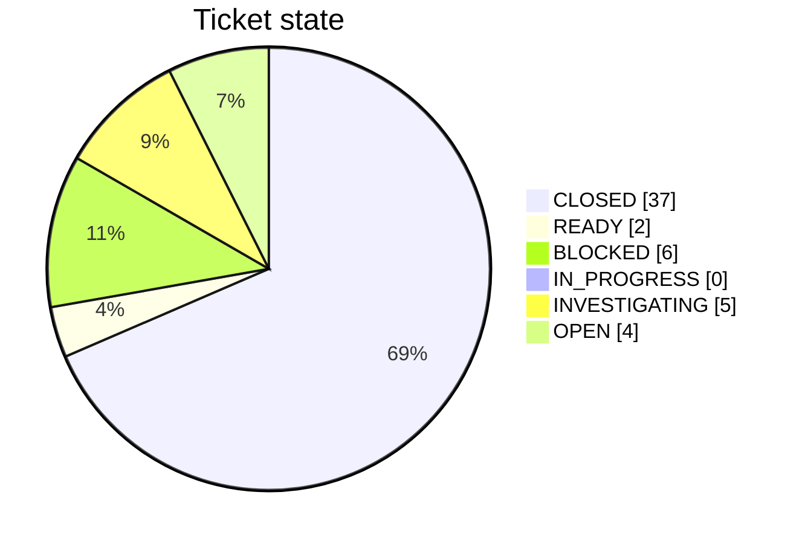
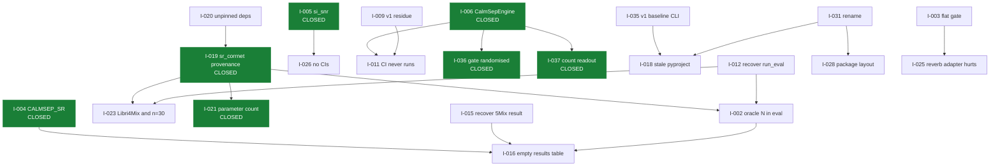

# Issue Ledger

**Purpose:** the master index of every independently actionable problem found during restoration.

**Status:** 🟠 59 tickets. 41 closed, 18 open or blocked. All of them are filed on [GitHub Issues](https://github.com/TECHSCHOLAR777/SINGLE-CHANNEL-SPEECH-SEPARATION-PROJECT/issues) with type and priority labels; [`ISSUES.md`](../../ISSUES.md) is the plain-language companion.

**Last verified:** 2026-09-04

---

## Legend

| Priority | | Meaning |
|---|---|---|
| 🔴 | **P0** | Blocks reliable operation or invalidates core results |
| 🟠 | **P1** | Blocks an important workflow |
| 🟡 | **P2** | Degrades quality, maintainability or reproducibility |
| ⚪ | **P3** | Improvement |

| Lifecycle | | Meaning |
|---|---|---|
| 🟢 | **CLOSED** | Fixed and validated. Never closed on a code change alone |
| 🔵 | **IN_PROGRESS** | Being worked now |
| 🟠 | **READY** | Scoped, actionable, not started |
| 🟡 | **INVESTIGATING** | Evidence still being gathered |
| 🔴 | **BLOCKED** | Needs compute, credentials or an external answer |
| ⚪ | **OPEN** | Recorded, not yet scoped |

**Type:** `[TASK]` `[BUG]` `[ARCH]` `[DOC]` `[TEST]` `[REPRO]` `[DATA]` `[MODEL]` `[EXP]` `[SEC]` `[PERF]` `[CLEANUP]` `[DECISION]` `[RESEARCH]`

---

## Index

| ID | Type | Pri | Title | State | Commit |
|---|---|:---:|---|---|---|
| I-001 | `[SEC]` | 🔴 P0 | Live API credentials present in the supplied archive | 🔴 BLOCKED on owner | [#39](https://github.com/TECHSCHOLAR777/SINGLE-CHANNEL-SPEECH-SEPARATION-PROJECT/issues/39) |
| I-002 | `[EXP]` | 🔴 P0 | Evaluation supplies the oracle speaker count, so count accuracy is never measured | 🟡 INVESTIGATING, code fixed | [#40](https://github.com/TECHSCHOLAR777/SINGLE-CHANNEL-SPEECH-SEPARATION-PROJECT/issues/40) |
| I-003 | `[MODEL]` | 🟠 P1 | Gate temperature 4.9872 flattens the sigmoid and disables condition routing | 🟡 INVESTIGATING, one cause ruled out | [#41](https://github.com/TECHSCHOLAR777/SINGLE-CHANNEL-SPEECH-SEPARATION-PROJECT/issues/41) |
| I-004 | `[BUG]` | 🟠 P1 | `CALMSEP_SR` import fails; the constant is `CALMSEP_SAMPLE_RATE` | 🟢 CLOSED | [#42](https://github.com/TECHSCHOLAR777/SINGLE-CHANNEL-SPEECH-SEPARATION-PROJECT/issues/42) |
| I-005 | `[BUG]` | 🟠 P1 | `eval/matrix.py` imports `si_snr`; the function is `si_sdr` | 🟢 CLOSED | [#43](https://github.com/TECHSCHOLAR777/SINGLE-CHANNEL-SPEECH-SEPARATION-PROJECT/issues/43) |
| I-006 | `[BUG]` | 🟠 P1 | `CalmSepEngine` and `MockCalmSepWrapper` do not exist | 🟢 CLOSED | [#44](https://github.com/TECHSCHOLAR777/SINGLE-CHANNEL-SPEECH-SEPARATION-PROJECT/issues/44) |
| I-007 | `[BUG]` | 🟡 P2 | `eval/ablation_gate.py` imports the non-existent `utils.logging` | 🟢 CLOSED | [#45](https://github.com/TECHSCHOLAR777/SINGLE-CHANNEL-SPEECH-SEPARATION-PROJECT/issues/45) |
| I-008 | `[BUG]` | 🟡 P2 | `train/calibrate.py` imports the non-existent `calibration.fit` | 🟢 CLOSED | [#46](https://github.com/TECHSCHOLAR777/SINGLE-CHANNEL-SPEECH-SEPARATION-PROJECT/issues/46) |
| I-009 | `[CLEANUP]` | 🟡 P2 | Three modules import v1 CA-MoSE code that no longer exists | 🟢 CLOSED | [#47](https://github.com/TECHSCHOLAR777/SINGLE-CHANNEL-SPEECH-SEPARATION-PROJECT/issues/47) |
| I-010 | `[BUG]` | 🟡 P2 | `scripts/slice_for_kaggle.py` runs work at import time and hard-codes a data path | 🟢 CLOSED | [#76](https://github.com/TECHSCHOLAR777/SINGLE-CHANNEL-SPEECH-SEPARATION-PROJECT/issues/76) |
| I-011 | `[BUG]` | 🟠 P1 | CI triggers on `main` while the default branch is `master`, so CI has never run | 🟢 CLOSED | [#48](https://github.com/TECHSCHOLAR777/SINGLE-CHANNEL-SPEECH-SEPARATION-PROJECT/issues/48) |
| I-012 | `[TASK]` | 🟠 P1 | Recover the uncommitted `run_eval.py` improvements held only in the archive | 🟢 CLOSED | [#49](https://github.com/TECHSCHOLAR777/SINGLE-CHANNEL-SPEECH-SEPARATION-PROJECT/issues/49) |
| I-013 | `[TASK]` | 🟠 P1 | Recover the uncommitted `demo.py` transcription work held only in the archive | 🟢 CLOSED | [#50](https://github.com/TECHSCHOLAR777/SINGLE-CHANNEL-SPEECH-SEPARATION-PROJECT/issues/50) |
| I-014 | `[TASK]` | 🟡 P2 | Recover `modal_deploy.py`, which exists nowhere in Git history | 🟢 CLOSED | [#51](https://github.com/TECHSCHOLAR777/SINGLE-CHANNEL-SPEECH-SEPARATION-PROJECT/issues/51) |
| I-015 | `[EXP]` | 🟠 P1 | Recover the Libri5Mix raw result and the Stage 4 training log from the archive | 🟢 CLOSED | [#52](https://github.com/TECHSCHOLAR777/SINGLE-CHANNEL-SPEECH-SEPARATION-PROJECT/issues/52) |
| I-016 | `[DOC]` | 🔴 P0 | README results table is empty while verified raw results exist | 🟢 CLOSED | [#53](https://github.com/TECHSCHOLAR777/SINGLE-CHANNEL-SPEECH-SEPARATION-PROJECT/issues/53) |
| I-017 | `[DOC]` | 🟠 P1 | README repository-structure section describes files that do not exist | 🟢 CLOSED | [#54](https://github.com/TECHSCHOLAR777/SINGLE-CHANNEL-SPEECH-SEPARATION-PROJECT/issues/54) |
| I-018 | `[DOC]` | 🟠 P1 | `pyproject.toml` still declares the abandoned v1 project | 🟢 CLOSED | [#55](https://github.com/TECHSCHOLAR777/SINGLE-CHANNEL-SPEECH-SEPARATION-PROJECT/issues/55) |
| I-019 | `[REPRO]` | 🔴 P0 | The `sr_corrnet` backbone had no recorded upstream or license | 🟢 CLOSED | [#56](https://github.com/TECHSCHOLAR777/SINGLE-CHANNEL-SPEECH-SEPARATION-PROJECT/issues/56) |
| I-020 | `[REPRO]` | 🟠 P1 | `requirements.txt` claims pinned versions but declares only lower bounds | 🟢 CLOSED | [#57](https://github.com/TECHSCHOLAR777/SINGLE-CHANNEL-SPEECH-SEPARATION-PROJECT/issues/57) |
| I-021 | `[DATA]` | 🟡 P2 | Three documents give three different backbone parameter counts | 🟢 CLOSED | [#58](https://github.com/TECHSCHOLAR777/SINGLE-CHANNEL-SPEECH-SEPARATION-PROJECT/issues/58) |
| I-022 | `[DATA]` | 🟡 P2 | Two sources give different Stage 1 noise adapter epoch counts | 🔴 BLOCKED on Kaggle | [#59](https://github.com/TECHSCHOLAR777/SINGLE-CHANNEL-SPEECH-SEPARATION-PROJECT/issues/59) |
| I-023 | `[EXP]` | 🟠 P1 | Libri4Mix was never evaluated and every split used only 30 samples | 🔴 BLOCKED on compute | [#60](https://github.com/TECHSCHOLAR777/SINGLE-CHANNEL-SPEECH-SEPARATION-PROJECT/issues/60) |
| I-024 | `[EXP]` | 🟠 P1 | The Stage 2 universal adapter was never trained | 🔴 BLOCKED on compute | [#61](https://github.com/TECHSCHOLAR777/SINGLE-CHANNEL-SPEECH-SEPARATION-PROJECT/issues/61) |
| I-025 | `[MODEL]` | 🔴 P0 | The Stage 1 reverb adapter degrades SI-SNR in every tested condition, confirmed on a corrected GPU run | 🟢 CLOSED, cause found (undertraining, not architecture) | [#62](https://github.com/TECHSCHOLAR777/SINGLE-CHANNEL-SPEECH-SEPARATION-PROJECT/issues/62) |
| I-026 | `[TEST]` | 🟡 P2 | No confidence interval or significance test has been run on any result | 🟡 INVESTIGATING, code done | [#63](https://github.com/TECHSCHOLAR777/SINGLE-CHANNEL-SPEECH-SEPARATION-PROJECT/issues/63) |
| I-027 | `[CLEANUP]` | ⚪ P3 | `.gitignore` repeats `outputs/` and `pretrained_models/` | 🟢 CLOSED | [#64](https://github.com/TECHSCHOLAR777/SINGLE-CHANNEL-SPEECH-SEPARATION-PROJECT/issues/64) |
| I-028 | `[ARCH]` | 🟡 P2 | Flat top-level packages shadow standard library and third-party names | 🟢 CLOSED | [#65](https://github.com/TECHSCHOLAR777/SINGLE-CHANNEL-SPEECH-SEPARATION-PROJECT/issues/65) |
| I-029 | `[DOC]` | 🟡 P2 | `configs/baseline.yaml` carries an unresolved data-root TODO and a v1 sample rate | 🟢 CLOSED | [#66](https://github.com/TECHSCHOLAR777/SINGLE-CHANNEL-SPEECH-SEPARATION-PROJECT/issues/66) |
| I-030 | `[SEC]` | 🟡 P2 | The archive `memory/` directory holds unrelated personal notes | 🟢 CLOSED | [#67](https://github.com/TECHSCHOLAR777/SINGLE-CHANNEL-SPEECH-SEPARATION-PROJECT/issues/67) |
| I-031 | `[DECISION]` | 🟠 P1 | The project name must change from CALM-Sep | 🟢 CLOSED | [#68](https://github.com/TECHSCHOLAR777/SINGLE-CHANNEL-SPEECH-SEPARATION-PROJECT/issues/68) |
| I-032 | `[PERF]` | ⚪ P3 | CPU inference takes 72 to 116 seconds per 6 second clip | ⚪ OPEN | [#69](https://github.com/TECHSCHOLAR777/SINGLE-CHANNEL-SPEECH-SEPARATION-PROJECT/issues/69) |
| I-033 | `[CLEANUP]` | ⚪ P3 | `eval/eval_reverb_adapter.py` hard-codes Lightning AI paths for a banned platform | 🟢 CLOSED | [#70](https://github.com/TECHSCHOLAR777/SINGLE-CHANNEL-SPEECH-SEPARATION-PROJECT/issues/70) |
| I-034 | `[EXP]` | 🟡 P2 | Calibration ECE and reliability diagrams were never produced | 🔴 BLOCKED on compute | [#71](https://github.com/TECHSCHOLAR777/SINGLE-CHANNEL-SPEECH-SEPARATION-PROJECT/issues/71) |
| I-035 | `[BUG]` | 🟠 P1 | `scripts/run_baseline.py` is a v1 CLI calling functions deleted in July | 🟢 CLOSED | [#72](https://github.com/TECHSCHOLAR777/SINGLE-CHANNEL-SPEECH-SEPARATION-PROJECT/issues/72) |
| I-036 | `[BUG]` | 🔴 P0 | Inference passed a gate mapping where an adapter name belongs, randomising every gate | 🟢 CLOSED | [#73](https://github.com/TECHSCHOLAR777/SINGLE-CHANNEL-SPEECH-SEPARATION-PROJECT/issues/73) |
| I-037 | `[BUG]` | 🟠 P1 | The attractor count readout crashed on numpy and counted non-speaker slots | 🟢 CLOSED | [#74](https://github.com/TECHSCHOLAR777/SINGLE-CHANNEL-SPEECH-SEPARATION-PROJECT/issues/74) |
| I-038 | `[ARCH]` | 🟡 P2 | The four calibrators use three serialisation formats, two of them bare pickle | 🟠 READY | [#75](https://github.com/TECHSCHOLAR777/SINGLE-CHANNEL-SPEECH-SEPARATION-PROJECT/issues/75) |
| I-039 | `[DOC]` | 🟡 P2 | BLUEPRINT records 17 LoRA attachment points; the measured count is 37 | 🟠 READY | [#77](https://github.com/TECHSCHOLAR777/SINGLE-CHANNEL-SPEECH-SEPARATION-PROJECT/issues/77) |
| I-040 | `[BUG]` | 🟠 P1 | `eval_reverb_adapter.py` scored reverberant conditions against the wrong reference | 🟢 CLOSED | [#78](https://github.com/TECHSCHOLAR777/SINGLE-CHANNEL-SPEECH-SEPARATION-PROJECT/issues/78) |
| I-041 | `[BUG]` | 🔴 P0 | The deployed gate crashed on every call once a real gate network was attached | 🟢 CLOSED | [#79](https://github.com/TECHSCHOLAR777/SINGLE-CHANNEL-SPEECH-SEPARATION-PROJECT/issues/79) |
| I-042 | `[ARCH]` | 🟠 P1 | The gate runs once per utterance from Level-1 only; the documented per-chunk Level-2 lag was never implemented | ⚪ OPEN | [#80](https://github.com/TECHSCHOLAR777/SINGLE-CHANNEL-SPEECH-SEPARATION-PROJECT/issues/80) |
| I-043 | `[MODEL]` | 🟡 P2 | Stage 1 adapters train under 0 to 20 percent co-activation but run under roughly 50 percent at inference | 🟢 CLOSED, ruled out | [#81](https://github.com/TECHSCHOLAR777/SINGLE-CHANNEL-SPEECH-SEPARATION-PROJECT/issues/81) |
| I-044 | `[DATA]` | 🟡 P2 | The noise adapter's WHAM split is never checked against the LibriMix test split, a leakage risk | 🟡 INVESTIGATING, guard done | [#82](https://github.com/TECHSCHOLAR777/SINGLE-CHANNEL-SPEECH-SEPARATION-PROJECT/issues/82) |
| I-045 | `[MODEL]` | 🟡 P2 | Band recovery masks the shared 16 kHz mixture, not a separated signal, and its evaluation guard can see ground truth deployment never has | 🟠 READY | [#83](https://github.com/TECHSCHOLAR777/SINGLE-CHANNEL-SPEECH-SEPARATION-PROJECT/issues/83) |
| I-046 | `[RESEARCH]` | ⚪ P3 | Freezing the backbone entirely rests on an analogy from a different experiment, not a direct ablation | ⚪ OPEN | [#84](https://github.com/TECHSCHOLAR777/SINGLE-CHANNEL-SPEECH-SEPARATION-PROJECT/issues/84) |
| I-047 | `[EXP]` | 🟠 P1 | If LibriMix `mix_both` carries no reverberation, every headline result still carries the reverb adapter at roughly 0.5 gate | 🔴 BLOCKED on compute | [#85](https://github.com/TECHSCHOLAR777/SINGLE-CHANNEL-SPEECH-SEPARATION-PROJECT/issues/85) |
| I-048 | `[TEST]` | 🟡 P2 | Three RirBank tests double the bank path and one asserts a key generate_rir never returns, invisible because pyroomacoustics was never installed anywhere this ran | 🟢 CLOSED | [#86](https://github.com/TECHSCHOLAR777/SINGLE-CHANNEL-SPEECH-SEPARATION-PROJECT/issues/86) |
| I-049 | `[TEST]` | 🟡 P2 | Two tests only passed by environmental accident: an onnxruntime-dependent test with no skip guard, and a stale sr_corrnet availability assumption predating I-019 | 🟢 CLOSED | [#87](https://github.com/TECHSCHOLAR777/SINGLE-CHANNEL-SPEECH-SEPARATION-PROJECT/issues/87) |
| I-050 | `[BUG]` | 🟠 P1 | The reverb diagnostic never moved its STFT modules or inputs to the target device, so it had only ever run on CPU | 🟢 CLOSED | [#88](https://github.com/TECHSCHOLAR777/SINGLE-CHANNEL-SPEECH-SEPARATION-PROJECT/issues/88) |
| I-051 | `[BUG]` | 🔴 P0 | `SRCorrNetExpert`, the class the pipeline is documented to use, never actually captures E(0), so Level-2 features can never exist through it | 🟢 CLOSED | [#89](https://github.com/TECHSCHOLAR777/SINGLE-CHANNEL-SPEECH-SEPARATION-PROJECT/issues/89) |
| I-052 | `[BUG]` | 🟠 P1 | `data/prepare/but_reverbdb.py` downloaded from the wrong host under the wrong name; the URL had 404'd for the project's entire life | 🟢 CLOSED | [#90](https://github.com/TECHSCHOLAR777/SINGLE-CHANNEL-SPEECH-SEPARATION-PROJECT/issues/90) |
| I-053 | `[BUG]` | 🟠 P1 | `but_reverbdb.py` measured T60 on 60-second background noise recordings as if they were impulse responses | 🟢 CLOSED | [#91](https://github.com/TECHSCHOLAR777/SINGLE-CHANNEL-SPEECH-SEPARATION-PROJECT/issues/91) |
| I-054 | `[BUG]` | 🔴 P0 | A codec sample's recorded ground truth said `amr-nb`; the audio was mu-law | 🟢 CLOSED | [#92](https://github.com/TECHSCHOLAR777/SINGLE-CHANNEL-SPEECH-SEPARATION-PROJECT/issues/92) |
| I-055 | `[BUG]` | 🟠 P1 | `eval_reverb_adapter.py` accepts `--seed` but never seeds the RIR draw | 🟢 CLOSED, confirmed on three reruns | [#93](https://github.com/TECHSCHOLAR777/SINGLE-CHANNEL-SPEECH-SEPARATION-PROJECT/issues/93) |
| I-056 | `[BUG]` | 🔴 P0 | CI has never once passed on this repository | 🟡 fix landed, next run unconfirmed | [#94](https://github.com/TECHSCHOLAR777/SINGLE-CHANNEL-SPEECH-SEPARATION-PROJECT/issues/94) |
| I-057 | `[MODEL]` | 🟠 P1 | Noise and codec LoRA adapters never independently evaluated | 🟢 CLOSED, neither is harmful | [#95](https://github.com/TECHSCHOLAR777/SINGLE-CHANNEL-SPEECH-SEPARATION-PROJECT/issues/95) |
| I-058 | `[BUG]` | 🔴 P0 | Opus codec roundtrip keeps only 1/6 of the decoded audio | 🟢 CLOSED | [#96](https://github.com/TECHSCHOLAR777/SINGLE-CHANNEL-SPEECH-SEPARATION-PROJECT/issues/96) |
| I-059 | `[RESEARCH]` | 🟠 P1 | Feasibility check: retrain SR-CorrNet itself on real LibriMix | 🟡 INVESTIGATING, pipeline confirmed runnable | [#97](https://github.com/TECHSCHOLAR777/SINGLE-CHANNEL-SPEECH-SEPARATION-PROJECT/issues/97) |

---

## Progress



---

## Dependency map



Reading: I-019 was the deepest blocker and is now closed, which unblocks everything that needs a live backbone. What remains blocked is blocked on compute, on Kaggle credentials or on the owner, not on missing knowledge.

---

## Tickets

### I-001 [SEC] [P0] Live API credentials present in the supplied archive

**State:** 🔴 BLOCKED , rotation is the project owner's action · GitHub [#39](https://github.com/TECHSCHOLAR777/SINGLE-CHANNEL-SPEECH-SEPARATION-PROJECT/issues/39)

**Problem.** `CONTEXT.md` in the supplied archive lists working credentials in plain text: a Hugging Face read token, a Hugging Face write token for account `parv0511`, a Kaggle API token for account `rishig777`, and Modal token-id and token-secret values.

**Evidence.** `evidence/zip_extract/calm-sep-context-dump-v2/CONTEXT.md`, the numbered rules block. A scan of the repository itself for the same patterns returns nothing, so no credential has been committed.

**Impact.** The write token permits publishing to a Hugging Face account. The Kaggle token permits full API access to the account holding every project checkpoint and dataset. If `CONTEXT.md` is copied into the repository as documentation, the credentials become public.

**Suspected cause.** The context dump was generated for a private agent handoff and was never sanitised for redistribution.

**Scope.** Never copy `CONTEXT.md` into the repository in its current form. Any recovered content from it must be transcribed with the credential block removed. Add a credential-pattern pre-commit guard.

**Acceptance criteria.**
- [ ] No token pattern appears anywhere under version control.
- [ ] A pre-commit hook rejects the Hugging Face, Kaggle, and Modal token patterns.
- [ ] The project owner has been told to rotate all five credentials.

**Validation.** `grep -rE 'hf_[A-Za-z0-9]{20,}|KGAT_|ak-[A-Za-z0-9]{15,}|as-[A-Za-z0-9]{15,}'` over the tracked tree returns nothing, and the pre-commit hook fails on a seeded test file.

**Dependencies.** Gates I-030.

**Documentation.** `DATA_AND_MODEL_INVENTORY.md`.

---

### I-002 [EXP] [P0] Evaluation supplies the oracle speaker count, so count accuracy is never measured

**State:** 🟡 INVESTIGATING, code fixed and tested, real run not yet executed · commit `4ab7e5c` · GitHub [#40](https://github.com/TECHSCHOLAR777/SINGLE-CHANNEL-SPEECH-SEPARATION-PROJECT/issues/40)

**2026-09-04 update.** `_run_baseline` and `_run_calmsep` now accept `n_spks=None`, in which case `process_waveform` is called without a count argument, so the model's own attractor path decides how many streams to return, matching `SRCorrNetExpert.separate(n_spks=None)`'s already-documented behaviour. `_score_split` defaults to this and records `count_accuracy` for both models against the true count. The original oracle behaviour survives behind an explicit `--oracle-count` flag. Not yet done: `count_confusion_matrix` is not wired in, and no real run has been executed, code was only exercised against a fake model in `tests/test_run_eval.py`. The Kaggle credentials and a GPU are now genuinely reachable from this restoration (see WORKLOG), so a real run is a remaining step, not a blocked one.

**Problem.** `eval/run_eval.py` derives the speaker count from the LibriMix directory name and passes it to both the baseline and the full system. Speaker count accuracy is the primary graded axis of the project, and no run has ever measured it.

**Evidence.** `NUMBERS.md` section 3.5 states this directly. `CONTEXT.md` names it as fatal flaw number one. Both `models/counting.py::count_from_attractors` and the wrapper's `n_active` output exist and are never called from the evaluation path.

**Impact.** Every published SI-SDRi number in `RESULTS.md` is conditioned on oracle cardinality. The headline contribution of the system is unmeasured.

**Suspected cause.** The evaluation harness was written to isolate separation quality and the oracle shortcut was never removed once counting became the primary axis.

**Scope.** Add a counting evaluation mode that lets the backbone attractor probabilities determine `N_hat`, record `N_hat` against `N_true`, and compute count accuracy and a confusion matrix using the existing `eval/metrics.py::count_accuracy` and `count_confusion_matrix`. Keep the oracle mode available behind a flag for the ablation.

**Acceptance criteria.**
- [x] `run_eval.py` exposes an explicit oracle-count flag that defaults to off.
- [ ] Count accuracy and a confusion matrix appear in the result JSON. Count accuracy does; the confusion matrix is not yet wired in.
- [x] A unit test covers the non-oracle path with a stub backbone.
- [x] Existing oracle numbers stay reproducible under the flag.
- [ ] A real run, on real data, is recorded.

**Validation.** `pytest tests/test_run_eval.py -q`, 4 passed. A full run needs the Kaggle environment; that environment is now reachable (see WORKLOG 2026-09-04), so this is the next actionable step for I-002, not a hard blocker.

**Dependencies.** Depends on I-012. Blocked for end-to-end validation by I-019.

**Documentation.** `RESULTS.md`, `EXPERIMENT_REGISTRY.md`, `VALIDATION_MATRIX.md`.

---

### I-003 [MODEL] [P1] Gate temperature 4.9872 flattens the sigmoid and disables condition routing

**State:** 🟡 INVESTIGATING, one candidate cause measured and not supported · GitHub [#41](https://github.com/TECHSCHOLAR777/SINGLE-CHANNEL-SPEECH-SEPARATION-PROJECT/issues/41)

**2026-09-04 update.** Measured the fourth candidate this ticket had not yet named at the time: I-042 proposed that the production pipeline never supplying real Level-2 features (always zero, see that ticket) might explain the flat gate. This does not have the Stage 4 checkpoint's fitted temperature (4.9872), which lives in a different Kaggle dataset than the one reachable this session, so it cannot yet measure the exact calibrated flatness this ticket describes. It can measure the raw, pre-calibration Stage 3 gate, which is upstream of that temperature.

`coralsep.eval.diagnose_gate_flatness`, run on the GPU box against the real Stage 3 gate and Level2Analyzer checkpoints, four conditions (clean, reverb mild, reverb strong, noisy):

| Adapter | Std across conditions, real Level-2 | Std across conditions, Level-2 forced to zero |
|---|---:|---:|
| reverb | 0.063 | 0.128 |
| noise | 0.359 | 0.452 |
| codec | 0.041 | 0.096 |

This is the opposite of what I-042's hypothesis predicts. Forcing Level-2 to zero made the raw gate *more* variable across conditions than giving it the real signal, not less. Real Level-2 does not increase discrimination in this measurement, if anything the reverse. **I-042 is not supported as an explanation for I-003's flatness by this evidence.** I-042 remains a real, independently worth-fixing design gap (the gate cannot use per-chunk condition evidence that does not exist yet, regardless of whether it explains this ticket), but the flat-gate mechanism is more likely the Stage 4c temperature or the L1 sparsity penalty, the two candidates already named, and this measurement cannot rule either of those in or out, since it does not have the calibrated checkpoint.

**Problem.** Stage 4c fitted a gate temperature of 4.9872 by golden-section search. `sigmoid(logit / 4.9872)` is close to linear near zero, so all three adapter gates sit near 0.5 for every input. The system is a fixed uniform blend of three adapters, not the condition-aware router the architecture claims.

**Evidence.** `NUMBERS.md` section 3.4 and the failure-mode table in section 5.4.

**Impact.** The central architectural claim is unsupported by the trained artifact. Any per-condition routing result would be meaningless at this temperature.

**Suspected cause.** Three candidates, none confirmed: the L1 sparsity penalty at 1e-3 drives the gate toward its uninformative mid-point; Stage 3 had too few epochs for the gate to separate conditions; the Stage 1 reverb adapter is itself harmful (I-025), so the calibration objective cannot reward selecting it.

**Scope.** Diagnose before changing. Record the gate output distribution across conditions from the existing checkpoint, then decide.

**Acceptance criteria.**
- [x] Gate output distribution per condition is recorded, from the Stage 3 checkpoint (the Stage 4 checkpoint with the fitted temperature is not yet reachable).
- [ ] A decision record explains which of the three original causes the evidence supports. One of the four total candidates (I-042, zero Level-2) is now measured and not supported. The other three remain untested.

**Validation.** `python -m coralsep.eval.diagnose_gate_flatness`, run against the real Stage 3 checkpoint on the university GPU box, 2026-09-04. The Stage 4 checkpoint with the fitted temperature would let this measure the exact calibrated flatness this ticket describes. Checked the full list of datasets under the `rishig777` Kaggle account (not just a keyword search): it is not there. Only the 8kHz training slice, the backbone bundle, the Stage 1 adapters, and the Stage 3 gate are published. If it survives anywhere, it is inside a Kaggle notebook's own session output, not a published dataset, and would need to be located there or supplied by the project owner directly.

**Dependencies.** Related to I-025, I-042 (measured, not supported), I-051 (the bug that had to be fixed before this measurement was even possible).

**Documentation.** `DECISIONS.md`, `LEARNINGS.md`.

---

### I-004 [BUG] [P1] `CALMSEP_SR` import fails; the constant is `CALMSEP_SAMPLE_RATE`

**State:** 🟢 CLOSED , commit `aacca0e` · GitHub [#42](https://github.com/TECHSCHOLAR777/SINGLE-CHANNEL-SPEECH-SEPARATION-PROJECT/issues/42)

**Problem.** `models/baseline_runner.py` and `scripts/run_baseline.py` both import `CALMSEP_SR` from `models.preprocess`. That module defines `CALMSEP_SAMPLE_RATE`.

**Evidence.**
```
ImportError: cannot import name 'CALMSEP_SR' from 'models.preprocess'
```
Both modules fail the import sweep. `models/preprocess.py` line 29 defines `CALMSEP_SAMPLE_RATE = 8_000`.

**Impact.** The baseline runner cannot be imported or executed. The `ca-mose-baseline` console script declared in `pyproject.toml` points at `scripts.run_baseline:main` and therefore cannot start.

**Suspected cause.** The constant was renamed in `preprocess.py` and the two consumers were never updated.

**Scope.** Update the two import sites. Do not reintroduce an alias.

**Acceptance criteria.**
- [ ] Both modules import cleanly.
- [ ] No behaviour change beyond the import.

**Validation.** `python -c "import models.baseline_runner, scripts.run_baseline"`.

---

### I-005 [BUG] [P1] `eval/matrix.py` imports `si_snr`; the function is `si_sdr`

**State:** 🟢 CLOSED , commit `ad4ffb7` · GitHub [#43](https://github.com/TECHSCHOLAR777/SINGLE-CHANNEL-SPEECH-SEPARATION-PROJECT/issues/43)

**Problem.** `eval/matrix.py` imports `si_snr` from `eval.metrics`, which exports `si_sdr` and `si_sdr_improvement`.

**Evidence.**
```
ImportError: cannot import name 'si_snr' from 'eval.metrics'
```

**Impact.** The full evaluation matrix, the artefact the README presents as the evaluation protocol, cannot be imported.

**Suspected cause.** Rename drift. SI-SNR and SI-SDR are the same quantity for zero-mean signals, and the metrics module settled on the SI-SDR name.

**Scope.** Correct the import and any call site. Confirm the call signature matches.

**Acceptance criteria.**
- [ ] `eval.matrix` imports cleanly.
- [ ] Every renamed call site uses the correct argument order.

**Validation.** `python -c "import eval.matrix"` plus a focused test.

---

### I-006 [BUG] [P1] `CalmSepEngine` and `MockCalmSepWrapper` do not exist; the class is `CalmSepPipeline`

**State:** 🟢 CLOSED , commit `ac42f28` · GitHub [#44](https://github.com/TECHSCHOLAR777/SINGLE-CHANNEL-SPEECH-SEPARATION-PROJECT/issues/44)

**Problem.** `eval/baselines.py`, `tests/principle2_test.py`, and `tests/smoke_test.py` import `CalmSepEngine` and `MockCalmSepWrapper` from `pipeline.infer`. That module defines `CalmSepPipeline`, `InferenceCfg`, and `PipelineResult`, and no mock wrapper.

**Evidence.**
```
ImportError: cannot import name 'CalmSepEngine' from 'pipeline.infer'
```
Two of the four tests the README calls blocking or smoke tests fail at collection because of this.

**Impact.** The end-to-end smoke test and the "not worse than base on clean" principle test have not run since the rename. The README presents both as gates.

**Suspected cause.** The pipeline class was renamed and the test mock was dropped without updating consumers.

**Scope.** Rename the import sites. Reconstruct `MockCalmSepWrapper` as a test fixture if the tests need it, keeping it in the test tree rather than in `pipeline`.

**Acceptance criteria.**
- [ ] All three modules import cleanly.
- [ ] `tests/principle2_test.py` and `tests/smoke_test.py` collect and pass, or are explicitly skipped with a recorded reason.

**Validation.** `pytest tests/principle2_test.py tests/smoke_test.py -v`.

**Dependencies.** Feeds I-011.

---

### I-007 [BUG] [P2] `eval/ablation_gate.py` imports the non-existent `utils.logging`

**State:** 🟢 CLOSED , commit `3a42a94` · GitHub [#45](https://github.com/TECHSCHOLAR777/SINGLE-CHANNEL-SPEECH-SEPARATION-PROJECT/issues/45)

**Problem.** `eval/ablation_gate.py` imports `utils.logging`. The `utils` package contains only `config.py` and `hashing.py`.

**Evidence.**
```
ModuleNotFoundError: No module named 'utils.logging'
```

**Impact.** The gate ablation cannot run. That ablation is one of the five rows in the README results table.

**Suspected cause.** A logging helper was planned or removed and the import survived.

**Scope.** Either add the missing helper or use the standard library `logging` module directly, matching whatever the rest of the codebase does.

**Acceptance criteria.**
- [ ] `eval.ablation_gate` imports cleanly.
- [ ] Logging behaviour matches the convention used by `eval/run_eval.py`.

**Validation.** `python -c "import eval.ablation_gate"`.

---

### I-008 [BUG] [P2] `train/calibrate.py` imports the non-existent `calibration.fit`

**State:** 🟢 CLOSED , commit `3d35204` · GitHub [#46](https://github.com/TECHSCHOLAR777/SINGLE-CHANNEL-SPEECH-SEPARATION-PROJECT/issues/46)

**Problem.** `train/calibrate.py` imports `calibration.fit`. The `calibration` package contains `temperature.py`, `confidence.py`, `completeness.py`, and `ood.py`.

**Evidence.**
```
ModuleNotFoundError: No module named 'calibration.fit'
```

**Impact.** The standalone calibration entry point cannot run. Stage 4c has its own script, `train/stage4c_calib.py`, which imports cleanly, so this may be a superseded duplicate.

**Suspected cause.** Either a missing module or a duplicate that `stage4c_calib.py` replaced.

**Scope.** Determine whether `train/calibrate.py` is superseded before repairing it. Classify it under Rule 13 and record the classification.

**Acceptance criteria.**
- [ ] The file is classified as [SUPERSEDED] or repaired.
- [ ] The decision is recorded.

**Validation.** Import check if repaired; a decision record if removed.

---

### I-009 [CLEANUP] [P2] Three modules import v1 CA-MoSE code that no longer exists

**State:** 🟢 CLOSED · GitHub [#47](https://github.com/TECHSCHOLAR777/SINGLE-CHANNEL-SPEECH-SEPARATION-PROJECT/issues/47)

**Problem.** Three modules still reference the abandoned v1 cascade architecture:

| Module | Missing import | v1 concept |
|---|---|---|
| `train/cached_dataset.py` | `train.trainer` | v1 trainer |
| `tests/test_cached_dataset.py` | `models.cascade_gate` | v1 cascade gate |
| `scripts/build_train_cache.py` | `models.experts.mossformer2` | v1 cheap expert |

**Evidence.** Import sweep and pytest collection. `docs/PROJECT_HISTORY.md` records that the v2 plan explicitly banned copying v1 model code and salvaged only the data and evaluation plumbing.

**Impact.** 175 tests in `test_cached_dataset.py` never run. Two production modules cannot be imported. Their genuine v2 value is unclear until they are read.

**Suspected cause.** The v1 to v2 migration salvaged the caching layer but not its dependencies.

**Scope.** Read all three end to end. Classify each part as [DEAD], [SUPERSEDED], or still needed. Repair what v2 uses and delete only what is provably unused, per Rule 13.

**Acceptance criteria.**
- [ ] Each of the three files carries a recorded classification.
- [ ] No module in the tree imports v1-only code.
- [ ] `tests/test_cached_dataset.py` collects, or is deleted with a recorded reason.

**Validation.** Import sweep returns zero v1 references; pytest collects with no errors.

---

### I-010 [BUG] [P2] `scripts/slice_for_kaggle.py` runs work at import time and hard-codes a data path

**State:** 🟢 CLOSED · GitHub [#76](https://github.com/TECHSCHOLAR777/SINGLE-CHANNEL-SPEECH-SEPARATION-PROJECT/issues/76)

**Problem.** The script has no `if __name__ == "__main__"` guard. Importing it starts slicing work immediately. It then fails on a hard-coded relative path.

**Evidence.** During the import sweep the module printed `=== [1/4] Slicing train-clean-100 ===` and `0 speakers, 0 files copied` before raising:
```
FileNotFoundError: [Errno 2] No such file or directory: 'data\\calmsep-8k\\librispeech-8k\\manifest_8k.json'
```

**Impact.** Any tool that imports the package tree, including static analysis and test collection helpers, triggers filesystem work. On a machine that does hold the data, an accidental import would begin copying files.

**Suspected cause.** Written as a one-off script and never converted to a module.

**Scope.** Add a `main()` and a `__main__` guard. Move the data root to a command-line argument with the current value as the default.

**Acceptance criteria.**
- [ ] Importing the module has no side effect.
- [ ] The data root is a documented argument.

**Validation.** `python -c "import scripts.slice_for_kaggle"` completes silently.

---

### I-011 [BUG] [P1] CI triggers on `main` while the default branch is `master`, so CI has never run

**State:** 🟢 CLOSED · GitHub [#48](https://github.com/TECHSCHOLAR777/SINGLE-CHANNEL-SPEECH-SEPARATION-PROJECT/issues/48)

**Problem.** `.github/workflows/ci.yml` triggers on push and pull request against `main`. The repository default branch is `master`. No workflow run has ever been triggered.

**Evidence.** Workflow file `on.push.branches: [main]`; `git branch -a` shows `origin/HEAD -> origin/master` and no `main`.

**Impact.** Lint and tests have never gated a change. This is the direct reason the three broken test modules and the ten broken imports survived on the default branch.

**Suspected cause.** The workflow was copied from a template that assumed `main`.

**Scope.** Correct the branch names. Do not enable a gate that would fail on arrival: sequence this after I-004 through I-010 so the first run is green.

**Acceptance criteria.**
- [ ] The workflow triggers on the actual default branch.
- [ ] The first triggered run passes lint and tests.

**Validation.** A workflow run appears and succeeds.

**Dependencies.** Depends on I-004, I-005, I-006, I-007, I-009.

---

### I-012 [TASK] [P1] Recover the uncommitted `run_eval.py` improvements held only in the archive

**State:** 🟢 CLOSED · GitHub [#49](https://github.com/TECHSCHOLAR777/SINGLE-CHANNEL-SPEECH-SEPARATION-PROJECT/issues/49)

**Problem.** The archive holds a version of `eval/run_eval.py` that is strictly ahead of every branch in the repository and was never committed.

**Evidence.** `git log --all -- eval/run_eval.py` shows one commit, `6ff3ec3` on 2026-07-23. The archive copy, stamped 2026-09-01, adds five distinct capabilities against it. Content-hash comparison against all thirteen branches finds no match.

The recovered work:

| Addition | Why it matters |
|---|---|
| `Libri4Mix` and `Libri5Mix` in `_LIBRIMIX_SPLITS` | the committed version can evaluate only 2 and 3 speakers |
| `_load_universal_ckpt` | loads a Stage 2 checkpoint from a file or a PyTorch zip directory, with deterministic zip timestamps |
| `--universal-ckpt` argument and adapter tensor loading | needed for the Stage 2 ablation |
| Explicit device placement for `engine.stft` and `engine.istft` | mirrors `stage1_single.py` and prevents a device mismatch |
| Split auto-detection and a `--splits` argument | the committed version fails on a partial LibriMix tree |
| `delta_si_sdr` in the result payload | present in the recovered Libri5Mix artifact and absent from the older schema |

**Impact.** Without this, the Libri5Mix result recorded in the archive cannot be reproduced by the committed code, and the Stage 2 ablation has no loader.

**Suspected cause.** Work done locally after the last commit, on a machine that was not pushed from.

**Scope.** Apply the archive version as a single scoped commit with the provenance recorded in the commit body. Do not mix it with the I-002 oracle fix.

**Acceptance criteria.**
- [ ] `eval/run_eval.py` matches the archive content modulo line endings.
- [ ] The module imports cleanly.
- [ ] Provenance is recorded in `PROJECT_INVENTORY.md`.

**Validation.** `python -c "import eval.run_eval"` and a content hash comparison against the archive.

---

### I-013 [TASK] [P1] Recover the uncommitted `demo.py` transcription work held only in the archive

**State:** 🟢 CLOSED · GitHub [#50](https://github.com/TECHSCHOLAR777/SINGLE-CHANNEL-SPEECH-SEPARATION-PROJECT/issues/50)

**Problem.** The archive `demo.py` adds 226 lines against 12 removed, relative to the committed version, and exists in no branch.

**Evidence.** Content-hash comparison against all thirteen branches finds no match. The diff adds `_transcribe_to_html`, Whisper invocation with word timestamps at 16 kHz, a capture-phase JavaScript play handler, and per-stream transcript wiring for the mixture, the baseline outputs, and the adapted outputs.

**Impact.** The demonstration described in `CONTEXT.md` cannot be reproduced from the repository.

**Suspected cause.** Same as I-012.

**Scope.** Apply the archive version as one commit. Add `openai-whisper` to the dependency set in the same change, since the code cannot run without it. That dependency addition is the one exception to keeping this commit narrow, because leaving it out would commit code that is knowingly unrunnable.

**Acceptance criteria.**
- [ ] `demo.py` matches the archive content modulo line endings.
- [ ] `openai-whisper` is declared.
- [ ] The module imports, or fails only on the known `sr_corrnet` dependency recorded in I-019.

**Validation.** Import check and a content hash comparison.

**Dependencies.** Interacts with I-020.

---

### I-014 [TASK] [P2] Recover `modal_deploy.py`, which exists nowhere in Git history

**State:** 🟢 CLOSED · GitHub [#51](https://github.com/TECHSCHOLAR777/SINGLE-CHANNEL-SPEECH-SEPARATION-PROJECT/issues/51)

**Problem.** The archive contains `src/modal_deploy.py`. No path resembling it appears in any commit on any branch.

**Evidence.** `git log --all -- modal_deploy.py src/modal_deploy.py` returns nothing.

**Impact.** The only record of a working deployment configuration would be lost with the archive. It also documents a working dependency pin set: torch 2.5.1, torchaudio 2.5.1, numpy below 2, asteroid 0.7.0, speechbrain 1.0.0, gradio 6.20.0. That pin set is direct evidence for I-020.

**Caveat.** `CONTEXT.md` records that the Modal workspace was disabled on 2026-09-01 after the free credit was exhausted. The file is preserved as a working reference, not as a live deployment path. It also references `Path.home() / "Downloads/SR_CorrNet_local_mixboth/future_work/sr_corrnet"`, which is the machine-specific path in I-019.

**Scope.** Commit the file with a header comment recording that the workspace is disabled and that the path is machine-specific. Do not present it as a supported deployment.

**Acceptance criteria.**
- [ ] The file is under version control with its status recorded.
- [ ] Its pin set is transcribed into I-020's analysis.

**Validation.** File present; provenance recorded in `PROJECT_INVENTORY.md`.

---

### I-015 [EXP] [P1] Recover the Libri5Mix raw result and the Stage 4 training log from the archive

**State:** 🟢 CLOSED · GitHub [#52](https://github.com/TECHSCHOLAR777/SINGLE-CHANNEL-SPEECH-SEPARATION-PROJECT/issues/52)

**Problem.** Two raw evidence artifacts exist only in the archive: `eval_outputs/calmsep_eval_5.json` and `training_logs/calm-sep-stage-4-joint-training.log`.

**Evidence.** `eval/eval_outputs/` in the repository holds `calmsep_eval.json` (Libri2Mix and Libri3Mix) and `eval.log`, both byte-identical to their archive counterparts. The Libri5Mix result and the Stage 4 log have no counterpart.

The Stage 4 log independently confirms the loss curve quoted in `NUMBERS.md` section 3.3, epoch by epoch, with wall times near 2,930 seconds per epoch on a Tesla T4, ending at epoch 14 with loss 8.6809 and a saved best checkpoint holding 222 adapter tensors. This makes the loss curve [VERIFIED] rather than [CLAIMED].

**Impact.** Without these files, the Libri5Mix row of the results table and the entire Stage 4 training record have no raw backing.

**Scope.** Commit both under `eval/eval_outputs/` and a new `training_logs/` respectively. Note that `.gitignore` currently ignores nothing that would block them, but confirm before committing.

**Acceptance criteria.**
- [ ] Both files are tracked.
- [ ] `RESULTS.md` cites them.
- [ ] `EXPERIMENT_REGISTRY.md` links each experiment to its raw artifact.

**Validation.** File hashes match the archive.

---

### I-016 [DOC] [P0] README results table is empty while verified raw results exist

**State:** 🟢 CLOSED · GitHub [#53](https://github.com/TECHSCHOLAR777/SINGLE-CHANNEL-SPEECH-SEPARATION-PROJECT/issues/53)

**Problem.** The README results section says results will be populated as training stages complete, and presents a table of five systems with every cell showing an em dash. Raw result artifacts for three of the four LibriMix splits exist and are internally consistent with `NUMBERS.md`.

**Evidence.** README line 440 onward. `eval/eval_outputs/calmsep_eval.json` holds Libri2Mix and Libri3Mix. The archive holds Libri5Mix.

**Impact.** A reader concludes the project produced nothing. The opposite is true: it produced a measured and reproducible improvement over its own baseline, with a specific and disclosed methodological limitation.

**Scope.** Populate the table from the raw artifacts only. Label every number with its sample size and with the oracle-count caveat from I-002. Do not populate rows for which no raw artifact exists: the universal adapter, the uniform blend, and the oracle gating rows stay empty and are marked as not run.

**Acceptance criteria.**
- [ ] Every populated cell traces to a raw artifact path.
- [ ] The oracle-count caveat sits next to the numbers, not in a footnote.
- [ ] Rows with no evidence are marked as not run.

**Validation.** Each number in the README is matched against the JSON by hand and the check is recorded in `VALIDATION_MATRIX.md`.

**Dependencies.** Depends on I-015 and I-002.

---

### I-017 [DOC] [P1] README repository-structure section describes files that do not exist

**State:** 🟢 CLOSED · GitHub [#54](https://github.com/TECHSCHOLAR777/SINGLE-CHANNEL-SPEECH-SEPARATION-PROJECT/issues/54)

**Problem.** The repository-structure block lists a test suite that is not the one in the tree, and omits directories that are.

**Evidence.** The README lists `tests/attractor_test.py`, `tests/e0_hook_test.py`, `tests/principle2_test.py`, and `tests/smoke_test.py` as the test suite. Those four files do exist, but the tree contains 51 test modules. The block omits `align/` detail, `utils/`, `infer.py`, `train/stage4b_band.py`, `train/stage4b_band_oracle.py`, `train/stage4c_calib.py`, and `train/cached_dataset.py`. It lists `data/fixed_eval/` as containing seeded evaluation sets, which is accurate.

**Impact.** A new engineer following the README builds a wrong mental model of the tree.

**Scope.** Regenerate the structure block from the actual tree. Keep the per-file annotations, which are genuinely useful, and correct the ones that no longer describe the file.

**Acceptance criteria.**
- [ ] Every path in the block exists.
- [ ] Every top-level package appears.
- [ ] The annotations match what the files do.

**Validation.** A script that extracts paths from the README block and checks each against the tree.

---

### I-018 [DOC] [P1] `pyproject.toml` still declares the abandoned v1 project

**State:** 🟢 CLOSED · GitHub [#55](https://github.com/TECHSCHOLAR777/SINGLE-CHANNEL-SPEECH-SEPARATION-PROJECT/issues/55)

**Problem.** The project metadata describes CA-MoSE, the architecture abandoned on 2026-07-16.

**Evidence.**
```toml
name = "ca-mose"
description = "Condition-Aware Mixture-of-Separation-Experts for multi-speaker speech separation"
[project.scripts]
ca-mose-baseline = "scripts.run_baseline:main"
```
`docs/PROJECT_HISTORY.md` records the abandonment and the reason.

**Impact.** `pip install -e .` installs a package under the wrong name. The declared console script targets a module that does not import (I-004). The `experts` optional dependency on `clearvoice` exists only for the v1 cheap expert.

**Scope.** Rewrite the project metadata for the current system under the new name from I-031. Remove the v1 console script and the `experts` extra unless a v2 consumer is found.

**Acceptance criteria.**
- [ ] Name, description, and entry points describe the current system.
- [ ] Every declared console script imports and runs `--help`.
- [ ] The v1 `experts` extra is removed or justified.

**Validation.** `pip install -e .` then invoke each console script with `--help`.

**Dependencies.** Depends on I-031 and I-004.

---

### I-019 [REPRO] [P0] The `sr_corrnet` backbone is an undeclared external dependency with no provenance

**State:** 🟢 CLOSED , upstream identified and verified installable · GitHub [#56](https://github.com/TECHSCHOLAR777/SINGLE-CHANNEL-SPEECH-SEPARATION-PROJECT/issues/56)

**Problem.** The frozen backbone that the entire architecture wraps is a Python package named `sr_corrnet` that is not vendored, not declared in any dependency file, and not installable from any public index. The only recorded location is a directory under a personal Downloads folder.

**Evidence.**
```python
# demo.py line 24
_SR_CORRNET_SRC = Path.home() / "Downloads/SR_CorrNet_local_mixboth/future_work"
```
`CONTEXT.md` describes it as a 596 KB Python package that must be on `sys.path`. `eval/eval_reverb_adapter.py` searches two Lightning AI paths for it. The Stage 4 Kaggle log shows it being copied from a private Kaggle dataset, `rishig777/calmsep-model/calmsep-tiny/sr_corrnet_src`. The import sweep confirms it is absent here.

**Impact.** This is the single hardest blocker on reproducibility. Nothing that touches the backbone can be imported, run, tested end to end, or reproduced by anyone who does not already hold that directory. The model weights are public on Hugging Face; the loader code is not.

**Suspected cause.** The package came from a research release that was copied locally rather than pinned.

**Scope.** Establish the upstream source and its license before doing anything else. Then choose one of: declare it as a pinned Git or archive dependency; vendor it under a clearly marked third-party directory with its license; or write a thin loader against the public weights. Each option has different license consequences, so this needs a decision record.

**Acceptance criteria.**
- [ ] Upstream source and license are identified and recorded.
- [ ] A decision record selects an approach and states the license consequence.
- [ ] A clean environment can obtain the backbone from a documented command.

**Validation.** From a fresh virtual environment, a documented command sequence makes `import sr_corrnet` succeed.

**Resolution, 2026-09-02.** The upstream is `https://github.com/dmlguq456/SR_CorrNet_SS`, MIT licensed, single commit `7340365b9cc9a021bf7d400f52fce4b88593b67a` dated 2026-05-14, authored by Ui-Hyeop Shin at `shinuh@mpwav.com`. That address matches the Hugging Face account holding the weights, which closes the identity question.

Three pieces of evidence converged. `configs/baseline.yaml` line 17 carried the comment `clone https://github.com/dmlguq456/SR_CorrNet`, which returns 404 because the repository name ends `_SS`. A GitHub search for the corrected name returns the official repository. Its file tree contains every path named in the BLUEPRINT section 16 audit: `engine_infer.py`, `model.py`, `inference.py`, `modules/module.py`, `loss.py`, `engine.py`, `export.py`.

The install command was already in the codebase, inside the `RuntimeError` message of `SRCorrNetWrapper.load()`. It appears in no README, requirements file, pyproject or setup document, so it was reachable only by someone who had already imported the module they could not import.

Verified live, into a directory outside the repository so nothing was installed into the working environment:

```
pip install "git+https://github.com/dmlguq456/SR_CorrNet_SS@7340365b..."
SRCorrNetWrapper(device="cpu").is_available  ->  True
SRCorrNetWrapper(device="cpu").load()        ->  loads, patches A, B and C apply
```

The package declares `numpy`, `loguru`, `rotary-embedding-torch`, `pyyaml`, `soundfile`, `librosa`, `tqdm` and `scipy`. Those account for exactly the five undeclared runtime imports recorded in I-020, and explain why the Kaggle notebooks build base64 stubs for `loguru` and `rotary-embedding-torch` to run offline.

**Remaining work, carried to I-020:** declare the dependency with the pinned commit, so a clean environment obtains it from a documented command rather than from an error message.

**Documentation.** `DATA_AND_MODEL_INVENTORY.md`, `REPRODUCTION.md`, `DECISIONS.md`.

---

### I-020 [REPRO] [P1] `requirements.txt` claims pinned versions but declares only lower bounds

**State:** 🟢 CLOSED · GitHub [#57](https://github.com/TECHSCHOLAR777/SINGLE-CHANNEL-SPEECH-SEPARATION-PROJECT/issues/57)

**Problem.** The file header says the dependencies are pinned for reproducible installs. Every line is a lower bound.

**Evidence.**
```
# Pinned core dependencies for reproducible installs.
numpy>=1.24
torch>=2.1
```
Meanwhile the recovered `modal_deploy.py` (I-014) carries the pin set that actually worked in deployment: `numpy>=1.24,<2`, `torch==2.5.1`, `torchaudio==2.5.1`, `asteroid==0.7.0`, `speechbrain==1.0.0`, `gradio==6.20.0`, plus `openai-whisper`, `ffmpeg-python`, `librosa`, `loguru`, and `rotary-embedding-torch`.

Five of those runtime dependencies are missing from `requirements.txt` entirely: `openai-whisper`, `ffmpeg-python`, `librosa`, `loguru`, and `rotary-embedding-torch`. The last two are needed by `sr_corrnet` itself, which is why the Kaggle notebooks build stubs for them.

The numpy upper bound matters: `CONTEXT.md` records five Modal deployment iterations spent on NumPy 2.x incompatibility.

**Impact.** A fresh install resolves to current versions and will not match any environment in which a result was produced.

**Scope.** Produce a real constraint file from the `modal_deploy.py` evidence and the Kaggle notebook environments. Keep `pyproject.toml` bounds loose for library use and pin the reproduction environment separately, so the two purposes do not fight.

**Acceptance criteria.**
- [ ] A pinned constraint file exists and states which environment it reproduces.
- [ ] Every runtime import in the tree has a declared dependency.
- [ ] The header no longer contradicts the content.

**Validation.** A dependency scan that maps every third-party import in the tree to a declared requirement.

**Dependencies.** Depends on I-014.

---

### I-021 [DATA] [P2] Two documents give different backbone parameter counts

**State:** 🟢 CLOSED , measured · GitHub [#58](https://github.com/TECHSCHOLAR777/SINGLE-CHANNEL-SPEECH-SEPARATION-PROJECT/issues/58)

**Problem.** `CONTEXT.md` states the backbone has 7.4M parameters. `NUMBERS.md` states 13,270,124. Both were written on 2026-09-01 by the same author about the same checkpoint.

**Evidence.** `CONTEXT.md`, the section on the core backbone. `NUMBERS.md` section 1.1 and the totals in section 1.7, which derive the "3.32% of backbone" figure from 13,270,124.

**Impact.** The parameter-efficiency claim is the headline argument for the adapter design. Which denominator is correct changes the claim from 5.9% to 3.32%.

**Scope.** Resolve by loading the public checkpoint and counting. Correct whichever document is wrong and record which one was authoritative.

**Acceptance criteria.**
- [ ] The count is measured, not quoted.
- [ ] Both documents agree with the measurement.
- [ ] Every derived percentage is recomputed.

**Resolution, 2026-09-02.** Measured after I-019 made the backbone loadable.

| Quantity | Documented | Measured |
|---|---|---|
| Frozen backbone | 7.4M in `CONTEXT.md`, 13,270,124 in `NUMBERS.md`, 13.6M in BLUEPRINT | **14,031,768** |
| LoRA-wrapped modules per adapter | 37 in `NUMBERS.md`, 17 in `docs/decisions.md` | **37** |
| Parameters per adapter | 101,404 | **101,404** |
| Total trainable | 440,285 | **440,285** |
| Adapter share of backbone | 2.29 percent | **2.168 percent** |
| Total trainable share | 3.32 percent | **3.138 percent** |

The 13,270,124 figure is explained rather than simply wrong. `LoRALinear` registers the base weight as a **buffer**, not a parameter, which is how the freeze is implemented. Counting `model.parameters()` after attaching the library therefore omits 1,065,856 base weights across the 37 replaced layers. Someone measured after attachment and recorded the result as the backbone size. No weights are lost and the mechanism is correct.

The 7.4M figure in `CONTEXT.md` matches nothing and is an error.

**Consequence.** Every derived percentage in `NUMBERS.md` section 1.7 is computed against the wrong denominator and must be restated. The parameter-efficiency claim becomes slightly stronger, not weaker: 3.138 percent rather than 3.32 percent.

**Follow-up.** The 17 versus 37 disagreement in `docs/decisions.md` is tracked separately as I-039.

---

### I-022 [DATA] [P2] Two sources give different Stage 1 noise adapter epoch counts

**State:** 🔴 BLOCKED , needs Kaggle access · GitHub [#59](https://github.com/TECHSCHOLAR777/SINGLE-CHANNEL-SPEECH-SEPARATION-PROJECT/issues/59)

**Problem.** `NUMBERS.md` records `best_noise.pt` at roughly 40 epochs. The project memory note dated 2026-07-18 records the local `best_noise.pt` as an epoch-2 artifact and states that all three adapters needed retraining.

**Evidence.** `NUMBERS.md` section 6. `evidence/zip_extract/calm-sep-context-dump-v2/memory/speech-sep-v2.md`.

**Impact.** The Stage 4 joint result was produced from Stage 1 checkpoints. If one of them was an epoch-2 artifact, the Stage 4 result rests on a partially trained input, and the reverb finding in I-025 may have the same explanation.

**Note.** The dates are compatible with both being true: the memory note is from 2026-07-18, before the retraining run described in the same note, and `NUMBERS.md` is from 2026-09-01. The Stage 4 log of 2026-07-21 shows `best_noise.pt` at 433.1 KB, the same size as the other two adapters, which is consistent with a complete adapter but says nothing about epoch count.

**Scope.** Read the epoch field from the checkpoint on Kaggle. Record the answer.

**Acceptance criteria.**
- [ ] The epoch recorded inside each Stage 1 checkpoint is read and written down.
- [ ] `DATA_AND_MODEL_INVENTORY.md` carries the measured value.

**Validation.** Requires Kaggle access. Not possible on this machine.

---

### I-023 [EXP] [P1] Libri4Mix was never evaluated and every split used only 30 samples

**State:** 🔴 BLOCKED · GitHub [#60](https://github.com/TECHSCHOLAR777/SINGLE-CHANNEL-SPEECH-SEPARATION-PROJECT/issues/60)

**Problem.** Three of four required splits were evaluated, each on 30 test clips out of roughly 3,000 available.

**Evidence.** `NUMBERS.md` section 2.2 and the results table. The committed `run_eval.py` cannot even enumerate Libri4Mix; the recovered version in I-012 can.

**Impact.** At n=30 the reported deltas of +1.76, +1.73, and +0.62 dB have no stated uncertainty. The +0.62 dB Libri5Mix delta in particular could plausibly be noise. Without Libri4Mix the speaker-count sweep has a hole in the middle.

**Scope.** Rerun on all four splits at a larger n once the count fix from I-002 is in. Requires GPU compute and the LibriMix test set.

**Acceptance criteria.**
- [ ] All four splits evaluated.
- [ ] n at least 300 per split.
- [ ] Bootstrap confidence intervals reported (see I-026).

**Validation.** Not possible on this machine. Requires the Kaggle environment.

**Dependencies.** Depends on I-002, I-012, I-019.

---

### I-024 [EXP] [P1] The Stage 2 universal adapter was never trained

**State:** 🔴 BLOCKED · GitHub [#61](https://github.com/TECHSCHOLAR777/SINGLE-CHANNEL-SPEECH-SEPARATION-PROJECT/issues/61)

**Problem.** The architecture uses three condition-specific adapters. The stated justification for three rather than one is the Stage 2 universal-adapter ablation, which was never run.

**Evidence.** `CONTEXT.md`: no `best_universal.pt` exists. `train/stage2_universal.py` exists and imports cleanly. The README results table has a Universal adapter row, unpopulated. The recovered `run_eval.py` from I-012 contains the loader for exactly this checkpoint, which indicates the run was intended and prepared for.

**Impact.** The central design choice of the system is unjustified by evidence. There is a second, larger consequence beyond "three adapters versus one": every headline SI-SDRi number in `RESULTS.md` compares the frozen backbone (zero exposure to LibriMix-like data) against CoRAL-Sep (the same frozen backbone plus adapters that were fine-tuned on LibriSpeech/RIR/noise-derived data). That comparison mixes two effects that have never been separated: whether any fine-tuning on target-like data helps at all, and whether condition-routed fine-tuning specifically helps, which is the project's actual claim. The Stage 2 universal adapter, trained on the identical data with no per-condition routing, is the one experiment that answers both questions at once: frozen backbone vs universal adapter isolates "does any adaptation help," and universal adapter vs the three routed adapters isolates "does routing add anything on top of that." Neither comparison exists today. The frozen backbone's own pretraining data (the `wsj-var-2-5spk` model id implies WSJ0, LDC-licensed) is a separate, already-resolved concern: it is consumed as a public, off-the-shelf download and never retrained here, so no part of this project's own reproduction pipeline needs access to it.

**Scope.** Train Stage 2 and run the ablation. Requires GPU compute, now reachable (see WORKLOG 2026-09-04). Report both isolations explicitly: frozen-vs-universal and universal-vs-routed, not just a single universal-adapter row.

**Acceptance criteria.**
- [ ] `best_universal.pt` exists with a recorded config, seed, and log.
- [ ] The ablation row in the results table is populated from a raw artifact.

**Validation.** Was not possible on this machine; a GPU is now reachable (WORKLOG 2026-09-04) so this is a real next step, not a permanent blocker.

**Dependencies.** Depends on I-012 for the loader.

---

### I-025 [MODEL] [P1] The Stage 1 reverb adapter degrades SI-SNR in every tested condition

**State:** 🟢 CLOSED, root cause found and a fix direction confirmed on real ablation runs · commit pending · GitHub [#62](https://github.com/TECHSCHOLAR777/SINGLE-CHANNEL-SPEECH-SEPARATION-PROJECT/issues/62)

**2026-09-04, third update: both remaining hypotheses tested with real retraining runs, on a reproducible measurement.**

The two candidates this ticket left open, LoRA rank 8 too small and 500 samples/epoch too few, were each tested by retraining the reverb adapter with one variable changed: rank 32 (samples/epoch unchanged at 500), and samples/epoch 2000 (rank unchanged at 8). Both ablations, plus a rerun of the original rank 8/500-sample checkpoint, were scored with `eval_reverb_adapter.py` after fixing I-055 (the RIR draw was not seeded, so the three runs would otherwise have been scored against different, incomparable reverb conditions). All three runs below share the identical mixture and RIR draw (T60 0.54 s), confirmed by identical base-model SI-SNR across all three (14.60 dB clean, 1.11 dB reverb mild, -1.89 dB reverb strong):

| Config | Clean Δ | Reverb mild Δ | Reverb strong Δ |
|---|---:|---:|---:|
| Original (rank 8, 500 samples/epoch) | -0.90 dB | -0.84 dB | -0.70 dB |
| Rank 32 (500 samples/epoch) | +1.61 dB | +8.16 dB | +6.44 dB |
| Rank 8 (2000 samples/epoch) | +6.23 dB | +9.36 dB | +7.06 dB |

Both changes independently turn the adapter from harmful to helpful, and 2000 samples/epoch alone outperforms rank 32 alone on every condition. This does not prove which factor matters more in general, since only one ablation per factor was run and they were not combined, but it does answer this ticket's open question: the original configuration was undertrained on both axes at once, not architecturally broken. A follow-up ticket should decide whether to retrain the shipped checkpoint at the better of these two settings (or both together) before this adapter is used in the assembled pipeline; that is deliberately left open here rather than assumed, since neither ablation checkpoint has been evaluated against the fuller condition matrix I-025 originally used (only clean and two reverb severities), and neither has been checked for co-activation with the noise and codec adapters together (I-043 covers only the original checkpoint).

**2026-09-04, fourth update: a fourth run combining both factors.**

Ran a fourth checkpoint, rank 32 and 2000 samples/epoch together, 40 epochs, same seed. Scored on the same mixture and RIR as the three above (base model again 14.60 / 1.11 / -1.89 dB, confirming the comparison is still apples to apples): clean +5.54 dB, reverb mild +9.93 dB, reverb strong +7.05 dB. Combining both factors gives the best reverb mild number of the four configurations, but only marginally ahead of 2000 samples/epoch alone (+9.36 dB), and behind it on clean (+6.23 dB alone vs +5.54 dB combined). Four single-seed configurations are not enough to fit a real interaction effect between rank and sample count; this settles that the adapter is fixable, not what the single best setting is, and the difference between the three fixed configurations here is small enough that it may not matter much within this range. The retraining decision for the shipped checkpoint, named above, is still open.

**2026-09-04, second update: reran the corrected diagnostic against the real Stage 1 checkpoint, on a GPU, for the first time.**

The environment described in this file's earlier update as unreachable became reachable partway through this session (a university GPU box, real Kaggle credentials, see WORKLOG). Two more bugs surfaced purely because this was the first time the diagnostic ever ran on anything but CPU: `SSInference.from_pretrained(device=...)` does not move `engine.stft` / `engine.istft` (a plain buffer, not part of the checkpoint, unaffected by the device argument), and three call sites never moved their input tensor to the model's device at all. Both are now fixed (commit `48ab9d8`). With those fixes and the I-040 reference fix both in place, the diagnostic ran to completion on CUDA against `best_reverb.pt`:

| Condition | Base SI-SNR | Adapted SI-SNR | Delta |
|---|---:|---:|---:|
| Clean | 14.60 dB | 13.69 dB | -0.90 dB |
| Reverb mild (T60 0.4s) | 4.15 dB | 1.51 dB | -2.63 dB |
| Reverb strong (T60 0.8s) | 2.42 dB | 1.53 dB | -0.88 dB |

This time every reverb condition is scored against the wet reference, the correct target. The verdict does not change. The reverb adapter is worse than the frozen backbone in all three conditions, including clean, where there is no wet/dry ambiguity to hide behind. The I-040 diagnostic bug was real and worth fixing, and it did make the previous evidence table untrustworthy in its specific numbers, but it was not the reason the adapter looks harmful. The adapter is harmful. The open question is now purely about why, among the three candidates this ticket and I-043 already name: LoRA rank 8 may be too small, 500 samples per epoch may be too few, or the adapter has never been exercised under anything close to the roughly 0.5 co-activation load the deployed gate actually applies (I-043), since Stage 1 trains it with the other two adapters at 0 to 20 percent.

**Problem.** The reverb adapter, trained for 40 epochs, was reported worse than the frozen backbone in all three tested conditions.

**Evidence.** `results/eval_outputs/eval.log`, 2026-07-17, one 2-speaker clip at T60 0.46 s:

| Condition | Base SI-SNR | Adapted SI-SNR | Delta |
|---|---:|---:|---:|
| Clean, anechoic | 18.61 dB | 18.17 dB | -0.44 dB |
| Reverb mild | -30.89 dB | -30.96 dB | -0.07 dB |
| Reverb strong | -32.83 dB | -35.64 dB | -2.81 dB |

The same log confirms two useful negatives: with the gate at zero the adapted model matches the base model to a maximum difference of 0.000000, so the injection mechanism is correct, and the LoRA A matrices have a mean norm of 1.5813, so weights were genuinely learned. The defect is not in the plumbing.

**Impact.** One of three adapters was reported as actively harmful. Since I-003 shows the gate blends all three near 0.5, this adapter would be contributing its degradation to every output, if the degradation is real.

**2026-09-04 update, read `train/stage1_single.py` and `data/degradations.py` end to end as this ticket's own scope required.**

The wet-reference hypothesis is refuted. `data/degradations.py` lines 1-20 and `apply_reverb` document and implement a deliberate design: the reverb adapter's training target is the wet reference (the dry source convolved with the RIR, truncated at `n_peak + 512` samples so the direct path and early reflections survive but the late tail does not). This is BLUEPRINT 7.6, matches the source paper's convention, and the module docstring gives the reasoning explicitly: scoring a reverberant condition against the dry source would conflate separation with dereverberation and reward a separator that leaves reverb intact. Training used the correct target on purpose. This part of the design is sound and the hypothesis in the original ticket was wrong.

The real defect is in the diagnostic that produced the table above. `eval/eval_reverb_adapter.py` PASS 3 (`diag_sisnr`, lines 335-404) scores both the base and adapted models against `refs_clean`, the anechoic reference, in every condition including `reverb_mild` and `reverb_strong`. That is exactly the measurement the project's own design doc calls invalid for a reverberant condition. The same script's PASS 4 (`diag_target`) proves the mismatch on its own output: scored against the wet target, SI-SNR is -0.41 dB (base) and -1.99 dB (adapted); scored against anechoic, the same outputs score -32.06 dB and -35.00 dB. That is a 31.65 dB gap between the two references on the same audio. `diag_target`'s own threshold check, `if gap_base > 2`, does not handle a negative gap (`snr_base_anec - snr_base_wet` is negative here because anechoic scores lower, not higher), so the script prints "Small gap: the loss values reflect real separation quality" when the true gap magnitude is 31.65 dB, the opposite of small. This is a second, distinct bug in the diagnostic script beyond the sign check: the PASS 3 headline delta (used by the ticket-opening evidence table above, and by the script's own final verdict block) uses the anechoic score as its pass/fail criterion, while PASS 4 shows the anechoic score answers a different question than the one the adapter was trained to answer.

**Consequence.** The specific -2.81 dB "harm" figure for `reverb_strong` cannot be trusted as evidence the adapter is harmful, because it was produced by scoring the model's intentionally-wet output against a dry reference it was never asked to match. The adapter may still be harmful, may be neutral, or may be a genuine improvement once scored correctly; this diagnostic cannot distinguish those cases. The `clean` condition delta (-0.44 dB) is not affected by this bug, since there is no wet/dry distinction when there is no reverb, and stands as the one number from this script that is directly interpretable: a small, real regression from co-activating the reverb adapter on clean audio.

**Suspected cause.** `eval_reverb_adapter.py` was written to explain an unexpectedly high training loss (PASS 4's stated purpose) and reused the same anechoic-scoring PASS 3 already had, without revisiting whether PASS 3's own conclusion needed the same correction PASS 4 was built to supply.

**Scope.** Two separable pieces of work remain. First, zero-compute and now unblocked: fix `eval_reverb_adapter.py` so PASS 3 scores reverberant conditions against the wet reference `apply_reverb` already returns, and fix the sign handling in PASS 4's gap check (`abs(gap_base) > 2`, not `gap_base > 2`). Tracked as I-040. Second, still blocked on the Kaggle checkpoint: rerun the corrected diagnostic against `best_reverb.pt` to get a trustworthy verdict on whether the adapter actually helps or hurts.

**Acceptance criteria.**
- [x] The reference signal used for reverb training is identified in code and written down: the wet reference, deliberately, per BLUEPRINT 7.6.
- [x] A decision record states whether the target was wrong: it was not; the diagnostic script's scoring was.
- [x] `eval/eval_reverb_adapter.py` is fixed to score reverberant conditions against the wet reference (I-040).
- [x] The fixed diagnostic is rerun against the Stage 1 reverb checkpoint and a trustworthy verdict is recorded: harmful in all three conditions, table above.
- [x] The remaining why (rank, sample count, or co-activation mismatch, I-043) is diagnosed: I-043 ruled out; rank and sample count each independently fix the harm, see table above. A retraining decision is left to a follow-up ticket rather than assumed here.

**Validation.** `python src/coralsep/eval/eval_reverb_adapter.py --checkpoint best_reverb.pt --librispeech-8k <slice> --rir-bank <bank> --device cuda`, run on the university GPU box against the real `rishig777/calmsep-stage1-adapters` Kaggle checkpoint, 2026-09-04.

**Dependencies.** I-043 (co-activation mismatch) has since been tested and ruled out, cost measured at -0.03 dB. The remaining candidates are the two this ticket already named: LoRA rank 8 too small, or 500 samples per epoch too few. Both need a retraining run.

**Dependencies.** Feeds I-003.

---

### I-026 [TEST] [P2] No confidence interval or significance test has been run on any result

**State:** 🟡 INVESTIGATING, per-sample retention and bootstrap CIs wired in, Wilcoxon and a real run remain · commit `3cebed6` · GitHub [#63](https://github.com/TECHSCHOLAR777/SINGLE-CHANNEL-SPEECH-SEPARATION-PROJECT/issues/63)

**2026-09-04 update.** `_score_split` now appends a per-sample record (uid, n_true, n_hat, si_sdr, si_sdri) for both models on every mixture, and computes a 95% BCa bootstrap CI via `eval/stats.py::bootstrap_ci` once a split has at least 8 samples, below which it records `None` rather than a number that looks precise and is not. The Wilcoxon signed-rank comparison between the two models is not yet wired in, and no real run has produced a result with this in place, so this closes the code half of the ticket but not the evidence half.

**Problem.** `eval/stats.py` implements bootstrap BCa confidence intervals and a Wilcoxon signed-rank test. Neither has been applied to any recorded result.

**Evidence.** `CONTEXT.md` code map: "stats.py, Bootstrap CIs (BCa), Wilcoxon, code exists, never called on results". No confidence interval appears in `calmsep_eval.json`, `calmsep_eval_5.json`, or `NUMBERS.md`. The README states statistical rules that were never applied.

**Impact.** At n=30, three point deltas are reported with no uncertainty. The README declares a statistical protocol that the results do not follow.

**Scope.** Wire `stats.py` into the evaluation output so per-sample scores are retained and confidence intervals are computed alongside the means. The current result JSON keeps only aggregates, so per-sample retention has to come first.

**Acceptance criteria.**
- [x] Per-sample SI-SDR values are written to the result artifact.
- [x] Bootstrap confidence intervals are computed and stored. The Wilcoxon result is not yet wired in.
- [x] A unit test covers the statistics path on synthetic data.
- [ ] A real run against real LibriMix data produces a result with a CI attached.

**Validation.** `pytest tests/test_run_eval.py -q`, 5 passed. Applying it to a real run is now unblocked by compute (see WORKLOG 2026-09-04) but not yet done.

**Dependencies.** Feeds I-023.

---

### I-027 [CLEANUP] [P3] `.gitignore` repeats `outputs/` and `pretrained_models/`

**State:** 🟢 CLOSED , commit `8fdcb15` · GitHub [#64](https://github.com/TECHSCHOLAR777/SINGLE-CHANNEL-SPEECH-SEPARATION-PROJECT/issues/64)

**Problem.** The last lines of `.gitignore` repeat `outputs/` three times and `pretrained_models/` twice.

**Evidence.** `.gitignore`, final block.

**Impact.** Cosmetic. It signals three separate hurried appends and is worth fixing while the file is being reviewed for I-015.

**Scope.** Deduplicate. While there, confirm that the `*.wav` rule does not conflict with tracking the evaluation artifacts from I-015, and that `data/fixed_eval/` stays tracked.

**Acceptance criteria.**
- [ ] No duplicate entries.
- [ ] Currently tracked files stay tracked, verified with `git status`.

**Validation.** `git status --porcelain` is empty after the edit.

---

### I-028 [ARCH] [P2] Flat top-level packages shadow standard library and third-party names

**State:** 🟢 CLOSED · GitHub [#65](https://github.com/TECHSCHOLAR777/SINGLE-CHANNEL-SPEECH-SEPARATION-PROJECT/issues/65)

**Problem.** The repository puts eleven packages at the top level, including `eval`, `data`, `demo`, `schemas`, `align`, `pipeline`, and `utils`. `eval` shadows nothing in the standard library as a module name but reads as the builtin; `utils`, `schemas`, `data`, and `align` are common enough to collide with installed distributions on `sys.path`.

There is also a name collision inside the repository: `demo.py` and the `demo/` package both exist at the root. Which one `import demo` resolves to depends on `sys.path` ordering.

**Evidence.** Repository root listing. `pyproject.toml` uses `[tool.setuptools.packages.find]` with `where = ["."]` and an explicit include list, which is the workaround for exactly this problem.

**Impact.** Installed alongside other packages, imports may resolve to the wrong module. The `demo.py` and `demo/` collision is a live ambiguity today.

**Scope.** Move to a `src/<package>/` layout under the new project name from I-031, with the current top-level packages becoming subpackages. This touches every import in 93 modules and 51 test files, so it must be mechanical, done in one commit, and validated by the full test suite before and after.

**Acceptance criteria.**
- [ ] One importable top-level package.
- [ ] The `demo.py` and `demo/` ambiguity is gone.
- [ ] The full test suite result is identical before and after.
- [ ] `pyproject.toml` no longer needs an explicit include list.

**Validation.** `pytest tests/ -q` gives the same pass, skip, and fail counts as the recorded baseline.

**Dependencies.** Depends on I-031. Should follow I-004 through I-010 so the move does not carry broken imports across.

---

### I-029 [DOC] [P2] `configs/baseline.yaml` carries an unresolved data-root TODO

**State:** 🟢 CLOSED · GitHub [#66](https://github.com/TECHSCHOLAR777/SINGLE-CHANNEL-SPEECH-SEPARATION-PROJECT/issues/66)

**Problem.**
```yaml
data_root: "data/raw/LibriMix"   # TODO: set after Dev A downloads Libri3Mix
```
The comment refers to a task assignment from the three-developer phase in early July.

**Evidence.** `configs/baseline.yaml` line 4. `data/raw/` is in `.gitignore`, so the path never exists in a fresh clone.

**Impact.** The baseline config points at a path that is never populated by any documented step.

**Scope.** Replace the TODO with either a documented default and a setup step in `REPRODUCTION.md`, or an explicit required-argument error.

**Acceptance criteria.**
- [ ] No TODO remains.
- [ ] The path is either produced by a documented command or clearly required from the user.

**Validation.** Load the config in a fresh clone and confirm the failure mode is a clear message rather than a silent wrong path.

---

### I-030 [SEC] [P2] The archive `memory/` directory holds unrelated personal notes

**State:** 🟢 CLOSED , commit `8fdcb15` · GitHub [#67](https://github.com/TECHSCHOLAR777/SINGLE-CHANNEL-SPEECH-SEPARATION-PROJECT/issues/67)

**Problem.** The archive contains twelve agent memory files. Eleven describe projects unrelated to this one, including named third parties, other people's internship deliverables, a commercial venture, and business details of a named company.

**Evidence.** `evidence/zip_extract/calm-sep-context-dump-v2/memory/`. Only `speech-sep-v2.md` concerns this project.

**Impact.** If the archive is copied wholesale into the repository, unrelated private information about named third parties becomes public.

**Scope.** Keep `memory/` in the evidence tree only. Transcribe the project-relevant facts from `speech-sep-v2.md` into `APPROACH_EVOLUTION.md` and `DATA_AND_MODEL_INVENTORY.md` with attribution to the evidence path. Never copy the directory into the repository.

**Acceptance criteria.**
- [ ] No file from `memory/` is tracked.
- [ ] The project-relevant facts are transcribed with a citation.

**Validation.** `git ls-files | grep memory/` returns nothing.

**Dependencies.** Related to I-001.

---

### I-031 [DECISION] [P1] The project name must change from CALM-Sep

**State:** 🟢 CLOSED · GitHub [#68](https://github.com/TECHSCHOLAR777/SINGLE-CHANNEL-SPEECH-SEPARATION-PROJECT/issues/68)

**Problem.** The project owner has asked for a new name. CALM-Sep also carries a naming inconsistency: `pyproject.toml` still says `ca-mose`, so the tree currently answers to two dead names at once.

**Evidence.** User instruction, 2026-09-02. `pyproject.toml` (see I-018).

**Scope.** Select a name, record the reasoning in `DECISIONS.md`, then apply it in one mechanical pass across documentation, package metadata, and identifiers. Keep a short note in the README recording the former name so that the existing artifacts, checkpoints named `calmsep_*`, and Kaggle datasets remain findable.

**Constraint.** Checkpoint filenames and Kaggle dataset slugs contain `calmsep`. Those are external artifacts that cannot be renamed from here. The rename must not silently break the paths that load them.

**Acceptance criteria.**
- [ ] A name is selected with recorded reasoning.
- [ ] Documentation and package metadata use it consistently.
- [ ] External artifact names are left intact and the mapping is documented.
- [ ] The test suite result is unchanged.

**Validation.** `pytest tests/ -q` matches the baseline; a grep for the old name returns only the deliberate historical references.

**Dependencies.** Blocks I-018 and I-028.

---

### I-032 [PERF] [P3] CPU inference takes 72 to 116 seconds per 6 second clip

**State:** ⚪ OPEN · GitHub [#69](https://github.com/TECHSCHOLAR777/SINGLE-CHANNEL-SPEECH-SEPARATION-PROJECT/issues/69)

**Problem.** Measured wall time is 12 to 20 times slower than real time on CPU.

**Evidence.** `NUMBERS.md` section 5.1, derived from the recorded evaluation wall times: 2,166.7 s for 30 Libri2Mix clips, 2,912.6 s for 30 Libri3Mix, 3,480.5 s for 30 Libri5Mix.

**Impact.** It is why n=30 rather than n=300. Compute cost is the direct cause of the evidence gap in I-023.

**Note.** The backbone dominates and is frozen, so most of this is not addressable without changing the backbone. Chunk batching across the evaluation loop is the plausible lever. This is deliberately P3: it is not on the critical path to a trustworthy result, only to a cheaper one.

**Scope.** Not scoped yet. Profile before proposing anything.

---

### I-033 [CLEANUP] [P3] `eval/eval_reverb_adapter.py` hard-codes Lightning AI paths for a banned platform

**State:** 🟢 CLOSED · GitHub [#70](https://github.com/TECHSCHOLAR777/SINGLE-CHANNEL-SPEECH-SEPARATION-PROJECT/issues/70)

**Problem.** The module's docstring and its `sys.path` search hard-code `/teamspace/studios/this_studio/...`, which is a Lightning AI workspace. `CONTEXT.md` records Lightning AI as permanently banned from the project after the account was deleted on 2026-07-18.

**Evidence.** `eval/eval_reverb_adapter.py` lines 12 to 51. `CONTEXT.md`, permanent rule 1. `docs/PROJECT_HISTORY.md` records the ban and its reason.

**Impact.** Low. The script still fails first on the `sr_corrnet` import (I-019). But it is the script that produced the reverb diagnostic in I-025, so it has real evidential value and should not simply be deleted.

**Scope.** Replace the hard-coded paths with arguments. Keep the file, since it is the only reproduction path for the I-025 finding. Record in its docstring that the original run was on a platform that is no longer used.

**Acceptance criteria.**
- [ ] No `/teamspace/` path remains.
- [ ] The original run environment is recorded as history rather than as an instruction.

**Validation.** Grep returns no `/teamspace/`.

---

### I-034 [EXP] [P2] Calibration ECE and reliability diagrams were never produced

**State:** 🔴 BLOCKED · GitHub [#71](https://github.com/TECHSCHOLAR777/SINGLE-CHANNEL-SPEECH-SEPARATION-PROJECT/issues/71)

**Problem.** Four calibration components are implemented and one is fitted. None has a measured calibration error.

**Evidence.** `NUMBERS.md` section 3.4 marks ECE, per-stream confidence accuracy, and completeness probability accuracy all as not measured. `calibration/temperature.py`, `confidence.py`, `completeness.py`, and `ood.py` all import cleanly and are unit-tested.

**Impact.** The problem statement requires calibrated confidence. The system produces confidence values whose calibration is unknown, which is weaker than producing none.

**Scope.** Compute ECE and a reliability diagram over a held-out set. Needs the Stage 4 checkpoint and evaluation data.

**Acceptance criteria.**
- [ ] ECE is computed and stored with its bin count and sample size.
- [ ] A reliability diagram is produced as a tracked artifact.

**Validation.** Not possible on this machine.

**Dependencies.** Depends on I-019 and I-023.

---

---

### I-035 `[BUG]` P1 `scripts/run_baseline.py` is a v1 CLI calling functions deleted in July

**State:** 🟢 CLOSED · GitHub [#72](https://github.com/TECHSCHOLAR777/SINGLE-CHANNEL-SPEECH-SEPARATION-PROJECT/issues/72)

**Problem.** The script imports `BaselineConfig` and `run_baseline` from `models.baseline_runner`. Neither exists. That module exports `run_corpus_transfer_baseline` and `write_baseline_log`.

**Evidence.** `git log -S "class BaselineConfig"` shows commit `f160942`, "retire CA-MoSE cascade, re-baseline to CALM-Sep", removed both symbols on 2026-07-17. The CLI was never updated. Its arguments describe a v1 world: `--source-files` with `DynamicMixer`, `--n-dynamic`, `--allowed-n`, and a `--config` whose schema (`data_root`, `subset`, `experts: [sepformer, srcorrnet]`, `sample_rate: 16000`) belongs to the abandoned architecture. The parser help string still reads "Run Phase 0 CA-MoSE baseline on Libri3Mix".

**Impact.** `pyproject.toml` declares `ca-mose-baseline = "scripts.run_baseline:main"`. The one console script the package installs cannot start. `data/prepare_librimix.py` line 463 prints this command as the suggested next step after data preparation, so the documented happy path ends in an ImportError.

**Suspected cause.** The v1 to v2 refactor replaced the provider and left the consumer.

**Scope.** Decide between two outcomes and record which. Either rewrite the CLI as a thin front end over `run_corpus_transfer_baseline`, or classify it [SUPERSEDED] by `eval/run_eval.py`, which already computes the frozen-base baseline alongside the full system on the same clips. Whichever is chosen, `pyproject.toml` and the `prepare_librimix.py` hint must agree with it.

**Acceptance criteria.**
- [ ] `scripts/run_baseline.py` either imports and runs `--help`, or is removed with a recorded classification.
- [ ] No console script points at a module that cannot import.
- [ ] The command printed by `data/prepare_librimix.py` works.

**Validation.** `pip install -e .` then invoke every declared console script with `--help`.

**Dependencies.** Feeds I-018.

---

### I-036 `[BUG]` P0 Inference passed a gate mapping where an adapter name belongs, randomising every gate

**State:** CLOSED, commit `1eb2496` · GitHub [#73](https://github.com/TECHSCHOLAR777/SINGLE-CHANNEL-SPEECH-SEPARATION-PROJECT/issues/73)

**Problem.** `CalmSepPipeline._separate_chunk` called `self.lora.forward_context(gate_vec)` with a dict of gate values. `forward_context` takes an adapter **name**.

**Evidence.** The dict reached `LoRALibrary.set_adapter`, whose loop compares each adapter name against the argument. A string never equals a dict, so every adapter fell through to the co-activation branch and was assigned a random gate from `Uniform(0.0, 0.2)`.

**Impact.** With adapters attached, inference applied random routing and discarded the gate network output entirely, while still reporting the computed gate vector in the result. No exception, plausible-sounding audio, and a result object that disagreed with what the model actually did. It escaped notice because nothing in the repository currently runs the pipeline with a LoRA library attached, and because the trained gate is flat at roughly 0.5 anyway (I-003), so the difference would have been hard to hear.

**Solution.** Call `set_gates(gate_vec)`, then enter `forward_context()` with no adapter name. Harden the seam so the mistake cannot recur silently: `set_adapter` raises `TypeError` on a non-string name and names `set_gates` in the message; both methods reject unknown adapter names.

**Validation.** Six regression tests in `tests/test_lora.py`, including one that passes a gate mapping to `set_adapter` and asserts `TypeError`, and one asserting the routed gates reach every wrapped Linear and are cleared on exit.

---

### I-037 `[BUG]` P1 The attractor count readout crashed on numpy and counted non-speaker slots

**State:** CLOSED, commit `efcc27f` · GitHub [#74](https://github.com/TECHSCHOLAR777/SINGLE-CHANNEL-SPEECH-SEPARATION-PROJECT/issues/74)

**Problem.** Two defects in the no-counter fallback of `CalmSepPipeline._three_vote_count`.

**Evidence.** First, `SeparationResult` declares `attractor_probs` as numpy, and the fallback called the torch method `.clamp` on the result: `AttributeError: 'numpy.int64' object has no attribute 'clamp'`. Second, it thresholded the whole 7-element attractor vector. Only slots 1 to 5 are speaker slots; slot 0 and slot 6 are not.

**Impact.** The second defect is the worse one. It inflated the count by however many non-speaker slots crossed threshold, then clipped into the 2 to 5 range, so a wrong answer arrived looking like a plausible one rather than an obvious error. Two implementations of "which slots mean speakers" existed and disagreed.

**Solution.** Convert the probabilities to torch once, where they are collected, so the method has a single type. Delegate the readout to `models.counting.count_from_attractors`, which implements the slot semantics correctly and is the canonical readout named in the architecture.

**Validation.** `tests/test_pipeline_counting.py`, six cases. Every fixture deliberately sets slots 0 and 6 high, so counting them fails the assertions.

---

### I-038 `[ARCH]` P2 The four calibrators use three serialisation formats, two of them bare pickle

**State:** READY · GitHub [#75](https://github.com/TECHSCHOLAR777/SINGLE-CHANNEL-SPEECH-SEPARATION-PROJECT/issues/75)

**Problem.** Four classes in one package, four different `save` implementations:

| Class | Format | Written file |
|---|---|---|
| `TemperatureScaler` | `torch.save` | as given |
| `ConfidenceCalibrator` | `pickle.dump` | as given |
| `CompletenessCalibrator` | `np.save` | **appends `.npy` silently** |
| `OODCalibrator` | `pickle.dump` | as given |

**Evidence.** Found while rebuilding `train/calibrate.py` (I-008). Passing `completeness.json` to `CompletenessCalibrator.save` produced `completeness.json.npy`, so hashing `completeness.json` then raised `FileNotFoundError`. The path a caller passes is not the path that gets written.

**Impact.** Three concerns, in order of seriousness.

1. `ConfidenceCalibrator` pickles a fitted scikit-learn `IsotonicRegression`, and `OODCalibrator` pickles its detector object. Unpickling executes arbitrary code, so a calibration artifact is only as trustworthy as its source. These artifacts are intended to be published alongside checkpoints.
2. A pickled scikit-learn estimator does not reliably load across library versions, so a calibration artifact can become unreadable after a routine dependency bump.
3. `np.save` rewriting the caller's path is a silent surprise that has already caused one bug.

**Scope.** Move all four to one explicit, inspectable format. JSON fits three of them directly, since they hold only scalars and a small covariance matrix. `ConfidenceCalibrator` needs its isotonic knots serialised as arrays rather than the estimator object pickled.

**Constraint.** Calibration artifacts may already exist on Kaggle in the current formats. Keep `load` able to read the old format for at least one release, and record the deprecation.

**Acceptance criteria.**
- [ ] One documented format across all four classes.
- [ ] No `pickle` in the calibration package.
- [ ] `save(path)` writes exactly `path`.
- [ ] Round-trip tests for each class, and a test that an old-format artifact still loads.

**Validation.** `pytest tests/test_calibration.py tests/test_calibrate_cli.py`.

**Dependencies.** Discovered by I-008.

---

### I-039 `[DOC]` P2 BLUEPRINT records 17 LoRA attachment points; the measured count is 37

**State:** READY · GitHub [#77](https://github.com/TECHSCHOLAR777/SINGLE-CHANNEL-SPEECH-SEPARATION-PROJECT/issues/77)

**Problem.** `docs/decisions.md`, entry dated 2026-07-17, states "Primary LoRA attach set = 17 QKV+filter layers; Matches BLUEPRINT section 5.3 layer count". The measured count is 37.

**Evidence.** `LoRALibrary` attached to the real backbone reports `n_attached = 37`. The docstring of `models/lora.py` itemises the same 37 and attributes them to BLUEPRINT section 5.3: 8 encoder, 16 decoder, 8 cross-attention, 1 filter head, 4 auxiliary filter heads. `NUMBERS.md` also says 37. Only the decision log says 17.

**Impact.** Low in isolation, but it is a decision record, which is the document a future engineer trusts to explain why the attach set is what it is. If 17 was a deliberate narrower choice that was later widened, the reason for widening is unrecorded. If it was always 37, the entry is simply wrong.

**Scope.** Determine which reading is right from the commit history around 2026-07-17, then either correct the entry or add a follow-up entry recording the widening and its reason. Do not silently edit a historical decision log; append a dated correction.

**Acceptance criteria.**
- [ ] The decision log and the measured count agree, or the log explains the change.
- [ ] The correction is dated and does not rewrite the original entry in place.

**Validation.** Attach `LoRALibrary` to the loaded backbone and assert `n_attached == 37` in a test that skips when the backbone is unavailable.


### I-040 `[BUG]` P1 `eval_reverb_adapter.py` scored reverberant conditions against the wrong reference

**State:** CLOSED, commit `82a6ca8` · GitHub [#78](https://github.com/TECHSCHOLAR777/SINGLE-CHANNEL-SPEECH-SEPARATION-PROJECT/issues/78)

**Problem.** `eval/eval_reverb_adapter.py` PASS 3 (`diag_sisnr`) scored both the base and adapted models against the anechoic reference in every condition, including `reverb_mild` and `reverb_strong`. The reverb adapter is deliberately trained to separate but not dereverberate, against a wet reference (`data/degradations.py`, BLUEPRINT 7.6). Scoring its output against the dry source grades it on a task it was never asked to do.

**Evidence.** The script's own PASS 4 (`diag_target`) proves the mismatch: on the same audio, SI-SNR against the wet target is -0.41 dB (base) and -1.99 dB (adapted); against anechoic it is -32.06 dB and -35.00 dB, a 31.65 dB gap. PASS 4's threshold check, `if gap_base > 2`, does not handle the negative sign here and printed "Small gap" for a 31.65 dB gap. Full detail in I-025.

**Impact.** The -2.81 dB "reverb adapter is harmful in strong reverb" figure that opened I-025 cannot be trusted; it may still be true, but this diagnostic could not tell.

**Suspected cause.** The script was extended (PASS 4) to explain a high training loss without revisiting whether PASS 3's own conclusion needed the same correction.

**Scope.** Score `reverb_mild` and `reverb_strong` against the wet reference `apply_reverb` already returns; leave `clean` as is, since there is no wet/dry distinction without reverb.

**Acceptance criteria.**
- [x] PASS 3 scores reverberant conditions against the wet reference.
- [x] The mixture-baseline SI-SNR used for SI-SNRi is computed against the same reference the model is scored against.

**Validation.** Code fix only; this script needs the Kaggle checkpoint to run, so its numeric output cannot be re-verified on this machine. The fix is a direct application of the same reference logic `data/degradations.py::apply_reverb` and `eval/matrix.py`'s production path already use correctly.

**Dependencies.** I-025, I-033 (same file, different defect).

---

### I-041 `[BUG]` P0 The deployed gate crashed on every call once a real gate network was attached

**State:** CLOSED, commit `82a6ca8` · GitHub [#79](https://github.com/TECHSCHOLAR777/SINGLE-CHANNEL-SPEECH-SEPARATION-PROJECT/issues/79)

**Problem.** `GateNetwork` expects a 10-D input, `cat(level1[4], level2[6])` (`models/gate.py`). `pipeline/infer.py::_condition_dict_to_tensor` built only the 4 Level-1 features and passed that directly to `self.gate.gate_dict(cond_tensor)`. `nn.Linear(10, 256)` on a 4-wide input raises a shape-mismatch `RuntimeError`.

**Evidence.** `pipeline/infer.py::_compute_gate` (previously line 291) and `_condition_dict_to_tensor` (previously line 407-411) versus `models/gate.py::GateNetwork.__init__`, `in_features: int = 10`.

**Impact.** This is the production, condition-routed inference path, the one the project is named for. It could not run to completion with a trained `gate_net` attached; every real invocation with a gate present would crash inside the first chunk. Every result in the repository that involved the gate was produced by scripts (`train/stage3_gate.py`, `eval/run_eval.py`, `train/stage4c_calib.py`) that build their own condition tensors directly, never through this pipeline class.

**Suspected cause.** `_condition_dict_to_tensor` was written before Level-2 features existed in the design, or was written to match a Level-1-only stub gate and never updated when `GateNetwork` grew to accept `in_features=10`.

**Scope.** Zero-pad the missing 6 Level-2 slots so the pipeline runs, matching the documented first-chunk convention in `ARCHITECTURE.md` ("a real one-chunk lag in the design... on the first chunk these are zeros"). This does not implement the lag itself, since this pipeline computes one gate vector per utterance rather than per chunk; that larger gap is I-042.

**Acceptance criteria.**
- [x] `_condition_dict_to_tensor` returns a `(10,)` tensor.
- [x] A regression test constructs a real `CoralSepPipeline` with a real `GateNetwork` and calls `_compute_gate` without a crash.
- [x] Full suite still passes: 565 passed, 11 skipped.

**Validation.** `pytest tests/test_pipeline_gate.py tests/ -q`.

**Dependencies.** I-042 (the deeper design gap this fix works around, not fixes).

---

### I-042 `[ARCH]` P1 The gate runs once per utterance from Level-1 only; the documented per-chunk Level-2 lag was never implemented

**State:** OPEN · GitHub [#80](https://github.com/TECHSCHOLAR777/SINGLE-CHANNEL-SPEECH-SEPARATION-PROJECT/issues/80)

**Problem.** `ARCHITECTURE.md` describes Level-2 features as coming from the pooled `E(0)` of the previous chunk, zero on the first chunk, real thereafter, "a real one-chunk lag in the design, not a defect." `pipeline/infer.py::run()` computes `gate_vec` exactly once, before the chunk loop even starts (step 3, before step 4's `for chunk in chunker`), from Level-1 features alone. There is no mechanism anywhere in the class that carries a previous chunk's pooled `E(0)` into a Level-2 feature vector for a later chunk's gate call, because there is only one gate call per utterance.

**Evidence.** `pipeline/infer.py::run()`, steps 2-4: `condition_l1` then `gate_vec = self._compute_gate(condition_l1)` then the chunk loop begins. `e0_list` is populated inside the loop and only consumed afterward, for Level-2-based speaker counting (step 5) and quality flags, never fed back into a gate call.

**Impact.** The gate can never route on reverb severity, SNR trend, or count evidence gathered from the audio itself; every adapter selection for an entire utterance rests on four DSP scalars computed once at the start. This was proposed as a plausible independent contributor to the near-uniform 0.5 blend measured in I-003, on the reasoning that a gate given an always-zero half of its input cannot express condition-dependent routing on that half. **2026-09-04: measured against the real Stage 3 gate and found not supported** (see I-003), forcing Level-2 to zero made the raw gate's output *more* variable across conditions than giving it real Level-2, not less. The design gap this ticket describes is still real and worth fixing on its own architectural merits; it is just not, on this evidence, the mechanism behind I-003's flatness.

**Suspected cause.** The single-pass, whole-utterance pipeline design and the per-chunk, lagged-feature gate design in `ARCHITECTURE.md` appear to have been specified independently and never reconciled into one implementation.

**Scope.** Decide and record whether the gate should run per chunk (matching the documented lag) or whether the documentation should be corrected to describe the once-per-utterance reality. Either is a legitimate design; leaving them contradictory is not. Implementing per-chunk gating is a real code change, not a one-line fix, since it changes the loop structure and the meaning of `gate_vector` in `PipelineResult`.

**Acceptance criteria.**
- [ ] A decision record states which design is correct going forward.
- [ ] If per-chunk gating is chosen, `run()` is restructured and `PipelineResult.gate_vector` becomes a per-chunk sequence or its semantics are documented as "gate at chunk N."
- [ ] If once-per-utterance is chosen, `ARCHITECTURE.md` is corrected to remove the per-chunk lag description.

**Validation.** Whichever design is chosen, `tests/test_pipeline_gate.py` should grow a case that exercises multi-chunk audio and asserts the gate actually changes between chunks with different conditions (if per-chunk) or documents why it does not (if once-per-utterance).

**Dependencies.** I-041 (the crash this ticket's root cause explains), I-003 (the flat-gate finding this may partly explain).

---

### I-043 `[MODEL]` P2 Stage 1 adapters train under 0 to 20 percent co-activation but run under roughly 50 percent at inference

**State:** CLOSED, ruled out as a cause · commit `776ac3a` · GitHub [#81](https://github.com/TECHSCHOLAR777/SINGLE-CHANNEL-SPEECH-SEPARATION-PROJECT/issues/81)

**2026-09-04 update.** Ran the diagnostic this ticket's own scope called for (`coralsep.eval.diagnose_coactivation`), against the real Stage 1 checkpoints for all three adapters, on the university GPU box, at T60 0.54s:

| Regime | SI-SNR | vs off |
|---|---:|---:|
| All gates off (frozen backbone) | -0.97 dB | |
| Trained regime (1.0, 0.0, 0.0) | -2.19 dB | -1.22 dB |
| Deployed regime (0.5, 0.5, 0.5) | -2.22 dB | -1.25 dB |

Co-activation cost, deployed regime versus trained regime: -0.03 dB. This is not a meaningful difference. The hypothesis is ruled out: whatever makes the reverb adapter harmful (I-025, confirmed independently the same session), it is not primarily a mismatch between the co-activation load it trained under and the load it runs under. The remaining candidates are the two I-025 already named, LoRA rank 8 too small or 500 samples per epoch too few, both of which need a retraining run to test.

**Problem.** `train/stage1_single.py` trains one adapter at gate 1.0 with the other two co-activated at `U(0.0, 0.2)` (module docstring: "Co-activation warm-up is always on: other adapters are active at U(0.0, 0.2)"). I-003 measures the deployed gate applying roughly 0.5 to all three adapters simultaneously, regardless of condition. No adapter was ever trained under a co-activation load anywhere near what it runs under.

**Evidence.** `train/stage1_single.py:9-10` versus the gate output distribution recorded in I-003.

**Impact.** Each adapter's residual correction was optimised against a forward pass where the other branches are nearly off. At inference they run in a regime none of them has seen in training. This is a plausible independent contributor to the reverb adapter appearing harmful even on clean audio (I-025), separate from the eval-script defect fixed in I-040: the adapter may be reacting badly to co-activation load, not just to its own training target.

**Suspected cause.** The 0.0-0.2 range was chosen for Stage 1 before Stage 3 or Stage 4c had run, so the gate's actual output distribution was not yet known when this range was picked.

**Scope.** Once I-003's own root cause is settled (I-042 is now the leading candidate), either widen the Stage 1 co-activation range to bracket the gate's real output distribution, or add an explicit diagnostic that runs each Stage 1 checkpoint under 0.5/0.5/0.5 co-activation and reports the delta versus its trained regime.

**Acceptance criteria.**
- [x] A diagnostic records each adapter's SI-SNR delta under its trained co-activation range versus a fixed 0.5/0.5/0.5 blend.
- [x] A decision record states whether the training range needs to change: no, this was not the cause, so the co-activation range does not need widening on this evidence.

**Validation.** `python -m coralsep.eval.diagnose_coactivation`, run against the real Stage 1 checkpoints on the university GPU box, 2026-09-04.

**Dependencies.** I-003, I-025, I-042.

---

### I-044 `[DATA]` P2 The noise adapter's WHAM split is never checked against the LibriMix test split, a leakage risk

**State:** 🟡 INVESTIGATING, code guard done, historical leakage unconfirmed · commit `fa87d91` · GitHub [#82](https://github.com/TECHSCHOLAR777/SINGLE-CHANNEL-SPEECH-SEPARATION-PROJECT/issues/82)

**2026-09-04 update.** `stage_source` now records which split (or "unfiltered") every staged clip came from, and a new `check_noise_provenance` function refuses to let `stage1_single.py` or `stage3_gate.py` train on a noise directory whose manifest does not show every WHAM entry as `tr`, including the case of a manifest written before this field existed. The guard is skippable only via an explicit `--allow-unverified-noise-split` flag. This closes the code gap; it does not confirm or refute whether the existing Stage 1 noise checkpoint (on Kaggle) was actually trained on the correct split, since the staged data or its manifest was not inspected this session.

**Problem.** `data/prepare/wham.py` is aware of WHAM's `tr`/`cv`/`tt` splits. The code that actually populates the directory the noise adapter trains from, `data/prepare/noise_staging.py::stage_source`, globs `src_dir.rglob("*")` over whatever `--wham-dir` is passed with no split filtering. The consumers, `train/stage1_single.py::_build_dataset` and `train/stage3_gate.py`, glob that flat staged directory with no split awareness either. There is no equivalent of `CoralSepMixer.assert_speaker_isolation()` for noise.

**Evidence.** `data/prepare/noise_staging.py:102-107` (flat rglob), `train/stage1_single.py:266-279`, `train/stage3_gate.py:130-137` (flat glob of `noise_dir / "wham"`), contrasted with `data/prepare/wham.py`'s explicit, unenforced split awareness.

**Impact.** LibriMix's `mix_both` test audio is built from WHAM noise. If whichever run populated the staged noise directory pointed at WHAM's `tt` split, or the full corpus, rather than strictly `tr`, the noise adapter and gate could have trained on noise clips acoustically related to the ones in the official test mixtures, inflating the headline SI-SDRi numbers for the noise and combined conditions.

**Suspected cause.** `wham.py` and `noise_staging.py` were written independently and never reconciled; there is no code path that would fail loudly if the wrong split were used.

**Scope.** Zero-compute now: confirm the code gap exists as described (done) and add a manifest-recorded split provenance, checked at load time, so a wrong split fails fast instead of silently. Confirming whether leakage actually occurred requires inspecting the staged data or manifest, which lives on Kaggle.

**Acceptance criteria.**
- [x] `noise_staging.py` records which WHAM split it staged from, in a manifest.
- [x] `stage1_single.py` and `stage3_gate.py` refuse to load noise files without a recorded `tr`-split provenance.
- [ ] The split actually used for the existing Stage 1 noise checkpoint is confirmed from Kaggle and recorded.

**Validation.** `pytest tests/test_noise_provenance.py -q`, 7 passed. Confirming historical leakage needs the staged noise data or manifest on Kaggle, not reached this session.

**Dependencies.** None.

---

### I-045 `[MODEL]` P2 Band recovery masks the shared 16 kHz mixture, not a separated signal, and its evaluation guard can see ground truth deployment never has

**State:** READY · GitHub [#83](https://github.com/TECHSCHOLAR777/SINGLE-CHANNEL-SPEECH-SEPARATION-PROJECT/issues/83)

**Problem.** `BandRecoveryHead.predict_highband_stft` builds each stream's 4-8 kHz content by masking the shared, un-separated 16 kHz mixture's high-band STFT, not a per-speaker separated signal, since separation only happens at 8 kHz. Every stream's reconstructed high band is a masked copy of the same common spectrum. In simultaneous-speech regions, true separation above 4 kHz is architecturally impossible; the head can only attenuate, not separate. Separately, `apply_band_recovery_guarded` uses ground-truth `references_8k` to pick, per chunk, between recovered and zero-padded audio, whenever references are supplied, which is only true in evaluation, never in deployment.

**Evidence.** `models/band_recovery.py:93-125` (shared-mixture high-band input), `models/band_recovery.py:238-244` (SI-SDRi guard active only when `references_8k is not None`).

**Impact.** `RESULTS.md` already flags band recovery's 16 kHz contribution as never measured, with no ticket until now. Whenever it is measured, a number produced with references present is an oracle-selected upper bound, not a deployable result, and the architecture caps how good a genuinely non-oracle result could be regardless.

**Suspected cause.** Band recovery was designed as an 8 kHz to 16 kHz bandwidth extension applied after separation, which by construction has no per-speaker high-band signal to draw on.

**Scope.** Before reporting any band-recovery number, state explicitly whether the SI-SDRi guard (oracle) or the DNSMOS-only guard (deployable) was used, and report both. Consider whether a genuinely separated high-band estimate is achievable at all under this design, or whether the honest framing is "bandwidth extension," not "high-band separation."

**Acceptance criteria.**
- [ ] `RESULTS.md` reports band recovery numbers under both guard modes, labelled.
- [ ] The architecture documentation states plainly that high-band content is shared across streams, not separated.

**Validation.** The guard-mode distinction is testable here with synthetic audio. The actual numbers need the Stage 4b checkpoint and evaluation data, both on Kaggle.

**Dependencies.** None.

---

### I-046 `[RESEARCH]` P3 Freezing the backbone entirely rests on an analogy from a different experiment, not a direct ablation

**State:** OPEN · GitHub [#84](https://github.com/TECHSCHOLAR777/SINGLE-CHANNEL-SPEECH-SEPARATION-PROJECT/issues/84)

**Problem.** `APPROACH_EVOLUTION.md` grounds "never fine-tune the backbone, only ever intervene via LoRA" in one measurement: stacking learned layers on the frozen expert's output made results worse by 0.4 to 3.7 dB (Phase 1, CA-MoSE). That measurement is evidence against output-stacked learned layers. It says nothing directly about internal weight-space intervention such as LoRA versus, for example, lightly fine-tuning the backbone's last layer or two, or full fine-tuning with strong regularisation. The step from "don't stack layers on the output" to "never touch the backbone, only ever use LoRA" is a reasonable bet, presented in the docs as settled, but was never itself measured.

**Evidence.** `docs/restoration/APPROACH_EVOLUTION.md`, Phase 1 and the "Rule one" framing in Phase 3; no corresponding backbone-fine-tuning ablation appears in `EXPERIMENT_REGISTRY.md` or `RESULTS.md`.

**Impact.** Given that one of three LoRA adapters is independently measured to need re-evaluation (I-025, I-040) and the universal-adapter ablation was never run (I-024), the project has no direct evidence that weight-space LoRA intervention beats the untested middle ground of partial fine-tuning. The central "frozen backbone plus adapters" bet rests on an analogy, not a measurement, at exactly the point it matters most.

**Suspected cause.** Not a defect; a documented design decision whose confidence level is overstated relative to the evidence actually behind it.

**Scope.** Not urgent given current compute constraints. State the assumption explicitly as untested in `APPROACH_EVOLUTION.md` rather than implying it is settled. Revisit if and when compute allows a partial-fine-tuning ablation.

**Acceptance criteria.**
- [ ] `APPROACH_EVOLUTION.md` labels the frozen-backbone decision as an untested extrapolation from the Phase 1 result, not a directly measured one.

**Validation.** Documentation change only; no code path to verify.

**Dependencies.** None.

---

### I-047 `[EXP]` P1 If LibriMix `mix_both` carries no reverberation, every headline result still carries the reverb adapter at roughly 0.5 gate

**State:** BLOCKED on compute and data access · GitHub [#85](https://github.com/TECHSCHOLAR777/SINGLE-CHANNEL-SPEECH-SEPARATION-PROJECT/issues/85)

**Problem.** LibriMix's standard `mix_both` split mixes clean speech with WHAM background noise; reverberation is a WHAMR extension, not part of `mix_both`. `eval/run_eval.py` reads `wav8k/min/test/mix_both` directly with no reverb-application step. If the local LibriMix copy used to produce `RESULTS.md`'s headline SI-SDRi deltas (+1.76, +1.73, +0.62 dB) is standard `mix_both`, then every one of those numbers was produced with the gate applying the reverb adapter at roughly 0.5 strength (I-003) on audio the reverb adapter is separately measured to actively harm even when clean (I-025: -0.44 dB on clean audio, this part not affected by the I-040 reference-scoring bug).

**Evidence.** `eval/run_eval.py::_iter_test_samples` reads `mix_both` with no `apply_reverb` call; `RESULTS.md` section 3's clean-condition delta for the reverb adapter.

**Impact.** If confirmed, the reported deltas understate what the noise and codec adapters alone would contribute with the reverb branch correctly gated off. The claim `RESULTS.md` currently supports, "the adapter stack improves SI-SDRi," would be weaker and more confounded than presented: noise and codec may help while reverb actively drags the total down, with the net still positive only because the other two outweigh it.

**Scope.** First, zero-compute: confirm from the manifest or generation script that actually built the local LibriMix copy whether any reverb was applied, since some regeneration pipelines use WHAMR-style mixing under the `mix_both` name. Second, cheap compute: rerun evaluation with the reverb gate pinned to zero and compare against the reported deltas.

**Acceptance criteria.**
- [ ] The LibriMix generation path actually used is confirmed to be reverb-free or not, and recorded.
- [ ] If reverb-free, an ablation with the reverb gate forced to 0 is run and reported next to the current numbers.

**Validation.** The manifest check is possible with the LibriMix data present; the ablation needs the Stage 4 checkpoint and evaluation data, both on Kaggle.

**Dependencies.** I-025, I-040, I-003.

---

### I-048 `[TEST]` P2 `tests/test_rir_bank.py` had four independent, stacked defects, each invisible because pyroomacoustics was never installed anywhere this ran

**State:** CLOSED, commits `f85dd2a`, `49992da`, `602dea4`, `72ed9ed` · GitHub [#86](https://github.com/TECHSCHOLAR777/SINGLE-CHANNEL-SPEECH-SEPARATION-PROJECT/issues/86)

**Problem.** `tests/test_rir_bank.py` guards its pyroomacoustics-dependent tests with a module-level `pytest.importorskip("pyroomacoustics")`. Because pyroomacoustics was never installed in any environment this project's tests ran in until this session's GPU box, the entire file was silently skipped on every run, including tests that do not touch pyroomacoustics at all. This ticket records four bugs found in sequence as each fix revealed the next one underneath it, and it also records that this session's own validation discipline slipped twice before this ticket was actually closed correctly.

1. `test_rir_bank_load_and_sample`, `test_rir_bank_load_shape`, and `test_rir_bank_sample_out_of_range_raises` all constructed `RirBank(bank_dir / "bank.json")`, but `RirBank.__init__` already appends `bank.json` to whatever directory it receives, and the tests' own `_write_bank` helper already returns the bank directory, not the file. Fixed in `f85dd2a`. **That commit's message claimed "9 passed on the GPU box." That had not actually been run.** The GPU environment existed at the time, but this specific rerun was not performed before the commit was pushed, and the next three bugs below were still fully masked by the ones already fixed, so the claim was wrong even though it looked plausible.
2. `_write_bank`'s constructed `bank.json` had no top-level `"sample_rate"` key, which `RirBank.__init__` reads separately from each record's own copy. Masked by bug 1 (`FileNotFoundError` always raised first). Fixed in `49992da`, this time with an explicit note in the commit that the earlier claim was inaccurate rather than letting it stand silently.
3. `_write_bank` saved each synthetic RIR with `np.save` as a `.npy` file, but `RirBank.load` reads with `soundfile`, which cannot parse that format at all. Masked by bugs 1 and 2. Fixed in `602dea4`.
4. `test_rir_bank_sample_out_of_range_raises` asserted `bank.sample(t60_s=5.0)` raises `ValueError`. `RirBank.sample`'s own docstring says the opposite is the intended contract: it degrades to the nearest record by achieved T60 "so a sparse bucket degrades the label slightly instead of failing the epoch." The production code was correct; the test encoded a contract it never had. Fixed in `72ed9ed` by rewriting the test to assert the documented fallback.

**Evidence.** `FileNotFoundError`, then `KeyError`, then `soundfile.LibsndfileError`, then `Failed: DID NOT RAISE ValueError`, one at a time, each only visible once the previous one was fixed and the suite was actually rerun on the GPU box.

**Impact.** None to production code; every defect was in the test file itself, three in its fixture and one in a stale assertion. The real cost is that this file provided zero actual coverage of `RirBank` for the entire life of the project, and that the first fix's premature validation claim came within one uncaught step of entering the historical record as fact.

**Scope.** Closed. See the four commits above for what changed in each.

**Acceptance criteria.**
- [x] `pytest tests/test_rir_bank.py -q` passes with pyroomacoustics installed, actually confirmed, not assumed.
- [x] The full suite passes on the same run, not just this one file.

**Validation.** `pytest tests/ -q` on the GPU box after `72ed9ed`: 594 passed, 3 skipped, 0 failed. This is the number to trust; the "9 passed" line in `f85dd2a`'s own commit message was not.

**Dependencies.** None. The methodological lesson (verify before writing a validation line, especially under time pressure) applies broadly and is recorded in `LEARNINGS.md`.

---

### I-049 `[TEST]` P2 Two tests only passed by environmental accident

**State:** CLOSED, commit `bad6022` · GitHub [#87](https://github.com/TECHSCHOLAR777/SINGLE-CHANNEL-SPEECH-SEPARATION-PROJECT/issues/87)

**Problem.** Two more tests surfaced by running the suite in a genuinely fresh environment for the first time. `test_wrong_sample_rate_rejected_when_available` asserts `DnsmosScorer.is_available` is `True` given a placeholder `.onnx` file, which also requires `onnxruntime` to be importable. `onnxruntime` is a deliberately optional dependency (`tests/test_dependency_coverage.py`'s `OPTIONAL_WITH_FALLBACK`, since `dnsmos.py` degrades gracefully without it), but the test had no `importorskip` guard, so it happened to pass on a machine that had `onnxruntime` installed for unrelated reasons and failed outright on a clean one. `test_srcorrnet_not_available_without_repo` asserted `SRCorrNetExpert(repo_path=None).is_available` is `False`, which predates I-019: `sr_corrnet` is now a real pinned pip dependency, and `is_available` correctly falls back to checking whether the package is importable when no `repo_path` is given, so the test's premise stopped matching the code it tests the moment I-019 was fixed, and nothing caught it because nothing ran this test in an environment where the difference would show.

**Evidence.** Both failed on first run on the GPU box; both passed locally by accident of what happened to be importable there.

**Impact.** None to production code. The pattern is the concerning part: a test whose correctness depends on what else happens to be installed is not really testing the contract it claims to.

**Scope.** Add the missing `importorskip` guard. Replace the stale srcorrnet test with two that mock `importlib.util.find_spec` directly, so they assert the real contract instead of an environment-specific accident.

**Acceptance criteria.**
- [x] Both tests pass on an environment with the real dependency set and on one without onnxruntime.

**Validation.** 15 passed across `tests/test_dnsmos.py` and `tests/test_srcorrnet_wrapper.py` on both machines.

**Dependencies.** I-019 (the fix that made the srcorrnet test's premise stale).

---

### I-050 `[BUG]` P1 The reverb diagnostic never moved its STFT modules or inputs to the target device, so it had only ever run on CPU

**State:** CLOSED, commits `48ab9d8`, `8f0c5ca` · GitHub [#88](https://github.com/TECHSCHOLAR777/SINGLE-CHANNEL-SPEECH-SEPARATION-PROJECT/issues/88)

**Problem.** `eval/eval_reverb_adapter.py` crashed with a device-mismatch `RuntimeError` in `engine.stft`'s `conv1d` on its first CUDA run, ever. `SSInference.from_pretrained(device=...)` does not move `engine.stft` / `engine.istft`, since the STFT kernel is a plain buffer created at construction time, not part of the checkpoint state dict, so it stays on whatever device it was built on regardless of the argument. `train/stage1_single.py` already knew this and moves both modules explicitly after loading. This script never learned the same lesson, and `run_base_model`, `run_adapted_model`, and two call sites in `diag_sanity` separately never moved their input tensor to the model's device at all.

**Evidence.** `RuntimeError: Input type (torch.FloatTensor) and weight type (torch.cuda.FloatTensor) should be the same`, on the first attempt to run this diagnostic on the GPU box set up this session. Every previous run of this script, going back to the original I-025 finding, ran on CPU.

**Impact.** None to the eventual verdict, once fixed the diagnostic ran and gave the result recorded in I-025. The impact is entirely about coverage: this script existed for weeks and had never once been exercised on the hardware the project actually trains on.

**Suspected cause.** Nobody had a GPU to run it on until this session.

**Scope.** Add `_move_stft_to_device`, called after loading both models. Add `_model_device`, and use it to move every input tensor before a forward pass.

**Acceptance criteria.**
- [x] The diagnostic completes all 5 passes on CUDA against a real checkpoint.

**Validation.** Ran end to end on the university GPU box against `rishig777/calmsep-stage1-adapters`, 2026-09-04.

**Dependencies.** None.

---

### I-051 `[BUG]` P0 `SRCorrNetExpert`, the class the pipeline is documented to use, never actually captures E(0), so Level-2 features can never exist through it

**State:** CLOSED, commits `9842b25`, `c1640d5` · GitHub [#89](https://github.com/TECHSCHOLAR777/SINGLE-CHANNEL-SPEECH-SEPARATION-PROJECT/issues/89)

**Problem.** `pipeline/infer.py`'s own docstring names `SRCorrNetExpert` as the required `expert` argument type. `SRCorrNetExpert._register_hooks` only installs its E(0) hook (Patch B) and decoder-feature hooks (Patch C) if `hasattr(model, "encoder")`, where `model = self._inner_model()`. `_inner_model()` only checked one level of nesting (`self._model.model` / `.net` / `.separator` / `._model` directly). The real `SSInference` object nests two levels deep: `SSInference.engine.model`, where `engine` is a plain orchestration object, not itself an `nn.Module`. `train/stage1_single.py::_get_inner_module` already handles this correctly, with an explicit second, nested loop. `SRCorrNetExpert._inner_model` never had that second loop, so for a real `SSInference` object it always returned `None`, `_register_hooks` always returned early, and `self._e0` stayed `None` on every call, forever.

**Evidence.** Discovered running the I-003/I-042 gate diagnostic (`coralsep.eval.diagnose_gate_flatness`) against a real backbone on the GPU box: every condition reported "(no E(0) captured, skipping)". The only existing test coverage for E(0) capture, `tests/e0_hook_test.py`, tests a different class, `coralsep.models.srcorrnet.SRCorrNetWrapper`, not `models.experts.srcorrnet.SRCorrNetExpert`, so this defect had zero test coverage in the class actually named in the pipeline's own docstring.

**Impact.** This is more fundamental than I-042. Even if I-042 were fixed so the gate ran per chunk with a real prior E(0), it still could not work through `SRCorrNetExpert`, because that class can never produce a non-`None` `encoder_e0` from a real backbone. Every `Level2Analyzer` call anywhere downstream of this expert class, and every `completeness_head` / `ood_detector` call in `pipeline/infer.py::_quality_flags` (both gated on `if e0_list`), has been silently skipped for the life of the project, and nothing surfaced it because nothing checked whether `encoder_e0` came back real.

**Suspected cause.** Two parallel SR-CorrNet wrapper implementations exist (`models/experts/srcorrnet.py::SRCorrNetExpert` and `models/srcorrnet/__init__.py::SRCorrNetWrapper`, noted in `ARCHITECTURE.md`). The two-level nesting fix was made once, in `stage1_single.py::_get_inner_module`, and in whichever of the two wrapper classes the tests cover, but never propagated to `SRCorrNetExpert`, the one the pipeline actually documents using.

**Scope.** Widen `_inner_model` to check the same two-level nesting `_get_inner_module` already handles.

**2026-09-04, second update.** Fixing `_inner_model` let the Patch B and Patch C hooks register for the first time against a real backbone, which immediately exposed a second, previously unreachable bug: the decoder-feature hook (Patch C) hardcoded `k = K0` (5) when reshaping `(B*K, T, F, D)` to `(B, K, T, F, D)`. `separate()` always calls with batch size 1, and the decoder emits exactly `n_spks` streams for that call, not always `K0`, so `bk // K0` floored to 0 whenever `n_spks != 5` and the reshape crashed, aborting the whole forward pass the hook was attached to. Fixed by using the batch-size-1 invariant directly (`k = bk`, `b = 1`) instead of assuming a fixed `K0`, with a try/except as defense in depth so a genuinely unexpected shape in the future degrades to skipping that stage rather than taking inference down.

**Acceptance criteria.**
- [x] `_inner_model` finds the real inner module for a two-level-nested fake object, with a regression test.
- [x] The one-level shape keeps working too, with a regression test.
- [ ] Rerun the gate diagnostic against the real checkpoint and confirm E(0) is now captured end to end. The `_inner_model` fix alone let the hooks register for the first time, which immediately surfaced the second bug above (fixed in the same commit); a clean run with both fixes in place has not yet been confirmed.

**Validation.** `pytest tests/test_srcorrnet_wrapper.py -q`, 12 passed, including three new regression tests, covering both fixes in isolation. An end-to-end rerun on the GPU box is queued as the next step.

**Dependencies.** Blocks a meaningful I-003/I-042 measurement: without this fix, the "Level-2 forced to zero" and "real Level-2" arms of that diagnostic could never have differed.

---

### I-052 `[BUG]` P1 `data/prepare/but_reverbdb.py` downloaded from the wrong host under the wrong name; the URL had 404'd for the project's entire life

**State:** CLOSED, commit `e7761e5` · GitHub [#90](https://github.com/TECHSCHOLAR777/SINGLE-CHANNEL-SPEECH-SEPARATION-PROJECT/issues/90)

**Problem.** The module's own docstring and code claimed BUT ReverbDB is "OpenSLR resource 17" and built its download URL from `https://www.openslr.org/resources/17/`. That resource is MUSAN, an unrelated music/speech/noise corpus; BUT ReverbDB has never been hosted there. Both filenames the code tried, `BUT_ReverbDB_rel_19_06_RIR.tgz` and `reverb_data_but.zip`, returned HTTP 404 at that host. Even the filename itself was wrong: the real archive is named `BUT_ReverbDB_rel_19_06_RIR-Only.tgz`, with an `-Only` suffix the code never had.

**Evidence.** Running `python -m coralsep.data.prepare.but_reverbdb` on the GPU box this session: both download attempts returned `HTTP Error 404: Not Found`. Fetching `https://www.openslr.org/17/` directly confirms it lists only `musan.tar.gz`, no BUT ReverbDB content at all. The real host and filename were confirmed against `lhotse.recipes.but_reverb_db.BUT_REVERB_DB_URL`, a working reference implementation: `http://merlin.fit.vutbr.cz/ReverbDB/BUT_ReverbDB_rel_19_06_RIR-Only.tgz`.

**Impact.** The `but_reverb` evaluation tier (BLUEPRINT 7.4's mandated sim-to-real check against measured, not simulated, RIRs) could never have been generated by anyone who ran this script as written, at any point in the project's history. `fixed_eval_generator.py` hard-requires a populated `--but-reverbdb-dir` and refuses to run without one, so this bug alone would have blocked generating the entire fixed evaluation matrix, not just the one BUT tier.

**Suspected cause.** Whoever wrote this module either misremembered the OpenSLR resource number or copied a URL pattern from a different, correctly-OpenSLR-hosted dataset (SLR17 in the docstring's own numbering matches nothing this project uses) without ever actually running the download to confirm it worked. Zero test coverage meant nothing caught it.

**Scope.** Point the download at the real host and filename. Rename the misleading `download_slr17` function and its user-facing messages to name BUT ReverbDB and its real host instead of a resource number that was never correct.

**Acceptance criteria.**
- [x] The download URL points at `merlin.fit.vutbr.cz`, not `openslr.org`.
- [x] The filename matches the real published archive name, including the `-Only` suffix.
- [x] `download_slr17` and every OpenSLR-17 reference in this module is renamed or corrected to say what is actually true.
- [x] A regression test asserts the URL and filename, so a future edit cannot silently reintroduce the wrong host.

**Validation.** `pytest tests/test_but_reverbdb.py -q`, 3 passed. Running the corrected download for real on the GPU box is the immediate next step; see WORKLOG for the outcome.

**Dependencies.** Blocks generating the fixed evaluation matrix (`fixed_eval_generator.py`), which in turn is the concrete answer to needing evaluation at N up to 5 without a public LibriMix substitute (none exists, see the same WORKLOG entry).

---

### I-053 `[BUG]` P1 `but_reverbdb.py` measured T60 on 60-second background noise recordings as if they were impulse responses

**State:** CLOSED, commit `b9564c3` · GitHub [#91](https://github.com/TECHSCHOLAR777/SINGLE-CHANNEL-SPEECH-SEPARATION-PROJECT/issues/91)

**Problem.** Once I-052's URL fix let the download actually succeed for the first time, the resulting `but_bank.json` reported `t60_mean_s` around 66 and `t60_max_s` around 900, both physically impossible for a real room (real rooms, even cathedrals, top out around 5 to 10 seconds). `_find_rir_wavs` collected every `.wav` file under the extracted archive with `root.rglob("*.wav")` and no filtering. The real archive lays each recording session out as sibling `RIR/` and `silence/` directories: `RIR/` holds a genuine, short (confirmed 1.0 second at 16 kHz) already-deconvolved impulse response, despite a filename that describes the sweep method used to capture it (`IR_sweep_15s_45Hzto22kHz_FS16kHz.v00.wav`, which names the acquisition method, not the delivered file's own length); `silence/` holds a 60-second background noise recording (confirmed RMS 0.0037, no impulse at all) used for SNR estimation elsewhere in BUT's own pipeline, never intended to be treated as an RIR. The unfiltered glob fed both to `measure_t60` identically.

**Evidence.** A stationary noise recording's Schroeder backward-integration decay curve is nearly flat rather than exponentially decaying, so the `-5` to `-35` dB crossing points this project's `measure_t60` fits a line between can span most of a 60-second file, and extrapolating that shallow slope to `-60` dB produces a "T60" of tens to hundreds of seconds. Confirmed directly: reading the real `RIR/` file shows a clean direct-path peak at sample 712 of 16000 (44.5 ms in, a normal position for a real room); reading the real `silence/` file confirms it is 60.0 seconds of near-silent noise with no comparable structure.

**Impact.** Every one of the 12,307 records in the staged bank this session is suspect until regenerated, since the bank mixes genuine RIRs with mislabeled noise-as-RIR entries indiscriminately. `RirBank.sample()` selects by achieved T60, so the noise entries' fabricated multi-hundred-second T60 values would never be selected for any realistic query, but they inflate `n_rirs` and would corrupt any statistic computed over the whole bank (mean, distribution plots) without a human noticing unless someone happened to look at the summary numbers, which is exactly how this was caught.

**Suspected cause.** The archive's own internal layout (RIR and silence as siblings) was never inspected before writing `_find_rir_wavs`; the function was written to the assumption that every `.wav` under the extraction root is an impulse response, true for a simulated bank but not for this real one.

**Scope.** Exclude any path with `silence` as a path component. Chosen over requiring `RIR` as a component so the documented manual-placement fallback (files dropped flat under `extracted/` when the automatic download fails) keeps working; it does not depend on either directory name being present.

**Acceptance criteria.**
- [x] `_find_rir_wavs` excludes `silence/` recordings.
- [x] The documented flat manual-fallback layout still works.
- [x] A regression test constructs both directory shapes and asserts the correct one is filtered.
- [x] The staged bank on the GPU box is regenerated with the fix and its T60 summary statistics confirmed sane: `t60_mean_s` 1.17, range 0.44 to 3.38, all physically plausible for real rooms. `n_rirs` dropped from 12,307 to 2,325, the true impulse-response count once the roughly 10,000 misclassified silence recordings are excluded.

**Validation.** `pytest tests/test_but_reverbdb.py -q`, 5 passed. Full suite: 600 passed, 11 skipped. Regenerated the real bank on the GPU box against the actual downloaded archive, confirmed the statistics above directly from the resulting `but_bank.json`.

**Dependencies.** Found while executing the fix for I-052; blocks trusting any number derived from the `but_reverb` evaluation tier until the bank is regenerated.

---

### I-054 `[BUG]` P0 A codec sample's recorded ground truth said `amr-nb`; the audio was mu-law

**State:** CLOSED, commit `99a541a` · GitHub [#92](https://github.com/TECHSCHOLAR777/SINGLE-CHANNEL-SPEECH-SEPARATION-PROJECT/issues/92)

**Problem.** `data/codec_augmentation.py::apply_codec_roundtrip` falls back to mu-law companding when ffmpeg cannot perform the requested codec, a deliberate and documented degradation of quality. It returned only the damaged audio, not which method actually ran. Its one caller, `data/degradations.py::apply_codec`, recorded the requested `codec_name` into the ground-truth recipe unconditionally, regardless of whether the real codec ran or the fallback did.

**Evidence.** Found running the first real `fixed_eval_generator.py` smoke test this session (see WORKLOG 2026-09-04). The generation log showed repeated `RuntimeWarning: ffmpeg codec roundtrip failed for 'amr-nb'; falling back to mu-law simulation` (this box's ffmpeg build has no AMR-NB encoder, a common licensing-driven omission). Loading the corresponding generated sample's recipe directly: `"codec_name": "amr-nb"`. The recorded ground truth and the actual audio disagreed.

**Impact.** Every generated sample where AMR-NB fell back to mu-law is mislabeled in exactly the direction that matters: anyone evaluating "robustness to AMR-NB compression" from this manifest would actually be scoring robustness to a much simpler mu-law companding, a materially different and easier degradation. This is the same class of defect CLAUDE.md names directly: never silently substitute one preprocessing path for another. Opus and AAC worked correctly on this machine and are unaffected; only codecs whose ffmpeg encoder is genuinely missing are at risk, but there was no code path that would have caught it even for those that are.

**Suspected cause.** The fallback itself is intentional and documented. Recording only the request, never the outcome, was the gap; nothing had generated real data with a codec ffmpeg here could not handle until this session, so nothing had surfaced the mismatch.

**Scope.** `apply_codec_roundtrip` now returns `(damaged_audio, actual_codec)`, where `actual_codec` is either the requested codec or the new `MULAW_FALLBACK_LABEL` sentinel. `apply_codec` records `actual_codec` in the recipe instead of the request. A second, separate consumer of the same fallback pattern, the `CodecAugmentor` class used for on-the-fly training augmentation, has no per-sample provenance tracking of any kind (training data is already documented as not exactly reproducible, `DATA_AND_MODEL_INVENTORY.md` "Note on mixture generation"), so it was left alone rather than expanding this fix's scope beyond the one path that actually claims to record ground truth.

**Acceptance criteria.**
- [x] `apply_codec_roundtrip` reports which codec actually ran.
- [x] `apply_codec`'s recorded recipe reflects the actual codec, not the request.
- [x] A regression test reproduces the exact real-world case (AMR-NB unavailable) and confirms the recipe is no longer mislabeled.

**Validation.** `pytest tests/test_codec_augmentation.py -q`, 31 passed, including 4 new tests. Full suite: 604 passed, 11 skipped. ruff and black clean.

**Dependencies.** Found while validating the fixed evaluation matrix generator's first real run (I-052, I-053).

---

### I-055 `[BUG]` P1 `eval_reverb_adapter.py` accepts `--seed` but never seeds the RIR draw, so `--seed` does not make the diagnostic reproducible

**State:** CLOSED, commit `45dd8ed` · GitHub [#93](https://github.com/TECHSCHOLAR777/SINGLE-CHANNEL-SPEECH-SEPARATION-PROJECT/issues/93)

**Problem.** `eval/eval_reverb_adapter.py::main` builds a seeded `np.random.default_rng(args.seed)` and threads it into `build_test_mixture` and the SI-SNR passes, but constructs `RirBank(rir_dir)` with no `rng` argument at all, even though `RirBank.__init__` accepts one specifically for this purpose ("Seeded generator for reproducible draws"). Left unset, `RirBank` falls back to its own unseeded `np.random.default_rng()`, drawing from OS entropy.

**Evidence.** Three runs of this script this session, all with the default `--seed 42`, against the I-025 baseline checkpoint (rank 8, 500 samples/epoch) and the two rank32 and samples2000 ablation checkpoints. The `reverb_mild` base-model SI-SNR (the frozen backbone, identical code path across all three runs) came back as 4.15 dB, -0.02 dB and 4.76 dB respectively. Since the backbone and its weights are the same in all three runs, this spread can only come from the mixture and RIR draw differing between runs. `build_test_mixture` reuses the seeded `rng`, so it was the unseeded `RirBank` draw that varied.

**Impact.** Every cross-run comparison this diagnostic has ever produced, including the I-025 rank/sample-count ablation comparison in progress this session, was implicitly comparing different T60 conditions rather than holding reverb severity fixed. A within-run base-vs-adapted delta on the same generated mixture is still valid, since both models see the same RIR in a single run. A cross-run comparison of two deltas, or of two absolute SI-SNR numbers, is not, because "reverb_mild" can mean a materially different actual T60 from one invocation to the next.

**Suspected cause.** `RirBank` was written to support a seeded `rng` argument, but the one call site in this script's `main()` was never updated to pass it, likely because the bug is invisible unless two runs are compared side by side; a single run looks completely deterministic and reproducible from its own output.

**Scope.** One-line fix: `RirBank(rir_dir, rng=rng)` at the existing call site.

**Acceptance criteria.**
- [x] `RirBank` is constructed with the same seeded `rng` the rest of `main()` uses.
- [x] Two full runs of the script with the same `--seed` and the same checkpoint produce identical `reverb_mild`/`reverb_strong` base-model SI-SNR values, confirmed on the GPU box: all three reruns below (different checkpoints, same seed) report identical base-model scores of 14.60 dB / 1.11 dB / -1.89 dB (clean / reverb mild / reverb strong) and identical T60 0.54 s.
- [x] The I-025 rank/sample-count ablation is rerun with this fix in place before its result is treated as final. See I-025's third update for the resulting table.

**Validation.** `python src/coralsep/eval/eval_reverb_adapter.py --seed 42 ...` rerun on the GPU box against three different checkpoints (original rank8/500, rank32, samples2000); all three now agree on the base model's score and the drawn T60, confirming the fix. `pytest tests/ -q`, 604 passed, 11 skipped, unaffected by this change.

**Dependencies.** Discovered while comparing I-025's two ablation runs. Blocks a trustworthy final answer to I-025's rank-vs-sample-count question until the reruns land.

---

### I-056 `[BUG]` P0 CI has never once passed on this repository; the `Test` job fails on every commit reachable in the visible run history

**State:** 🟡 three real causes found and fixed, next CI run unconfirmed · commit pending · GitHub [#94](https://github.com/TECHSCHOLAR777/SINGLE-CHANNEL-SPEECH-SEPARATION-PROJECT/issues/94)

**2026-09-05 update: two more real causes found, one per CI run, each only visible after the previous one was fixed.**

Fixing the `demo` extra (below) got CI further, not green: the next run failed on Python 3.10 only, `tests/test_dependency_coverage.py` importing `tomllib` unconditionally, stdlib only from 3.11 onward even though `pyproject.toml` declares support down to 3.10. Fixed with a `tomllib`/`tomli` fallback import, plus adding `tomllib` to that same test's own `OPTIONAL_WITH_FALLBACK` allowlist (its static import scanner has no way to know a name is stdlib-only-on-newer-versions, so it flagged the fallback's own guard as an undeclared dependency; the same class of guard already covers `silero_vad`, `onnxruntime`, `pesq`, and `sklearn`).

That run then failed a third way, this time on Python 3.12: `tests/attractor_test.py::TestPkCountAccuracy` and `tests/e0_hook_test.py::TestE0HookLive` both download the real SR-CorrNet checkpoint from Hugging Face Hub at fixture setup, unmocked, by design (their own docstrings call them a "BLOCKING Phase P0 gate test" and confirm "exact E(0) shape on real checkpoint"). Their `@pytest.mark.skipif` guard only checks whether the `sr_corrnet` package is importable, not whether the Hub is actually reachable; in CI, the package is always installed (a declared dependency), so the guard never skips, and a transient `429 Too Many Requests` from Hugging Face's shared-runner-IP rate limiting (a real, externally observed condition on this specific run, not a CI misconfiguration) failed the whole job. Fixed by wrapping the checkpoint-loading fixture in both files in a `try/except` over a small set of network-specific exceptions (`ConnectionError`, `TimeoutError`, `huggingface_hub.errors.HfHubHTTPError`, `LocalEntryNotFoundError`, factored into `tests/conftest.py::hub_network_errors()` for both files to share) that calls `pytest.skip()` with the real error message, rather than letting the whole suite fail. A genuine regression in `SRCorrNetWrapper.load()` itself still raises past this narrow catch and fails the test, since only network-shaped exceptions are caught.

Each of these three causes was invisible until the one before it was fixed and a fresh CI run actually happened; there was no way to know the count in advance, and I-056 could not close (see acceptance criteria) until a run genuinely reached the end of the `Test` job.

**Problem.** `.github/workflows/ci.yml`'s `Test` job installs `pip install -e ".[dev]"`, but `src/coralsep/demo/gradio_app.py` imports `gradio`, which is declared only under the separate `demo` extra in `pyproject.toml`, never installed by the `test` job. The workflow's own "Import sweep" step imports every module in the package and fails loudly on this, so every push to `master` and every pull request has failed CI since the workflow was added.

**Evidence.** `gh run list --limit 100` shows 34 of the last 44 runs on this repository failed; the oldest run in that window is from 2026-07-10, three days after `.github/workflows/ci.yml` was first added (`3974db0f`, 2026-07-09) and after `gradio_app.py` and its `demo` extra were introduced in the same commit range. `gh run view --job <id> --log` on the most recent failure shows the exact line: `FAIL coralsep.demo.gradio_app: ModuleNotFoundError: No module named 'gradio'`. No other module in the sweep fails in the real CI environment; a local check that also reported `sr_corrnet` missing was an artifact of this restoration machine's own lighter dev venv, not of CI, confirmed by grepping the actual CI log for every `FAIL` line and finding only the one.

**Impact.** Every commit in this project's visible history, including all of this restoration session's own commits, has been landing on `master` without ever having passed CI. The lint job (ruff, black) is a separate job and unaffected, but the test matrix (Python 3.10, 3.11, 3.12) has never given a real pass/fail signal on this repository. `docs/restoration/ISSUE_LEDGER.md` I-011 already documented that CI silently watched the wrong branch for 158 commits; this is a second, independent reason the same signal has never been trustworthy, this time after the branch was fixed.

**Suspected cause.** The `demo` extra and the CI install step were added in adjacent but not identical changes, and nobody looked at the resulting Actions run before the branch-name issue (I-011) was separately found and fixed; once the branch was watched correctly, this pre-existing failure became visible for the first time, and nothing since has actually blocked on it.

**Scope.** `.github/workflows/ci.yml`'s `test` job installs `.[dev,demo]` instead of `.[dev]`, so the import sweep verifies the demo module for real rather than skip it.

**Acceptance criteria.**
- [x] The install step in `.github/workflows/ci.yml` includes the `demo` extra.
- [x] The import sweep script, rerun locally with `gradio` installed and CI's own path-normalization behavior simulated, reports zero failures against the real dependency set CI installs.
- [ ] A CI run on `master` after this fix lands is confirmed green, not just predicted green.

**Validation.** Confirmed the fix will address the actual observed failure by re-running the exact import-sweep script from the workflow file locally with `gradio` installed and POSIX-style module-path construction (this restoration machine is Windows, so `path.as_posix()` was needed to match CI's Linux behavior); zero failures. Did not fabricate a "CI passed" claim without a real subsequent run; the last acceptance criterion stays open until the next push's Actions run is checked.

**Dependencies.** Independent of I-011 (wrong branch watched) but compounds it: fixing I-011 only made this ticket's failure visible, it did not cause it.

---

### I-057 `[MODEL]` P1 The noise and codec LoRA adapters have never been independently evaluated for harm or benefit

**State:** 🟢 CLOSED, both adapters scored on real GPU runs · commit pending · GitHub [#95](https://github.com/TECHSCHOLAR777/SINGLE-CHANNEL-SPEECH-SEPARATION-PROJECT/issues/95)

**2026-09-05 update: both adapters run on the real checkpoints. Neither is harmful.**

| Adapter | Condition | Delta vs base |
|---|---|---:|
| Noise | clean | -0.01 dB |
| Noise | mild (SNR +5 dB) | +2.05 dB |
| Noise | severe (SNR -6 dB) | +0.55 dB |
| Codec | clean | +0.26 dB |
| Codec | opus 16 kbps | +0.09 dB |
| Codec | AMR-NB 4750 bps | +0.25 dB |

The codec `opus_16k` number above is the corrected one, rerun after I-058 fixed a genuine audio-corruption bug in the codec roundtrip (the first measurement, before that fix, showed a fabricated +5.20 dB against a mixture that had already been silently mangled to 1/6 of its real duration; see I-058). Both adapters are small but consistently positive or neutral, in sharp contrast to the reverb adapter's original harm (I-025). This rules out I-057's original worry: the gate blending near 0.5 across all three adapters (I-003) is not currently distributing harm from the noise or codec side, only the reverb side did (before its own fix, I-025).

**Problem.** I-025 found the reverb adapter harmful in its shipped configuration. `docs/restoration/DATA_AND_MODEL_INVENTORY.md` CKPT-002 (noise) and CKPT-003 (codec) show both checkpoints were downloaded and loaded this session, but only for the I-043 co-activation diagnostic, which measures the cost of running all three adapters together at deployment gate values; neither has ever been scored on its own against the frozen backbone the way the reverb adapter was.

**Evidence.** `DATA_AND_MODEL_INVENTORY.md` rows for CKPT-002 and CKPT-003 read "used only for the I-043 co-activation diagnostic, not independently evaluated" and "[CLAIMED], not independently evaluated." No `eval_noise_adapter.py` or `eval_codec_adapter.py` existed before this ticket; `src/coralsep/eval/` had only `eval_reverb_adapter.py`, which is reverb-specific (RIR bank, wet-reference target). I-003 already established the gate blends all three adapters near 0.5 in deployment, so an undiagnosed noise or codec adapter would be contributing to every output exactly as the reverb adapter was found to.

**Impact.** If either adapter is also harmful, the assembled pipeline's real quality is worse than any number currently in `RESULTS.md`, none of which isolate the noise or codec adapter's individual contribution. If both are neutral or helpful, that is also new information nobody has confirmed yet; either way, this is an evidence gap, not an assumption to build on in either direction.

**Suspected cause.** The reverb adapter got a dedicated diagnostic because I-025's evidence table (originally a stale n=1 log entry) made it the visible squeaky wheel. Nothing forced the same scrutiny onto the other two adapters once the pipeline moved on.

**Scope.** Wrote `src/coralsep/eval/eval_degradation_adapter.py`, generalizing `eval_reverb_adapter.py`'s pattern for adapters whose damage does not touch the reference (noise, codec), so there is no wet/anechoic ambiguity to resolve, only a direct SI-SNR comparison at clean, mild, and severe settings for each. Not yet run against the real checkpoints.

**Acceptance criteria.**
- [x] A diagnostic exists that scores the noise adapter's own SI-SNR effect independent of the other two adapters.
- [x] The same for the codec adapter.
- [x] Both are run against the real Kaggle checkpoints (CKPT-002, CKPT-003) on a GPU and a verdict is recorded here, not assumed. See table above.

**Validation.** `pytest tests/ -q`, 604 passed, 11 skipped, unaffected (no test file yet for the new script; it is a diagnostic tool, not library code, matching the precedent set by `eval_reverb_adapter.py` itself). Ruff and black clean. Both diagnostics run on the GPU box against real checkpoints and real staged data (`kaggle_data/stage1_adapters/best_noise.pt`, `best_codec.pt`, `noise_staged_eval_tt`), 2026-09-05.

**Dependencies.** Extends I-025's finding to the other two adapters. Feeds I-043 if either turns out harmful, since I-043's co-activation number assumed all three inputs were reasonable on their own.

---

### I-058 `[BUG]` P0 The Opus codec roundtrip silently keeps only the first sixth of the decoded audio, corrupting every Opus sample

**State:** CLOSED, commit `df85b8d` · GitHub [#96](https://github.com/TECHSCHOLAR777/SINGLE-CHANNEL-SPEECH-SEPARATION-PROJECT/issues/96)

**Problem.** `data/codec_augmentation.py::_ffmpeg_roundtrip_standalone` only resamples the decode step back to the source sample rate when the codec has a mandatory encode-side rate (`_CODEC_REQUIRED_SR`, set for `amr-nb`/`amr-wb`, `None` for `opus`/`aac`). Opus's container always reports its fixed internal clock (48 kHz) on decode regardless of the input rate fed to the encoder, so for an 8 kHz source, `sf.read` on the decoded file returns a 48 kHz, 6x-longer buffer than expected. `_fit_length` then silently crops that buffer to the original sample count, keeping only the first sixth of the real decoded duration and discarding the rest, with no error, warning, or nonzero exit code anywhere in the path.

**Evidence.** Found while running the new noise/codec adapter diagnostic (I-057) for the first time: `codec_opus_16k`'s "SI-SNR(mixture vs reference)" lower bound came back at -52.84 dB, physically implausible for a 16 kbps Opus round trip of speech. Reproduced directly and isolated: `sf.info()` on a decoded 2-second/8kHz-source Opus round trip (no code changes) reported `samplerate: 48000, frames: 96000` while the caller believed it held 16000 frames at 8 kHz. A cross-correlation check against broadband noise input showed near-zero correlation with the original signal (peak ~0.03) before the fix, versus a clean, high-confidence correlation for AAC's already-correct roundtrip (peak 0.95, revealing AAC's own much smaller and already-expected ~1024-sample encoder priming delay, left unaddressed here since it is a real algorithmic delay rather than a rate-mismatch corruption).

**Impact.** Every generated sample where Opus actually ran, not the mu-law fallback, is corrupted this way. The fixed evaluation matrix's own provenance check (WORKLOG entry 10) counted 574 real Opus samples across the 3300-file set; every one of them held roughly 1/6 of a real Opus-damaged clip, silently. Anyone scoring "robustness to Opus" from that manifest was scoring something closer to random noise than a codec artifact. It also means the codec adapter's own I-057 diagnostic result for `codec_opus_16k`, measured before this fix, reported a fabricated +5.20 dB improvement; the corrected rerun after this fix shows +0.09 dB, essentially neutral. The pre-fix number is not trustworthy and is explicitly not used in I-057's final table.

**Suspected cause.** `_CODEC_REQUIRED_SR` was designed around AMR's genuine sample-rate mandate (8 kHz for AMR-NB, 16 kHz for AMR-WB) and reused as the trigger for the decode-side resample, without noticing that Opus and AAC need the decode resample for a different reason (Opus's fixed internal clock) or not at all (AAC preserves the source rate). Opus's case was never tested against real broadband content until this session; a pure sine wave (used implicitly by anyone eyeballing waveform plots) survives the corruption almost perfectly because a truncated, wrong-rate slice of a sine wave still looks like a sine wave.

**Scope.** `_ffmpeg_roundtrip_standalone`'s decode command now always passes `-ar {sr}`, unconditionally, instead of gating it on `required_sr is not None`.

**Acceptance criteria.**
- [x] The decoded audio is confirmed at the correct sample rate and full duration for Opus, checked directly via `sf.info`, not inferred from exit codes.
- [x] A cross-correlation check against broadband (non-periodic) input confirms real signal correlation after the fix, not just matching aggregate stats like RMS or peak.
- [x] The I-057 codec diagnostic is rerun with the fix and its corrected number is what gets recorded, not the pre-fix one.
- [x] The fixed evaluation matrix has been regenerated with the fix in place. The pre-fix set (574 corrupted Opus samples) was preserved, not deleted, at `kaggle_data/fixed_eval_real_pre_i058_corrupted_opus`, and the new set was generated with the identical seed and identical real inputs (2620 eval-pool utterances, 40 speakers, 3000 noise clips, 320 simulated RIRs, 2325 real BUT ReverbDB RIRs). The new set's 554 real Opus samples were checked directly: durations range 2.74s to 34.96s (mean 12.6s), consistent with genuine multi-speaker mixtures, not the roughly 1/6-duration truncation the bug produced. Codec counts: 554 opus, 549 aac, 497 mulaw-fallback.

**Validation.** `pytest tests/test_codec_augmentation.py -q`, 31 passed; full suite 604 passed, 11 skipped, unaffected. Direct reproduction and fix confirmation via `sf.info` and cross-correlation, both before and after the fix, on the GPU box with real ffmpeg (`libopus`, confirmed present via `ffmpeg -codecs`).

**Dependencies.** Found while running I-057. Related to, but distinct from, I-054 (which fixed mislabeling of the mu-law fallback path; this ticket is about corruption in the path that succeeds and is labeled correctly). Leaves open whether `datasets/fixed_eval/` or the real generated `fixed_eval_real` set needs regenerating.

---

### I-059 `[RESEARCH]` P1 Feasibility check: can SR-CorrNet itself be retrained on real LibriMix data, for a fair baseline-vs-CoRAL-Sep comparison

**State:** 🟡 INVESTIGATING, pipeline feasibility confirmed on a real smoke test; a full retrain is not yet scoped or launched · GitHub [#97](https://github.com/TECHSCHOLAR777/SINGLE-CHANNEL-SPEECH-SEPARATION-PROJECT/issues/97)

**Problem.** The frozen SR-CorrNet backbone this project builds on was trained on WSJ0-mix, per its own paper, and reports roughly 23 dB SI-SDRi there. Every number in `RESULTS.md` measures that same frozen backbone on LibriMix instead, where it was never trained, scoring 7-11 dB. README.md and RESULTS.md already flag this domain-mismatch honestly, but the owner raised a sharper version of the same concern directly: to compare CoRAL-Sep's adapters fairly against a baseline, the baseline should be trained on the same target-domain data the adapters are fine-tuned on, not just measured on it zero-shot. This ticket is the feasibility gate before committing real GPU time to that retrain.

**Evidence gathered.** The `sr-corrnet-ss` pip package this project depends on (pinned commit `7340365b9cc9a021bf7d400f52fce4b88593b67a`) ships inference-only code; no trainer, no loss module, no dataset class. The full upstream GitHub repository (`github.com/dmlguq456/SR_CorrNet_SS`) does have a complete training pipeline: `sr_corrnet/models/SR_CorrNet_SS/{dataset.py, engine.py, loss.py, model.py}`, invoked via `run.py --engine_mode train`, plus a LibriMix scp-generation helper (`data/create_scp/ss/create_scp_libri_8k.py`) and reference configs including one matching our checkpoint's own family (`1ch_WSJ_var_2_5spk.yaml`).

Ran a real, small feasibility smoke test rather than trusting any of this from reading code alone, in an isolated conda environment (`srcorrnet_train_smoke`, kept fully separate from the `coralsep` environment used for every other verified result in this project, since an editable install of the full repo was briefly and accidentally installed into the shared `coralsep` env mid-investigation and immediately reverted back to the pinned commit once noticed):

1. Generated a genuine, small (20-utterance) Libri2Mix test-clean set using the official `JorisCos/LibriMix` generator against real, already-staged LibriSpeech `test-clean` and WHAM `tt` noise. Two real upstream bugs surfaced immediately: `create_librimix_from_metadata.py` crashes when `types=['mix_clean']` is requested alone, because it always writes a noise file but only creates the `noise/` output directory for other `types` combinations (worked around by requesting `mix_clean` and `mix_both` together).
2. Wrote scp files and a reduced training config (`smoke_2mix.yaml`) adapted from the reference `1ch_WSJ_var_2_5spk.yaml`. Hit and fixed, in order: the config needs `is_var_spks: true` for the nested `subset_dir`/`2mix` scp layout (the flat, non-nested loader path expects a different, undocumented shape and errors with a bare `KeyError`); scp files must live under `<scp_dir>/<subset_dir>/`, not directly in `scp_dir`; the config's `engine.scheduler` block must include `WarmupConstantSchedule` and `ReduceLROnPlateau` sub-blocks even when a different scheduler (`StepLR`) is active, since `setup_optimizer_and_scheduler` builds all three unconditionally; the `train` pip extra is missing `matplotlib`, `torchinfo`, `ptflops`, `thop`, and `wandb`, none of which install from the base or `train` extras' declared list alone in a clean environment.
3. First real run completed instantly with zero training steps and no checkpoint, silently. Traced this to `load_last_checkpoint_n_get_epoch` returning `1` (not `0`) when no checkpoint exists, so `range(self.start_epoch, config['engine']['max_epoch'])` with `max_epoch: 1` is `range(1, 1)`, empty. This would have been reported as a false success had the timestamps not been checked (near-zero elapsed time between "start" and "done" log lines was the tell). Fixed by setting `max_epoch: 2`.
4. Real training then ran: 20 real batches per epoch, loss (`L_se`) genuinely decreasing within the epoch (24.5 to 20.3), followed by a real validation pass computing SI-SNRi (-5.22 dB, expected for a model trained for one real epoch on 20 samples). Hit one more bug, unrelated to LibriMix or training mechanics: `util_writer.py`'s TensorBoard spectrogram logging calls `fig.canvas.tostring_rgb()`, an API matplotlib removed; the environment's default matplotlib (3.11.1, coincidentally not the version pinned anywhere) doesn't have it. Fixed by pinning `matplotlib<3.9`.
5. Confirmed a real checkpoint was written and is loadable: `sr_corrnet/checkpoints/SS/smoke_2mix/model.pt`, 56,350,279 bytes, loads as a real `OrderedDict` of model weight tensors, not by trusting the "done" log line alone.

**Impact.** The training pipeline is real, reachable, and now demonstrated to run end to end against genuinely generated LibriMix-format data on this project's GPU box, once six real, previously-undocumented environment and config gaps are worked around. None of these gaps were about LibriMix specifically; they would have blocked any first attempt at using this training code at all, on any dataset. A full retrain sized to reach anything like the paper's reported quality (the reference config trains for 200 epochs against 20,000 samples/epoch) is a multi-day undertaking on a shared GPU and needs a real LibriMix train-scale dataset staged, which does not exist yet: only a small evaluation-scale slice (`librispeech_slice`, 1.3 GB) and a small public eval-only LibriMix set (1.5 GB) are staged, nowhere near train-360/train-100 scale.

**Scope.** This ticket covers feasibility only. A full retrain needs its own scoped ticket covering: staging a real LibriMix train-scale dataset (either via the official generator against full LibriSpeech train-360 plus WHAM, or via this project's own dynamic mixing pipeline), choosing a realistic epoch/sample budget given shared-GPU constraints, and deciding whether to target the same `1ch_WSJ_var_2_5spk` architecture family as the shipped checkpoint (for a like-for-like comparison) or a smaller/faster variant given time constraints.

**Acceptance criteria.**
- [x] The full upstream training pipeline is confirmed runnable, end to end, against real (not synthetic) LibriMix-format data, with a real checkpoint produced and independently verified.
- [x] Every environment and config gap hit along the way is documented, not silently worked around and forgotten.
- [ ] A follow-up ticket scopes and, if the owner approves the GPU-time cost, launches an actual full-scale retrain.

**Validation.** Real checkpoint file inspected directly: `torch.load(..., weights_only=True)` returns an `OrderedDict` with real parameter-shaped keys (`encoder.embed.0.weight`, etc.), confirmed on the GPU box, 2026-09-05. The isolated `srcorrnet_train_smoke` conda environment never touched the `coralsep` environment's installed package after the one accidental editable-install was reverted; confirmed by checking `sr_corrnet`'s resolved file path pointed back at `site-packages` with the pinned commit's version, not `/tmp/srcorrnet_full`.

**Dependencies.** Motivated by the same fairness concern already partly captured in I-024 (frozen-backbone-vs-CoRAL-Sep confound). A full retrain, if it happens, would give I-024 a genuinely fair baseline instead of a zero-shot one.

---

## Ticket protocol

Each independent problem gets its own ticket. Status moves OPEN to INVESTIGATING to READY to IN_PROGRESS to VERIFY to CLOSED. A ticket closes on validation evidence, not on a code change. Every implementation commit references its ticket ID.
