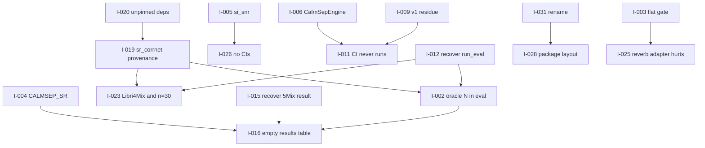

# Issue Ledger

**Purpose:** the master index of every independently actionable problem found during restoration.

**Status:** [AMBER] 34 tickets opened from the 2026-09-02 forensic pass. None closed.

**Last verified:** 2026-09-02

## Tag legend

**Type:** [TASK] [BUG] [ARCH] [DOC] [TEST] [REPRO] [DATA] [MODEL] [EXP] [SEC] [PERF] [CLEANUP] [DECISION] [RESEARCH]

**Priority:** [P0] blocks reliable operation or invalidates core results · [P1] blocks an important workflow · [P2] degrades quality, maintainability or reproducibility · [P3] improvement

**Lifecycle:** [OPEN] [INVESTIGATING] [READY] [IN_PROGRESS] [BLOCKED] [VERIFY] [CLOSED] [WONT_FIX] [DUPLICATE]

---

## Index

| ID | Type | Pri | Title | State | Evidence |
|---|---|---|---|---|---|
| I-001 | [SEC] | P0 | Live API credentials present in the supplied archive | [READY] | `CONTEXT.md` lines 9-15 |
| I-002 | [EXP] | P0 | Evaluation supplies the oracle speaker count, so count accuracy is never measured | [READY] | `eval/run_eval.py`, `NUMBERS.md` section 3.1 |
| I-003 | [MODEL] | P1 | Gate temperature 4.9872 flattens the sigmoid and disables condition routing | [READY] | `NUMBERS.md` section 3.4 |
| I-004 | [BUG] | P1 | `CALMSEP_SR` import fails; the constant is `CALMSEP_SAMPLE_RATE` | [READY] | import sweep |
| I-005 | [BUG] | P1 | `eval/matrix.py` imports `si_snr`; the function is `si_sdr` | [READY] | import sweep |
| I-006 | [BUG] | P1 | `CalmSepEngine` and `MockCalmSepWrapper` do not exist; the class is `CalmSepPipeline` | [READY] | import sweep, pytest collection |
| I-007 | [BUG] | P2 | `eval/ablation_gate.py` imports the non-existent `utils.logging` | [READY] | import sweep |
| I-008 | [BUG] | P2 | `train/calibrate.py` imports the non-existent `calibration.fit` | [READY] | import sweep |
| I-009 | [CLEANUP] | P2 | Three modules import v1 CA-MoSE code that no longer exists | [READY] | import sweep |
| I-010 | [BUG] | P2 | `scripts/slice_for_kaggle.py` runs work at import time and hard-codes a data path | [READY] | import sweep side effect |
| I-011 | [BUG] | P1 | CI triggers on `main` while the default branch is `master`, so CI has never run | [READY] | `.github/workflows/ci.yml` |
| I-012 | [TASK] | P1 | Recover the uncommitted `run_eval.py` improvements held only in the archive | [READY] | ZIP versus all 13 branches |
| I-013 | [TASK] | P1 | Recover the uncommitted `demo.py` transcription work held only in the archive | [READY] | ZIP versus all 13 branches |
| I-014 | [TASK] | P2 | Recover `modal_deploy.py`, which exists nowhere in Git history | [READY] | ZIP versus all 13 branches |
| I-015 | [EXP] | P1 | Recover the Libri5Mix raw result and the Stage 4 training log from the archive | [READY] | `calmsep_eval_5.json`, Stage 4 log |
| I-016 | [DOC] | P0 | README results table is empty while verified raw results exist | [READY] | README line 440, `calmsep_eval.json` |
| I-017 | [DOC] | P1 | README repository-structure section describes files that do not exist | [READY] | README lines 454-543 |
| I-018 | [DOC] | P1 | `pyproject.toml` still declares the abandoned v1 project | [READY] | `pyproject.toml` |
| I-019 | [REPRO] | P0 | The `sr_corrnet` backbone is an undeclared external dependency with no provenance | [BLOCKED] | `demo.py` line 24, import sweep |
| I-020 | [REPRO] | P1 | `requirements.txt` claims pinned versions but declares only lower bounds | [READY] | `requirements.txt` |
| I-021 | [DATA] | P2 | Two documents give different backbone parameter counts | [INVESTIGATING] | `CONTEXT.md` versus `NUMBERS.md` |
| I-022 | [DATA] | P2 | Two sources give different Stage 1 noise adapter epoch counts | [INVESTIGATING] | `NUMBERS.md` versus project memory note |
| I-023 | [EXP] | P1 | Libri4Mix was never evaluated and every split used only 30 samples | [BLOCKED] | `NUMBERS.md` section 2.2 |
| I-024 | [EXP] | P1 | The Stage 2 universal adapter was never trained | [BLOCKED] | `CONTEXT.md` checkpoint table |
| I-025 | [MODEL] | P1 | The Stage 1 reverb adapter degrades SI-SNR in every tested condition | [BLOCKED] | `eval/eval_outputs/eval.log` |
| I-026 | [TEST] | P2 | No confidence interval or significance test has been run on any result | [READY] | `eval/stats.py` exists and is never called |
| I-027 | [CLEANUP] | P3 | `.gitignore` repeats `outputs/` and `pretrained_models/` | [READY] | `.gitignore` |
| I-028 | [ARCH] | P2 | Flat top-level packages shadow standard library and third-party names | [READY] | repository root |
| I-029 | [DOC] | P2 | `configs/baseline.yaml` carries an unresolved data-root TODO | [READY] | `configs/baseline.yaml` line 4 |
| I-030 | [SEC] | P2 | The archive `memory/` directory holds unrelated personal notes | [READY] | `memory/` |
| I-031 | [DECISION] | P1 | The project name must change from CALM-Sep | [READY] | user instruction 2026-09-02 |
| I-032 | [PERF] | P3 | CPU inference takes 72 to 116 seconds per 6 second clip | [OPEN] | `NUMBERS.md` section 5.1 |
| I-033 | [CLEANUP] | P3 | `eval/eval_reverb_adapter.py` hard-codes Lightning AI paths for a banned platform | [READY] | file lines 12-51 |
| I-034 | [EXP] | P2 | Calibration ECE and reliability diagrams were never produced | [BLOCKED] | `NUMBERS.md` section 3.4 |

---

## Dependency map



Reading: I-019 is the deepest blocker. Nothing that needs a live backbone can be validated until the `sr_corrnet` dependency is packaged or vendored with a license. Everything on the left of the graph can proceed without it.

---

## Tickets

### I-001 [SEC] [P0] Live API credentials present in the supplied archive

**State:** [READY]

**Problem.** `CONTEXT.md` in the supplied archive lists working credentials in plain text: a Hugging Face read token, a Hugging Face write token for account `parv0511`, a Kaggle API token for account `rishig777`, and Modal token-id and token-secret values.

**Evidence.** `evidence/zip_extract/calm-sep-context-dump-v2/CONTEXT.md`, the numbered rules block. A scan of the repository itself for the same patterns returns nothing, so no credential has been committed.

**Impact.** The write token permits publishing to a Hugging Face account. The Kaggle token permits full API access to the account holding every project checkpoint and dataset. If `CONTEXT.md` is copied into the repository as documentation, the credentials become public.

**Suspected cause.** The context dump was generated for a private agent handoff and was never sanitised for redistribution.

**Scope.** Never copy `CONTEXT.md` into the repository in its current form. Any recovered content from it must be transcribed with the credential block removed. Add a credential-pattern pre-commit guard.

**Acceptance criteria.**
- [ ] No token pattern appears anywhere under version control.
- [ ] A pre-commit hook rejects the Hugging Face, Kaggle, and Modal token patterns.
- [ ] The project owner has been told to rotate all five credentials.

**Validation.** `grep -rE 'hf_[A-Za-z0-9]{20,}|KGAT_|ak-[A-Za-z0-9]{15,}|as-[A-Za-z0-9]{15,}'` over the tracked tree returns nothing, and the pre-commit hook fails on a seeded test file.

**Dependencies.** Gates I-030.

**Documentation.** `DATA_AND_MODEL_INVENTORY.md`.

---

### I-002 [EXP] [P0] Evaluation supplies the oracle speaker count, so count accuracy is never measured

**State:** [READY]

**Problem.** `eval/run_eval.py` derives the speaker count from the LibriMix directory name and passes it to both the baseline and the full system. Speaker count accuracy is the primary graded axis of the project, and no run has ever measured it.

**Evidence.** `NUMBERS.md` section 3.5 states this directly. `CONTEXT.md` names it as fatal flaw number one. Both `models/counting.py::count_from_attractors` and the wrapper's `n_active` output exist and are never called from the evaluation path.

**Impact.** Every published SI-SDRi number in `RESULTS.md` is conditioned on oracle cardinality. The headline contribution of the system is unmeasured.

**Suspected cause.** The evaluation harness was written to isolate separation quality and the oracle shortcut was never removed once counting became the primary axis.

**Scope.** Add a counting evaluation mode that lets the backbone attractor probabilities determine `N_hat`, record `N_hat` against `N_true`, and compute count accuracy and a confusion matrix using the existing `eval/metrics.py::count_accuracy` and `count_confusion_matrix`. Keep the oracle mode available behind a flag for the ablation.

**Acceptance criteria.**
- [ ] `run_eval.py` exposes an explicit oracle-count flag that defaults to off.
- [ ] Count accuracy and a confusion matrix appear in the result JSON.
- [ ] A unit test covers the non-oracle path with a stub backbone.
- [ ] Existing oracle numbers stay reproducible under the flag.

**Validation.** Unit test with a stubbed wrapper. A full run requires the Kaggle environment and is out of scope for this machine.

**Dependencies.** Depends on I-012. Blocked for end-to-end validation by I-019.

**Documentation.** `RESULTS.md`, `EXPERIMENT_REGISTRY.md`, `VALIDATION_MATRIX.md`.

---

### I-003 [MODEL] [P1] Gate temperature 4.9872 flattens the sigmoid and disables condition routing

**State:** [READY]

**Problem.** Stage 4c fitted a gate temperature of 4.9872 by golden-section search. `sigmoid(logit / 4.9872)` is close to linear near zero, so all three adapter gates sit near 0.5 for every input. The system is a fixed uniform blend of three adapters, not the condition-aware router the architecture claims.

**Evidence.** `NUMBERS.md` section 3.4 and the failure-mode table in section 5.4.

**Impact.** The central architectural claim is unsupported by the trained artifact. Any per-condition routing result would be meaningless at this temperature.

**Suspected cause.** Three candidates, none confirmed: the L1 sparsity penalty at 1e-3 drives the gate toward its uninformative mid-point; Stage 3 had too few epochs for the gate to separate conditions; the Stage 1 reverb adapter is itself harmful (I-025), so the calibration objective cannot reward selecting it.

**Scope.** Diagnose before changing. Record the gate output distribution across conditions from the existing checkpoint, then decide.

**Acceptance criteria.**
- [ ] Gate output distribution per condition is recorded from the Stage 4 checkpoint.
- [ ] A decision record explains which of the three causes the evidence supports.

**Validation.** Requires the Stage 4 checkpoint, which lives on Kaggle. Cannot be validated on this machine.

**Dependencies.** Related to I-025.

**Documentation.** `DECISIONS.md`, `LEARNINGS.md`.

---

### I-004 [BUG] [P1] `CALMSEP_SR` import fails; the constant is `CALMSEP_SAMPLE_RATE`

**State:** [READY]

**Problem.** `models/baseline_runner.py` and `scripts/run_baseline.py` both import `CALMSEP_SR` from `models.preprocess`. That module defines `CALMSEP_SAMPLE_RATE`.

**Evidence.**
```
ImportError: cannot import name 'CALMSEP_SR' from 'models.preprocess'
```
Both modules fail the import sweep. `models/preprocess.py` line 29 defines `CALMSEP_SAMPLE_RATE = 8_000`.

**Impact.** The baseline runner cannot be imported or executed. The `ca-mose-baseline` console script declared in `pyproject.toml` points at `scripts.run_baseline:main` and therefore cannot start.

**Suspected cause.** The constant was renamed in `preprocess.py` and the two consumers were never updated.

**Scope.** Update the two import sites. Do not reintroduce an alias.

**Acceptance criteria.**
- [ ] Both modules import cleanly.
- [ ] No behaviour change beyond the import.

**Validation.** `python -c "import models.baseline_runner, scripts.run_baseline"`.

---

### I-005 [BUG] [P1] `eval/matrix.py` imports `si_snr`; the function is `si_sdr`

**State:** [READY]

**Problem.** `eval/matrix.py` imports `si_snr` from `eval.metrics`, which exports `si_sdr` and `si_sdr_improvement`.

**Evidence.**
```
ImportError: cannot import name 'si_snr' from 'eval.metrics'
```

**Impact.** The full evaluation matrix, the artefact the README presents as the evaluation protocol, cannot be imported.

**Suspected cause.** Rename drift. SI-SNR and SI-SDR are the same quantity for zero-mean signals, and the metrics module settled on the SI-SDR name.

**Scope.** Correct the import and any call site. Confirm the call signature matches.

**Acceptance criteria.**
- [ ] `eval.matrix` imports cleanly.
- [ ] Every renamed call site uses the correct argument order.

**Validation.** `python -c "import eval.matrix"` plus a focused test.

---

### I-006 [BUG] [P1] `CalmSepEngine` and `MockCalmSepWrapper` do not exist; the class is `CalmSepPipeline`

**State:** [READY]

**Problem.** `eval/baselines.py`, `tests/principle2_test.py`, and `tests/smoke_test.py` import `CalmSepEngine` and `MockCalmSepWrapper` from `pipeline.infer`. That module defines `CalmSepPipeline`, `InferenceCfg`, and `PipelineResult`, and no mock wrapper.

**Evidence.**
```
ImportError: cannot import name 'CalmSepEngine' from 'pipeline.infer'
```
Two of the four tests the README calls blocking or smoke tests fail at collection because of this.

**Impact.** The end-to-end smoke test and the "not worse than base on clean" principle test have not run since the rename. The README presents both as gates.

**Suspected cause.** The pipeline class was renamed and the test mock was dropped without updating consumers.

**Scope.** Rename the import sites. Reconstruct `MockCalmSepWrapper` as a test fixture if the tests need it, keeping it in the test tree rather than in `pipeline`.

**Acceptance criteria.**
- [ ] All three modules import cleanly.
- [ ] `tests/principle2_test.py` and `tests/smoke_test.py` collect and pass, or are explicitly skipped with a recorded reason.

**Validation.** `pytest tests/principle2_test.py tests/smoke_test.py -v`.

**Dependencies.** Feeds I-011.

---

### I-007 [BUG] [P2] `eval/ablation_gate.py` imports the non-existent `utils.logging`

**State:** [READY]

**Problem.** `eval/ablation_gate.py` imports `utils.logging`. The `utils` package contains only `config.py` and `hashing.py`.

**Evidence.**
```
ModuleNotFoundError: No module named 'utils.logging'
```

**Impact.** The gate ablation cannot run. That ablation is one of the five rows in the README results table.

**Suspected cause.** A logging helper was planned or removed and the import survived.

**Scope.** Either add the missing helper or use the standard library `logging` module directly, matching whatever the rest of the codebase does.

**Acceptance criteria.**
- [ ] `eval.ablation_gate` imports cleanly.
- [ ] Logging behaviour matches the convention used by `eval/run_eval.py`.

**Validation.** `python -c "import eval.ablation_gate"`.

---

### I-008 [BUG] [P2] `train/calibrate.py` imports the non-existent `calibration.fit`

**State:** [READY]

**Problem.** `train/calibrate.py` imports `calibration.fit`. The `calibration` package contains `temperature.py`, `confidence.py`, `completeness.py`, and `ood.py`.

**Evidence.**
```
ModuleNotFoundError: No module named 'calibration.fit'
```

**Impact.** The standalone calibration entry point cannot run. Stage 4c has its own script, `train/stage4c_calib.py`, which imports cleanly, so this may be a superseded duplicate.

**Suspected cause.** Either a missing module or a duplicate that `stage4c_calib.py` replaced.

**Scope.** Determine whether `train/calibrate.py` is superseded before repairing it. Classify it under Rule 13 and record the classification.

**Acceptance criteria.**
- [ ] The file is classified as [SUPERSEDED] or repaired.
- [ ] The decision is recorded.

**Validation.** Import check if repaired; a decision record if removed.

---

### I-009 [CLEANUP] [P2] Three modules import v1 CA-MoSE code that no longer exists

**State:** [READY]

**Problem.** Three modules still reference the abandoned v1 cascade architecture:

| Module | Missing import | v1 concept |
|---|---|---|
| `train/cached_dataset.py` | `train.trainer` | v1 trainer |
| `tests/test_cached_dataset.py` | `models.cascade_gate` | v1 cascade gate |
| `scripts/build_train_cache.py` | `models.experts.mossformer2` | v1 cheap expert |

**Evidence.** Import sweep and pytest collection. `docs/PROJECT_HISTORY.md` records that the v2 plan explicitly banned copying v1 model code and salvaged only the data and evaluation plumbing.

**Impact.** 175 tests in `test_cached_dataset.py` never run. Two production modules cannot be imported. Their genuine v2 value is unclear until they are read.

**Suspected cause.** The v1 to v2 migration salvaged the caching layer but not its dependencies.

**Scope.** Read all three end to end. Classify each part as [DEAD], [SUPERSEDED], or still needed. Repair what v2 uses and delete only what is provably unused, per Rule 13.

**Acceptance criteria.**
- [ ] Each of the three files carries a recorded classification.
- [ ] No module in the tree imports v1-only code.
- [ ] `tests/test_cached_dataset.py` collects, or is deleted with a recorded reason.

**Validation.** Import sweep returns zero v1 references; pytest collects with no errors.

---

### I-010 [BUG] [P2] `scripts/slice_for_kaggle.py` runs work at import time and hard-codes a data path

**State:** [READY]

**Problem.** The script has no `if __name__ == "__main__"` guard. Importing it starts slicing work immediately. It then fails on a hard-coded relative path.

**Evidence.** During the import sweep the module printed `=== [1/4] Slicing train-clean-100 ===` and `0 speakers, 0 files copied` before raising:
```
FileNotFoundError: [Errno 2] No such file or directory: 'data\\calmsep-8k\\librispeech-8k\\manifest_8k.json'
```

**Impact.** Any tool that imports the package tree, including static analysis and test collection helpers, triggers filesystem work. On a machine that does hold the data, an accidental import would begin copying files.

**Suspected cause.** Written as a one-off script and never converted to a module.

**Scope.** Add a `main()` and a `__main__` guard. Move the data root to a command-line argument with the current value as the default.

**Acceptance criteria.**
- [ ] Importing the module has no side effect.
- [ ] The data root is a documented argument.

**Validation.** `python -c "import scripts.slice_for_kaggle"` completes silently.

---

### I-011 [BUG] [P1] CI triggers on `main` while the default branch is `master`, so CI has never run

**State:** [READY]

**Problem.** `.github/workflows/ci.yml` triggers on push and pull request against `main`. The repository default branch is `master`. No workflow run has ever been triggered.

**Evidence.** Workflow file `on.push.branches: [main]`; `git branch -a` shows `origin/HEAD -> origin/master` and no `main`.

**Impact.** Lint and tests have never gated a change. This is the direct reason the three broken test modules and the ten broken imports survived on the default branch.

**Suspected cause.** The workflow was copied from a template that assumed `main`.

**Scope.** Correct the branch names. Do not enable a gate that would fail on arrival: sequence this after I-004 through I-010 so the first run is green.

**Acceptance criteria.**
- [ ] The workflow triggers on the actual default branch.
- [ ] The first triggered run passes lint and tests.

**Validation.** A workflow run appears and succeeds.

**Dependencies.** Depends on I-004, I-005, I-006, I-007, I-009.

---

### I-012 [TASK] [P1] Recover the uncommitted `run_eval.py` improvements held only in the archive

**State:** [READY]

**Problem.** The archive holds a version of `eval/run_eval.py` that is strictly ahead of every branch in the repository and was never committed.

**Evidence.** `git log --all -- eval/run_eval.py` shows one commit, `6ff3ec3` on 2026-07-23. The archive copy, stamped 2026-09-01, adds five distinct capabilities against it. Content-hash comparison against all thirteen branches finds no match.

The recovered work:

| Addition | Why it matters |
|---|---|
| `Libri4Mix` and `Libri5Mix` in `_LIBRIMIX_SPLITS` | the committed version can evaluate only 2 and 3 speakers |
| `_load_universal_ckpt` | loads a Stage 2 checkpoint from a file or a PyTorch zip directory, with deterministic zip timestamps |
| `--universal-ckpt` argument and adapter tensor loading | needed for the Stage 2 ablation |
| Explicit device placement for `engine.stft` and `engine.istft` | mirrors `stage1_single.py` and prevents a device mismatch |
| Split auto-detection and a `--splits` argument | the committed version fails on a partial LibriMix tree |
| `delta_si_sdr` in the result payload | present in the recovered Libri5Mix artifact and absent from the older schema |

**Impact.** Without this, the Libri5Mix result recorded in the archive cannot be reproduced by the committed code, and the Stage 2 ablation has no loader.

**Suspected cause.** Work done locally after the last commit, on a machine that was not pushed from.

**Scope.** Apply the archive version as a single scoped commit with the provenance recorded in the commit body. Do not mix it with the I-002 oracle fix.

**Acceptance criteria.**
- [ ] `eval/run_eval.py` matches the archive content modulo line endings.
- [ ] The module imports cleanly.
- [ ] Provenance is recorded in `PROJECT_INVENTORY.md`.

**Validation.** `python -c "import eval.run_eval"` and a content hash comparison against the archive.

---

### I-013 [TASK] [P1] Recover the uncommitted `demo.py` transcription work held only in the archive

**State:** [READY]

**Problem.** The archive `demo.py` adds 226 lines against 12 removed, relative to the committed version, and exists in no branch.

**Evidence.** Content-hash comparison against all thirteen branches finds no match. The diff adds `_transcribe_to_html`, Whisper invocation with word timestamps at 16 kHz, a capture-phase JavaScript play handler, and per-stream transcript wiring for the mixture, the baseline outputs, and the adapted outputs.

**Impact.** The demonstration described in `CONTEXT.md` cannot be reproduced from the repository.

**Suspected cause.** Same as I-012.

**Scope.** Apply the archive version as one commit. Add `openai-whisper` to the dependency set in the same change, since the code cannot run without it. That dependency addition is the one exception to keeping this commit narrow, because leaving it out would commit code that is knowingly unrunnable.

**Acceptance criteria.**
- [ ] `demo.py` matches the archive content modulo line endings.
- [ ] `openai-whisper` is declared.
- [ ] The module imports, or fails only on the known `sr_corrnet` dependency recorded in I-019.

**Validation.** Import check and a content hash comparison.

**Dependencies.** Interacts with I-020.

---

### I-014 [TASK] [P2] Recover `modal_deploy.py`, which exists nowhere in Git history

**State:** [READY]

**Problem.** The archive contains `src/modal_deploy.py`. No path resembling it appears in any commit on any branch.

**Evidence.** `git log --all -- modal_deploy.py src/modal_deploy.py` returns nothing.

**Impact.** The only record of a working deployment configuration would be lost with the archive. It also documents a working dependency pin set: torch 2.5.1, torchaudio 2.5.1, numpy below 2, asteroid 0.7.0, speechbrain 1.0.0, gradio 6.20.0. That pin set is direct evidence for I-020.

**Caveat.** `CONTEXT.md` records that the Modal workspace was disabled on 2026-09-01 after the free credit was exhausted. The file is preserved as a working reference, not as a live deployment path. It also references `Path.home() / "Downloads/SR_CorrNet_local_mixboth/future_work/sr_corrnet"`, which is the machine-specific path in I-019.

**Scope.** Commit the file with a header comment recording that the workspace is disabled and that the path is machine-specific. Do not present it as a supported deployment.

**Acceptance criteria.**
- [ ] The file is under version control with its status recorded.
- [ ] Its pin set is transcribed into I-020's analysis.

**Validation.** File present; provenance recorded in `PROJECT_INVENTORY.md`.

---

### I-015 [EXP] [P1] Recover the Libri5Mix raw result and the Stage 4 training log from the archive

**State:** [READY]

**Problem.** Two raw evidence artifacts exist only in the archive: `eval_outputs/calmsep_eval_5.json` and `training_logs/calm-sep-stage-4-joint-training.log`.

**Evidence.** `eval/eval_outputs/` in the repository holds `calmsep_eval.json` (Libri2Mix and Libri3Mix) and `eval.log`, both byte-identical to their archive counterparts. The Libri5Mix result and the Stage 4 log have no counterpart.

The Stage 4 log independently confirms the loss curve quoted in `NUMBERS.md` section 3.3, epoch by epoch, with wall times near 2,930 seconds per epoch on a Tesla T4, ending at epoch 14 with loss 8.6809 and a saved best checkpoint holding 222 adapter tensors. This makes the loss curve [VERIFIED] rather than [CLAIMED].

**Impact.** Without these files, the Libri5Mix row of the results table and the entire Stage 4 training record have no raw backing.

**Scope.** Commit both under `eval/eval_outputs/` and a new `training_logs/` respectively. Note that `.gitignore` currently ignores nothing that would block them, but confirm before committing.

**Acceptance criteria.**
- [ ] Both files are tracked.
- [ ] `RESULTS.md` cites them.
- [ ] `EXPERIMENT_REGISTRY.md` links each experiment to its raw artifact.

**Validation.** File hashes match the archive.

---

### I-016 [DOC] [P0] README results table is empty while verified raw results exist

**State:** [READY]

**Problem.** The README results section says results will be populated as training stages complete, and presents a table of five systems with every cell showing an em dash. Raw result artifacts for three of the four LibriMix splits exist and are internally consistent with `NUMBERS.md`.

**Evidence.** README line 440 onward. `eval/eval_outputs/calmsep_eval.json` holds Libri2Mix and Libri3Mix. The archive holds Libri5Mix.

**Impact.** A reader concludes the project produced nothing. The opposite is true: it produced a measured and reproducible improvement over its own baseline, with a specific and disclosed methodological limitation.

**Scope.** Populate the table from the raw artifacts only. Label every number with its sample size and with the oracle-count caveat from I-002. Do not populate rows for which no raw artifact exists: the universal adapter, the uniform blend, and the oracle gating rows stay empty and are marked as not run.

**Acceptance criteria.**
- [ ] Every populated cell traces to a raw artifact path.
- [ ] The oracle-count caveat sits next to the numbers, not in a footnote.
- [ ] Rows with no evidence are marked as not run.

**Validation.** Each number in the README is matched against the JSON by hand and the check is recorded in `VALIDATION_MATRIX.md`.

**Dependencies.** Depends on I-015 and I-002.

---

### I-017 [DOC] [P1] README repository-structure section describes files that do not exist

**State:** [READY]

**Problem.** The repository-structure block lists a test suite that is not the one in the tree, and omits directories that are.

**Evidence.** The README lists `tests/attractor_test.py`, `tests/e0_hook_test.py`, `tests/principle2_test.py`, and `tests/smoke_test.py` as the test suite. Those four files do exist, but the tree contains 51 test modules. The block omits `align/` detail, `utils/`, `infer.py`, `train/stage4b_band.py`, `train/stage4b_band_oracle.py`, `train/stage4c_calib.py`, and `train/cached_dataset.py`. It lists `data/fixed_eval/` as containing seeded evaluation sets, which is accurate.

**Impact.** A new engineer following the README builds a wrong mental model of the tree.

**Scope.** Regenerate the structure block from the actual tree. Keep the per-file annotations, which are genuinely useful, and correct the ones that no longer describe the file.

**Acceptance criteria.**
- [ ] Every path in the block exists.
- [ ] Every top-level package appears.
- [ ] The annotations match what the files do.

**Validation.** A script that extracts paths from the README block and checks each against the tree.

---

### I-018 [DOC] [P1] `pyproject.toml` still declares the abandoned v1 project

**State:** [READY]

**Problem.** The project metadata describes CA-MoSE, the architecture abandoned on 2026-07-16.

**Evidence.**
```toml
name = "ca-mose"
description = "Condition-Aware Mixture-of-Separation-Experts for multi-speaker speech separation"
[project.scripts]
ca-mose-baseline = "scripts.run_baseline:main"
```
`docs/PROJECT_HISTORY.md` records the abandonment and the reason.

**Impact.** `pip install -e .` installs a package under the wrong name. The declared console script targets a module that does not import (I-004). The `experts` optional dependency on `clearvoice` exists only for the v1 cheap expert.

**Scope.** Rewrite the project metadata for the current system under the new name from I-031. Remove the v1 console script and the `experts` extra unless a v2 consumer is found.

**Acceptance criteria.**
- [ ] Name, description, and entry points describe the current system.
- [ ] Every declared console script imports and runs `--help`.
- [ ] The v1 `experts` extra is removed or justified.

**Validation.** `pip install -e .` then invoke each console script with `--help`.

**Dependencies.** Depends on I-031 and I-004.

---

### I-019 [REPRO] [P0] The `sr_corrnet` backbone is an undeclared external dependency with no provenance

**State:** [BLOCKED]

**Problem.** The frozen backbone that the entire architecture wraps is a Python package named `sr_corrnet` that is not vendored, not declared in any dependency file, and not installable from any public index. The only recorded location is a directory under a personal Downloads folder.

**Evidence.**
```python
# demo.py line 24
_SR_CORRNET_SRC = Path.home() / "Downloads/SR_CorrNet_local_mixboth/future_work"
```
`CONTEXT.md` describes it as a 596 KB Python package that must be on `sys.path`. `eval/eval_reverb_adapter.py` searches two Lightning AI paths for it. The Stage 4 Kaggle log shows it being copied from a private Kaggle dataset, `rishig777/calmsep-model/calmsep-tiny/sr_corrnet_src`. The import sweep confirms it is absent here.

**Impact.** This is the single hardest blocker on reproducibility. Nothing that touches the backbone can be imported, run, tested end to end, or reproduced by anyone who does not already hold that directory. The model weights are public on Hugging Face; the loader code is not.

**Suspected cause.** The package came from a research release that was copied locally rather than pinned.

**Scope.** Establish the upstream source and its license before doing anything else. Then choose one of: declare it as a pinned Git or archive dependency; vendor it under a clearly marked third-party directory with its license; or write a thin loader against the public weights. Each option has different license consequences, so this needs a decision record.

**Acceptance criteria.**
- [ ] Upstream source and license are identified and recorded.
- [ ] A decision record selects an approach and states the license consequence.
- [ ] A clean environment can obtain the backbone from a documented command.

**Validation.** From a fresh virtual environment, a documented command sequence makes `import sr_corrnet` succeed.

**Blocked by:** the upstream identity is not determinable from the archive or the repository. This needs the project owner.

**Documentation.** `DATA_AND_MODEL_INVENTORY.md`, `REPRODUCTION.md`, `DECISIONS.md`.

---

### I-020 [REPRO] [P1] `requirements.txt` claims pinned versions but declares only lower bounds

**State:** [READY]

**Problem.** The file header says the dependencies are pinned for reproducible installs. Every line is a lower bound.

**Evidence.**
```
# Pinned core dependencies for reproducible installs.
numpy>=1.24
torch>=2.1
```
Meanwhile the recovered `modal_deploy.py` (I-014) carries the pin set that actually worked in deployment: `numpy>=1.24,<2`, `torch==2.5.1`, `torchaudio==2.5.1`, `asteroid==0.7.0`, `speechbrain==1.0.0`, `gradio==6.20.0`, plus `openai-whisper`, `ffmpeg-python`, `librosa`, `loguru`, and `rotary-embedding-torch`.

Five of those runtime dependencies are missing from `requirements.txt` entirely: `openai-whisper`, `ffmpeg-python`, `librosa`, `loguru`, and `rotary-embedding-torch`. The last two are needed by `sr_corrnet` itself, which is why the Kaggle notebooks build stubs for them.

The numpy upper bound matters: `CONTEXT.md` records five Modal deployment iterations spent on NumPy 2.x incompatibility.

**Impact.** A fresh install resolves to current versions and will not match any environment in which a result was produced.

**Scope.** Produce a real constraint file from the `modal_deploy.py` evidence and the Kaggle notebook environments. Keep `pyproject.toml` bounds loose for library use and pin the reproduction environment separately, so the two purposes do not fight.

**Acceptance criteria.**
- [ ] A pinned constraint file exists and states which environment it reproduces.
- [ ] Every runtime import in the tree has a declared dependency.
- [ ] The header no longer contradicts the content.

**Validation.** A dependency scan that maps every third-party import in the tree to a declared requirement.

**Dependencies.** Depends on I-014.

---

### I-021 [DATA] [P2] Two documents give different backbone parameter counts

**State:** [INVESTIGATING]

**Problem.** `CONTEXT.md` states the backbone has 7.4M parameters. `NUMBERS.md` states 13,270,124. Both were written on 2026-09-01 by the same author about the same checkpoint.

**Evidence.** `CONTEXT.md`, the section on the core backbone. `NUMBERS.md` section 1.1 and the totals in section 1.7, which derive the "3.32% of backbone" figure from 13,270,124.

**Impact.** The parameter-efficiency claim is the headline argument for the adapter design. Which denominator is correct changes the claim from 5.9% to 3.32%.

**Scope.** Resolve by loading the public checkpoint and counting. Correct whichever document is wrong and record which one was authoritative.

**Acceptance criteria.**
- [ ] The count is measured, not quoted.
- [ ] Both documents agree with the measurement.
- [ ] Every derived percentage is recomputed.

**Validation.** A script that loads the Hugging Face checkpoint and prints the parameter count. Requires network access and roughly 50 MB of download; it does not require a GPU, so it can run on this machine once the loader from I-019 is available.

**Dependencies.** Depends on I-019.

---

### I-022 [DATA] [P2] Two sources give different Stage 1 noise adapter epoch counts

**State:** [INVESTIGATING]

**Problem.** `NUMBERS.md` records `best_noise.pt` at roughly 40 epochs. The project memory note dated 2026-07-18 records the local `best_noise.pt` as an epoch-2 artifact and states that all three adapters needed retraining.

**Evidence.** `NUMBERS.md` section 6. `evidence/zip_extract/calm-sep-context-dump-v2/memory/speech-sep-v2.md`.

**Impact.** The Stage 4 joint result was produced from Stage 1 checkpoints. If one of them was an epoch-2 artifact, the Stage 4 result rests on a partially trained input, and the reverb finding in I-025 may have the same explanation.

**Note.** The dates are compatible with both being true: the memory note is from 2026-07-18, before the retraining run described in the same note, and `NUMBERS.md` is from 2026-09-01. The Stage 4 log of 2026-07-21 shows `best_noise.pt` at 433.1 KB, the same size as the other two adapters, which is consistent with a complete adapter but says nothing about epoch count.

**Scope.** Read the epoch field from the checkpoint on Kaggle. Record the answer.

**Acceptance criteria.**
- [ ] The epoch recorded inside each Stage 1 checkpoint is read and written down.
- [ ] `DATA_AND_MODEL_INVENTORY.md` carries the measured value.

**Validation.** Requires Kaggle access. Not possible on this machine.

---

### I-023 [EXP] [P1] Libri4Mix was never evaluated and every split used only 30 samples

**State:** [BLOCKED]

**Problem.** Three of four required splits were evaluated, each on 30 test clips out of roughly 3,000 available.

**Evidence.** `NUMBERS.md` section 2.2 and the results table. The committed `run_eval.py` cannot even enumerate Libri4Mix; the recovered version in I-012 can.

**Impact.** At n=30 the reported deltas of +1.76, +1.73, and +0.62 dB have no stated uncertainty. The +0.62 dB Libri5Mix delta in particular could plausibly be noise. Without Libri4Mix the speaker-count sweep has a hole in the middle.

**Scope.** Rerun on all four splits at a larger n once the count fix from I-002 is in. Requires GPU compute and the LibriMix test set.

**Acceptance criteria.**
- [ ] All four splits evaluated.
- [ ] n at least 300 per split.
- [ ] Bootstrap confidence intervals reported (see I-026).

**Validation.** Not possible on this machine. Requires the Kaggle environment.

**Dependencies.** Depends on I-002, I-012, I-019.

---

### I-024 [EXP] [P1] The Stage 2 universal adapter was never trained

**State:** [BLOCKED]

**Problem.** The architecture uses three condition-specific adapters. The stated justification for three rather than one is the Stage 2 universal-adapter ablation, which was never run.

**Evidence.** `CONTEXT.md`: no `best_universal.pt` exists. `train/stage2_universal.py` exists and imports cleanly. The README results table has a Universal adapter row, unpopulated. The recovered `run_eval.py` from I-012 contains the loader for exactly this checkpoint, which indicates the run was intended and prepared for.

**Impact.** The central design choice of the system is unjustified by evidence.

**Scope.** Train Stage 2 and run the ablation. Requires GPU compute.

**Acceptance criteria.**
- [ ] `best_universal.pt` exists with a recorded config, seed, and log.
- [ ] The ablation row in the results table is populated from a raw artifact.

**Validation.** Not possible on this machine.

**Dependencies.** Depends on I-012 for the loader.

---

### I-025 [MODEL] [P1] The Stage 1 reverb adapter degrades SI-SNR in every tested condition

**State:** [BLOCKED]

**Problem.** The reverb adapter, trained for 40 epochs, makes output worse than the frozen backbone in all three tested conditions.

**Evidence.** `eval/eval_outputs/eval.log`, 2026-07-17, one 2-speaker clip at T60 0.46 s:

| Condition | Base SI-SNR | Adapted SI-SNR | Delta |
|---|---:|---:|---:|
| Clean, anechoic | 18.61 dB | 18.17 dB | -0.44 dB |
| Reverb mild | -30.89 dB | -30.96 dB | -0.07 dB |
| Reverb strong | -32.83 dB | -35.64 dB | -2.81 dB |

The same log confirms two useful negatives: with the gate at zero the adapted model matches the base model to a maximum difference of 0.000000, so the injection mechanism is correct, and the LoRA A matrices have a mean norm of 1.5813, so weights were genuinely learned. The defect is in the training objective, not in the plumbing.

**Impact.** One of three adapters is actively harmful. Since I-003 shows the gate blends all three near 0.5, this adapter is contributing its degradation to every output.

**Suspected cause.** Three candidates recorded by the author, in the order the evidence supports them: the training target used the wet reverberant reference rather than the anechoic reference, so the adapter was taught to reproduce reverberation rather than remove it; rank 8 may be too small; 500 samples per epoch may be too few.

The wet-reference hypothesis is the strongest, because it explains the sign of the result rather than only its magnitude.

**Scope.** Confirm the reference signal used by the Stage 1 reverb training path by reading `train/stage1_single.py` and `data/degradations.py` end to end. This part needs no compute and can be done here. Retraining does need compute.

**Acceptance criteria.**
- [ ] The reference signal used for reverb training is identified in code and written down.
- [ ] A decision record states whether the target was wrong.
- [ ] If it was wrong, a fix is implemented and a retraining ticket is opened.

**Validation.** Code reading for the diagnosis. Retraining validation is out of scope for this machine.

**Dependencies.** Feeds I-003.

---

### I-026 [TEST] [P2] No confidence interval or significance test has been run on any result

**State:** [READY]

**Problem.** `eval/stats.py` implements bootstrap BCa confidence intervals and a Wilcoxon signed-rank test. Neither has been applied to any recorded result.

**Evidence.** `CONTEXT.md` code map: "stats.py, Bootstrap CIs (BCa), Wilcoxon, code exists, never called on results". No confidence interval appears in `calmsep_eval.json`, `calmsep_eval_5.json`, or `NUMBERS.md`. The README states statistical rules that were never applied.

**Impact.** At n=30, three point deltas are reported with no uncertainty. The README declares a statistical protocol that the results do not follow.

**Scope.** Wire `stats.py` into the evaluation output so per-sample scores are retained and confidence intervals are computed alongside the means. The current result JSON keeps only aggregates, so per-sample retention has to come first.

**Acceptance criteria.**
- [ ] Per-sample SI-SDR values are written to the result artifact.
- [ ] Bootstrap confidence intervals and the Wilcoxon result are computed and stored.
- [ ] A unit test covers the statistics path on synthetic data.

**Validation.** The unit test runs on this machine. Applying it to real results needs a rerun.

**Dependencies.** Feeds I-023.

---

### I-027 [CLEANUP] [P3] `.gitignore` repeats `outputs/` and `pretrained_models/`

**State:** [READY]

**Problem.** The last lines of `.gitignore` repeat `outputs/` three times and `pretrained_models/` twice.

**Evidence.** `.gitignore`, final block.

**Impact.** Cosmetic. It signals three separate hurried appends and is worth fixing while the file is being reviewed for I-015.

**Scope.** Deduplicate. While there, confirm that the `*.wav` rule does not conflict with tracking the evaluation artifacts from I-015, and that `data/fixed_eval/` stays tracked.

**Acceptance criteria.**
- [ ] No duplicate entries.
- [ ] Currently tracked files stay tracked, verified with `git status`.

**Validation.** `git status --porcelain` is empty after the edit.

---

### I-028 [ARCH] [P2] Flat top-level packages shadow standard library and third-party names

**State:** [READY]

**Problem.** The repository puts eleven packages at the top level, including `eval`, `data`, `demo`, `schemas`, `align`, `pipeline`, and `utils`. `eval` shadows nothing in the standard library as a module name but reads as the builtin; `utils`, `schemas`, `data`, and `align` are common enough to collide with installed distributions on `sys.path`.

There is also a name collision inside the repository: `demo.py` and the `demo/` package both exist at the root. Which one `import demo` resolves to depends on `sys.path` ordering.

**Evidence.** Repository root listing. `pyproject.toml` uses `[tool.setuptools.packages.find]` with `where = ["."]` and an explicit include list, which is the workaround for exactly this problem.

**Impact.** Installed alongside other packages, imports may resolve to the wrong module. The `demo.py` and `demo/` collision is a live ambiguity today.

**Scope.** Move to a `src/<package>/` layout under the new project name from I-031, with the current top-level packages becoming subpackages. This touches every import in 93 modules and 51 test files, so it must be mechanical, done in one commit, and validated by the full test suite before and after.

**Acceptance criteria.**
- [ ] One importable top-level package.
- [ ] The `demo.py` and `demo/` ambiguity is gone.
- [ ] The full test suite result is identical before and after.
- [ ] `pyproject.toml` no longer needs an explicit include list.

**Validation.** `pytest tests/ -q` gives the same pass, skip, and fail counts as the recorded baseline.

**Dependencies.** Depends on I-031. Should follow I-004 through I-010 so the move does not carry broken imports across.

---

### I-029 [DOC] [P2] `configs/baseline.yaml` carries an unresolved data-root TODO

**State:** [READY]

**Problem.**
```yaml
data_root: "data/raw/LibriMix"   # TODO: set after Dev A downloads Libri3Mix
```
The comment refers to a task assignment from the three-developer phase in early July.

**Evidence.** `configs/baseline.yaml` line 4. `data/raw/` is in `.gitignore`, so the path never exists in a fresh clone.

**Impact.** The baseline config points at a path that is never populated by any documented step.

**Scope.** Replace the TODO with either a documented default and a setup step in `REPRODUCTION.md`, or an explicit required-argument error.

**Acceptance criteria.**
- [ ] No TODO remains.
- [ ] The path is either produced by a documented command or clearly required from the user.

**Validation.** Load the config in a fresh clone and confirm the failure mode is a clear message rather than a silent wrong path.

---

### I-030 [SEC] [P2] The archive `memory/` directory holds unrelated personal notes

**State:** [READY]

**Problem.** The archive contains twelve agent memory files. Eleven describe projects unrelated to this one, including named third parties, other people's internship deliverables, a commercial venture, and business details of a named company.

**Evidence.** `evidence/zip_extract/calm-sep-context-dump-v2/memory/`. Only `speech-sep-v2.md` concerns this project.

**Impact.** If the archive is copied wholesale into the repository, unrelated private information about named third parties becomes public.

**Scope.** Keep `memory/` in the evidence tree only. Transcribe the project-relevant facts from `speech-sep-v2.md` into `APPROACH_EVOLUTION.md` and `DATA_AND_MODEL_INVENTORY.md` with attribution to the evidence path. Never copy the directory into the repository.

**Acceptance criteria.**
- [ ] No file from `memory/` is tracked.
- [ ] The project-relevant facts are transcribed with a citation.

**Validation.** `git ls-files | grep memory/` returns nothing.

**Dependencies.** Related to I-001.

---

### I-031 [DECISION] [P1] The project name must change from CALM-Sep

**State:** [READY]

**Problem.** The project owner has asked for a new name. CALM-Sep also carries a naming inconsistency: `pyproject.toml` still says `ca-mose`, so the tree currently answers to two dead names at once.

**Evidence.** User instruction, 2026-09-02. `pyproject.toml` (see I-018).

**Scope.** Select a name, record the reasoning in `DECISIONS.md`, then apply it in one mechanical pass across documentation, package metadata, and identifiers. Keep a short note in the README recording the former name so that the existing artifacts, checkpoints named `calmsep_*`, and Kaggle datasets remain findable.

**Constraint.** Checkpoint filenames and Kaggle dataset slugs contain `calmsep`. Those are external artifacts that cannot be renamed from here. The rename must not silently break the paths that load them.

**Acceptance criteria.**
- [ ] A name is selected with recorded reasoning.
- [ ] Documentation and package metadata use it consistently.
- [ ] External artifact names are left intact and the mapping is documented.
- [ ] The test suite result is unchanged.

**Validation.** `pytest tests/ -q` matches the baseline; a grep for the old name returns only the deliberate historical references.

**Dependencies.** Blocks I-018 and I-028.

---

### I-032 [PERF] [P3] CPU inference takes 72 to 116 seconds per 6 second clip

**State:** [OPEN]

**Problem.** Measured wall time is 12 to 20 times slower than real time on CPU.

**Evidence.** `NUMBERS.md` section 5.1, derived from the recorded evaluation wall times: 2,166.7 s for 30 Libri2Mix clips, 2,912.6 s for 30 Libri3Mix, 3,480.5 s for 30 Libri5Mix.

**Impact.** It is why n=30 rather than n=300. Compute cost is the direct cause of the evidence gap in I-023.

**Note.** The backbone dominates and is frozen, so most of this is not addressable without changing the backbone. Chunk batching across the evaluation loop is the plausible lever. This is deliberately P3: it is not on the critical path to a trustworthy result, only to a cheaper one.

**Scope.** Not scoped yet. Profile before proposing anything.

---

### I-033 [CLEANUP] [P3] `eval/eval_reverb_adapter.py` hard-codes Lightning AI paths for a banned platform

**State:** [READY]

**Problem.** The module's docstring and its `sys.path` search hard-code `/teamspace/studios/this_studio/...`, which is a Lightning AI workspace. `CONTEXT.md` records Lightning AI as permanently banned from the project after the account was deleted on 2026-07-18.

**Evidence.** `eval/eval_reverb_adapter.py` lines 12 to 51. `CONTEXT.md`, permanent rule 1. `docs/PROJECT_HISTORY.md` records the ban and its reason.

**Impact.** Low. The script still fails first on the `sr_corrnet` import (I-019). But it is the script that produced the reverb diagnostic in I-025, so it has real evidential value and should not simply be deleted.

**Scope.** Replace the hard-coded paths with arguments. Keep the file, since it is the only reproduction path for the I-025 finding. Record in its docstring that the original run was on a platform that is no longer used.

**Acceptance criteria.**
- [ ] No `/teamspace/` path remains.
- [ ] The original run environment is recorded as history rather than as an instruction.

**Validation.** Grep returns no `/teamspace/`.

---

### I-034 [EXP] [P2] Calibration ECE and reliability diagrams were never produced

**State:** [BLOCKED]

**Problem.** Four calibration components are implemented and one is fitted. None has a measured calibration error.

**Evidence.** `NUMBERS.md` section 3.4 marks ECE, per-stream confidence accuracy, and completeness probability accuracy all as not measured. `calibration/temperature.py`, `confidence.py`, `completeness.py`, and `ood.py` all import cleanly and are unit-tested.

**Impact.** The problem statement requires calibrated confidence. The system produces confidence values whose calibration is unknown, which is weaker than producing none.

**Scope.** Compute ECE and a reliability diagram over a held-out set. Needs the Stage 4 checkpoint and evaluation data.

**Acceptance criteria.**
- [ ] ECE is computed and stored with its bin count and sample size.
- [ ] A reliability diagram is produced as a tracked artifact.

**Validation.** Not possible on this machine.

**Dependencies.** Depends on I-019 and I-023.

---

## Ticket protocol

Each independent problem gets its own ticket. Status moves OPEN to INVESTIGATING to READY to IN_PROGRESS to VERIFY to CLOSED. A ticket closes on validation evidence, not on a code change. Every implementation commit references its ticket ID.
