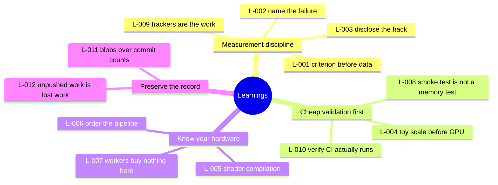

# Learnings

**Purpose:** durable lessons, each tied to the evidence that produced it.

**Status:** [GREEN] Twelve records. Nine inherited from the project's own history, three from the restoration.

**Last verified:** 2026-09-02

**Inclusion rule:** a learning appears here only if something measurable happened. Opinions do not qualify.

---

## L-001: A criterion written before the first measurement is a wish

**Context.** v1 defined a milestone gate named `cascade_beats_single_expert` before any number existed.

**Observation.** When the cascade at full escalation exactly equalled SR-CorrNet at 16.22 dB, that briefly read as success.

**Evidence.** `docs/PROJECT_HISTORY.md` part 1, `NUMBERS.md` section 3.2.

**Root cause.** The criterion encoded a hope, and equality with a component was never distinguished from improvement over it.

**Action taken.** The milestone was reframed around the measured efficiency result and the quality goal was recorded as a confirmed negative.

**General lesson.** A cascade that equals its own strongest component has added latency and parameters and nothing else. Write the acceptance criterion so that "equal" is a failure if improvement was the point.

---

## L-002: Name the exact thing that failed

**Context.** The v1 outcome was summarised inside the team as "BEATs failed".

**Observation.** No BEATs model existed anywhere in the project. A boolean flag returned False.

**Evidence.** `docs/PROJECT_HISTORY.md` part 2.

**Root cause.** A compressed summary replaced the specific failure and then propagated.

**Action taken.** The framing was corrected in writing, which redirected the whole project from "find a better model" to "stop putting learned layers on a strong frozen expert".

**General lesson.** The project's own words: the correct sentence was one flag name long. A wrong failure name costs days of aiming at the wrong problem.

---

## L-003: A known hack in a comment is still a known hack in the results table

**Context.** The 2-versus-3 stream mismatch in v1 was patched by filling the missing stream with the mixture minus the sum of emitted stems. A code comment said from day one that this is not a real third speaker.

**Observation.** The comparison that used it was presented without saying loudly enough that the cheap expert was structurally broken on 3 or more speakers.

**Evidence.** `docs/PROJECT_HISTORY.md` part 1.

**General lesson.** If a comparison depends on a known hack, the disclosure belongs next to the number, not in the source file. A comment protects the next reader of the code, not the next reader of the table.

---

## L-004: Run it end to end at toy scale before renting a GPU

**Context.** 2026-07-13, one Kaggle T4 session, ten bugs fixed live: device mismatches, shape errors, an embedding dimension of 64 where ECAPA gives 192, NaN losses on variable-speaker batches, a factorial permutation blowup at 5 speakers, a temperature scalar on the wrong device.

**Observation.** Ten bugs in one paid session means the code had never run end to end anywhere.

**Evidence.** `docs/PROJECT_HISTORY.md` part 1.

**General lesson.** The project's own estimate is that nine of the ten would have surfaced in a single local CPU dry run with one batch.

---

## L-005: On Apple Silicon, shader compilation looks exactly like a memory leak

**Context.** Batch times went 1 s, then 11 s, then 86 s.

**Observation.** The first forward pass for each unique speaker count triggers Metal shader compilation, 60 to 90 s each. Mixtures span 2 to 5 speakers, so the first epoch paid it four times at random moments.

**Evidence.** `docs/PROJECT_HISTORY.md` part 3.

**Action taken.** A warm-up loop over all speaker counts before training. Costs about 8 s warm, up to 90 s cold, after which batch times are stable.

**General lesson.** On MPS, profile the first occurrence of each distinct shape before concluding anything about memory.

---

## L-006: Order the pipeline so you never transform data you are about to discard

**Context.** Reverberation, noise and codec degradations were applied to full 15 to 30 second utterances, after which 2 seconds were cropped for training.

**Observation.** Data preparation was roughly 15 times slower than necessary.

**Action taken.** Clip to 2 seconds first, then degrade. A wrinkle inside the fix is worth remembering: the mixture object is a dataclass whose `mixture` field is a read-only property, so the clip has to rebuild the inner sample and use `dataclasses.replace` rather than assigning in place.

**General lesson.** Convolution against audio you are about to throw away is pure waste, and the cost hides inside a loader that looks like it is just loading.

---

## L-007: When compute dominates, worker processes buy nothing and cost stability

**Context.** A cleanup command intended for a stale benchmark process killed a DataLoader worker of the live training run and crashed it.

**Observation.** Data loading takes 8 ms per sample against 1 to 4 s of compute.

**Action taken.** `num_workers=0` permanently. Single process, single owner, no child process for a stray kill to hit.

**General lesson.** Measure the loader before parallelising it. When compute dominates by two to three orders of magnitude, workers add only failure modes.

---

## L-008: A smoke test that passes is not a memory test

**Context.** A true batched forward path was built, grouping each batch by speaker count and packing the STFT with real and imaginary parts stacked on a channel dimension. It passed a smoke test.

**Observation.** Minutes into the real run it died. Holding four full activation graphs at once exceeds the roughly 30 GiB unified-memory ceiling available on a 24 GB machine.

**Action taken.** Reverted to the per-sample loop, where each sample's graph is freed by its own backward call before the next forward begins. The batched code was left in place, disabled, with the reason written next to it.

**General lesson.** The project's own conclusion: a crashed overnight run costs more hours than per-sample forward ever will. Also, leaving the disabled path in with an explanation is better than deleting it, because the next person will otherwise try the same thing.

---

## L-009: Progress trackers are part of the work

**Context.** The v1 README pulse counter drifted from the actual task table more than once, and a human caught it both times.

**General lesson.** If the tracker says something the table does not, someone you respect will notice and they will be right to. This restoration found the same class of defect at a larger scale: a README claiming no results while three measured results sat in tracked JSON files (I-016).

---

## L-010: A quality gate pointed at the wrong branch is worse than no gate

**Context, from the restoration.** `.github/workflows/ci.yml` triggers on `main`. The default branch is `master`. The workflow has never executed once across 158 commits.

**Observation.** Ten broken imports and three uncollectable test modules survived on the default branch. Every one of them would have been caught by the first `ruff check` or `pytest` run.

**Evidence.** V-19 in `VALIDATION_MATRIX.md`; the ten failures in section 2 of the same document.

**Root cause.** The workflow was copied from a template that assumed `main`, and nobody verified that a run had ever appeared.

**General lesson.** Verify that CI has produced at least one run before trusting it. A configured-but-silent pipeline is more dangerous than an absent one, because the badge implies protection that does not exist.

**Related ticket.** I-011.

---

## L-011: Commit counts do not settle branch precedence, blob hashes do

**Context, from the restoration.** `origin/integration` sits seventeen commits ahead of its merge base with `master` and carries real work: Stage 2 evaluation, Stage 3 training, a PIT-loss gradient fix.

**Observation.** Fifteen of the eighteen files it touches are already byte-identical to `master`, and in the three that differ, `master` carries the strictly later change. Merging it would have reverted two fixes in `models/lora.py`.

**Evidence.** Blob comparison across all thirteen branches, confirmed independently by the archive, whose 2026-09-01 copy of `models/lora.py` matches `master` and not `integration`.

**General lesson.** "Ahead by N commits" measures topology, not content. Compare blobs before merging anything that looks stranded, and look for a third witness such as a later working copy.

**Related.** DEC-001.

---

## L-012: Work that is never pushed is one disk failure from gone

**Context, from the restoration.** The last commit is 2026-07-23. The supplied archive is dated 2026-09-01. Roughly six weeks of work exists only inside that archive: Whisper transcription in the demo, a Modal deployment file, Libri4Mix and Libri5Mix support plus a Stage 2 checkpoint loader in the evaluation harness, and the Libri5Mix result itself.

**Observation.** Three source files and one raw result match no commit on any of thirteen branches. The reasoning behind those changes exists nowhere at all, because no commit messages were written.

**Evidence.** `PROJECT_INVENTORY.md` section 3.

**General lesson.** The code was recoverable because someone happened to make an archive. The *reasoning* was not, and that is the more expensive loss. A push costs seconds; reconstructing six weeks of intent from a diff costs days.

**Related tickets.** I-012, I-013, I-014, I-015.

---

## Themes

---

## Related documents

`APPROACH_EVOLUTION.md` · `RESULTS.md` · `DECISIONS.md` · `ISSUE_LEDGER.md`
