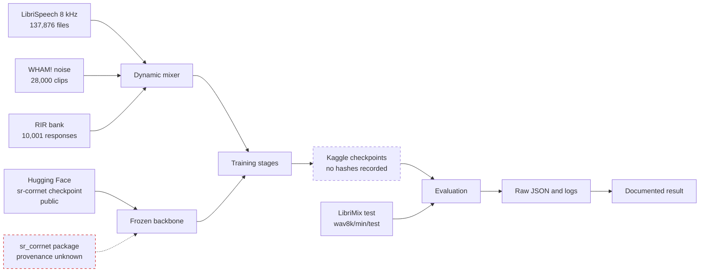

# Project Inventory

**Purpose:** the complete inventory of what exists, where it came from and how far it can be trusted.

**Status:** [GREEN] Inventory complete for code, documentation and archive. [AMBER] for external artifacts, which can only be inventoried from references.

**Last verified:** 2026-09-02

---

## 1. Inventory dimensions

| Area | Expected evidence | Found | Status |
|---|---|---|---|
| Source code | Git tree and archive tree | 243 tracked files, ~20,700 lines Python outside tests | [GREEN] |
| Dependencies | pyproject, requirements, lock files | pyproject and two requirements files, no lock, no pins | [AMBER] I-020 |
| Configurations | YAML, JSON, TOML | 12 YAML configs, one with an unresolved TODO | [AMBER] I-029 |
| Datasets | manifests, source references, preprocessing | 25 manifests with SHA sidecars; no audio present | [AMBER] external |
| Models | architecture definitions and checkpoints | all architecture code present, zero checkpoints present | [AMBER] external |
| Training | scripts, notebooks, logs | 7 stage scripts, 18 notebooks, 1 recovered log | [GREEN] |
| Inference | entry points and output contracts | `infer.py`, `pipeline/infer.py`, `SeparationResult` | [AMBER] I-006 |
| Evaluation | metrics and fixed sets | 13 modules, 25 fixed eval manifests | [AMBER] I-005 |
| Tests | unit, integration, smoke | 51 modules, 513 tests | [AMBER] I-006, I-009 |
| Demo | CLI and web UI | `demo.py` Gradio, `demo/app.py` CLI | [AMBER] I-013 |
| Documentation | README and docs | README 625 lines, BLUEPRINT 1,216 lines, TRAINING_GUIDE 347 lines, plus recovered docs | [AMBER] I-016, I-017 |
| CI | workflows and checks | one workflow, never triggered | [RED] I-011 |
| Secrets | scan of tracked tree | none found in the repository | [GREEN] |

---

## 2. Repository map

| Directory | Files | Lines | Role | Import status |
|---|---:|---:|---|---|
| `models/` | 13 | 2,775 | backbone wrapper, LoRA, condition, gate, counting, confidence, band recovery | 12 of 13 import |
| `data/` | 26 | 6,834 | dataset preparation, mixing, degradations, RIR bank, VAD, fixed eval synthesis | all import |
| `train/` | 11 | 2,909 | seven training stages, losses, cached dataset, calibrate | 9 of 11 import |
| `eval/` | 13 | 2,629 | metrics, matrix, baselines, statistics, DNSMOS, PESQ, ablation, curves | 9 of 13 import |
| `align/` | 5 | 723 | embeddings, Hungarian assignment, chunk alignment | all import |
| `pipeline/` | 4 | 846 | chunker, stitcher, inference orchestration | all import |
| `calibration/` | 5 | 416 | temperature, confidence, completeness, OOD | all import |
| `scripts/` | 7 | 1,800 | checkpoint download, preflight, cache build, baseline, Kaggle slicing | 4 of 7 import |
| `schemas/` | 2 | 125 | `SeparationResult` contract | all import |
| `utils/` | 3 | 275 | config loading, hashing | all import |
| `demo/` | 2 | 312 | CLI entry point | all import |
| `tests/` | 51 | 7,309 | 513 tests | 48 of 51 collect |
| `notebooks/` | 18 | n/a | Kaggle training and evaluation notebooks | not importable by design |
| `configs/` | 12 | n/a | stage and adapter configuration | n/a |
| `data/fixed_eval/` | 51 | n/a | 25 JSONL manifests, 25 SHA-256 sidecars, 1 index | n/a |
| root | 3 | 1,557 | `demo.py`, `infer.py`, plus shell scripts | see I-013 |

---

## 3. Archive inventory and provenance classification

Archive: `calm-sep-context-2026-09-01-v2.zip`, SHA-256 `85129a23f8165ce373eb99d93886d8e7436d0c06d78e9828cdc5cffeb84b855e`, 556,621 bytes, 60 entries, all stamped 2026-09-01 20:11. Preserved unchanged at `.restoration/archive/`, extracted read-only at `.restoration/zip_extract/`.

| Archive path | Bytes | Classification | Disposition |
|---|---:|---|---|
| `src/calibration/*.py` (5 files) | 13,138 | [BOTH_SAME] modulo line endings | no action |
| `src/models/*.py` (9 files) | 74,946 | [BOTH_SAME] modulo line endings | no action |
| `src/train/stage1_single.py` | 29,588 | [BOTH_SAME] | no action |
| `src/train/stage4_joint.py` | 14,389 | [BOTH_SAME] | no action |
| `src/train/stage4c_calib.py` | 6,287 | [BOTH_SAME] | no action |
| `src/eval/metrics.py` | 11,618 | [BOTH_SAME] | no action |
| `src/eval/run_eval.py` | 15,852 | **[ZIP_ONLY]**, ahead of all 13 branches | recover, I-012 |
| `src/demo.py` | 48,089 | **[ZIP_ONLY]**, ahead of all 13 branches | recover, I-013 |
| `src/modal_deploy.py` | 2,659 | **[ZIP_ONLY]**, absent from all history | recover, I-014 |
| `eval_outputs/calmsep_eval.json` | 793 | [BOTH_SAME] | no action |
| `eval_outputs/eval.log` | 4,745 | [BOTH_SAME] | no action |
| `eval_outputs/calmsep_eval_5.json` | 495 | **[ZIP_ONLY]** raw result | recover, I-015 |
| `eval_outputs/*.wav` (7 files) | 647,412 | [GENERATED] demo outputs | keep in evidence only; `.gitignore` excludes `*.wav` |
| `training_logs/calm-sep-stage-4-joint-training.log` | 18,090 | **[ZIP_ONLY]** raw log | recover, I-015 |
| `docs/TRAINING_GUIDE.md` | 10,982 | [BOTH_SAME] as root `TRAINING_GUIDE.md` | no action |
| `docs/decisions.md` | 4,925 | [BOTH_SAME] | no action |
| `docs/vad_validation.md` | 701 | [BOTH_SAME] | no action |
| `docs/PROJECT_HISTORY.md` | 17,242 | **[ZIP_ONLY]** documentation | recover, high value |
| `NUMBERS.md` | 14,579 | **[ZIP_ONLY]** documentation | recover, high value |
| `CONTEXT.md` | 10,747 | **[ZIP_ONLY]**, **contains live credentials** | do not commit as-is, I-001 |
| `memory/*.md` (12 files) | 29,906 | [UNKNOWN_PROVENANCE], unrelated personal notes | evidence only, I-030 |

**Total recovered value:** three source files, two raw evidence artifacts and two substantial documents that exist in no commit. Without this archive, the Libri5Mix result, the entire Stage 4 training record, the project history narrative and roughly two months of documented reasoning would be unrecoverable.

---

## 4. Provenance model

Red dashed: the unresolved blocker (I-019). Dashed: artifacts with no recorded hash or version.

---

## 5. Files classified for review under Rule 13

Rule 13 requires a classification before any deletion. Nothing has been deleted. These are the candidates found.

| File | Classification | Reason | Action |
|---|---|---|---|
| `train/cached_dataset.py` | [UNKNOWN] | imports the v1 `train.trainer`; v2 usefulness unread | read before deciding, I-009 |
| `tests/test_cached_dataset.py` | [UNKNOWN] | imports the v1 `models.cascade_gate` | read before deciding, I-009 |
| `scripts/build_train_cache.py` | [UNKNOWN] | imports the v1 `models.experts.mossformer2` | read before deciding, I-009 |
| `train/calibrate.py` | [SUPERSEDED] suspected | `train/stage4c_calib.py` performs the same role and imports cleanly | confirm, I-008 |
| `data/mixer_stub.py` | [UNKNOWN] | name suggests a stub; it is imported by the Stage 4 Kaggle run per the log | keep, it is in the live path |
| `eval/eval_reverb_adapter.py` | [KEEP] | hard-codes paths for a banned platform, but is the only reproduction path for the I-025 finding | repair paths, I-033 |
| `models/experts/` | [UNKNOWN] | `srcorrnet.py` and `embeddings.py` present; `mossformer2` referenced and absent | read before deciding |
| `.restoration/pack/docs/*.md` templates | [SUPERSEDED] | empty templates, replaced by the populated documents in `docs/restoration/` | retained in evidence, not promoted |

No file has been deleted during this phase. Every candidate above needs a read-through first.

---

## Related documents

`RESTORATION_STATE.md` · `DATA_AND_MODEL_INVENTORY.md` · `ISSUE_LEDGER.md` · `ARCHITECTURE.md`
