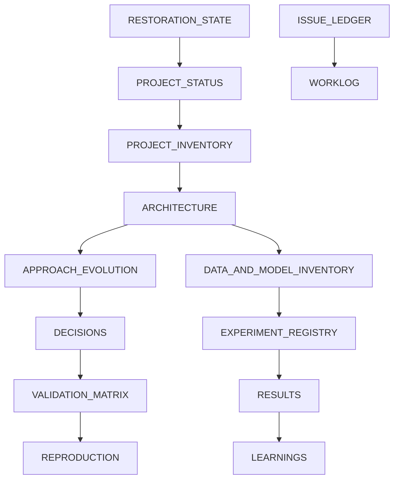

# Restoration Knowledge Base

The living record of what this project is, what it actually does, what was measured and what is still unknown.

**Established:** 2026-09-02 · **Baseline:** 504 tests passing, 10 module import failures, 34 open tickets

---

## Read in this order

Before changing code, read `ISSUE_LEDGER.md`, `VALIDATION_MATRIX.md` and `WORKLOG.md`.

---

## The documents

| Document | Answers |
|---|---|
| [RESTORATION_STATE](RESTORATION_STATE.md) | What is the factual state of this project, and how was it established? |
| [PROJECT_STATUS](PROJECT_STATUS.md) | What shape is it in right now, dimension by dimension? |
| [PROJECT_INVENTORY](PROJECT_INVENTORY.md) | What exists, where did it come from, how far can it be trusted? |
| [ARCHITECTURE](ARCHITECTURE.md) | What is actually built, and where does it disagree with the design intent? |
| [APPROACH_EVOLUTION](APPROACH_EVOLUTION.md) | Why does the architecture look like this? |
| [RESULTS](RESULTS.md) | What has been measured, and what does the measurement actually support? |
| [EXPERIMENT_REGISTRY](EXPERIMENT_REGISTRY.md) | Which runs happened, on what, with what provenance? |
| [DATA_AND_MODEL_INVENTORY](DATA_AND_MODEL_INVENTORY.md) | Which datasets, models and checkpoints, and where do they live? |
| [LEARNINGS](LEARNINGS.md) | What did this project learn the expensive way? |
| [DECISIONS](DECISIONS.md) | What was decided during restoration, and at what cost? |
| [ISSUE_LEDGER](ISSUE_LEDGER.md) | Every independent problem, scoped and prioritised. |
| [VALIDATION_MATRIX](VALIDATION_MATRIX.md) | What has been validated, by which command, with what output? |
| [REPRODUCTION](REPRODUCTION.md) | Can someone else rebuild this, and where exactly does it stop? |
| [CHANGELOG](CHANGELOG.md) | What changed during restoration? |
| [WORKLOG](WORKLOG.md) | What happened, in order. |
| [protocols/](protocols/) | Commit, ticketing, reconciliation and done-criteria rules. |

---

## The five things worth knowing before you touch anything

1. **The code is in better shape than the README implies.** 504 of 513 tests pass. Nine of the ten import failures are symbol renames that were never propagated, not design problems.

2. **CI has never run.** The workflow watches `main`; the default branch is `master`. That single misconfiguration is why every one of those broken imports survived 158 commits. See I-011.

3. **The headline claim is unmeasured.** Speaker count accuracy is the primary graded axis, and every evaluation run so far handed the true count to both systems. The SI-SDRi improvements are real and reproducible; they answer a narrower question than the project intends to ask. See I-002.

4. **The backbone loader cannot be obtained.** `sr_corrnet` is undeclared, unpinned and unpackaged. Nothing that touches the model can be run or reproduced until its upstream source is known. This is the deepest blocker. See I-019.

5. **Six weeks of work exists only in an archive.** No commits between 2026-07-23 and 2026-09-01, but the archive holds three source files and one raw result that appear in no branch. The code was recovered. The reasoning behind it was not. See I-012 through I-015.

---

## Status tags used throughout

**Health:** [GREEN] [AMBER] [RED] [UNKNOWN]

**Evidence:** [VERIFIED] [PARTIALLY_VERIFIED] [CLAIMED] [UNVERIFIED] [FAILED] [SUPERSEDED]

**Work:** [OPEN] [INVESTIGATING] [READY] [IN_PROGRESS] [BLOCKED] [VERIFY] [CLOSED]

**Provenance:** [ZIP_ONLY] [REPO_ONLY] [BOTH_SAME] [BOTH_CONFLICT] [HISTORICAL] [GENERATED] [UNKNOWN_PROVENANCE]

The traceability chain is: finding, ticket, implementation, validation, commit, documentation. A ticket closes on validation evidence, never on a code change alone.
