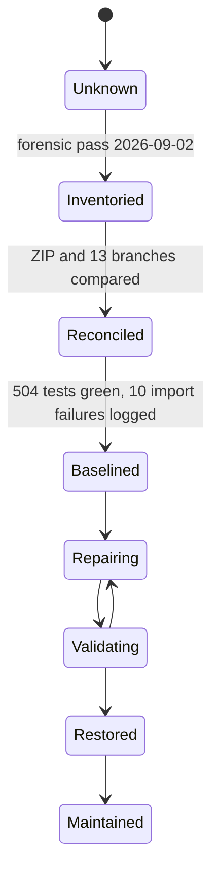

# Restoration State

**Purpose:** the factual state of the project as established by forensic inspection.

**Status:** [AMBER] Inventoried and reconciled. Baseline established. Repair not started.

**Last verified:** 2026-09-04

**Source of truth for this document:** direct inspection of the cloned repository, the supplied ZIP archive, and executed commands recorded in `VALIDATION_MATRIX.md`.

---

## 1. Evidence sources and their identity

| Source | Identity | Recorded |
|---|---|---|
| Supplied archive | `calm-sep-context-2026-09-01-v2.zip` | SHA-256 `85129a23f8165ce373eb99d93886d8e7436d0c06d78e9828cdc5cffeb84b855e`, 556,621 bytes, 60 files |
| Archive internal root | `calm-sep-context-dump-v2/` | all entries stamped 2026-09-01 20:11 |
| Remote repository | `https://github.com/TECHSCHOLAR777/SINGLE-CHANNEL-SPEECH-SEPARATION-PROJECT` | cloned 2026-09-02 |
| Remote default branch | `master` | HEAD `19caf73986e0bd99077bcb50c57e3d1dbb16b346` |
| HEAD commit | `feat: add GitHub Pages static landing site (docs/index.html)` | author Parv Bansal, 2026-07-23 22:41:59 +0530 |
| Commit count on master | 158 | matches the count named in the restoration pack |
| Tags | none | `git tag` returns empty |
| Local pre-existing repository | none | the working directory contained no `.git` before the clone |

Fact: there was no local Git repository before this restoration. The local repository is a fresh clone, so there is no uncommitted local work to recover and no local-versus-remote divergence.

Fact: the supplied ZIP is a context dump, not a working tree. It contains a curated subset of source files plus documentation and run artifacts. It has no `.git`, no tests, no configs, no notebooks, and no dependency files.

---

## 2. The central reconciliation result

The ZIP was compared file by file against the repository. Twenty of the twenty-one Python files it carries are byte-identical to `master` once line endings are normalised, because the Windows checkout applies CRLF while the archive stores LF.

Only three source items in the ZIP are not reproduced anywhere in the repository or in any of its thirteen branches:

| File | Classification | What it carries |
|---|---|---|
| `src/eval/run_eval.py` | [ZIP_ONLY], newer than every branch | Libri4Mix and Libri5Mix split support, Stage 2 universal checkpoint loading from a file or a directory, device placement for the STFT and iSTFT modules, split auto-detection, `delta_si_sdr` in the result payload |
| `src/demo.py` | [ZIP_ONLY], newer than every branch | Whisper transcription with word-level timestamps and a self-syncing HTML transcript, 226 lines added against 12 removed |
| `src/modal_deploy.py` | [ZIP_ONLY], no counterpart anywhere in history | Modal serverless deployment class with a pinned image and a warm-container load pattern |

Inference: work continued on the project after the last commit of 2026-07-23 and was never committed. The ZIP is the only surviving record of it.

Two run artifacts are also ZIP-only: `eval_outputs/calmsep_eval_5.json`, the raw Libri5Mix result, and `training_logs/calm-sep-stage-4-joint-training.log`, the raw Stage 4 Kaggle log. Three documents are ZIP-only: `CONTEXT.md`, `NUMBERS.md`, and `docs/PROJECT_HISTORY.md`.

---

## 3. Branch reconciliation

Thirteen remote branches exist. Ten are strictly behind `master` and contain nothing unique. `origin/integration` is seventeen commits ahead of the merge base, but only three of its eighteen touched files still differ from `master`, and in each case `master` carries the later change: `master` fixes tensor gates in `LoRALinear.forward` and the `olora_penalty` accumulator on top of what `integration` had. `origin/parv` holds four commits belonging to the abandoned v1 architecture.

| Branch | Ahead of master | Behind master | Last commit | Verdict |
|---|---:|---:|---|---|
| `origin/master` | 0 | 0 | 2026-07-23 | authoritative |
| `origin/integration` | 17 | 24 | 2026-07-19 | [SUPERSEDED] |
| `origin/parv` | 4 | 39 | 2026-07-13 | [HISTORICAL] v1 CA-MoSE |
| `origin/parvA` | 1 | 29 | 2026-07-17 | [SUPERSEDED] |
| `origin/parvB` | 1 | 30 | 2026-07-17 | [SUPERSEDED] |
| `origin/parvC` | 2 | 30 | 2026-07-17 | [SUPERSEDED] |
| `origin/suryansh` | 2 | 27 | 2026-07-17 | [SUPERSEDED] |
| `origin/feat/devc-completion` | 0 | 96 | 2026-07-11 | [HISTORICAL] |
| `origin/feat/devc/eval-align-router-demo` | 0 | 154 | 2026-07-09 | [HISTORICAL] |
| `origin/feat/devc/p1-embeddings-dnsmos` | 0 | 140 | 2026-07-10 | [HISTORICAL] |
| `origin/feat/devc/p1-integration` | 0 | 131 | 2026-07-10 | [HISTORICAL] |
| `origin/person_B` | 0 | 137 | 2026-07-11 | [HISTORICAL] |
| `origin/rishi` | 0 | 105 | 2026-07-11 | [HISTORICAL] |

Decision: `master` is authoritative for all committed source. See `DECISIONS.md`, DEC-001.

---

## 4. What actually exists in the repository

243 tracked files. Roughly 20,700 lines of Python outside tests, plus 7,309 lines across 51 test modules.

| Area | Present | Note |
|---|---|---|
| Package layout | flat top-level packages | `align`, `calibration`, `data`, `demo`, `eval`, `models`, `pipeline`, `schemas`, `scripts`, `train`, `utils` |
| Entry points | `demo.py`, `infer.py`, `demo/app.py`, `eval/run_eval.py`, per-stage scripts under `train/` | none exposed through `pyproject.toml` except a stale v1 console script |
| Training stages | Stage 1, 2, 3, 4, 4b, 4b oracle, 4c | all seven files exist and import cleanly |
| Notebooks | 18 | Kaggle-targeted, all referencing `/kaggle/...` paths |
| Configs | 12 YAML files | one carries an unresolved TODO for a data root |
| Checkpoints | none in the repository | `.gitignore` excludes `checkpoints/` and `*.pt`; the artifacts live on Kaggle |
| Datasets | none in the repository | manifests only, under `data/fixed_eval/` |
| Fixed eval manifests | 51 files: 25 JSONL, 25 SHA-256 sidecars, 1 index | tracked and hash-verifiable |
| Run artifacts | `eval/eval_outputs/calmsep_eval.json`, `eval/eval_outputs/eval.log` | tracked despite the `*.wav` and outputs ignore rules |
| CI | `.github/workflows/ci.yml` | triggers on `main`; the default branch is `master`, so CI has never run |

---

## 5. Executable baseline

Recorded 2026-09-02 on Windows 11, Python 3.14.3, torch 2.10.0+cpu, torchaudio 2.11.0+cpu, CPU only. No GPU, no checkpoints, and no datasets are available on this machine, so every check below is static or unit-level. Nothing was trained.

| Check | Result |
|---|---|
| Import every non-test module (93 modules) | 83 import, 10 fail |
| Test collection | 513 tests collected, 3 modules fail to import |
| Test run excluding the 3 broken modules | 504 passed, 10 skipped, 2 warnings, 36.06 s |
| Package install | not attempted; `speechbrain`, `asteroid`, and `pyroomacoustics` are absent from this interpreter |
| Backbone load | not possible; `sr_corrnet` is not installed and is not vendored |
| Inference on a fixture | blocked by the backbone dependency |
| Evaluation | blocked by missing LibriMix data and checkpoints |

The ten import failures are recorded individually in `ISSUE_LEDGER.md`. Nine of them are rename drift or v1 residue rather than deep breakage: symbols were renamed in the modules that define them and the consumers were never updated.

---

## 6. Known unknowns

These are unresolved after inspection. They are recorded as unknown rather than guessed.

1. Backbone parameter count. `CONTEXT.md` states 7.4M. `NUMBERS.md` states 13,270,124. Both were written by the same author on the same day. Unresolvable without loading the checkpoint.
2. Stage 1 noise adapter epoch count. `NUMBERS.md` states roughly 40 epochs. The project memory note states that the local `best_noise.pt` was epoch 2 only and that all three adapters needed retraining. Which checkpoint fed Stage 4 is not determinable from the archive.
3. Whether the Stage 4 checkpoint currently held on Kaggle is the epoch 14 artifact described in the log.
4. Whether any LibriMix evaluation has been run since the oracle speaker count defect was identified.
5. Clean-environment reproducibility. Never attempted, and not attemptable on this machine.
6. Provenance and license of the `sr_corrnet` package, described only as a 596 KB directory under a personal Downloads folder.

---

## 7. State machine

Current node: **Baselined**.

---

## Related documents

`PROJECT_STATUS.md` · `PROJECT_INVENTORY.md` · `ARCHITECTURE.md` · `ISSUE_LEDGER.md` · `VALIDATION_MATRIX.md` · `DECISIONS.md` · `RESULTS.md`
