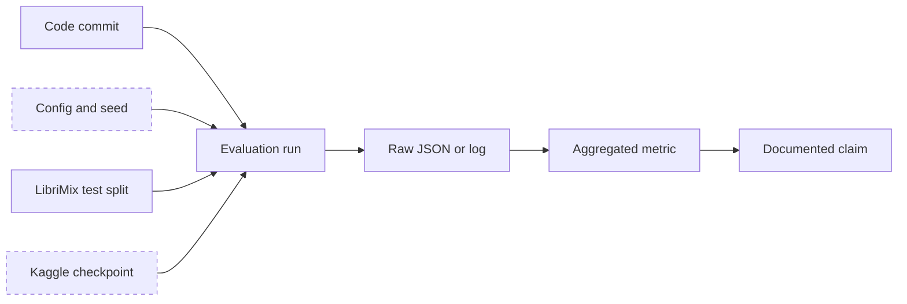

# Results

**Purpose:** the authoritative record of measured results, with provenance for each one.

**Status:** [AMBER] Three of four evaluation splits have raw backing. All of them carry a methodological caveat that prevents them from being read as final.

**Last verified:** 2026-09-02

**Rule applied here:** a number appears in this document only if a raw artifact in the repository or the preserved archive produced it. Every number below has been read out of a JSON or a log, not copied from prose.

---

## Evidence state legend

[VERIFIED] raw artifact exists, is internally consistent and the measurement protocol is sound
[PARTIALLY_VERIFIED] raw artifact exists and is consistent, but the protocol has a disclosed defect
[CLAIMED] stated in documentation with no raw artifact found
[UNVERIFIED] never measured
[FAILED] measured and the result contradicts the design intent
[SUPERSEDED] belongs to an abandoned architecture

---

## 1. Main separation results

**State: [PARTIALLY_VERIFIED].**

**The caveat, stated before the numbers rather than after them:** every run below supplied the true speaker count to both the baseline and the full system. Speaker count accuracy is the primary graded axis of this project and it is absent from all of these results. See I-002. These numbers measure separation quality given a correct count, which is a narrower claim than the project intends to make.

Second caveat: n = 30 per split, out of roughly 3,000 available test clips. No confidence intervals were computed (I-026).

| Split | N | n | Baseline SI-SDR | Baseline SI-SDRi | System SI-SDR | System SI-SDRi | Delta SI-SDRi | Wall time |
|---|---:|---:|---:|---:|---:|---:|---:|---:|
| Libri2Mix | 2 | 30 | 5.596 dB | 7.095 dB | 7.360 dB | 8.858 dB | **+1.764 dB** | 2,166.7 s |
| Libri3Mix | 3 | 30 | 5.755 dB | 10.071 dB | 7.487 dB | 11.803 dB | **+1.732 dB** | 2,912.6 s |
| Libri4Mix | 4 | 0 | not run | not run | not run | not run | not run | not run |
| Libri5Mix | 5 | 30 | 1.040 dB | 9.428 dB | 1.662 dB | 10.050 dB | **+0.623 dB** | 3,480.5 s |

**Raw artifacts.**

| Split | File | Provenance |
|---|---|---|
| Libri2Mix, Libri3Mix | `eval/eval_outputs/calmsep_eval.json` | tracked in the repository; byte-identical to the archive copy |
| Libri5Mix | `eval/eval_outputs/calmsep_eval_5.json` | recovered from the archive under I-015; existed nowhere in Git |

**Backbone:** `shinuh/sr-corrnet-ss-1ch-wsj-var-2-5spk`, recorded in both JSON files.
**Mix type:** `mix_both`, that is noise and reverberation combined, `wav8k/min/test`.
**Hardware:** CPU only, Apple M5 Pro, single threaded.

**What this does and does not support.** It supports the statement that the adapter stack improves SI-SDRi over the same frozen backbone on the same clips, by between 0.62 and 1.76 dB, when the speaker count is known. It does not support any statement about speaker counting, about statistical significance, about Libri4Mix, or about which of the three adapters contributed the gain.

**Note on absolute level.** These baseline numbers, 7.09 and 10.07 dB, sit far below published LibriMix results such as SepFormer at 22.3 dB. That is expected and is recorded in `NUMBERS.md`: the backbone was trained on WSJ0-mix and transfers poorly to LibriMix. The delta is the contribution; the absolute level is a property of the backbone choice, not of this work.

---

## 2. Stage 4 joint training

**State: [VERIFIED].**

This is the strongest evidence in the project. The full Kaggle log was recovered from the archive under I-015 and confirms every epoch independently, including wall times and checkpoint writes.

| Epoch | Loss | Best checkpoint saved |
|---:|---:|:---:|
| 4 | 13.5 (approx.) | yes |
| 5 | 13.47 | no |
| 6 | 9.59 | yes |
| 7 | 9.4863 | yes |
| 8 | 9.4310 | yes |
| 9 | 10.9350 | no |
| 10 | 8.8908 | yes |
| 11 | 10.3125 | no |
| 12 | 8.7204 | yes |
| 13 | 8.9367 | no |
| 14 | **8.6809** | yes, final |

**Raw artifact:** `training_logs/joint_stage4_kaggle.log`, recovered under I-015.
**Hardware:** Tesla T4, 15.6 GB, BF16 enabled. Roughly 2,930 s per epoch.
**Configured for:** 20 epochs. **Completed:** 14. The run ended before its configured length.
**Checkpoint written:** `best_joint.pt`, containing the gate, the analyser and 222 adapter tensors.

**Interpretation.** Loss was still decreasing at epoch 14, the last recorded value being the lowest. The run was cut short rather than converged. Any statement that the joint stage is finished is not supported.

---

## 3. Stage 1 reverb adapter diagnostic

**State: [FAILED].** Measured, reproducible, and contradicting the design intent.

Single 2-speaker clip, T60 = 0.46 s, three conditions:

| Condition | Base SI-SNR | Adapted SI-SNR | Delta |
|---|---:|---:|---:|
| Clean, anechoic | 18.61 dB | 18.17 dB | **-0.44 dB** |
| Reverb, mild | -30.89 dB | -30.96 dB | -0.07 dB |
| Reverb, strong | -32.83 dB | -35.64 dB | **-2.81 dB** |

**Raw artifact:** `eval/eval_outputs/eval.log`, dated 2026-07-17.

**Two controls in the same log make this trustworthy rather than a suspected bug.**

1. With the gate set to zero, the adapted model reproduced the base model to a maximum difference of 0.000000, through two independent code paths. The injection mechanism is correct.
2. The LoRA A matrices had a mean norm of 1.5813, consistent with Kaiming initialisation, and the B matrices were non-zero. Weights were genuinely learned.

So the adapter learned something, and what it learned makes the output worse. The leading hypothesis, recorded by the original author, is that training used the wet reverberant signal as the reference target rather than the anechoic signal, which would teach the adapter to preserve reverberation rather than remove it. That hypothesis explains the sign of the result and not merely its size, which is why it ranks above the alternatives of insufficient rank or too few samples. See I-025.

**Caveat on scope.** One clip, one T60 value, one speaker count. This is a diagnostic, not a benchmark. It is strong enough to justify investigation and not strong enough to quantify the harm.

---

## 4. Gate calibration

**State: [FAILED] for the routing claim, [VERIFIED] for the value itself.**

| Quantity | Value | State |
|---|---|---|
| Gate temperature T | 4.9872 | [VERIFIED], recorded in the Stage 4c artifact and in two documents |
| Effective gate behaviour | approximately 0.5 for all three adapters, on all inputs | [FAILED] |
| Expected calibration error | never measured | [UNVERIFIED] |
| Per-stream confidence accuracy | never measured | [UNVERIFIED] |
| Completeness probability accuracy | never measured | [UNVERIFIED] |

At T = 4.9872, `sigmoid(logit / T)` is nearly linear across the operating range of the logits, so the gate output is compressed toward its mid-point. The system therefore applies a roughly uniform blend of all three adapters regardless of condition. This is not a routing failure in the sense of routing badly; it is the absence of routing. See I-003.

---

## 5. Predecessor architecture, v1 CA-MoSE

**State: [SUPERSEDED], retained because it is the reason the current architecture exists.**

Measured 2026-07-13 on a Kaggle T4, 100 development samples, mixed 2 to 5 speakers.

| System | SI-SDRi |
|---|---:|
| MossFormer2 alone | 8.24 dB |
| SR-CorrNet-SS alone | **16.22 dB** |
| Cascade with fusion, best threshold | 15.79 dB |
| Cascade with fusion, worst threshold | 12.51 dB |
| Cascade, SR-primary, full escalation | 16.22 dB, equal to the backbone, never above it |

Efficiency result: 36 percent compute reduction at threshold 6, at a measured cost of 3.55 dB.
Speaker counting: the trained stop-classifier reached 61.4 percent validation accuracy and 10 percent count accuracy at inference, with two identified root causes.

**Why this stays in the record.** The trained fusion head made a strong frozen expert worse at every operating point. That single measurement is the origin of the current design rule: never put learned layers on top of the backbone's output, put small adapters inside its weights instead. Deleting this result would remove the justification for the architecture.

**Raw artifacts:** none in this repository. The numbers come from `docs/PROJECT_HISTORY.md` and `NUMBERS.md`, and the original `PROJECT_CRUX.md` lived in the abandoned v1 repository. Treat these as [CLAIMED] at the artifact level and [VERIFIED] at the level of "this is what the project recorded and acted on".

---

## 6. What has never been measured

Listed so that nobody mistakes silence for a negative result.

| Quantity | Why it matters | Ticket |
|---|---|---|
| Speaker count accuracy | the primary graded axis | I-002 |
| Libri4Mix, any metric | a hole in the middle of the count sweep | I-023 |
| Confidence intervals on any delta | three point estimates at n=30 with no uncertainty | I-026 |
| Per-condition breakdown, reverb, noise, codec separately | the only evidence that could show routing works | I-003, I-023 |
| Stage 2 universal adapter | the justification for using three adapters | I-024 |
| Oracle gate upper bound | shows how much headroom the gate is leaving | I-003 |
| Calibration ECE and reliability diagram | required by the problem statement | I-034 |
| A published baseline on the same test clips | positioning against SepFormer or ConvTasNet | I-023 |
| Band recovery contribution at 16 kHz | whether the head earns its place | none yet |

---

## 7. Result dependency model

Dashed nodes are the weak links. No evaluation config or seed was recorded with any result, and the checkpoints live outside version control with no hashes. That is why every result here is at best [PARTIALLY_VERIFIED]: the raw outputs exist and are consistent, but the chain from code and configuration to output cannot be reconstructed exactly. See `EXPERIMENT_REGISTRY.md` and I-020.

---

## Related documents

`EXPERIMENT_REGISTRY.md` · `DATA_AND_MODEL_INVENTORY.md` · `ARCHITECTURE.md` · `ISSUE_LEDGER.md` · `LEARNINGS.md`
