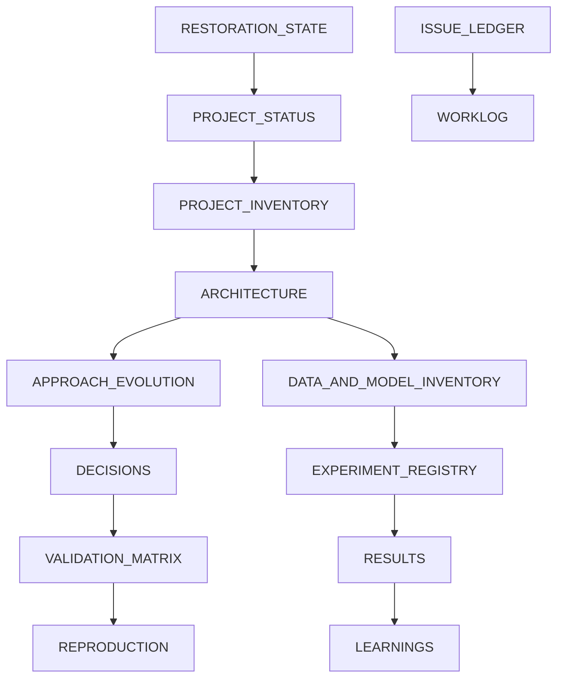

# Reading Order for Deep Project Understanding

Use this when you need to reconstruct the project quickly but accurately.

For operational work, read ISSUE_LEDGER, VALIDATION_MATRIX and WORKLOG before changing code.
