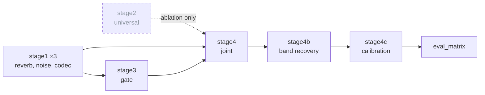

# Notebooks

Two families, kept apart because they serve different purposes and are edited in different ways.

---

## `launchers/` 🟢 readable

Thin parameterised drivers. Each is a handful of cells: constants at the top, then a `subprocess` call into the corresponding `python -m coralsep.train.*` entry point. Edit these by hand, read them to understand a stage, and change a hyperparameter in one obvious place.

| Notebook | Drives | Stage |
|---|---|---|
| `stage1_train_adapter.ipynb` | `coralsep.train.stage1_single` | One LoRA adapter, run three times |
| `stage2_universal.ipynb` | `coralsep.train.stage2_universal` | Universal adapter, ⚪ never run |
| `stage3_gate.ipynb` | `coralsep.train.stage3_gate` | Gate and Level-2 analyser |
| `stage4_joint.ipynb` | `coralsep.train.stage4_joint` | Joint fine-tune |
| `eval_matrix.ipynb` | `coralsep.eval.matrix` | Full 8-condition by 4-N evaluation matrix |

All of the real logic lives in the package. These exist so that a stage can be launched from a hosted GPU notebook without pasting code.

## `kaggle/` 🟠 baked, do not hand-edit

Self-contained notebooks that were actually executed on Kaggle. They inline their own dependencies, including base64-embedded stubs for `loguru` and `rotary-embedding-torch`, because Kaggle sessions run offline and the frozen backbone imports both.

These are **execution records** as much as they are tools. `coralsep_stage4_kaggle.ipynb` is the notebook behind the Stage 4 result in `results/training_logs/`. Rebake them from the launchers rather than editing them by hand: a hand edit to a baked notebook silently diverges from the package it copied.

They reference Kaggle dataset slugs that still use the pre-rename spelling (`rishig777/calmsep-8k-slice` and similar). Those are external artifacts and must not be renamed. See `docs/restoration/DECISIONS.md` DEC-006.

---

## Running order

Stage 2 is dashed because it has never been run. It exists to justify three condition adapters over one, and without it that design choice is unevidenced. Tracked as I-024.

## Before you launch anything

Read [`docs/TRAINING_GUIDE.md`](../docs/TRAINING_GUIDE.md) for the stage sequence. If you are training locally on Apple Silicon, also read [`docs/restoration/LEARNINGS.md`](../docs/restoration/LEARNINGS.md) L-005: Metal shader compilation on the first forward pass per speaker count looks exactly like a memory leak, and the warm-up loop that fixes it (already in `src/coralsep/train/stage1_single.py`) costs about eight seconds warm.
